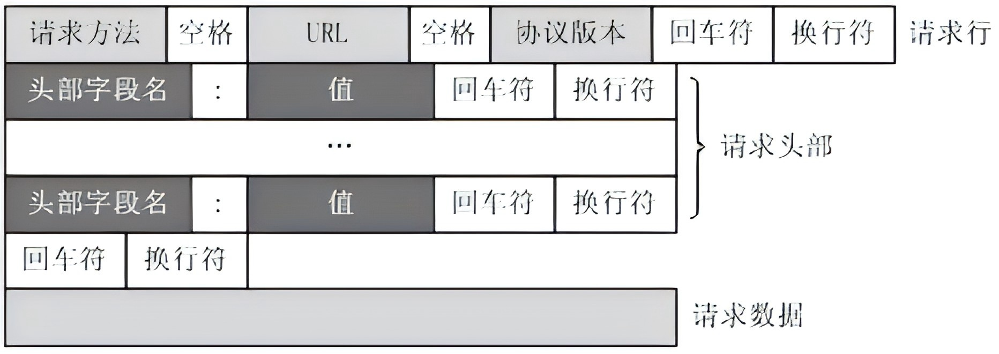

+++
title= "Web安全基础"
date= "2026-01-12T14:08:04+08:00"
lastmod= "2026-01-12T14:08:04+08:00"
draft=false
author= "leuco"
description= "网络空间安全】网络安全入门-Web安全基础"
keywords= ["网络空间安全", "Web安全"]
categories= ["网络空间安全", "学习笔记"]
tags= ["网络空间安全", "Web安全"]
math=true
+++

# Web安全基础



## Web发展史

- **Web1.0**：个人网站，门户网络等（www.163.com、www.souhu.com）。Web 1.0时代开始于1994年，其主要特征是大量使用静态的 HTML 网页来发布信息，并开始使用浏览器来获取信息，这个时候主要是单向的信息传递
  - 常见攻击手段：SQL注入；文件包含；命令执行；上传漏洞；WebShell

- **web2.0**：微博，Blog等（www.weibo.com、www.lofter.com）。Web 2.0 始于 2004 年 3 月Web2.0中，软件被当成一种服务，为用户提供网络应用的服务平台，强调用户的参与、在线的网络协作、数据储存的网络化、社会关系网络、应用以及文件的共享等成为了Web2.0发展的主要支撑和表现
  - 常见攻击手段：钓鱼攻击；URL跳转；框架漏洞；逻辑漏洞；XSS；CSRF

- **两者的本质区别在于**：Web1.0 的主要是在于用户通过浏览器获取信息。Web2.0 则更注重用户的交互作用。

## 静态页面与动态页面

- **静态页面**  
  - 在静态html页面中，用户通过Web浏览器HTTP协议向web服务器发送一个响应请求，告诉web服务器要浏览这个网站的哪个页面，接着根据用户的响应请求返回一个html页面给用户，经过浏览器渲染解析呈现在用户眼前。
  
  - 静态web页面是没有数据库文件的，所以不能连接网络数据库
  
  - 静态web页面主是通过HTML代码开发设计的
  
  - 部分静态web页面为了页面的好看，使用了大量的JS代码，导致静态web页面打开速度慢
  
- **动态页面**
  - 在动态web页面中，依然要通过web服务器的http协议或https协议响应才能返回结果给用户，用户所有请求都必须要通过web服务器处理才能实现
  - 用户的响应请求是一个静态的html页面，只需要响应请求web服务器从系统中调出用户响应的内容，将内容返回给客户端浏览器进行处理，再返回给用户
  - 如果用户响应请求的是动态页面资源，例如.jsp/.asp/.aspx/.php等，响应步骤是先将用户请求发送给web服务器，web服务器再从数据库调出有户请求的数据，调出数据后将所需要展示给用户的内容发送给服务器，最后通过web服务器将需要展示给用户的内容返回给用户浏览器解析执行，展示给用户。

## URL（URL Uniform Resource Locator）

- **统一资源定位符（Uniform Resource Locator，URL；俗称网页地址或简称网址）**是因特网上标准的资源的地址（Address），如同在网络上的门牌。它最初是由蒂姆·伯纳斯-李发明用来作为万维网的地址，现在它已经被万维网联盟编制为因特网标准 [RFC 1738](https://www.rfc-editor.org/info/rfc1738)。
- **格式**：**[protocol]://[hostname]:[port]/[path]/[parameters]?[query]**
  - **protocol**：协议，常用的协议是http、https、ftp等
  - **hostname**：主机地址，可以是域名，也可以是IP地址
  - **port**：端口号，http协议默认端口是80端口
  - **path**：路径，网络资源在服务器中的指定路径
  - **parameter**：参数，如果要向服务器传入参数，在这部分输入
  - **query**：查询字符串，如果需要从服务器那里查询内容，在这里编辑，可有多个参数，用“&”符号隔开，每个参数的名和值用“=”符号隔开。
- **例如**：https://www.baidu.com/s?ie=UTF-8&wd=kali

## HTML基础

### HTML简介

- HTML 是用来描述网页的一种语言
- HTML 指的是超文本标记语言: HyperText Markup Language
- HTML 不是一种编程语言，而是一种标记语言，标记语言是一套标记标签 (markup tag)
- HTML 使用标记标签来描述网页
- HTML 文档包含了HTML 标签及文本内容
- HTML文档也叫做 web 页面

### HTML标签/元素

- HTML 标记标签通常被称为 HTML 标签 (HTML tag)
- HTML 标签是由尖括号包围的关键词，比如\<html> 
- HTML 标签通常是成对出现的，比如 \<b> 和 \</b>。第一个标签是开始标签，第二个标签是结束标签
- 开始和结束标签也被称为开放标签和闭合标签 \<标签> 内容 \</标签>

- 一个简单例子

```html
<!DOCTYPE html>  <!-- 声明为HTML5文档 -->
<html>  <!-- 元素是 HTML 页面的根元素 -->
	<head> <!-- 第一部分：头部元素 -->
		<meta charset="utf-8">  <!-- 包含了文档的元数据，定义网页编码格式为 utf-8 -->
		<title>网页学习</title>  <!-- 文档的标题 -->
	</head>
    
	<body>  <!-- 第二部分：可见页面内容 -->
		<h1>这是一个标题</h1>  <!-- 元素定义一个大标题 -->
        <hr>  <!--横线-->
		<p>这是一个段落</p>  <!-- 元素定义一个段落 -->
	</body>
</html>
```

- 常用的轻量编辑器：
  - Sublime Text：http://www.sublimetext.com/
  - Notepad++：https://notepad-plus.en.softonic.com

- 常见HTML标签
  - \<html>\</html>
  - \<head>\</head>：头数据
  - \<title>\</title>：标题
  - \<body>\</body>：页面内容
  - \<h1>\</h1>：标题 1-6级
  - \<p>\</p>：段落
  - \<div>\</div>
  - \<a>\</a>：链接
  - \<ul>\</ul>
  - \<br>：换行
  - \<hr>：水平线
  - \<meta>
  - \：图片

## HTTP与HTTPS

### HTTP

- **HTTP简介**：超文本传输协议（Hyper Text Transfer Protocol，HTTP）是一个简单的请求-响应协议，它通常运行在TCP/IP协议之上。它指定了客户端可能发送给服务器什么样的消息以及得到什么样的响应。当时选择使用HTTP协议，是因为它使开发和部署非常地直截了当。
- **如何访问Web应用**
  - 在浏览器地址栏键入URL访问
  - 浏览器向 DNS 服务器请求解析该 URL 中的域名所对应的 IP 地址
  - 解析出 IP 地址后，根据该 IP 地址和默认端口 80，和服务器建立TCP连接
  - 浏览器发出读取文件(URL 中域名后面部分对应的文件)的HTTP 请求，该请求报文作为 TCP 三次握手的第三个报文的数据发送给服务器
  - 服务器对浏览器请求作出响应，并把对应的 html 文本发送给浏览器
  - 浏览器将该 html 文本进行解析并显示内容
- **HTTP协议的内部操作过程**
  - 客户端与服务器端建立连接
  - 客户端向服务器端发送请求
  - 服务器端向客户端回复响应
  - 断开连接
- **HTTP的发展历程**
  - HTTP 是基于 TCP/IP 协议的应用层协议，在 OSI 七层模型中在最上层，它并不涉及数据包传输，主要规定了客户端和服务器之间的通信格式，默认使用80端口。
  - 1991年发布的 HTTP/0.9 ，只支持：GET。这个版本的协议规定，服务器只能回应HTML格式的字符串，不能回应别的格式，也就是说今天的图像、视频等多媒体资源，在 HTTP/0.9这个版本上是无法进行传输的
  - 1996年5月，HTTP/1.0 版本发布，增加了POST命令和HEAD命令，丰富了浏览器与服务器的互动手段。这个版本HTTP协议可以发送任何格式的内容，包括传输文字、图像、视频、文件，这为互联网的大发展奠定了基础。除了增加了请求方法以及对发送文件的支持之外，还增加了格式的改变。除了数据部分，每次通信都必须包括头信息，用来描述一些元数据。另外还增加了状态码、多字符集支持、多部分发送、权限、缓存、内容编码等等
  - 1997年1月，HTTP/1.1 版本发布，这个版本只比 1.0 版本晚了半年。这个版本最大的变化就是将持久化连接加入了 HTTP 标准，即TCP连接默认不关闭，可以被多个请求复用。此外，HTTP/1.1版还新增了许多方法，例如：PUT、CONNECT、HEAD、 OPTIONS、DELETE。得到进一步完善的HTTP/1.1 版本，一直沿用至今
- **HTTP的请求类型**
  - URL全称是资源描述符，一个URL地址用于描述一个网络上的资源，HTTP中的GET，POST，PUT，DELETE就对应着对这个资源的查 ，改 ，增 ，删 4个操作。
  - GET一般用于获取/查询资源信息；POST一般用于更新资源信息
  - GET用于信息获取时应该是安全的、幂等的。
    - 安全：该操作用于获取信息而非修改信息。它仅仅是获取资源信息，就像数据库查询一样，不会修改，增加数据，不会影响资源的状态。
    - 幂等：对同一URL的多个请求应该返回同样的结果。
  - POST表示可能修改服务器上的资源的请求


| 方法        | 含义                                                         |
| ----------- | ------------------------------------------------------------ |
| **GET**     | 请求获取Request-URI（请求地址）所标识的资源。(请求读取由url所标志的信息) |
| **POST**    | 在Request-URI所标识的资源后附加新的数据。（给服务器添加信息，例如注释） |
| **HEAD**    | 请求获取由Request-URI所标识的资源的响应消息报头。            |
| **PUT**     | 请求服务器存储一个资源，并用Request-URI作为其标识。          |
| **DELETE**  | 请求服务器删除Request-URI所标识的资源。                      |
| **TRACE**   | 请求服务器回送收到的请求信息，主要用于测试或诊断。           |
| **CONNECT** | 用于代理服务器。                                             |
| **OPTIONS** | 请求查询服务器的性能，或者查询与资源相关（特定）的选项和需求。 |

- **HTTP的主要特点**
  - **支持客户/服务器模式**：一个服务器可以为分布在世界各地 的许多客户服务
  - **简单快速**：客户向服务器请求服务时，只需传送请求方法和路径。请求方法常用的有GET和POST。由于HTTP协议简单，使得HTTP服务器的程序规模小，因而通信速度很快
  - **灵活**：HTTP允许传输任意类型的数据对象。正在传输的类型由Content-Type加以标记。

- **HTTP报文格式**

  - 请求报文：
    - 请求行：用来说明请求类型,要访问的资源以及所使用的HTTP版本

    - 请求头：紧接着请求行（即第一行）之后的部分，用来说明服务器要使用的附加信息

    - 请求载体：也叫主体，可以添加任意的其他数据

  - 响应报文
    - 响应行：由HTTP协议版本号， 状态码， 状态消息三部分组成

    - 响应头：消息报头，用来说明客户端要使用的一些附加信息

    - 响应载体：响应正文，服务器返回给客户端的文本信息

  - 一个请求报文的格式与案例：


  ```http
  GET <url> HTTP/1.1
  [field-name]:[value][\r][\n]
  [field-name]:[value][\r][\n]
  ......
  [field-name]:[value][\r][\n]
  [\r][\n]
  [Body data]
  ```

  ```http
  GET /s?w=kali HTTP/1.1
  Accept: text/html,application/xhtml+xml,application/xml;q=0.9,image/avif,image/webp,image/apng,*/*;q=0.8,application/signed-exchange;v=b3;q=0.7
  Accept-Encoding: gzip, deflate, br, zstd
  Accept-Language: zh-CN,zh;q=0.9
  Connection: keep-alive
  Cookie: [Cookie]
  Host: www.baidu.com
  Sec-Fetch-Dest: document
  Sec-Fetch-Mode: navigate
  Sec-Fetch-Site: none
  Sec-Fetch-User: ?1
  Upgrade-Insecure-Requests: 1
  User-Agent: Mozilla/5.0 (Windows NT 10.0; Win64; x64) AppleWebKit/537.36 (KHTML, like Gecko) Chrome/143.0.0.0 Safari/537.36
  sec-ch-ua: "Google Chrome";v="143", "Chromium";v="143", "Not A(Brand";v="24"
  sec-ch-ua-mobile: ?0
  sec-ch-ua-platform: "Windows"
  ```

  

- **HTTP请求报文的常用字段**：

  | 请求字段            | 描述                                                         |
  | ------------------- | ------------------------------------------------------------ |
  | **Accept**          | 指定客户端接受信息的类型（MIME类型）                         |
  | **Connection**      | 允许C/S指定与请求/响应连接的有关选项                         |
  | **Host**            | 请求的服务器的主机名和端口号                                 |
  | **Referer**         | 当浏览器向web服务器发送请求的时候，一般会带上Referer，告诉服务器该网页是从哪个页面链接过来的，服务器因此可以获得一些信息用于处理 |
  | **User-Agent**      | 发起请求的应用程序名称                                       |
  | **Accept-Encoding** | 告诉服务器能够接受哪些内容编码方式                           |
  | **Content-Length**  | 表示请求消息正文的长度                                       |
  | **Cookie**          | 客户端提供给服务器的认证数据<br />Cookie通常也叫做网站cookie，浏览器cookie或者httpcookie，是保存在用户浏览器端的，并在发出http请求时会默认携带的一段文本片段。它可以用来做用户认证，服务器校验等通过文本数据可以处理的问题。 |

- **HTTP响应报文常用状态码**

  | 状态码                | 描述                                           |
  | --------------------- | ---------------------------------------------- |
  | **临时响应（1xx）**   | 表示临时响应并需要请求者继续执行操作的状态代码 |
  | **成功（2xx）**       | 表示成功处理了请求的状态代码                   |
  | **重定向（3xx）**     | 表示要完成请求，需要进一步操作，通常用来重定向 |
  | **请求错误（4xx）**   | 表示请求可能出错，妨碍了服务器的处理           |
  | **服务器错误（5xx）** | 表示服务器在尝试处理请求时发生内部错误         |

- **HTTP的缺陷**

  - 由于 HTTP 协议的简单特性，且不保存客户端的状态，不进行验证客户端是否是真实存在，传输使用的是明文传输，故也很具有缺点。
    - 通信双方使用明文传输（不加密），内容可能会被窃听
    -  不验证通信方的身份，因此可能遭遇伪装
    - 无法证明报文的完整性，所以有可能已遭篡改。


#### HTTPS

- **HTTPS简介**：HTTPS是在HTTP上建立SSL加密层，并对传输数据进行加密，是HTTP协议的安全版。默认HTTP的端口号为80，HTTPS的端口号为443。
- **主要作用**：
  - 对数据进行加密，并建立一个信息安全通道，来保证传输过程中的数据安全
  - 对网站服务器进行真实身份认证
- **与HTTP的本质区别**：明文传输与加密传输
  - 采用HTTPS协议的服务器（Server）必须从公信机构（CA）申请一个用于证明服务器用途类型的证书。该证书只有用于对应的Server的时候，客户端（Client）才信任该主机