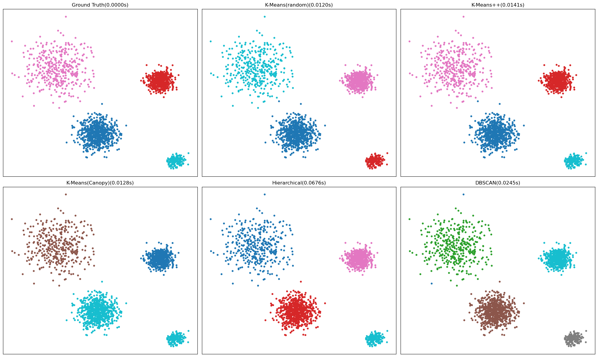

+++
title= "机器学习-无监督学习"
date= "2025-12-02T19:45:17+08:00"
lastmod= "2025-12-02T19:45:17+08:00"
draft=false
author= "leuco"
description= "【3】聚类是一种无监督的机器学习任务，它可以自动将数据划分成类（Cluster）"
keywords= ["聚类", "K-Means", "层次聚类", "密度聚类", "高斯混合模型", "GMM", "GM", "EM", "PCA", "降维"]
categories= ["机器学习", "学习笔记"]
tags= ["聚类", "K-Means", "层次聚类", "密度聚类", "高斯混合模型", "GMM", "GM", "EM", "PCA", "降维"]
image= "cover.png"
image_caption= "cover"
math=true
+++

# 无监督学习（Unsupervised Learning）
- 聚类是一种无监督的机器学习任务，它可以自动将数据划分成类（Cluster）

## K均值聚类（K-Means Clustering）
- 对于没有标签的数据样本 $X$ ，根据 $X$ 的相似度划分为 $k$ 类
- K-Means一般过程：
  - 初始化：指定中心数（簇数） $k$ 以及 $k$ 个簇中心（ $ \mu_1,\mu_2\dots \mu_k $ ，经典K-Means中随机选择中心）
  - 迭代：
    - 分配步：对每个样本 $$ x_i,i \in \{ 1,2\dots m  \},$$ 计算 $ x_i $与 $ \mu_1,\mu_2\dots \mu_k $ 的距离，并将 $ x_i $ 分配给簇中心距离其最近的簇：$$\displaystyle{x_i \rightarrow Cluster_{ \underset{j}{argmin}||x_i-\mu_j||^2}}$$
    - 更新步：更新簇中心：$$\displaystyle{\mu_j=\frac{1}{|N_j|}\sum_{x_i\in Cluster_j}x_i}$$
  - 迭代至：
    - 簇中心不变或变化幅度小于阈值
    - 样本点的归属不再发生变化
    - 迭代次数达到最大
- K-Means损失函数MSE：每个点到中心点的距离 $$\displaystyle{J(\mu_1,\mu_2 \dots \mu_k) = \frac{1}{2} \sum^k_{j=1}\sum^{N_j}_{i=1}(x_i-\mu_j)^2}$$
- $k$ 的选取——肘部法
  - 依次选取 $k\in{1,2\dots m}$，计算整体的损失  
  - 最终选取 $k_m$ 使得收益： $$Gain=|Loss(k_m-1)-Loss(k_m)|-|Loss(k_m)-Loss(k_m+1)|$$ 取得最大值。即$$\displaystyle{k_m = \underset{k}{\operatorname{argmax}} |Loss(k-1)-Loss(k)|-|Loss(k)-Loss(k+1)|}$$
- 相似度——以距离函数衡量
  - 闵可夫斯基距离：$$\displaystyle{d_p(x,y)=\sqrt[p]{\sum_{i=1}^n|x_n-y_n|^p}}$$
  - 曼哈顿距离(p=1)：$$\displaystyle{d_1(x,y)=\sum_{i=1}^n|x_n-y_n|}$$
  - 欧式距离(p=2)：$$\displaystyle{d_2(x,y)=\sqrt{(x-y)^T(x-y)}}$$
  - 切比雪夫距离(p=$\infty$)：$$\displaystyle{d_\infty(x,y)=\max\limits_{i\in\{1,2\dots n\}}|x_i-y_i|}$$
  - 余弦距离：$$\displaystyle{d_{\cos}(x,y)=\frac{x^Ty}{||x||·||y||}} \in [-1,1]$$
  - Jaccard相似系数：$$\displaystyle{J(A,B) = \frac{|A\cap B|}{|A \cup B|} = \frac{|A\cap B|}{|A|+|B|-|A\cap B|}}$$
- K-Means变种
  - K-Mediods：计算新的簇中心的时候不再选择均值，而选择中位数。抗噪能力得到加强
  - 二分K-Means：合并簇中心点比较近，MSE很小的簇；切分簇中心点比较远，MSE比较大的簇。重新进行K-Means聚类
  - K-Means++：使初始化簇中心稍微远一点。随机选择第一个中心点，计算MSE，将MSE转化为概率进行概率化选择初始簇中心点
- Canopy聚类： 一次迭代，给出k的值以及k个初始中心点（然后进行K-Means算法）

## 层次聚类（Hierarchical Clustering）
- 分裂法
  - 思想：将所有样本归为一个簇。每次迭代在一个簇中找到距离最远的两个样本点，将该簇划分为两个子簇。依次类推直到划分为k个簇
- 凝聚法
  - 思想：将所有样本点看作一个独立的簇。每次迭代找到距离最小的两个簇进行合并。

## 密度聚类
- DB-SCAN聚类（Density_Based Spatial Clustering of Applications with Noise）
  - 与层次聚类不同，它将簇定义为密度相连的点的最大集合，能够把具有高密度的区域划分为簇，并可有效地对抗噪声
  - 密度相连
    - 直接密度可达（若对象q的e邻域内至少有m个对象，m指定。则q为核心对象）
      - 若给定一个对象集合D，如果p在q的e邻域内，而q是一个核心对象，则p从q出发是直接密度可达的
      - 若q直接密度可达r，r直接密度可达p，则q直接密度可达p
    - 密度可达：如果存在一个对象链使得相邻两对象直接密度可达，则称对象链首尾密度可达
    - 密度相连：若o密度可达p，o密度可达q，则p，q密度相连
  - DB-SCAN通过检查数据集中每个对象的e邻域来寻找聚类
    - 如果一个点p是核心对象则以p为中心创建新簇。依据p来反复寻找密度相连的集合（可能合并原有簇），当没有新点时寻找结束
- 密度最大值聚类
  - 局部密度：
    $$
    \displaystyle{\rho_i = \sum_j\chi(d_{ij}-d_c), 其中 \chi(x) = }
    \begin{cases}
    1 &, x < 0 \\
    0 &, otherwise
    \end{cases}
    $$
  - $D_c$ 是一个截断距离，$\rho_i$ 即到对象 $i$ 的距离小于 $D_c$ 的对象的个数，即： $\rho_i$ = 任何一个点以 $D_c$ 为半径的圆内的样本点的数量， $D_c$ 的设定经验是使每个点的邻居数目是所有点的 1% ~ 2%


```python
import time
import numpy as np
import matplotlib.pyplot as plt

from sklearn.datasets import make_blobs # 生成高斯blob数据
from sklearn.cluster import KMeans,AgglomerativeClustering,DBSCAN # KMeans、层次、密度聚类
from sklearn.metrics import adjusted_rand_score,silhouette_score
from sklearn.preprocessing import StandardScaler

titles = ['Ground Truth','K-Means(random)','K-Means++','K-Means(Canopy)','Hierarchical','DBSCAN']
# colors = [
#     '#e41a1c', '#377eb8', '#4daf4a', '#984ea3',  # 红 蓝 绿 紫
#     '#ff7f00', '#ffff33',                         # 橙 黄
#     '#1b9e77', '#d95f02', '#7570b3', '#e7298a',   # 青 棕 靛 洋红
#     '#66a61e', '#666666'                          # 草绿 深灰
# ]
# markers = [
#     'o',          # 圆
#     's',          # 方
#     '^',          # 上三角
#     'd',          # 钻石
#     'v',          # 下三角
#     'p',          # 五边形
#     '*',          # 星号
#     'h',          # 六边形1
#     'H',          # 六边形2
#     '8',          # 八边形
#     '>',          # 右三角
#     '<'           # 左三角
# ]

# 数据可视化
def data_visualization_only(x,y):
    plt.scatter(x[:,0],x[:,1],s=12,c=y)
    plt.show()
def data_visualization_all(labels,times):
    fix,axes = plt.subplots(2,3,figsize=(20,12))
    axes = axes.flatten()
    for index,(ax,lab,tit,t) in enumerate(zip(axes,labels,titles,times)):
        ax.scatter(X[:,0],X[:,1],c=lab,s=12,cmap='tab10',)
        ax.set_title(f"{tit}({t:.4f}s)")
        # ax.set_title(tit+"("++"s)")
        ax.set_xticks([])
        ax.set_yticks([])
    plt.tight_layout()
    plt.show()
    
# 一 构造模拟数据
centers = [(0,0),(8,8),(-5,10),(10,-4)] # 样本中心
cluster_std = [1.2, 0.8, 2.0, 0.5] # 标准差
n_samples = [800,600,400,200] # 样本数量
X,y_true = make_blobs(
    n_samples=n_samples,
    centers=centers,
    cluster_std=cluster_std,
    random_state=42
)
# data_visualization_only(X,y_true)


# 二 算法实现
def kmeans_random(X, k):
    '''
    标准K-Means算法，随机选择初始中心
    '''
    start = time.time()
    model = KMeans(
        n_clusters=k,
        init='random',
        n_init=10,
        random_state=42
    )
    labels = model.fit_predict(X)
    return labels,time.time()-start

def kmeans_pp(X,k):
    '''
    K-Means++:智能初始化，远离地选择中心
    '''
    start=time.time()
    model = KMeans(
        n_clusters=k,
        init='k-means++',
        n_init=10,
        random_state=42
    )
    labels = model.fit_predict(X)
    return labels,time.time()-start

def kmeans_canopy(X,t1=4.0,t2=2.0):
    '''
    K-Means+Canopy。智能选择k和初始化中心
    '''
    start = time.time()
    canopies=[]
    X_copy = X.copy()
    np.random.shuffle(X_copy)
    for pt in X_copy:
        if any(np.linalg.norm(pt-c) < t2 for c in canopies):
            continue
        canopies.append(pt)
    k = len(canopies)
    model = KMeans(
        n_clusters=k,
        init=np.vstack(canopies),
        n_init=1,
        random_state=42
    )
    labels = model.fit_predict(X)
    return labels,time.time()-start

def hierarchical(X,k):
    '''
    凝聚层次聚类，使用Ward方差最小化准则
    '''
    start = time.time()
    model = AgglomerativeClustering(
        n_clusters=k,
        linkage='ward'
    )
    labels = model.fit_predict(X)
    return labels,time.time()-start

def dbscan(X):
    '''
    密度聚类DBSCAN
    '''
    start = time.time()
    X_stand = StandardScaler().fit_transform(X)
    model = DBSCAN(
        eps = 0.35, # 指定e邻域
        min_samples=5 # 指定m
    )
    labels = model.fit_predict(X_stand)
    return labels,time.time()-start

# 三 数据训练
k_true = len(set(y_true))
labels_random ,t_random = kmeans_random(X,k_true)
labels_pp ,t_pp = kmeans_pp(X,k_true)
labels_canopy ,t_canopy = kmeans_canopy(X,30,15)
labels_hier ,t_hier = hierarchical(X,k_true)
labels_dbscan ,t_dbscan = dbscan(X)
labels = [ 
    y_true,
    labels_random,
    labels_pp,
    labels_canopy,
    labels_hier,
    labels_dbscan
]
times = [
    0,
    t_random,
    t_pp,
    t_canopy,
    t_hier,
    t_dbscan
]


# 四 结果评估
def evaluate(name,labels,time):
    ari = adjusted_rand_score(y_true,labels) # 任意一对样本，看“预测是否同簇”与“真实是否同类”一致的比例
    # 轮廓系数：a为样本与同簇其他点的平均距离；b是样本与最近邻簇所有点的平均距离
    # 轮廓系数 si_i = (b-a)/max(a,b)。轮廓系数约接近1，簇间距离越远，簇内距离约近，聚类越理想
    sil = silhouette_score(X,labels) if len(set(labels))>1 else np.nan
    print(f"{name:15s} | ARI={ari:5.3f} | Sil={sil:5.3f} | Time={time:.3f}s")

for index,(label,time) in enumerate(zip(labels,times)):
    evaluate(titles[index],label,time)


# 五 可视化
data_visualization_all(labels,times)
```

    Ground Truth    | ARI=1.000 | Sil=0.801 | Time=0.000s
    K-Means(random) | ARI=0.999 | Sil=0.801 | Time=0.012s
    K-Means++       | ARI=0.999 | Sil=0.801 | Time=0.014s
    K-Means(Canopy) | ARI=0.823 | Sil=0.687 | Time=0.013s
    Hierarchical    | ARI=1.000 | Sil=0.801 | Time=0.068s
    DBSCAN          | ARI=0.999 | Sil=0.769 | Time=0.025s



    


## 高斯混合模型（GMM模型）
### 单个高斯分布（GM）
- 高斯分布：$N(\mu,\sigma)$
- 通过MLE思想估计 $\mu$ 和 $\sigma$ :
  - $$\displaystyle{\hat \mu=\frac{1}{n}\sum_{i \in \{1,2 \dots n\}} x_i=\bar x}$$
  - $$\displaystyle{\hat \sigma^2=\frac{1}{n}\sum_{i \in \{1,2 \dots n\}}(x_i-\hat\mu)^2$$
### 混合高斯模型（GMM）
- GMM：假设随机变量 $X$ 是由 $k$ 个高斯分布混合而来，取到各个高斯分布的概率为 $\pi_1,\pi_2 \dots \pi_k$ ，第 $i$ 个高斯分布的均值为 $\mu_i$ ，标准差为 $\sigma_i$ 。当前观测到一系列样本 $X_1,X_2\dots X_n$ ，估计参数向量： $\pi，\mu，\sigma$
  - $$\displaystyle{L_{\pi,\mu,\sigma}(X) = \sum^N_{i=1}\log P(X_i)\overset{\text{全概率公式}}{=}\sum^N_{i=1}\log(\sum^K_{k=1}\pi_kN(x_i|\mu_k,\sigma_k))}$$
  - EM算法求解估计 $\pi，\mu，\sigma$
### EM算法
- Jensen不等式：若f是凸函数，x是随机变量。有： $$f(\mathcal{E}x) \le \mathcal{E}f(x),\displaystyle{\sum_i \mathcal{E}_i=1}$$
- E-Step（求责任度）与M-Step（更新参数）
### GMM流程
- 变量介绍：
  - $ N $ 为数据集中样本总数量
  - $ N_k $ 为第 $ k $ 个高斯分布的有效数据点数量
  - $ K $ 为聚类数（即预设的高斯分布数量）
  - $ X $ 为整个数据集（ $ X_i $ 为第 $ i $ 个数据向量）
  - $ \pi_k $ 为第 $ k $ 个高斯分布的混合系数/权重
  - $ \mu_k $ 为第 $ k $ 个高斯分布的均值向量
  - $ \sigma_k $ 为第 $ k $ 个高斯分布的协方差
  - $ \gamma(i,k) $ 为责任度或响应度（即E步计算核心）
- 第零步：随机找 $m$ 个数据（中心点）
  - 确定初始 $\pi,\mu,\sigma$ ，例如随机等
- 第一步：估计数据来源于哪个分布(E步——责任度)
  - 代入：$$\displaystyle{\gamma(i,k) = P(X \in Z_k | X=X_i) \overset{\text{贝叶斯公式}}{=} \frac{\pi_kN(X_i|\mu_k,\sigma_k)}{\displaystyle{\sum^K_{j=1}\pi_jN(X_i|\mu_j,\sigma_j)}}}$$
  - 根据 $\gamma$ 划分类别 
- 第二步：更新参数（$\pi，\mu，\sigma$）（M步——参数更新）
  - $$\displaystyle{N_k=\sum^N_{i=1}\gamma(i,k)}$$
  - $$\displaystyle{\mu_k = \frac{1}{N_k}\displaystyle{\sum_{i}^N\gamma(i,k)X_i}}$$
  - $$\displaystyle{\sigma_k = \frac{1}{N_k}\sum^N_{i=1}\gamma(i,k)(x_i-\mu_k)(x_i-\mu_k)^T}$$
  - $$\displaystyle{\pi_k = \frac{N_k}{N}=\frac{1}{N}\sum_{i=1}^N\gamma(i,k)}$$
- 第三步：迭代，直到 $\pi,\mu,\sigma$ 不再变化


```python
import time
import numpy as np
import matplotlib.pyplot as plt

from sklearn.datasets import make_blobs # 生成高斯blob数据
from sklearn.mixture import GaussianMixture
from sklearn.metrics import adjusted_rand_score,adjusted_mutual_info_score,silhouette_score
from sklearn.preprocessing import StandardScaler

# 数据可视化
def data_visualization_only(x,y):
    plt.scatter(x[:,0],x[:,1],s=12,c=y)
    plt.show()
    
# 一 构造模拟数据
centers = [(0,0),(8,8),(-5,10),(10,-4)] # 样本中心
cluster_std = [1.2, 0.8, 2.0, 0.5] # 标准差
n_samples = [800,600,400,200] # 样本数量
X,y_true = make_blobs(
    n_samples=n_samples,
    centers=centers,
    cluster_std=cluster_std,
    random_state=42
)

# 二 用BIC在2~8个成分里面选最佳GMM(看看几个候选成分时解释力最好)
n_componenrs_range = range(2,9)
gmms=[GaussianMixture(n,random_state=42).fit(X) for n in n_componenrs_range]
bics = [g.bic(X) for g in gmms]
best_gmm = gmms[np.argmin(bics)]
print(gmms.index(best_gmm))

# 三 聚类与评估
y_pred = best_gmm.predict(X)
ari = adjusted_rand_score(y_true,y_pred)
ami = adjusted_mutual_info_score(y_true,y_pred)
sil = silhouette_score(X,y_pred)
print(f"ARI: {ari:.3f}   AMI: {ami:.3f}   Silhouette: {sil:.3f}")


# data_visualization_only(X,y_true)
data_visualization_only(X,y_pred)
```

    2
    ARI: 1.000   AMI: 1.000   Silhouette: 0.801


    


## 降维
### 降维方法：
- 特征提取：特征映射。把高维空间的数据映射到低维空间。比如PCA和基于神经网络的降维等
- 特征选择：
  - 过滤式（打分机制）：通过某个阈值进行过滤。比如根据方差、信息增益、互信息过滤经常会看到但可能不会去用的信息
    - 独立于任何机器学习算法。它基于数据本身的统计特征（如相关性、互信息）对特征进行评分和筛选，就像用一个“过滤器”把不好的特征过滤掉。
    - 优点：快，计算开销小，不依赖具体模型。
    - 缺点：可能忽略特征与模型的协同作用，选出的特征单独看很强，但组合起来对特定模型可能不是最优的。
    - 互信息：$$\displaystyle{I(X;Y)=\sum_{x\in X}\sum_{y \in Y}P(X=x,Y=y)\log_2\frac{P(X=x,Y=y)}{P(X=x)P(Y=y)}}$$
  - 包裹式：每次迭代产生一个特征子集，评分
    - 将模型性能作为评价标准。它会尝试不同的特征子集，并用一个特定的机器学习模型去评估每个子集的性能（比如准确率）。
    - 优点：针对性强，选出的特征子集对该模型通常性能最优。
    - 缺点：非常慢，计算开销大，容易过拟合。
  - 嵌入式：先通过机器学习模型训练来对每个特征提到一个权值。接下来和过滤式类似，通过设定某个阈值来筛选特征
    - 特征选择的过程嵌入在模型训练过程之中。模型在训练的同时会自动进行特征选择。
    - 优点：平衡了效率和效果，比过滤式更针对模型，比包裹式快很多。
    - 缺点：依赖于具有内置特征选择机制的模型。
### PCA降维
- 算法过程（对于样本矩阵 $X_{m×n}$，从 $n$ 维到 $k$ 维）
  - 1、数据标准化（中心化）：计算每个特征的均值 $ X_{mean} $ ，另 $ X_c=X-X_{mean} $
  - 2、计算协方差矩阵：$$\displaystyle{\Sigma = \frac{1}{m-1}X_c^TX_c}$$
  - 3、特征值分解（正交对角化）：
    $$
    \begin{aligned}
    &\Sigma=\chi\Lambda \chi^T =
    \begin{bmatrix}
    \xi_1,\xi_2 \dots \xi_n
    \end{bmatrix}
    \begin{bmatrix}
    \lambda_1 \\
    & \lambda_2 \\
    && \ddots \\
    &&& \lambda_n
    \end{bmatrix}
    \begin{bmatrix}
    \xi_1,\xi_2 \dots \xi_n
    \end{bmatrix}^{T}\\
    & \lambda_1 \ge \lambda_2 \ge \dots \ge \lambda_n
    \end{aligned}
    $$
  - 4、选择主成分（$\lambda_1,\lambda_2\dots \lambda_k,k<n$）
    - 保留信息量（方差贡献量）：$$\displaystyle{\eta_{k/n} = \frac{\displaystyle{\sum_{i=1}^k\lambda_i}}{\displaystyle{\sum_{i=1}^n\lambda_i}}}$$
    - 截取投影矩阵：
      $$
      \chi_k = 
      \begin{bmatrix}
      \xi_1,\xi_2 \dots \xi_k
      \end{bmatrix}
      $$
  - 5、投影（降维）： $Z=X_c·\chi_k$
- Kernel PCA
  - KernelPCA首先将 $X_{m×n}$ 升维映射到 $K_{n×n}$
  - $K_{i,j} = F_k(X_i,X_j)$ ， $F_k$ 为核函数
- 特征值特征向量的求解：SVD分解
  - 直接对 $X_c$ 进行SVD分解：$$X_c = U·\Sigma·V^T$$
    -  $ U $ 是一个 $ m×m $ 的正交矩阵，左奇异向量
    -  $ \Sigma $ 是一个 $ m×n $ 的对角矩阵，对角线上的值 $ \sigma_i $ 是奇异值。 $$\displaystyle{\lambda_i=\frac{\sigma_i^2}{m-1}}$$
    - $ V $ 是一 $ n×n $ 的正交矩阵，右奇异向量。 $$V = \chi $$
