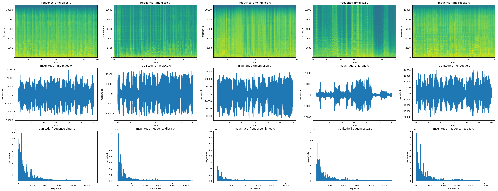

+++
title= "机器学习-线性分类"
date= "2025-12-02T18:51:05+08:00"
lastmod= "2025-12-02T18:51:05+08:00"
draft=false
author= "leuco"
description= "【2】机器学习 第二部分 通过线性模型实现有监督的分类任务"
keywords= ["sk-learn", "逻辑回归", "Logistic", "Softmax", "SVM", "SMO", "感知机", "支持向量机"]
categories= ["机器学习", "学习笔记"]
tags= ["sk-learn", "逻辑回归", "Logistic", "Softmax", "SVM", "SMO", "感知机", "支持向量机"]
math=true
image="SVM.jpg"

+++



# 线性分类（Linear Classification）
- 逻辑回归算法：在多元线性回归算法的基础上把结果缩放到0-1之间
- 线性分类器（GLM与分布的连接器，可以通过内部核函数升维变成非线性算法）：$$\eta = \theta^Tx = \theta_0+\theta_1x_1+……+\theta_nx_n$$
- 广义线性模型（GLM）：$\displaystyle{p(y;\eta)=b(y)e^{(\eta^TT(y)-a(\eta))}}$，其中$\eta$是自然参数，$T(y)$是充分统计量，$a(\eta)$是对数部分函数
  - Logistic回归（逻辑回归）：伯努利-GLM
  - Softmax回归（归一化函数回归）：多项式分布-GLM

## Logistic回归（逻辑回归） —— 二分类
- 伯努利分布：
$$
\displaystyle{P(y;p) = p^y (1-p)^{1-y}, \quad y=0,1 \Rightarrow P(y;p)=e^{(ln(\frac{p}{1-p})y+ln(1-p))}}\displaystyle{\Rightarrow \eta=ln(\frac{p}{1-p})\Rightarrow p=\frac{1}{1+e^{-\eta}}\Rightarrow p(x)=\frac{1}{1+e^{-\theta^Tx}} }
$$
- 逻辑回归函数（Sigmoid）：
$$
\displaystyle{\hat y = h_\theta(x)=g(\theta^Tx)=\frac{1}{1+e^{-\theta^Tx}}} \Rightarrow 分界:\theta^Tx=0
$$。当 $\hat y>0.5$ 时，$y$ 取1；当 $\hat y<0.5$ 时，$y$ 取0
- 损失函数（由极大似然推导而来）：
$$
\displaystyle{J(\theta)=-[\sum^m_{i=1}y^{(i)}lnh(x^{(i)})+(1-y^{(i)})ln(1-h(x^{(i)})]}
$$
  - 梯度下降：
$$
  \displaystyle{\theta_j^{(k+1)} = \theta_j^{(k)}-\alpha\frac{\partial}{\partial_{\theta_j^{(k)}}}J(\theta^{(k)})}
$$
  - 
$$
  \displaystyle{\frac{\partial}{\partial_{\theta_j^{(k)}}}J(\theta^{(k)}) = \frac{1}{n}\sum^n_{i=1}(h_\theta(x_i)-y_i)x^{(j)}_i} \Rightarrow \nabla_{\theta^{(k+1)}}J(\theta^{(k+1)}) = \frac{1}{n}X^T(X\theta^{(k)}-y)
$$
```python
# Sigmoid Function
import numpy as np
import math
import matplotlib.pyplot as plt

def sigmoid_function(x):
    return 1/(1+np.exp(-x))

x = np.linspace(-10,10,1000)
y = sigmoid_function(x)
plt.xlim(-10,10)
plt.ylim(0,1)
plt.plot(x,y)
plt.plot([0,0],[0,sigmoid_function(0)],'k--')
plt.plot([-10,0],[0.5,sigmoid_function(0)],'k--')
plt.plot(0,sigmoid_function(0))
plt.plot(0,0.5,'ko')
plt.text(0.1, 0.5 + 0.001, '(0 , 0.5)',
         fontsize=14, ha='left', va='bottom')
plt.show()
```


​    

​    


```python
# 二分类实例：乳腺癌
from sklearn.datasets import load_breast_cancer
from sklearn.linear_model import LogisticRegression
from sklearn.preprocessing import StandardScaler
from sklearn.model_selection import train_test_split
from sklearn.pipeline import Pipeline
from sklearn.metrics import accuracy_score
import numpy as np
import matplotlib.pyplot as plt

# 载入参数
X,y = load_breast_cancer(return_X_y=True)


# 划分测试集与训练集
X_train,X_test,y_train,y_test = train_test_split(
    X,y,
    test_size=0.3,
    random_state=20230428,
    stratify=y)

# # 标准归一化
# scaler = StandardScaler()
# X_train_scaled = scaler.fit_transform(X_train)
# X_test_scaled = scaler.fit_transform(X_test)

# # 模型训练
# lg_reg = LogisticRegression()
# lg_reg.fit(X_train_scaled,y_train)

# # 预测
# y_train_pre = lg_reg.predict(X_train_scaled)
# y_test_pre = lg_reg.predict(X_test_scaled)

# # 评估
# print("Train:", accuracy_score(y_train,y_train_pre)*100,"%")
# print("Test:",accuracy_score(y_test,y_test_pre)*100,"%")

# 归一化 —— 评估可用Pipeline实现
log_reg = Pipeline([
    ('scaler',StandardScaler()),
    ('clf',LogisticRegression())
])
log_reg.fit(X_train,y_train)
print("Test:",log_reg.score(X_train,y_train)*100,"%")
print("Train:",log_reg.score(X_test,y_test)*100,"%")
```

    Test: 99.49748743718592 %
    Train: 96.49122807017544 %


```python
# 二分类实例：鸢尾花三分类 => 二分类
from sklearn.datasets import load_iris
from sklearn.model_selection import train_test_split
from sklearn.linear_model import LogisticRegression
from sklearn.preprocessing import StandardScaler
from sklearn.metrics import accuracy_score
from sklearn.pipeline import Pipeline
# 0:'setosa', 1:'versicolor', 2:'virginica'

X,y = load_iris(return_X_y=True)
y = (y==2).astype(int) # 二分化

X_train,X_test,y_train,y_test = train_test_split(X,y,test_size=0.3,
                                                random_state=200304)
log_reg = Pipeline([
    ('scaler',StandardScaler()),
    ('clf',LogisticRegression())
    
])
log_reg.fit(X_train,y_train)

print('Train accuracy: {:.2f} %'.format(log_reg.score(X_train, y_train) * 100))
print('Test  accuracy: {:.2f} %'.format(log_reg.score(X_test, y_test) * 100))
```

    Train accuracy: 97.14 %
    Test  accuracy: 93.33 %


### 将多分类问题转化为双分类问题
- One-vs-all（One-vs-rest）：以鸢尾花分类问题为例。将三分类问题转换为三个二分类问题（分别为是否为'setosa'，是否为'versicolor'以及是否为'virginica'）。得到三个预测值，取最大


```python
# OneVsRestClassifier
from sklearn.datasets import load_iris
from sklearn.model_selection import train_test_split
from sklearn.linear_model import LogisticRegression
from sklearn.multiclass import OneVsRestClassifier
from sklearn.preprocessing import StandardScaler
from sklearn.metrics import accuracy_score
from sklearn.pipeline import Pipeline
# 0:'setosa', 1:'versicolor', 2:'virginica'

X,y = load_iris(return_X_y=True)

X_train,X_test,y_train,y_test = train_test_split(X,y,test_size=0.3,
                                                random_state=200304)
log_reg = Pipeline([
    # ('scaler',StandardScaler()),
    ('ovr',OneVsRestClassifier(
        LogisticRegression()
        )
    )
])
log_reg.fit(X_train,y_train)

print('Train accuracy: {:.2f} %'.format(log_reg.score(X_train, y_train) * 100))
print('Test  accuracy: {:.2f} %'.format(log_reg.score(X_test, y_test) * 100))
```

    Train accuracy: 93.33 %
    Test  accuracy: 97.78 %


```python
# 转化为三个二分类问题
from sklearn.datasets import load_iris
from sklearn.model_selection import train_test_split
from sklearn.linear_model import LogisticRegression
from sklearn.preprocessing import StandardScaler
from sklearn.metrics import accuracy_score
from sklearn.pipeline import Pipeline
import numpy as np
# 0:'setosa', 1:'versicolor', 2:'virginica'

X,y = load_iris(return_X_y=True)
temp = []
X_train,X_test,y_train_init,y_test = train_test_split(X,y,test_size=0.3,
                                                     random_state=200304)

for category in [0,1,2]:
    y_train = (y_train_init==category)
    log_reg = LogisticRegression()
    log_reg.fit(X_train,y_train)

    temp.append(log_reg.predict_proba(X_test)[:,1])
result = np.empty(len(temp[0])).reshape(-1,1)

for i in range(len(temp)):
    result = np.c_[result,temp[i].reshape(-1,1)]
result = result[:,1:]

y_test_pre = np.argmax(result,axis=1)
acc = (y_test_pre==y_test)
print('Test  accuracy: {:.2f} %'.format( (acc.sum()/len(acc))* 100))
```

    Test  accuracy: 97.78 %


## Softmax回归（归一化函数回归） —— 多分类
- 多项式分布：
$$\displaystyle{P(X_1=x_1,\dots,X_k=x_k;p_1,p_2,\dots,p_k) = \frac{n!}{x_1! \cdots x_k!} p_1^{x_1} \cdots p_k^{x_k}, \quad \sum_{i=1}^k x_i = n}\displaystyle{\Rightarrow P(y;\varphi)=e^{\displaystyle{\sum^{k-1}_{i=1}T(y)_iln(\frac{\varphi_i}{\varphi_k})+ln\varphi_k}} = e^{\displaystyle{\eta^TT(y)-a(\eta)}}}\Rightarrow\displaystyle{P_i = P({y^{(i)};\Theta})=P_k e^{\displaystyle{\Theta^{(i)}x}}},\displaystyle{P_k=\frac{1}{{\displaystyle{\sum^{k}_{j=1}e^{\displaystyle{\Theta^{(j)}x}}}}}}$$， $\displaystyle{\Theta^{(i)}}$ 为 $\Theta$ 的第 $i$ 行
- Softmax回归函数：$$
\displaystyle{P(y^{(i)}=k|x^{(i)};\theta) = \frac{\displaystyle{e^{\theta_k^Tx^{(i)}}}}{\displaystyle{\sum^k_{j=1}e^{\theta_j^Tx^{(i)}}}}}
$$，此时 $\theta$ 是一个矩阵
- 损失函数——交叉熵损失函数（Cross-Entropy Loss，负对数似然损失）：$$
\displaystyle{J(\theta)=-\frac{1}{N}\sum^{N}_{n=1}\sum^{k}_{i=1}y_i^{(n)}ln(\hat y_i^{(n)})}
$$，其中 $N$ 是样本数， $k$ 是分类数， $y_i^{(n)}$ 是真实标签，服从one-hot编码， $\hat y_i^{(n)}$ 是预测概率，取值为 $(0,1) $
- 当y的分类数为2时，Softmax回归退化为Logistc回归


```python
from sklearn.datasets import load_iris
from sklearn.model_selection import train_test_split
from sklearn.linear_model import LogisticRegression
from sklearn.preprocessing import StandardScaler
from sklearn.metrics import accuracy_score
from sklearn.pipeline import Pipeline

X,y = load_iris(return_X_y=True)
X_train,X_test,y_train,y_test = train_test_split(
    X,y,
    test_size=0.3,
    random_state=200304
)
pipe = Pipeline([
    ('scaler',StandardScaler()),
    ('clf',LogisticRegression(# 默认Softmax
        solver='sag',
        max_iter=1000,
    ))
])
pipe.fit(X_train,y_train)
pipe.score(X_test,y_test)
```


    0.9777777777777777


## 实践——音乐分类器
- 数据集路径： ".\Dataset\2_Music_Classifier"


```python
from scipy.fft import fft,fftfreq # 快速傅里叶转换
from scipy.io import wavfile # 读取wav文件格式
from matplotlib.pyplot import specgram as spg # 绘制频谱图
import matplotlib.pyplot as plt
from itertools import product

path = "./Dataset/2_Music_Classifier/"

# wavfile返回样本率（每秒采样个数，单通道采样总数）
# sample_rate,X = wavfile.read("./Dataset/2_Music_Classifier/blues/converted/blues.00000.au.wav")

# 绘图查看
def frequence_time(mtype,mserial):
    sample_rate,X = wavfile.read(path+mtype+"/converted/"+mtype+"."+mserial+".au.wav")
    plt.specgram(X,Fs=sample_rate,xextent=(0,30))
    # plt.plot(fft(X,sample_rate))
    plt.title("frequence_time:"+ mtype + "-" + mserial[-1])
    plt.ylabel('frequence')
    plt.xlabel('time')
    

def magnitude_time(mtype,mserial):
    sample_rate,X = wavfile.read(path+mtype+"/converted/"+mtype+"."+mserial+".au.wav")
    time = np.linspace(0,30,len(X))
    plt.plot(time,X)
    plt.title("magnitude_time:"+ mtype + "-" + mserial[-1])
    plt.ylabel('magnitude')
    plt.xlabel('time')

def magnitude_frequence(mtype,mserial):
    sample_rate,X = wavfile.read(path+mtype+"/converted/"+mtype+"."+mserial+".au.wav")
    N = len(X)
    freqs = fftfreq(N, 1/sample_rate)[:N//2]
    mag = np.abs(fft(X))[:N//2]
    plt.plot(freqs,mag)
    plt.title("magnitude_frequence:"+ mtype + "-" + mserial[-1])
    plt.ylabel('magnitude')
    plt.xlabel('frequence')

types = ['blues','classical','country','disco','hiphop','jazz','metal','pop','reggae','rock']
serials = ['00000','00001','00002']

types = types[:]
serials = serials[:]
plt.figure(num=None,figsize=(8*len(serials),5*len(types)),dpi=80)
for index,(t,s) in enumerate(product(types,serials)):
    plt.subplot(len(types),len(serials),index+1)
    frequence_time(t,s)
plt.show()
plt.figure(num=None,figsize=(8*len(serials),5*len(types)),dpi=80)
for index,(t,s) in enumerate(product(types,serials)):
    plt.subplot(len(types),len(serials),index+1)
    magnitude_time(t,s)
plt.show()
# plt.figure(num=None,figsize=(8*len(serials),5*len(types)),dpi=80)
# for index,(t,s) in enumerate(product(types,serials)):
#     plt.subplot(len(types),len(serials),index+1)
#     magnitude_frequence(t,s)

types = [types[i] for i in list(np.sort(np.random.choice(range(len(types)),size=5,replace=False)))]
serials = serials[:1]
plt.figure(num=None,figsize=(8*len(types),5*3),dpi=80)
for index,(t,s) in enumerate(product(types,serials)):
    plt.subplot(3,len(types),0*len(types)+index+1);frequence_time(t,s)
    plt.subplot(3,len(types),1*len(types)+index+1);magnitude_time(t,s)
    plt.subplot(3,len(types),2*len(types)+index+1);magnitude_frequence(t,s)
plt.show()
```


​    

​    


    



    


### 0、初始化


```python
from scipy.fft import fft # 快速傅里叶转换
from scipy.io import wavfile # 读取wav文件格式
from matplotlib.pyplot import specgram as spg # 绘制频谱图
from itertools import product
import matplotlib.pyplot as plt
import numpy as np
import os 

from sklearn.pipeline import Pipeline
from sklearn.preprocessing import StandardScaler
from sklearn.linear_model import LogisticRegression
from sklearn.model_selection import train_test_split

path = "./Dataset/2_Music_Classifier/"
model_path = "D:/MLab/project/StuML/ML/Model/2_Music_Classifier/"

max_len = 660000

labels = dict([(label_name,label_num) for label_num,label_name in enumerate(os.listdir(path))])
```

### 1、数据处理与特征存储


```python
y = [];X=[]
for label_name in labels.keys():
    sub_path = path+label_name+"/converted/"
    for wave_file_name in os.listdir(sub_path):
        y.append(labels[label_name])
        X.append(
            abs( # 取幅值（实部和虚部的平方和开根号）
                fft( # 傅里叶变换
                    wavfile.read( # 读取
                        sub_path+wave_file_name
                    )[1][:max_len] # 切片
                )
            )
        )

X_train,X_test,y_train,y_test = train_test_split(
    X,y,
    test_size=0.1,
    random_state=200304,
    stratify=y
)

# 特征存储
np.save(model_path+"train_feature",X_train)
np.save(model_path+"train_label",y_train)
np.save(model_path+"test_feature",X_test)
np.save(model_path+"test_label",y_test)

```

### 2、模型训练与存储


```python
X = np.load(model_path+"train_feature.npy")
y = np.load(model_path+"train_label.npy")


log_reg = Pipeline([
    ('scaler',StandardScaler()),
    ('clf',LogisticRegression(
        max_iter=10000,
        # solver='sag'
    ))
])

log_reg.fit(X,y)

with open(model_path+"model_object","wb") as file:
    pickle.dump(log_reg,file)
```

### 3、测试与评估


```python
X_test = np.load(model_path+"test_feature.npy")
y_test = np.load(model_path+"test_label.npy")

with open(model_path+"model_object","rb") as file:
    log_reg = pickle.load(file)

log_reg.score(X_test,y_test)
# log_reg.score(X_train,y_train)
```


    0.6


## 支持向量机（SVM，Support Vector Machine）与感知机（Perceptron）
- SVM是一种二分类算法，是对Perceptron模型的扩展,具有更强的泛化能力
- SVM/Perceptron模型：
$$
  y=\operatorname{sign}(\theta x)=
  \begin{cases}  
   +1, & \theta x>0 \\
   -1, & \ \theta x<0 
  \end{cases}
$$
- 间隔：样本到超平面的距离
  - 几何距离：$\displaystyle{\gamma = \frac{|w^tx_0+b|}{||w||}}$，其中超平面为 $\displaystyle{w^tx+b=0}$
    - 对于正确分类的样本点，有 $$\displaystyle{\gamma = \frac{y_0(w^tx_0+b)}{\sqrt{w^tw}} = \frac{y_0(\hat y_0+b)}{\sqrt{w^tw}}}$$
  - 函数距离：$\displaystyle{\delta=|w^tx_0+b|}$
    - 对于正确分类的样本点，有 $$\displaystyle{\delta=|w^tx_0+b|=y_0(w^tx_0+b)}$$
  - 硬间隔：要求所有样本都必须正确分类，不允许任何错误
  - 软间隔：允许部分样本分类错误，容忍一定程度的误差，以获得更好的泛化能力
- 支持向量：离分割超平面最近的那些样本点
- Perceptron思想：期望使分类错误的所有样本（m条）到超平面的距离之和最小
  - $$\displaystyle{J(\theta)=\sum_{i\in M_\theta}\frac{-y^i(\theta^T x^i+b)}{||\theta||}}\Rightarrow \displaystyle{J(\theta)=-\sum_{i\in M_\theta}{y^i(\theta^T x^i+b)}}$$，其中 $M_\theta$ 为分类错误集
  - 优化：随机梯度下降法（SGD）或小批量梯度下降法（MBGD）
    - $$\displaystyle{\nabla_\theta J(\theta) = -\sum_{i\in M_\theta}y^{(i)}x^{(i)}}$$$，注意，这里的梯度函数表达式内部虽然与 $\theta$ 无关，但错误集 $M_\theta$ 却与 $\theta$ 相关
- SVM思想：期望使离超平面比较近的点尽可能地远离超平面 —— 二次优化
  - 线性可分支持向量机：硬间隔最大化（完美分类正负例且距离超平面最近的点离超平面越远越好）
    - 损失函数：求解（拉格朗日条件约束）：
$$
      \begin{aligned}
      & \displaystyle{\max\limits_{w,b}\ \gamma_{min}=\frac{y_{min}(w^Tx_{min}+b)}{||w||}}\\
      s.t. \quad &\displaystyle{{\gamma}_{i} = \frac{y_i(w^Tx_i+b)}{||w||}\ge \gamma_{min} ,i \in \{1,2,\ldots m\}} \\
      \end{aligned} 
      $$
      令 $y_{min}(wx_{min}+b) = 1$，则原式等价于 （损失函数）：
      $$
      \begin{aligned}
      & \displaystyle{\min\limits_{w,b}\ \frac{1}{2}{||w||^2}}\\
      s.t. \quad &\displaystyle{y_i(w^Tx_i+b)\ge 1 ,i \in \{1,2,\ldots m\}} \\
      \end{aligned} 
      $$
    - 二次规划：
      - 构建拉格朗日函数：
        $$\displaystyle{ L(w,b,\alpha)=\frac{1}{2}||w||^2-\sum^m_{i=1}\alpha_i[y_i(w^Tx_i+b)-1], \alpha_i \ge 0}$$
      - 求解
        $$\displaystyle{\min\limits_{w,b}\max\limits_{\alpha_i\ge 0}L(w,b,\alpha) \overset{\text{对偶函数}}{\Leftrightarrow} \max\limits_{\alpha_i\ge 0}\min\limits_{w,b}L(w,b,\alpha)}$$
        - 原问题等价于（SMO算法推导）：
          $$
          \begin{aligned}
          & \displaystyle{\min\limits_\alpha \frac{1}{2}\sum^m_{i=1}\sum^m_{j=1}\alpha_i\alpha_jy_iy_j(x_i·x_j)-\sum^m_{i=1}\alpha_i}\\
          s.t. \quad &\displaystyle{\sum^m_{i=1}\alpha_iy_i=0}&,i\in \{1,2,\ldots m\} \\
          &\displaystyle{ \alpha_i \ge 0} &,i\in \{1,2,\ldots m\}
          \end{aligned} 
          $$
      - 求 $w^* \text{与} b^*$ ：
        $$
        \begin{cases}
        \displaystyle{w^* = \sum^m_{i=1}{\alpha^*}_iy_ix_i}\\
        \displaystyle{y_s({w^*}^Tx_s+b^*)=1,\quad x_s为任意支持向量}\\
        \displaystyle{\alpha^*(y_s({w^*}^Tx_s+b^*)-1)=0,\quad 可获得支持向量}
        \end{cases}
        $$
      - 预测函数：$$\hat y = ({w^*}^T x+b^*)$$
  - 线性支持向量机（线性不可分）：软间隔最大化（在硬间隔的基础上引入松弛变量 $\xi_i \ge 0$ ）
    - 损失函数：求解（拉格朗日条件约束）：
      $$
      \begin{aligned}
      & \displaystyle{\min\limits_{w,b} \frac{1}{2}{||w||^2} + C{\sum^m_{i=1}\xi_i}}\\
      s.t. \quad &\displaystyle{y_i(w^Tx_i+b)\ge 1-\xi_i} &, i \in \{1,2,\ldots m\} \\
      &\displaystyle{ \xi_i \ge 0}&, i \in \{1,2,\ldots m\}
      \end{aligned} 
      $$
    - 二次规划：
      - 构建拉格朗日函数：
        $$
        \displaystyle{ L(w,b,\xi,\alpha,\mu)=\frac{1}{2}||w||^2+C\sum^m_{i=1}\xi_i-\sum^m_{i=1}\alpha_i[y_i(w^Tx_i+b)-1+\xi_i]-\sum^m_i\mu_i\xi_i, \alpha_i,\xi_i \ge 0}
        $$
      - 求解
        $\displaystyle{\min\limits_{w,b,\xi}\max\limits_{\alpha_i\ge 0,\xi_i\ge 0}L(w,b,\xi,\alpha,\mu) \overset{\text{对偶函数}}{\Leftrightarrow} \max\limits_{\alpha_i\ge 0,\xi_i\ge 0}\min\limits_{w,b,\xi}L(w,b,\xi,\alpha,\mu)}$
        - 原问题等价于（SMO算法推导）：
          $$
          \begin{aligned}
          & \displaystyle{\min\limits_\alpha \frac{1}{2}\sum^m_{i=1}\sum^m_{j=1}\alpha_i\alpha_jy_iy_j(x_i·x_j)-\sum^m_{i=1}\alpha_i}\\
          s.t. \quad &\displaystyle{\sum^m_{i=1}\alpha_iy_i=0}&,i\in \{1,2,\ldots m\}\\
          & 0 \le \alpha_i \le C & , i\in \{1,2,\ldots m\}\\
          % & \xi_i \ge 0 & , i\in \{1,2,\ldots m\}
          \end{aligned} 
          $$
      - 对于支持样本 $x_i$:
        - $\alpha_i = 0$ : $x_i$ 被正确分类
        - $0 < \alpha_i < C$ : $x_i$ 在软边界上
        - $\alpha_i = C$ : $x_i$ 嵌入软边界内
          - $\xi < 1$ : $x_i$ 被正确分类
          - $\xi = 1$ : $x_i$ 在超平面上
          - $\xi > 0$ : $x_i$ 被错误分类
      - 求 $w^* \text{与}b^*$ ：
        $$
        \begin{cases}
        \displaystyle{w^* = \sum^m_{i=1}{\alpha}_i^*y_ix_i}\\
        \displaystyle{y_s({w^*}^Tx_s+b^*)=1,\quad x_s为任意支持向量}\\
        \displaystyle{\alpha^*(y_s({w^*}^Tx_s+b^*)-1)=0,\quad 可获得支持向量}
        \end{cases}
        $$
  - 非线性支持向量机：升维（核函数Kernel）
    - 定义Kernel函数：$K(x,z) = \phi(x)\phi(z)$
    - 此时对偶处理后的目标函数为：
      $$
      \begin{aligned}
          & \displaystyle{\min\limits_\alpha \frac{1}{2}\sum^m_{i=1}\sum^m_{j=1}\alpha_i\alpha_jy_iy_jK(x_i,x_j)-\sum^m_{i=1}\alpha_i}\\
          s.t. \quad &\displaystyle{\sum^m_{i=1}\alpha_iy_i=0}&,i\in \{1,2,\ldots m\}\\
          & 0 \le \alpha_i \le C & , i\in \{1,2,\ldots m\}\\
          % & \xi_i \ge 0 & , i\in \{1,2,\ldots m\}
          \end{aligned} 
      $$
    - 常用Kernel函数：
      - 线性Kernel函数：    $K(x,z)=x \cdot z$
      - 多项式Kernel函数：  $K(x,z)=(\gamma x \cdot z + r)$
      - 高斯Kernel函数：    $K(x,z)=\exp(-\gamma||x-z||^2)$
      - Sigmoid Kernel函数：$K(x,z)=\tanh(\gamma x \cdot z + r)$

## SMO算法
- SVM算法关键步骤：
  - 支持向量机算法最优化问题（指定惩罚系数C）：
  $$
   \begin{aligned}
   & \displaystyle{J(\alpha)=\min\limits_\alpha \frac{1}{2}\sum^m_{i=1}\sum^m_{j=1}\alpha_i\alpha_jy_iy_j(x_i·x_j)-\sum^m_{i=1}\alpha_i}\\
   s.t. \quad &\displaystyle{\sum^m_{i=1}\alpha_iy_i=0}&,i\in \{1,2,\ldots m\}\\
   & 0 \le \alpha_i \le C & , i\in \{1,2,\ldots m\}\\
   % & \xi_i \ge 0 & , i\in \{1,2,\ldots m\}
   \end{aligned} 
  $$
  - 等价于求解 ：
  $$
    \begin{cases}
    \displaystyle{w^* = \sum^m_{i=1}{\alpha}_i^*y_ix_i}\\
    \displaystyle{y_s({w^*}^Tx_s+b^*)=1,\quad x_s为任意支持向量}\\
    \displaystyle{\alpha^*(y_s({w^*}^Tx_s+b^*)-1)=0,\quad 可获得支持向量}
    \end{cases}
  $$
  - 预测函数： $\displaystyle{f(x)=sign(\sum^m_{i=1}\alpha_i^*y_iK(x,x_i)+b^*)}$
- SMO算法求解最优化问题
  - 求解 $\alpha_i, i\in \{1,2,\dots m\}$
  - 算法思想：
    - 由于 $\displaystyle{\sum^m_{i=1}\alpha_iy_i=0}$ ，故不能只固定一个参数
    - 将原始求解m个参数二次规划问题分解成多个子二次规划问题分别求解，每个子问题只求解2个参数
    - 采用启发式方法选择需要更新的两个参数 $\alpha_i $ 和 $\alpha_j$
      - 例如，选择 $\alpha_1$ 和 $\alpha_2$
    - 优化 $\alpha_i $ 和 $\alpha_j$ 使目标函数最大程度接近全局最优解（$\nabla_{\alpha_i,\alpha_j}J(\alpha)=0$），其余参数不变
      - $$\displaystyle{\min\limits_{\alpha_1,\alpha_2}J(\alpha_1,\alpha_2)=\min\limits_{\alpha_1,\alpha_2}\frac{1}{2}K_{11}\alpha_1^2+\frac{1}{2}K_{22}\alpha_2^2+y_1y_2K_{12}\alpha_1\alpha_2-(\alpha_1+\alpha_2)+y_1v_1\alpha_1+y_2v_2\alpha_2+Constant}$$ ，其中 $$v_i = \displaystyle{\sum^m_{j=3}\alpha_jy_jK(x_i,x_j), i = 1,2}$$
    - 将二元函数视为一元函数
      - 另 $$\alpha_1 = (\zeta-y_2\alpha_2)y_1$$ ，带回上式
      - $$\displaystyle{\min\limits_{\alpha_2}J(\alpha_2)=\min\limits_{\alpha_2}\frac{1}{2}K_{11}(\zeta-y_2\alpha_2)y_1^2+\frac{1}{2}K_{22}\alpha_2^2+y_1y_2K_{12}(\zeta-y_2\alpha_2)y_1\alpha_2-((\zeta-y_2\alpha_2)y_1+\alpha_2)+y_1v_1(\zeta-y_2\alpha_2)y_1+y_2v_2\alpha_2+Constant}$$
    - 对 $J(\alpha_2)$ 求导，导数为0
      - $$
        \begin{aligned}
        \displaystyle{v_1 = f(x_1)-\sum^2_{j=1}y_j\alpha_jK_{1j}-b} \\
        \displaystyle{v_2 = f(x_2)-\sum^2_{j=1}y_j\alpha_jK_{2j}-b}
        \end{aligned}
        $$
      - $$\displaystyle{\alpha^{new,unclipped}_2 = \alpha^{old}_2 + \frac{y_2(E_1-E_2)}{\eta}}$$，其中 $$\alpha_2^{new,unclipped}$$ 为未考虑约束的新值， $$E_i = f(x_i)-y_i, \ \eta = K_{11}+K_{22}-2K_{12}$$
    - 对新值进行约束修建
      - $$
        \begin{aligned}
        & 0 \le \alpha_1,\alpha_2 \le C \\
        & \alpha_1 + \alpha_2 = \zeta
        \end{aligned}
        $$
      - - 当 $y_1 \neq y_2$ 时，
      $$
      L=\max(0,\alpha^{old}_2-\alpha^{old}_1),H=\min(C,C+\alpha^{old}_2-\alpha^{old}_1)
      $$
        - 当 $y_1 \neq y_2$ 时，$$L=\max(0,\alpha_1^{old}+\alpha_2^{old}-C);H=\min(C,\alpha_2^{old}+\alpha_1^{old})$$
      - $$
      \alpha_2^{\text{new}} = 
      \begin{cases}
      H &, \alpha_2^{\text{new,unclipped}} > H \\
      \alpha_2^{\text{new,unclipped}} &, L \le \alpha_2^{\text{new,unclipped}} \le H \\
      L &, \alpha_2^{\text{new,unclipped}} < L
      \end{cases}
$$
  - 启发式选择变量
    - 第一个变量的选择称为外循环，首先遍历整个样本集，选择违反KKT条件的 $\alpha_i$ 作为第一个变量。依据相关规则选择第二个变量，对这两个变量采用上述方法进行优化。直到遍历整个样本集后，没有违反KKT条件 $\alpha_i$ ，然后退出
      - KKT条件：
$$
        \begin{aligned}
        & \alpha_i = 0 & \Rightarrow & \qquad y^{(i)}(w^Tx^{(i)}+b) \ge 1 \\
        & \alpha_i = C & \Rightarrow & \qquad y^{(i)}(w^Tx^{(i)}+b) \le 1 \\
        & 0 < \alpha_i < C & \Rightarrow & \qquad y^{(i)}(w^Tx^{(i)}+b) = 1 \\
        \end{aligned}
        $$
    - 第二个变量的选择成为内循环，假设在外循环中找到第一个变量记为 $\alpha_1$ ，第二个变量的选择希望能使 $\alpha_2$ 有较大变化。由于 $\alpha_2$ 是依赖于 $|E_1-E_2|$ ，当 $E_1$ 为正时，那么选择最小的 $E_i$ 作为 $E_2$ ；如果 $E_1$ 为负时，选择最大的 $E_i$ 作为 $E_2$ ，通常为每个样本的 $E_i$ 保存在一个列表中，选择最大的 $|E_1-E_2|$ 来近似最大化步长。

## SVM概率化输出
- 目的：将决策值映射为概率（如 $P(y=1∣x)\in[0,1]$），使用户能判断样本属于某类的可能性大小
- 标准的SVM的无阈值输出为：$f(x)=h(x)+b$ ，其中 $h(x)=\displaystyle{\sum_iy_i\alpha_iK(x_i,x)}$
- Platt利用 sigmoid-fitting 方法，将标准的SVM的输出结果进行后处理，转换为后验概率
  $P(y=1|f)=\displaystyle{\frac{1}{1+\exp(Af+B)}}$ ，其中 $A$ 和 $B$ 为待拟合参数，$f$ 为样本 $x$ 的无阈值输出。

## SVM合页损失
- 0-1损失是二分类问题的真正损失函数，合页损失与logistic损失是对0-1损失函数的近似
- 合页损失函数(Hinge Loss Function)：$L(y(wx+b))=[1-y(wx+b)]_+$ ， $[]_+$ 表示：
  $$
  [z]_+ = 
  \begin{cases}
  z&,z>0 \\
  0&,z\le 0
  \end{cases}
  $$
  也就是说，数据点如果被正确分类，损失为0，如果没有被正确分类，损失为z
- SVM的损失函数就是合页损失函数+正则化项:
  - $$\displaystyle{\min\limits_{w,b}\sum^m_{i=1}L(y^{(i)}(w^Tx^{(i)}+b)) + \lambda ||w||^2}$$
  - 上述目标函数中，当 $\displaystyle{\lambda = \frac{1}{2C}}$ 时。等价于原目标函数 $$\displaystyle{\frac{1}{2}||w||^2+C\sum^m_{i=1}\xi_i}$$

# 实践-人脸分类器
- 基于 sklearn 内置 LFW 数据集 + SVM


```python
import numpy as np
import matplotlib.pyplot as plt

from sklearn.datasets import fetch_lfw_people
from sklearn.model_selection import train_test_split
from sklearn.preprocessing import StandardScaler
from sklearn.decomposition import PCA
from sklearn.svm import SVC
from sklearn.pipeline import Pipeline
from sklearn.metrics import classification_report,accuracy_score

# 1、加载人脸数据
lfw_people = fetch_lfw_people(min_faces_per_person=70,resize=0.4)
X,y,names = (lfw_people.data,lfw_people.target,lfw_people.target_names)
n_classes = names.shape[0]

print("数据集规模：",X.shape)
print("类别数：",n_classes)
print("类别名：",names)
print()


# 2、划分数据集与训练集
X_train,X_test,y_train,y_test = train_test_split(X,y,test_size=0.25,random_state=428,stratify=y)


# 3、构建机器学习通道
pipe = Pipeline([ # 先降维，再归一，再SVM
    (
        'pca',
        PCA(
            n_components=150, # 只保留150个主成分（把原始11750维降到150维）
            whiten=True, # 白化：150维特征缩放到同尺度，去相关
            random_state=428
        )
    ),
    (
        'scaler',
        StandardScaler() # 对PCA后的150维特征进行归一化
    ),
    (
        'svm',
        SVC(
            kernel='rbf', # 使用高斯核函数进行非线性升维
            class_weight='balanced', # 自动根据各类样本量给出权重，防止某些人照片多导致偏向性
            C=5.0, # 正则强度，C越大越不允许误分，可能导致过拟合；C约小margin越大可能导致欠拟合
            gamma='scale' # 高斯核宽度gamma的取值策略
        )
    )
])


# 4、训练模型
print("开始训练 SVM ...")
pipe.fit(X_train,y_train)
print("训练完成")
print()

# 5、评估模型
y_pred = pipe.predict(X_test)
print(f"\n测试集整体准确率：{pipe.score(X_test,y_test):.3f}")
print("\n详细分类报告：")
print(classification_report(y_test, y_pred, target_names=names))

```

    数据集规模： (1288, 1850)
    类别数： 7
    类别名： ['Ariel Sharon' 'Colin Powell' 'Donald Rumsfeld' 'George W Bush'
     'Gerhard Schroeder' 'Hugo Chavez' 'Tony Blair']
    
    开始训练 SVM ...
    训练完成


​    
​    测试集整体准确率：0.851
​    
​    详细分类报告：
​                       precision    recall  f1-score   support
​    
         Ariel Sharon       1.00      0.47      0.64        19
         Colin Powell       0.84      0.90      0.87        59
      Donald Rumsfeld       0.95      0.70      0.81        30
        George W Bush       0.80      0.98      0.88       133
    Gerhard Schroeder       0.95      0.78      0.86        27
          Hugo Chavez       1.00      0.56      0.71        18
           Tony Blair       0.91      0.83      0.87        36
    
             accuracy                           0.85       322
            macro avg       0.92      0.75      0.81       322
         weighted avg       0.87      0.85      0.84       322


​    
