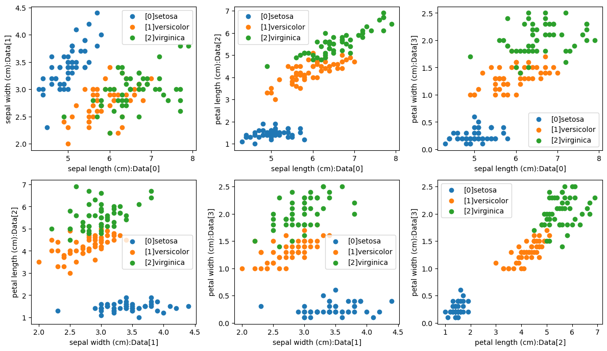
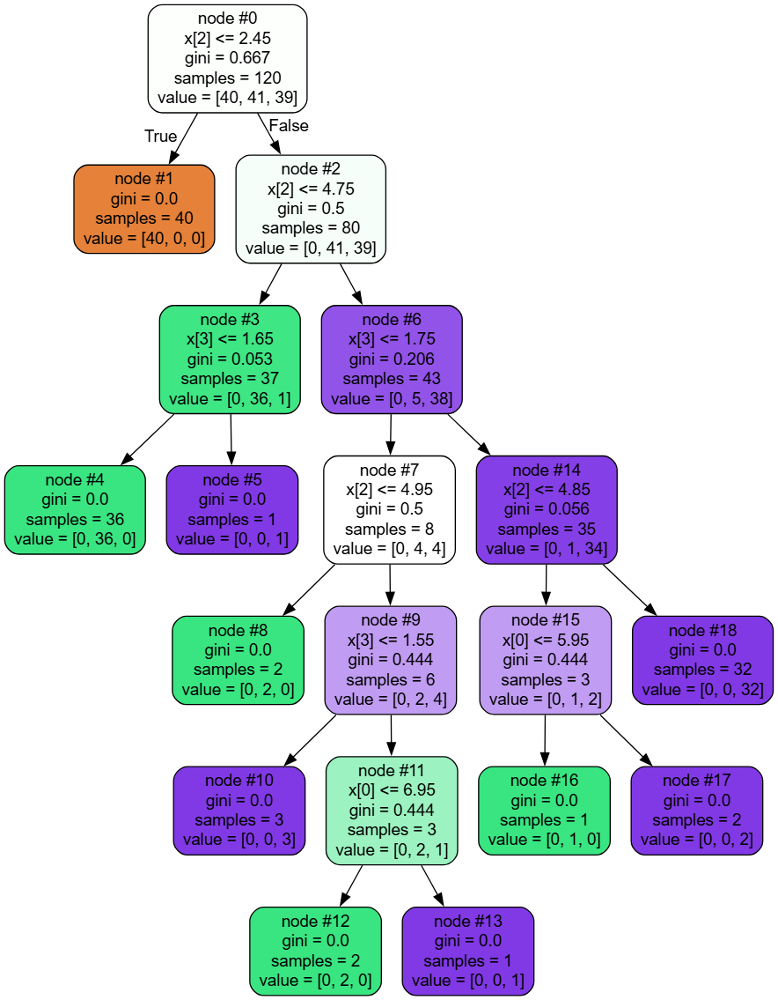
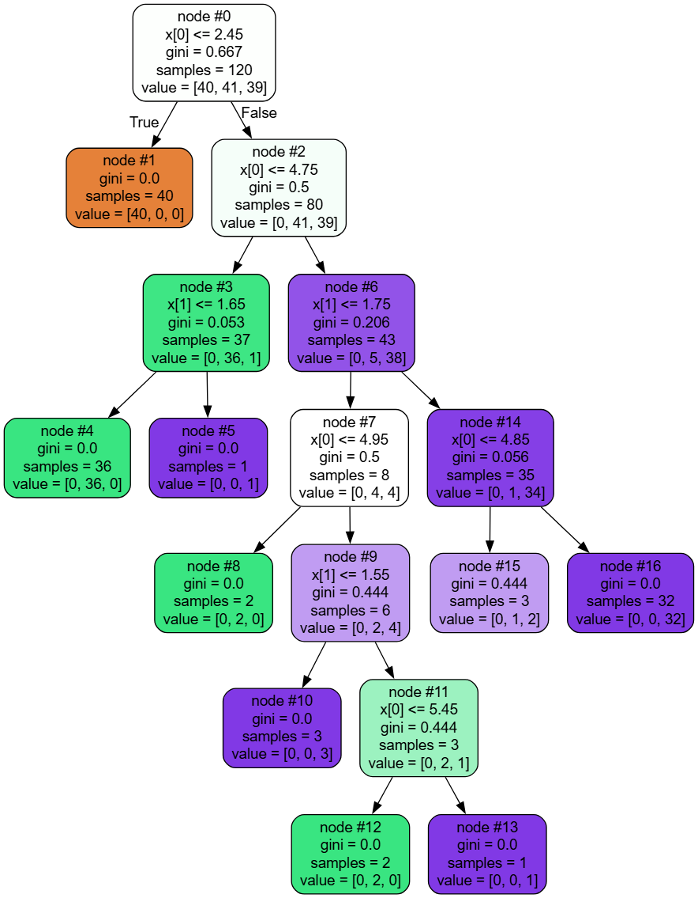

+++
title= "机器学习-集成学习"
date= "2025-12-02T20:30:43+08:00"
lastmod= "2025-12-02T20:30:43+08:00"
draft=false
author= "leuco"
description= "【4】机器学习第四部分 从决策树到集成学习"
keywords= ["决策树", "Bagging", "Boosting", "随机森林", "OOB", "袋外数据", "AdaBoost", "GBDT"]
categories= ["机器学习", "学习笔记"]
tags= ["决策树", "Bagging", "Boosting", "随机森林", "OOB", "袋外数据", "AdaBoost", "GBDT"]
image= "output_3_1.png"
image_caption= "output_3_1"
math=true
top_min=1
+++



# 集成学习
## 决策树（Decision-Making Tree）
- 决策树是有监督机器学习的一种
- 模型生成：通过大量数据生成一棵非常好的树（寻找最优的分裂条件）
- 预测：按照生成好的树的标准落到某一个叶子节点上
- 算法思想
  $$
  \begin{aligned}
  & function \ \operatorname{DecisionTree}(data:\mathcal{D}=\{(x_n,y_n)\}_{n=1}^N) \\
  &\qquad \operatorname{if} \ termination\ citeria met: \qquad\text{//如果满足终止条件}\\
  &\qquad\qquad \begin{aligned}
  \operatorname{return}\ base\ hypothesis\ g_t(x) \qquad\text{//返回第t个叶子节点的值}
  \end{aligned}\\
  &\qquad\operatorname{else}\\
  &\qquad\qquad \begin{aligned}
  & \operatorname{learn}\ branching\ criteria\ b(x)  \qquad\text{//学习最优分裂条件b(x)，该条件产生C个结果分支}\\
  & split\ \mathcal{D}\ to\ C\ parts\ \mathcal{D}_C=\{(x_n,y_n):b(x_n)=c\} \qquad//把当前的数据集\mathcal{D}切分成C个部分  \\ 
  & \operatorname{build}\ sub-tree\ G_C\ \leftarrow \ \operatorname{DecisionTree}(\mathcal{D}_C) \qquad\text{//递归在子结点上再进行子树划分}\\
  & \operatorname{return}\ G(x)=\displaystyle{\sum^C_{c=1}[[b(x)==c]]G_C(x)} \qquad\text{//返回整体数结构表达式}
  \end{aligned}
  \end{aligned}
  $$
- 生成决策树所需分裂指标——离散问题（$D_c为特征A的第c个取值样本子集$）
  - Gini系数：
    - 公式： $$\displaystyle{Gini^{init}(p)=\sum_{k=1}^Kp_k(1-p_k)=1-\sum_{k=1}^Kp_k^2}$$
    - 基尼系数越小，代表D集合中的数据约纯，所以可以计算分裂前的值在按照某个维度对数据集进行划分，然后计算多个节点的Gini系数：$$\displaystyle{Gini^{Divided}(D,A)=\sum_{c \in Values(A)}\frac{|D_c|}{|D|}Gini(D_c) }$$
    - 收益函数：$$Gain(D,A)=Gini^{init}(D)-Gini^{Devided}(D,A)$$
  - 信息增熵：$H(X) \simeq Gini(X)$
    - 公式： $$\displaystyle{H(N) = -\sum_j P(\omega_j)\log_2P(\omega_j) }$$
    - 划分后的多个结点的熵之和：$$\displaystyle{H^{Devided}(D,A)=-\sum_{c \in Values(A)}\frac{|D_c|}{|D|}H(D_c) }$$
    - 收益函数：$$\displaystyle{Gain(D,A)=H^{init}(D)-H^{Devided}(D,A)}$$
  - 信息增益率
    - 特征A的固有值（Intrinsic Value）：$$\operatorname{IV}(A)=\displaystyle{-\sum_{c \in Values(A)}\frac{|D_c|}{|D|}log_2\frac{|D_c|}{|D|}}$$
    - 信息增益率：$$\displaystyle{GainRatio(D,A)=\frac{Gain(D,A)}{IV(A)}}$$
  - MSE（回归问题）
- 剪枝：解决过拟合问题
  - 前剪枝：在构建决策树的过程中，限定最小叶子内的节点数、最大深度等条件
  - 后剪枝:
    - REP——错误率降低剪枝
    - PEP——悲观剪枝
    - CCP——代价复杂度剪枝
      - CCP为子树 $ T_t $ 定义了代价（cost）和复杂度（complexity），以及一个可由用户设置的衡量代价与复杂度之间关系的参数 $ \alpha^* $ ，其中代价指的是在剪枝过程中因子树 $ T_t $ 被叶子节点替代而增加的错分样本，复杂度表示剪枝后子树 $ T_t $ 减少的叶子节点数量。 $ \alpha $ 表示剪枝后树的复杂度减低程度与代价之间的关系。当 $ \alpha^* < \alpha $ 时就可以将该节点下的子树剪掉，当前节点作为叶子节点 
      $$
        \begin{aligned}
        &\alpha = \displaystyle{\frac{R(t)-R(T_t)}{|N_1|-1}}\\
        其中，&|N_1|:子树T_t中的叶子节点数 \\
        & R(t)为结点t的错误代价，R(t)=r(t)*p(t) \\
        & r(t)为结点t的错分样本率，p(t)为落入结点t的样本占所有样本的比例 \\
        & R(T_t)为子树T_t的错误代价，R(T_t)=\displaystyle{\sum_iR(i)},i为子树T_t的叶子节点
        \end{aligned}
        $$
- 各特征重要性评估指标：$$FI(j)=\displaystyle{\frac{\displaystyle{\sum_{t\ use\ j}N_t·Gain(t)}}{\displaystyle{\sum_{all\ t}N_t·Gain(t)}}}$$，其中 $ N_t $ 是分裂节点 $ t $ 的样本数
- 在线绘制工具：[Graphviz Online](https://dreampuf.github.io/GraphvizOnline/)


```python
# 决策树实现鸢尾花分类
import pandas as pd
import numpy as np
from sklearn.datasets import load_iris
from sklearn.tree import DecisionTreeClassifier
from sklearn.tree import export_graphviz
from sklearn.model_selection import train_test_split
from sklearn.metrics import accuracy_score
import matplotlib.pyplot as plt
import matplotlib as mpl
from itertools import product
from sklearn.preprocessing import StandardScaler
from sklearn.preprocessing import MinMaxScaler
from sklearn.pipeline import Pipeline

def show(X,y,names,species):
    s = [t for t in sorted(list(set([tuple(sorted(p)) for p in product([0,1,2,3],repeat=2)]))) if t[0]!=t[1]]
    fig,axs = plt.subplots(2,3,figsize=(12,7))
    axs = axs.flatten()
    for index,((x1,x2),ax) in enumerate(zip(s,axs)):
        [ax.scatter(X[y==lab][:,x1],X[y==lab][:,x2],label=f"[{lab}]{species[lab]}") for lab in set(y)]
        ax.set_xlabel(f"{names[x1]}:Data[{x1}]")
        ax.set_ylabel(f"{names[x2]}:Data[{x2}]")
        ax.legend()
    plt.tight_layout()
    plt.show()
    
iris = load_iris()
data = pd.DataFrame(iris.data)
data.columns = iris.feature_names
data['species'] = iris.target
X,y = (iris.data,iris.target)
show(X,y,data.columns,iris.target_names)

X_train,X_test,y_train,y_test = train_test_split(X,y,train_size=0.8,random_state=42)

pip = Pipeline(steps = [
    ('dtc',DecisionTreeClassifier(max_depth=8,criterion='gini',random_state=428)),  
])


pip.fit(X_train,y_train)
print(f"Accuracy of the test set (four features): {pip.score(X_test,y_test)}")
export_graphviz(
    pip['dtc'],
    out_file="Output/Iris_Decision_Tree/tree_dot.dot",
    filled=True,
    rounded=True,
    node_ids=True,
    class_names=None
)

print(f"feature importances: {pip['dtc'].feature_importances_}") #特征0与特征1的重要性极低

pip.fit(X_train[:,2:4],y_train)
print(f"Accuracy of the test set (two features): {pip.score(X_test[:,2:4],y_test)}")
export_graphviz(
    pip['dtc'],
    out_file="Output/Iris_Decision_Tree/tree1_dot.dot",
    filled=True,
    rounded=True,
    node_ids=True
)


#深度探测：寻找最优树深
scores = {}
for depth in np.arange(1,15):
    dtc = DecisionTreeClassifier(max_depth=depth,criterion='gini',random_state=428)
    dtc.fit(X_train[:,2:4],y_train)
    scores[str(depth)]=dtc.score(X_test[:,2:4],y_test)
print(scores)
```


​    

​    


    Accuracy of the test set (four features): 1.0
    feature importances: [0.03334028 0.         0.88947325 0.07718647]
    Accuracy of the test set (two features): 1.0
    {'1': 0.6333333333333333, '2': 0.9666666666666667, '3': 1.0, '4': 1.0, '5': 1.0, '6': 1.0, '7': 1.0, '8': 1.0, '9': 1.0, '10': 1.0, '11': 1.0, '12': 1.0, '13': 1.0, '14': 1.0}






```python
# 决策树拟合回归模型
from sklearn.tree import DecisionTreeRegressor
import numpy as np
import matplotlib.pyplot as plt
from sklearn.model_selection import train_test_split
from sklearn.tree import export_graphviz


colors = [
    '#e41a1c', '#377eb8', '#4daf4a', '#984ea3',  # 红 蓝 绿 紫
    '#ff7f00', '#ffff33',                         # 橙 黄
    '#1b9e77', '#d95f02', '#7570b3', '#e7298a',   # 青 棕 靛 洋红
    '#66a61e', '#666666'                          # 草绿 深灰
]
np.random.shuffle(colors)

def mapping(x):
    np.random.seed(20030428)
    return np.sin(x**2/2) + np.random.randn(len(x),1)*0.1

# 特征数
n = 1
# 数据量
m = 10000

# 随机生成 x 序列
X = np.random.rand(m,n) * 10 - 4
# 模拟非线性回归分布
y = mapping(X)
plt.scatter(X,y,s=0.05)

X_train,X_test,y_train,y_test = train_test_split(X,y,train_size=0.7,random_state=428)
# plt.scatter(X_train,y_train)

index = X_test[:,0].argsort(axis=0)
X_test = X_test[index]
y_test = y_test[index]
print(len(X_test),len(y_test))
scores = {}
for depth,color in zip(np.arange(3,15),colors):
    dtr = DecisionTreeRegressor(max_depth=depth,random_state=428)
    dtr.fit(X_train,y_train)
    scores[str(depth)] = dtr.score(X_test,y_test)
    export_graphviz(dtr,out_file="Output/Practice01_Reg_Decision_Tree/depth_"+str(depth)+".dot")
    if depth in [3,6,9]:
        plt.plot(X_test,dtr.predict(X_test),c=color,ms=0.05,label="depth="+str(depth))
plt.legend()
print(scores)
depth = int(list(scores.keys())[np.argmax(list(scores.values()))])
print(depth,scores[str(depth)])
```

    3000 3000
    {'3': 0.6082955315717642, '4': 0.7350159653921886, '5': 0.8994966783739446, '6': 0.9402911147144416, '7': 0.9630064233693199, '8': 0.969353657452782, '9': 0.9713638580425933, '10': 0.9699000308717682, '11': 0.9676749619741486, '12': 0.9648717916673495, '13': 0.963189780460903, '14': 0.9609148583309566}
    9 0.9713638580425933


    


## 集成学习（Ensemble Learning）
- Advance-Organizer：假设有10个决策树
  - 单决策树算法：找到10个决策树中最可靠的决策树树进行预测
  - 随机森林算法：所有决策树进行投票，少数服从多数
  - Adaboost：更可靠的决策树分到更多的票数
- 集成学习的单个弱学习器可以基于不同的学习策略构建
- ### 分类
#### Bagging
- 训练：有放回地对原始训练集进行均匀抽样（Bootstrap抽样），将抽样结果用于并行独立训练 $g(x)$ 
- 模型：同权重投票，对于分类任务少数服从多数；对于回归任务取平均
- 例如：random forest
#### Boosting
- 训练：通过训练集训练 $g_i$ ，再通过 $ g_k(k\in\{1,2\dots i\}) $ 的预测结果调整训练集，训练得到 $ g_{i+1} $ 
- 模型：按照某个权重序列进行投票，对于回归任务求加权平均
- 例如：Adaboost，GBDT，Xgboost

### 随机森林（Random Forest）
- Bagging思想 + 决策树基学习器 + 同权投票
- 模型训练：
  - 采样：有放回的从原始数据中随机抽取部分样本或特征
  - 训练：使用每次采样获得的子训练集分别并行训练决策树
  - 模型：随机森林投票（同权投票，少数服从多数）


```python
from sklearn.ensemble import RandomForestClassifier,BaggingClassifier,VotingClassifier # 集成学习器
from sklearn.linear_model import LogisticRegression # 逻辑回归
from sklearn.svm import SVC # 支持向量机
from sklearn.tree import DecisionTreeClassifier # 决策树 基学习器
from sklearn.model_selection import train_test_split
from sklearn.datasets import load_iris

data = load_iris()
X,y = iris.data,iris.target

X_train,X_test,y_train,y_test = train_test_split(X,y,train_size=0.8,random_state=428)

rfc = RandomForestClassifier( # 随机森林
    criterion='gini',
    n_estimators=15, # 多少棵树
    # max_depth=8, # 单棵树最大深度
    max_leaf_nodes=16, # 最大叶子节点数
    n_jobs=-1, # 启用所有CPU资源
    max_samples = None, # 单次抽取的样本数量。默认最大数量的有放回随机取样
    max_features='sqrt',
    bootstrap = True,
    random_state=428,
    oob_score=True, # OOB算法，具体见下文
    # verbose=True
)
rfc.fit(X_train,y_train)
print(f"RandomForest Accuracy: {rfc.score(X_test,y_test)}")
print(f"RandomForest OOB Score: {rfc.oob_score_}") # OOB_SCORE为无偏估计


bgc = BaggingClassifier(
    estimator=LogisticRegression(), # 用逻辑回归作为基学习器，默认为决策树
    n_estimators=15, # 基学习器个数
    # max_samples=None, # 单次抽样的样本个数
    max_features=0.8, # 随机选择特征
    n_jobs=-1,
    bootstrap = True,
    random_state=428,
    oob_score=True, # OOB算法，具体见下文
    # verbose=True
)
bgc.fit(X_train,y_train)
print(f"Bagging Accuracy: {bgc.score(X_test,y_test)}")
print(f"Bagging OOB Score: {bgc.oob_score_}") # OOB_SCORE为无偏估计


vtc = VotingClassifier(
    estimators=[
        ('lr',LogisticRegression()),
        ('svm',SVC()),
        ('DT',DecisionTreeClassifier())
    ],
    n_jobs=-1, # 全部核
    # verbose=True
)
vtc.fit(X_train,y_train)
print(f"Voting Accuracy: {bgc.score(X_test,y_test)}")

```

    RandomForest Accuracy: 0.9666666666666667
    RandomForest OOB Score: 0.95
    Bagging Accuracy: 0.9666666666666667
    Bagging OOB Score: 0.975
    Voting Accuracy: 0.9666666666666667


#### 袋外数据（OOB，Out of bag data）
- 一条数据N轮都没有被抽到的概率为 $\displaystyle{\underset{N\rightarrow\infty}{limit}\ (1-\frac{1}{N})^N = \frac{1}{e} \approx 36.79\%}$
- 整个训练过程中有大约 36.79% 的数据未被使用（这部分数据称为OOB），OOB为天然验证集
- 思想：无需像交叉验证一样显式地将数据集划分为训练集和验证集，就可以在训练过程中天然、无偏地评估模型地泛化能力，解决了验证集需要额外数据或减少训练数据量的问题。OOB判断仅基于样本是否被包含在Bootstrap训练集中，而与特征使用无关
- 具体算法过程
  - 第一步：训练阶段（假设原始训练集 $ D $ ，大小为 $ N $ 。构建一个包含 $ T $ 课决策树的随机森林）
    1.  对每棵树 $ t_i(i = 1,2\dots T) $ 进行 $ Bootstrap $ 抽样
        - 从 $ D $ 中有放回地随机抽取 $ N $ 个样本，形成该树的 $ Bootstrap $ 训练集 $ D_i $ 
        - 同时，没有被抽中的样本构成袋外样本集 $ OOB_i $ 。每个样本作为袋外样本的概率为36.79%
    2. 用 $ D_i $ 训练第 $ i $ 课决策树 $ t_i $ 
        - 训练时，随机森林还会从所有特征中随机选择一部分特征进行节点的分裂，以增加树的多样性。
    3. 记录每个样本的OOB预测器
        - 对于一个特定的样本 $ (x,y) $ ，找出所有没有使用它进行训练的树。即找到所有 $ OOB_i,(x,y)\in OOB_i $ 。这些树组成了样本 $ (x,y) $ 的OOB预测器
  - 第二步：评估OOB误差（泛化误差估计）
    1. 对每个样本 $ (x,y) $ 进行OOB预测
       - 取出该样本的OOB预测器集合
       - 让这个预测器集合中的每棵决策树对x进行预测
       - 通过投票（对于分类问题）或平均（对于回归问题）的方式，汇总这些树的预测结果，得到样本 $ (x,y) $ 的最终OOB预测值 $ \hat y_{OOB} $ 
    2. 计算所有样本的OOB误差
       - 分类问题（分类错误率）： $$OOB\_Error = \displaystyle{\frac{1}{N}\sum^N_{i=1}I(y_i\neq \hat y_{OOB_i})} $$ ，其中 $ I(j) $ 为指示函数，若 $ j $ 为 $ True $ 则输出 $ 1 $ ； $ j $ 为 $ False $ 则输出 $ 0 $ 
       - 回归问题（均方误差）： $$ OOB\_Error = \displaystyle{\frac{1}{N}\sum^N_{i=1}(y_i-\hat y_{OOB_i})^2} $$
    3. 该误差作为模型泛化能力的无偏估计，用于评估模型性能；指导模型超参数的选择，无需额外验证集；确定最优的树数量；进行模型诊断；指导特征选择；作为早期停止准则
  - 第三步：其他应用
    - 特征重要性评估：如果一个特征很重要，那么随机打乱其值会显著降低模型性能
       - 对于每棵树 $ t_i $ ，计算袋外样本 $ OOB_i $ 的误差，记作 $ Err_{OOB_i} $ 
       - 随机打乱（排序） $ OOB_i $ 中的某个特征j的值
       - 用打乱后的 $ OOB_i $ 再次计算 $ t_i $ 的预测误差，记作 $ Err_{perm_i} $ 
       - 对于特征 $ j $ ，它在所有树上的重要性得分可以计算为： $$ \displaystyle{Importance_j = \frac{1}{T}\sum_{i=1}^T(Err_{perm_i}-Err_{OOB_i}) }$$ ，该值衡量了由于特征j被打乱导致的模型性能下降程度。下降得越多，该特征越重要
       - 将所有特征得重要性得分进行归一化，以便比较

### AdaBoost（Adaptive Boosting，自适应增强）
- 思想：
  - 弱分类器：AdaBoost通过将多个比较简单的、性能较弱的基学习器（“弱分类器”）组合起来，构建出强大的、性能优异的“强分类器”。通常一个弱分类器为深度为 1 的二分决策树（决策树桩）。
  - “自适应”：在每一轮训练中，它都会根据前一轮的分类结果、自动调整训练数据的权重分布，使得算法在后续轮次中更加关注那些被前一个弱分类器分错的样本（提高分错样本在损失函数中的权重）。这样，每个新生成的弱分类器都是在“弥补”前一个分类器的不足。
  - 重点关注错误：在训练过程中更加关注那些被前一个分类器分错的样本。通过不断调整样本的权重实现
  - 专家投票：每个弱分类器的水平有高有低。最终决策时性能好的弱分类器原有更大的投票权重
- 算法流程：
  - 初始化：为每个样本分配相同的初始权重：$$\displaystyle{w_i^{(0)}=\frac{1}{m},i \in \{1,2,\dots m\}}$$
  - 训练T个弱分类器： $$G_t(x),t \in \{1,2,\dots T\}$$
    - 使用当前的样本权重分布 $w_t$ 训练一个二分类弱分类器 $G_t(x)$
    - 计算当前弱分类器的加权错误率 $$\displaystyle{\epsilon_t=\sum_{i=1}^mw_i^{(t)}·I(G_t(x_i) \neq y_i)} \le 0.5$$，$$
      其中, I(j) = 
      \begin{cases}
      1,& j=True \\
      0,& j=False \\
      \end{cases}
      $$
    - 计算当前弱分类器的权重： $\alpha_t = \displaystyle{\frac{1}{2}ln(\frac{1-\epsilon_t}{\epsilon_t})}$，
      $$
      \begin{cases}
      &\alpha \rightarrow +\infty , &\epsilon=0 \\
      &\alpha = 0 , &\epsilon=0.5 \\
      &\alpha > 0 , &\epsilon < 0.5, \ 且\epsilon_t越小，\alpha_t越大
      \end{cases}
      $$
    - 更新样本权重：
      $$
      \begin{array}
       ww_i^{t+1}=w_i^{(t)}\exp(-\alpha_t·y_i·D_t(x_i))·Z_t \\
      y_iG_t(x_i)=\begin{cases}
      +1,x_i分类正确 \\
      -1,x_i分类错误 \\
      \end{cases} \\
      Z_t为规范化因子，为常数，目的是让所有权重加起来等于1
      \end{array}
      $$
  - 组合所有分类器
    - 经过T轮迭代，得到T个弱分类器及其权重 $$\{G_t,\alpha_t\}, t \in \{1,2\dots T\}$$
    - 最终的强分类器F(x)是所有弱分类器的加权投票结果：$$F(x)=sign({\displaystyle{\sum_{t=1}^T\alpha_tG_t(x)}})$$


```python
from sklearn.ensemble import AdaBoostClassifier
from sklearn.datasets import load_iris
from sklearn.model_selection import train_test_split
from sklearn.metrics import accuracy_score
import matplotlib.pyplot as plt
import numpy as np

iris = load_iris()
X,y = iris.data[:,2:4],iris.target
X_train, X_test, y_train, y_test = train_test_split(X, y, test_size=0.2, random_state=42)

abc = AdaBoostClassifier(
    n_estimators=50,
    learning_rate=1,
    random_state=42
)
abc.fit(X_train,y_train)
print(abc.score(X_test,y_test))
```

    1.0


### GBDT（梯度提升决策树）
- Boosting思想 + 决策树 + 梯度下降思想
- 思想：
  - Gradient：通过梯度下降来最小化损失函数。每一棵树的新建都是为了学习之前所有树组合的预测结果的残差
  - Boosting：串行集成方法。基学习器一个个依次训练，每一都试图修正前一个的错误。
  - Decision Tree：使用CART回归树作为弱学习器，不论是分类任务还是回归任务
- 算法流程：
  - 第一步：模型初始化
    - 用一个常数来初始化一个非常简单的模型，通常取损失函数最小的常数值。对于平方误差损失，这个值就是目标值的均值。 $$F^{(0)}(x) = \underset{\gamma}{argmin}\displaystyle{\sum_{i=1}^nL(y_i,\gamma)=\frac{1}{n}\sum_{i=1}^ny_i}$$
  - 第二步：循环迭代
    - 计算伪残差：对于每条样本1-n，计算当前模型的负梯度: $$\gamma_i^{(m)}=-\displaystyle{[\frac{\partial L(y_i,F(x_i))}{\partial F(x_i)}]|_{F(x)=F^{(m-1)}(x)}}$$
      - 对于平方误差损失：$$L=\displaystyle{\frac{1}{2}(y_i-F(x_i))^2}$$。有：$$\gamma_i^{(m)}=y_i-F^{(m-1)}(x_i)$$
    - 使用训练数据$$(x_i,\gamma_i^{(m)})_{i=1}^{n}$$ 训练一颗新的CART回归树 $h^{(m)}(x)$。这棵树的叶节点区域记为 $R_j^{(m)}$，其中 $j=1,2\dots J^{(m)} ,\ J^{(m)}$是第 $m$ 棵树的叶子节点数
    - 为树的每个叶子节点计算最佳输出值：对于第m棵树的每一个叶子节点区域$R_j^{(m)}$。计算一个最佳输出值 $\gamma_j^{(m)}$ 。这个值是这个叶子节点区域内，能使损失函数最小化的值：$$\displaystyle{\gamma_j^{(m)}=\underset{\gamma}{argmin}\sum_{x_i \in R_j^{(m)}}L(y_i,F^{(m-1)}(x_i)+\gamma)}$$。对于平方误差损失，这个值就是落入这个叶节点的所有样本的伪残差的均值。
    - 更新模型。将新树加入到当前模型中，进行更新： $$\displaystyle{F^{(m)}(x) = F^{(m-1)}(x) + \nu · \sum_{j=1}^{J^{(m)}}\gamma_{j}^{(m)}I(x \in R_{j}^{(m)})}$$，其中$\nu$为学习率
  - 得到最终模型：$$\displaystyle{F^{(M)}(x) = F^{(0)}(x) + \nu · \sum_{m=1}^{M}h^{(m)}(x)}$$
- GBDT+LR架构
  - 思想：
    - GBDT负责：自动进行特征组合和转换。 它将原始的特征向量自动转化为一个新的、更高维的、且具有强表征能力的稀疏特征向量。
    - LR负责：在新生成的特征向量上进行高效训练。 LR模型简单、可解释性强，并且非常适合处理大规模稀疏特征。
  - 架构详解
    - 训练GBDT模型：训练一个含有m个基学习器（决策树），每个基学习器有n个叶子节点（n分类）。输入r维样本x。x分别喂给m个基学习器，最终x一定会落到每个基学习器的某个叶子节点上。创建一个m*n维向量X，依次对应每个学习器的叶子节点。若x落到某个叶子节点，则对应X的位置标为1，未落入的位置标为0。至此，r维的x向量转为mn维的X向量。
    - 将稀疏样本X喂给LR模型进行训练


```python
from sklearn.ensemble import AdaBoostClassifier
from sklearn.datasets import load_iris
from sklearn.model_selection import train_test_split
from sklearn.metrics import accuracy_score
from sklearn.pipeline import Pipeline
from sklearn.preprocessing import StandardScaler
import matplotlib.pyplot as plt
import numpy as np
from sklearn.ensemble import GradientBoostingClassifier

iris = load_iris()
X,y = iris.data[:,:],iris.target
X_train, X_test, y_train, y_test = train_test_split(X, y, test_size=0.2, random_state=42)

pip = Pipeline([
    ('scl',StandardScaler()),
    ('gbc',GradientBoostingClassifier(
        n_estimators=100,
        learning_rate=0.1,
        max_depth=3,
        random_state=42
    ))
])

pip.fit(X_train,y_train)
pip.score(X_test,y_test),pip['gbc'].feature_importances_
```


    (1.0, array([0.00135739, 0.01465991, 0.66567719, 0.31830551]))


```python
# GBDT + LR
from sklearn.datasets import load_iris
from sklearn.model_selection import train_test_split
from sklearn.ensemble import GradientBoostingClassifier
from sklearn.linear_model import LogisticRegression
from sklearn.preprocessing import OneHotEncoder


class GradientBoostingClassifierWithLogisticRegression(object):
    def __init__(self,X_train,X_test):
        self.gbdt_model = None
        self.lr_model = None
        self.gbdt_encoder = None
        self.X_train_leafs = None
        self.X_test_leafs = None
        self.X_encoded = None
        self.train_model(X_train,X_test)
    def train_gbdt_model(self,X_train,y_train):
        self.gbdt_model=GradientBoostingClassifier(
            n_estimators=5,
            max_depth=2,
            max_features=0.5
        ).fit(X_train,y_train)
    def train_lr_model(self,X_train,y_train):
        self.lr_model=LogisticRegression().fit(X_train,y_train)
    def train_model(self,X_train,y_train):
        self.train_gbdt_model(X_train,y_train)
        self.X_train_leafs = self.gbdt_model.apply(X_train)[:,:,0] # 第0个类别分别落到了哪棵树上
        self.gbdt_encoder = OneHotEncoder(sparse_output=False)
        self.X_encoded = self.gbdt_encoder.fit_transform(self.X_train_leafs)
        self.train_lr_model(self.X_encoded,y_train)
    def predict(self,X_test,y_test):
        X_test_leafs = self.gbdt_model.apply(X_test)[:,:,0]
        X_test_leafs_enconded = self.gbdt_encoder.transform(X_test_leafs)
        return self.lr_model.predict(X_test_leafs_enconded),self.lr_model.score(X_test_leafs_enconded,y_test)
        
        
    
if __name__=="__main__":
    iris = load_iris()
    X,y = iris.data[:,:],iris.target==2
    X_train, X_test, y_train, y_test = train_test_split(X, y, test_size=0.2, random_state=42)
    fdbtlr=GradientBoostingClassifierWithLogisticRegression(X_train,y_train)
    print(fdbtlr.predict(X_train,y_train))
    print(fdbtlr.predict(X_test,y_test))

```

    (array([False, False, False, False, False,  True, False, False, False,
           False,  True, False, False, False, False, False,  True,  True,
           False,  True, False,  True, False, False,  True, False, False,
           False, False, False,  True, False, False, False, False, False,
           False,  True, False, False,  True, False,  True,  True, False,
           False,  True, False, False, False,  True, False, False, False,
            True, False,  True, False, False,  True, False,  True,  True,
            True,  True, False, False, False,  True,  True, False, False,
           False, False,  True, False,  True,  True, False, False, False,
            True, False,  True, False,  True, False,  True, False, False,
           False, False, False, False, False, False,  True,  True, False,
           False,  True,  True, False,  True, False, False,  True,  True,
           False,  True, False, False,  True,  True, False, False,  True,
           False, False,  True]), 0.975)
    (array([False, False,  True, False, False, False, False,  True, False,
           False,  True, False, False, False, False, False,  True, False,
           False,  True, False,  True, False,  True,  True,  True,  True,
            True, False, False]), 1.0)