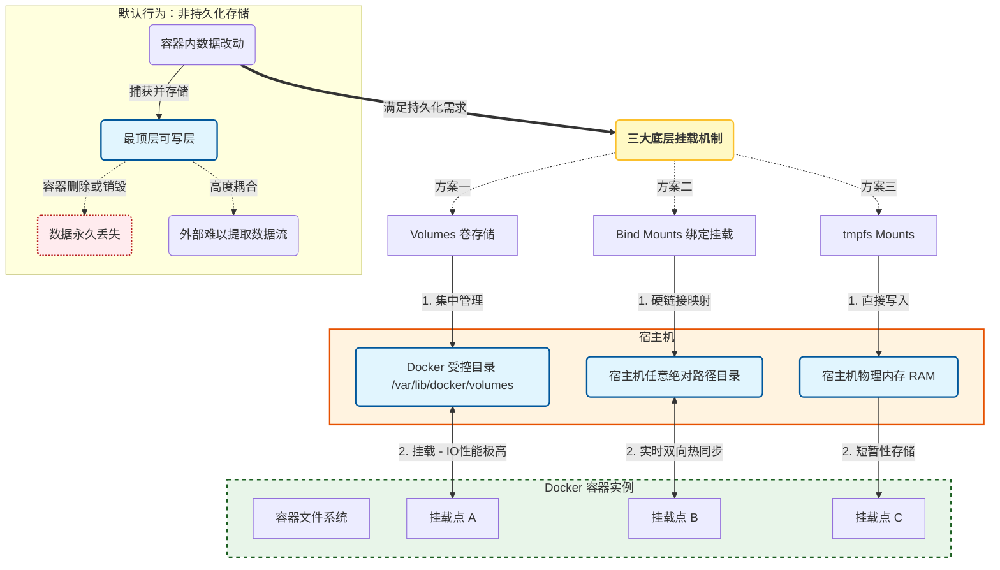
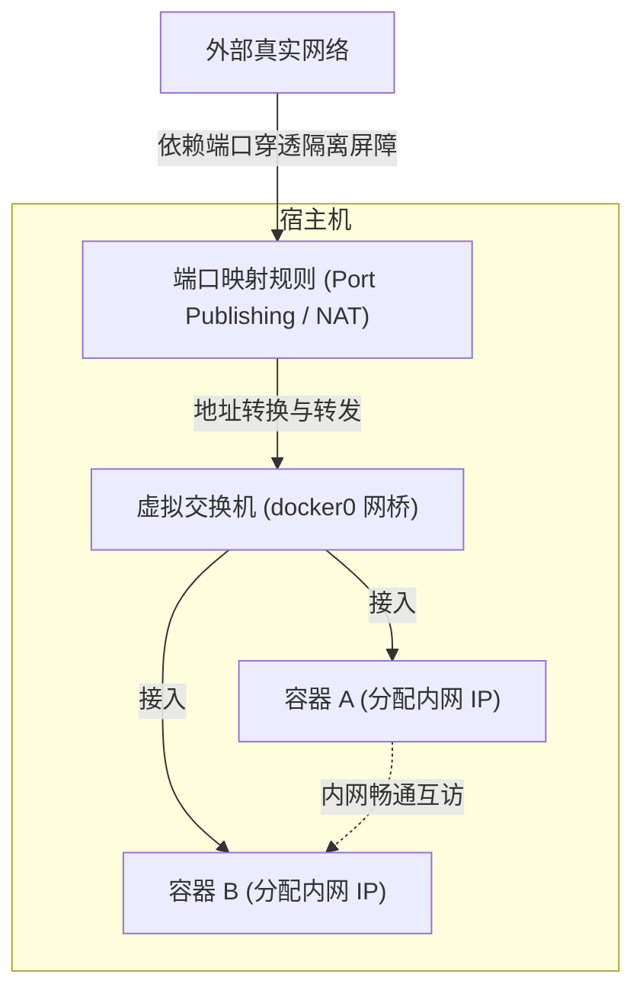
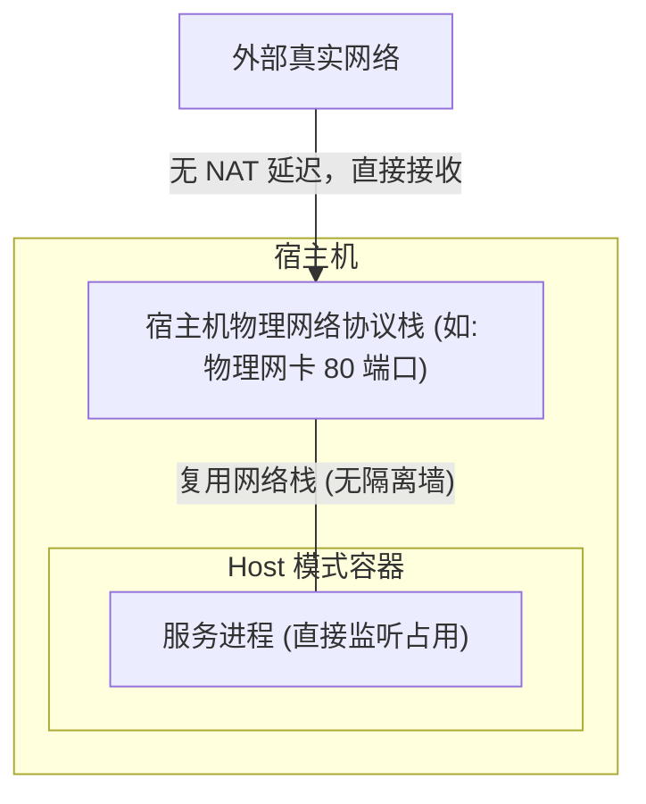
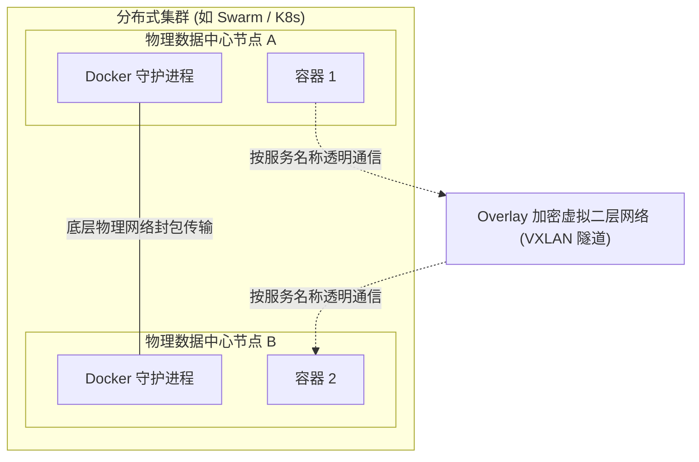
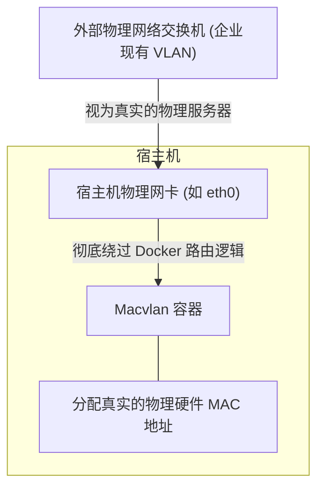
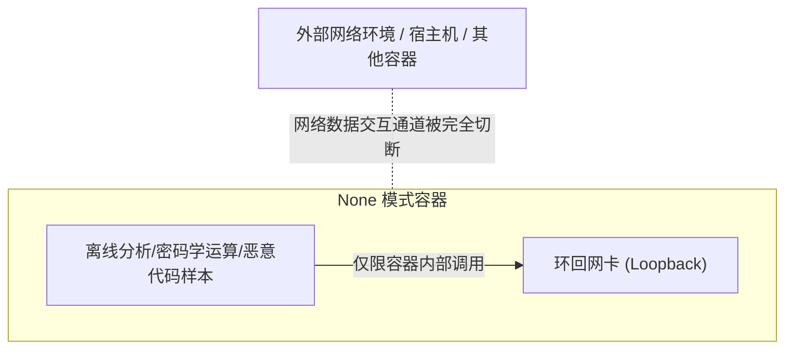
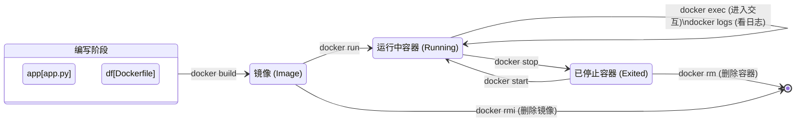

# 容器技术

- 容器并非“轻量级虚拟机”，其本质上是宿主机操作系统之上的一组具有高级隔离特性和严苛资源限制的常规Linux进程。
- 容器本身不负责硬件指令级别的虚拟化翻译，而是作为一层高级的管控平面，通过调用并配置Linux内核的三大核心机制——Namespaces（命名空间）、cGroups（控制组）以及UnionFS（联合文件系统），为目标进程创造出独占系统的幻觉。

## 三大核心机制

### Namespace（命名空间）

Namespaces机制在不阻断系统整体运行的前提下，为容器进程提供了一个虚拟化的、完全隔离的资源视图。不同的Namespace子系统负责隔离不同维度的系统资源。具体而言：

- **PID Namespace** 隔离了进程ID空间，使得每个容器内部的初始进程始终认为自己是系统的主进程（拥有独立的PID 1），从而无法感知宿主机层面或其他容器中的并发进程。
- **NET Namespace** 为容器分配了独立的网络协议栈，包括独立的网卡接口、IP地址、路由表以及防火墙规则，确保了网络流量的严格隔离与独立配置。
- **MNT Namespace** 则使得容器拥有独立的文件系统挂载点视图，配合底层的根文件系统（RootFS）切换机制，进程只能看到挂载到其所在Namespace下的特定目录树结构。
- **UTS Namespace** 专门用于隔离主机名与域名
- **IPC Namespace** 负责处理进程间通信（如共享内存机制和信号量）的隔离以防数据污染
- **USER Namespace** 则通过映射容器内部用户与宿主机全局用户组的ID，允许容器内部的进程以root权限运行，而在宿主机系统层面仅表现为一个无特权的普通用户，极大提升了多租户环境下的系统安全性。

### cGroups（Control Groups，控制组）

cGroups机制赋予了Docker为各个容器分配、核算和强制管理硬件资源的能力。通过深度配置cGroups接口，系统管理员可以实施极为严格的资源限制策略：

- 设置 **CPU Quotas（绝对配额）** 与 **CPU Shares（相对时间片权重）** 来限制计算资源的过度侵占

- 设置 **物理内存（RAM）** 以及 **交换空间（Swap）** 的硬性上限，以防止单个容器因内存泄漏而触发宿主机级别的OOM（Out of Memory）杀手程序

- 通过 **I/O节流（Throttling）** 机制控制磁盘读写频率与网络接口的传输速率

- 限制 **容器内部可分叉（fork）** 创建的最大进程数，从而在内核层面上有效抵御Fork炸弹等拒绝服务攻击。

在诸如Kubernetes等现代容器编排环境中，cGroups同样是实现资源请求配置、资源限制分配以及服务质量（QoS）动态分级的底层技术基石。

### UnionFS（联合文件系统）

UnionFS（联合文件系统，现代Docker常采用OverlayFS驱动）机制能够将多个位于不同物理位置的只读目录（即镜像层）透明地叠加合并在一起，对外呈现为一个统一的、平坦的文件系统视图，且在整个过程中无需修改底层的原始数据源。

- 在Docker的运行时架构中，镜像通常由多个只读的底层叠加而成；

- 当容器正式启动时，系统会在这组只读层之上临时叠加一个极薄的可写层（Writable Container Layer）。

这种独特的分层架构与写时复制（Copy-on-Write）的延迟加载设计，使得成千上万个基于同一基础镜像的容器能够极其高效地复用底层文件系统，不仅将存储空间的占用降低了几个数量级，更实现了毫秒级的容器启动速度，这在传统的厚重基础设施时代是不可想象的。

---

## 容器 vs 虚拟机

容器和虚拟机在系统架构与资源调度层面上采取了截然不同的实现路径，导致其在资源利用率、启动特性、可移植性以及隔离级别上存在显著的物理差异。

| 评估维度               | Docker 容器架构                                              | 传统虚拟VM构                                                 |
| ---------------------- | ------------------------------------------------------------ | ------------------------------------------------------------ |
| **底层系统架构**       | 依赖Docker Engine，所有容器直接复用宿主机操作系统的内核，通过Namespace进行逻辑隔离。 | 依赖Hypervisor（如VMware, Hyper-V），每个虚拟机均包含一套完整独立的Guest OS内核及依 |
| **资源请求与分配机制** | 采用按需使用的弹性动态资源共享模式，仅向宿主机内核请求必需的系统资源，无须预先进行硬性切 | 在启动前必须向Hypervisor请求并长期固定占用特定数量的硬件资源池，无论应用是否处于负载状态。 |
| **存储开销与系统体积** | 体积通常在MB级别，由于无须虚拟化完整的操作系统，磁盘占用极小，内存利用率极高。 | 体积庞大（通常为几十甚至上百GB级别），必须加载整个Guest OS文件系统，产生极大的空耗。 |
| **生命周期与启动时间** | 秒级甚至毫秒级启动，对于操作系统而言仅仅相当于唤醒一个常规的Linux用户态进程。 | 启动过程极为漫长（通常需要数分钟），必须完成操作系统的完整底层引导、内核加载与虚拟硬件初始化流程。 |
| **隔离性边界与安全性** | 进程级逻辑隔离，由于与宿主机及其他容器共享内核，若内核存在漏洞，则面临潜在的内核级逃逸风险。 | 系统级物理隔离，通过Hypervisor实现底层硬件指令级别的阻断，容器间干扰可能性极低，提供企业级最高安全性。 |
| **计算与I/O性能表现**  | 由于直接与物理硬件交互，没有操作系统层的指令集开销转换，其性能表现几乎完全等同于原生宿主机应用。 | Guest OS的额外指令转换、硬件模拟与系统调用拦截会引发不可避免的性能损耗，整体执行效率低于容器。 |

---

# Docker 技术

- **容器**是轻量级虚拟化技术标准
- **Docker**是开源的平台与工具集，是实现容器化技术的工具
## Docker 核心工作流程
- 编Dockerfile`
- 通过`docker build`命令打包为**镜像（Image）**
  - **镜像**：一个包含了指定应用程序、代码依赖、系统运行库甚至基础操作系统的只读文件包。
- 通过`docker run`命令生产实例，即容器（Container）
  - **容器**：基于镜像运行起来的实体。当“运行这个镜像”时，Docker 就会在内存中开辟一块独立隔离的空间，把镜像里的程序跑起来。这个跑起来的、活生生的环境，就叫容器。容器是可以被启动、停止、删除的，且里面可以产生新的数据。
- 可以根据同一个镜像，启动出无数个相互隔离的容器

---------

## Docker 持久化存储机制

在Docker的默认行为模型中，容器内部产生的所有数据改动均被捕获并存储在最顶层的 **可写层（Writable Layer）** 中。这种设计导致了 **一旦容器被删除或销毁 ，这些非持久化数据将永久丢失**；同时，这种高度耦合的存储模式也使得外部监控系统或宿主机进程难以直接提取或共享容器内的数据流。为了满足现代生产环境中复杂的状态化应用（如关系型数据库、分布式消息队列、集中式日志收集系统）的持久化需求，Docker引擎提供了三大类底层的挂载存储机制。
- **Volumes（卷存储）**： **Volumes（卷存储）** 是性能最稳健的数据持久化方案。Volumes完全由Docker守护进程在宿主机的一个受控受保护的目录下集中创建与管理。它们具备独立于任何单个容器生命周期的特性，即使挂载该Volume的所有容器均被彻底移除，Volume中的数据依然完好无损地保留在系统中，等待下一次被重新挂载使用。由于数据驻留在宿主机文件系统的高速缓存体系中，Volumes能够提供与直接物理读写几乎无异的极高I/O性能，是部署高性能数据库或关键数据处理引擎的理想选择。

- **Bind Mounts（绑定挂载）**：与Volumes不同， **Bind Mounts（绑定挂载）** 允许开发者将宿主机操作系统上的任意绝对路径目录直接硬链接映射到容器内部的特定挂载点。这种机制赋予了系统极高的灵活性，能够实现宿主机代码库与容器内运行环境的实时双向热同步。因此，在本地开发测试阶段（例如修改了前端代码后希望立即在容器化的Nginx服务器中看到热更新效果），Bind Mounts是不可或缺的工具。然而，Bind Mounts打破了容器严格的隔离性边界，使得主机上的非Docker特权进程或恶意脚本能够轻易篡改容器内的文件，反之亦然，这在生产环境中构成了极其严重的安全隐患。

- **tmpfs Mounts**：对于处理极其敏感的内存数据、密码学凭据（Credentials）或者需要极高读取速度但无需永久保留的中间态缓存数据，系统推荐使用**tmpfs Mounts**。该存储模式通过将数据结构直接写入宿主机的系统物理内存（RAM）中，从根本上杜绝了数据落盘（写入物理磁盘）的可能性。因此，这是一种纯粹的短暂性（Ephemeral）存储方案，一旦容器停止、重启或宿主机遭遇断电，内存中的所有敏感痕迹将瞬间消失，极大地降低了数据在物理介质上被窃取的风险，同时彻底消除了磁盘I/O带来的性能损耗。



---

## Docker 网络驱动

在网络拓扑与通信架构设计方面，Docker通过灵活的插件化网络驱动程序（Network Drivers），满足了从简单的单机调试到复杂的跨数据中心编排的各类连通性需求。

- **Bridge（网桥架构）**：这是所有在单机上新建容器的默认骨干网络。Docker引擎会在宿主机上虚拟出一个网桥（通常名为docker0），所有加入该网络的容器均会被分配一个内网IP并接入此虚拟交换机。虽然容器之间可以通过该内网畅通无阻地互相访问，但对于宿主机外部的真实网络而言，这些容器是隐身的。外部请求必须依赖于宿主机上设置的端口映射规则（Port Publishing），通过NAT（网络地址转换）技术才能精准穿透隔离屏障，抵达目标容器内部的服务进程。



- **Host（主机网络）**：该驱动机制会直接移除容器与宿主机之间的网络隔离墙。容器将直接复用并接管宿主机的物理网络协议栈。举例而言，如果一个容器在Host模式下监听了80端口，那么它将直接占用宿主机物理网卡的80端口，任何针对该物理机80端口的请求都将直接被容器接收。这种模式虽然牺牲了网络隔离性，但彻底免除了NAT转发带来的计算开销与延迟，在对网络吞吐量和延迟要求极高的分布式高频交易系统或高性能网络嗅探器中广泛应用。



- **Overlay（覆盖网络）**：针对跨多台物理主机的分布式集群（如Docker Swarm或Kubernetes集群），Overlay网络驱动发挥了中流砥柱的作用。它利用VXLAN等底层隧道封包技术，在分散于不同物理数据中心的Docker守护进程之间建立起一层加密的虚拟二层网络，使得调度在不同节点上的容器能够像处于同一个局域网内一样，利用服务名称进行透明的直接通信。



- **Macvlan（物理MAC虚拟化）**：对于许多陈旧的企业应用而言，它们往往在底层代码中硬编码了对物理网络环境的期望。Macvlan驱动通过向容器分配一个真实的物理硬件MAC地址，使得容器在外部物理网络交换机的路由表中表现为一台真实的物理服务器设备。这允许容器直接接入现有的企业内部VLAN网络，彻底绕过了Docker主机的路由转发逻辑。



- **None（完全隔离）**：在某些执行高度敏感的离线数据分析、密码学运算或者被用作沙盒执行恶意代码样本分析的场景下，可以为容器分配None网络驱动。此时，容器内部将仅保留环回网卡（Loopback），被完全切断与外界（包括宿主机和其他容器）的任何网络数据交互通道，实现极致的封闭隔离。



---

# Dockerfile

## 运行机制

- **从上到下逐行执行：** Docker 会从文件的第一行开始，逐条读取并执行指令。
- **每一条指令都是一层（Layer）：** 每一次 `COPY`、每一次 `RUN` 都会在原有的镜像上“套”上一层新的只读层。**层数越多，镜像体积越大，构建越慢。**

---

## 指令字典

### 环境配置

| 指令      | 作用                                                         | 示例                                             |
| --------- | ------------------------------------------------------------ | ------------------------------------------------ |
| `FROM`    | 指定镜像基于哪个基础镜像构建。                               | `FROM ubuntu:22.04` 或 `FROM python:3.10-alpine` |
| `WORKDIR` | 设置容器内的工作目录。如果目录不存在会自动创建。后续的 `RUN`, `CMD`, `COPY` 等指令都会在这个目录下执行。 | `WORKDIR /app`                                   |
| `ENV`     | 设置环境变量。这些变量在构建时和运行中的容器内都有效。       | `ENV PORT=8080` (后续可以用 `$PORT` 引用它)。    |

### 文件配置

| 指令           | 作用                                                         | 示例                                                         |
| -------------- | ------------------------------------------------------------ | ------------------------------------------------------------ |
| `COPY`（推荐） | 纯粹地把宿主机的文件或目录复制到镜像中。                     | `COPY requirements.txt .` (把当前目录的 `requirements.txt` 复制到 `WORKDIR` 中)。 |
| `ADD`          | `COPY` 的增强版。除了复制，如果源文件是一个 `.tar.gz` 压缩包，它会自动解压到目标路径；如果源路径是一个 URL，它会自动下载。 | 同上                                                         |

### 环境构建

- `RUN`

  - **作用**：在构建镜像的过程中执行linux命令（如安装软件、创建目录等）

  - **示例**：`RUN apt-get update && apt-get install -y vim`

  - **注意**：避免“多行`RUN`”。

    - 错误（根据构建机制，三个`RUN`会产生三个冗余镜像层）：

      ```dockerfile
      RUN apt-get update
      RUN apt-get install -y python3
      RUN apt-get clean
      ```

    - 正确：

      ```dockerfile
      RUN apt-get update \
          && apt-get install -y python3 \
          && apt-get clean \
          && rm -rf /var/lib/apt/lists/*
      ```

### 启动程序

| 指令                  | 作用                               | 特点                                                         | 示例                                                         |
| --------------------- | ---------------------------------- | ------------------------------------------------------------ | ------------------------------------------------------------ |
| `cmd`（默认启动命令） | 指定容器**启动时**默认执行的命令。 | 可以被覆盖。如果在 `docker run` 后面加了命令，`CMD` 就会被完全无视。 | `CMD ["python", "app.py"]`。如果用户执行 `docker run myapp bash`，那么容器启动的将是 `bash` 而不是 Python 程序。 |
| `ENTRYPOINT`          | 也是容器启动时执行的命令           | 不可被常规覆盖。如果在 `docker run` 后面加了参数，这些参数会被当做**参数**传给 `ENTRYPOINT`，而不是覆盖它。 | `ENTRYPOINT ["ping"]`。此时执行 `docker run myping 8.8.8.8`，实际容器内执行的命令是 `ping 8.8.8.8`。让一个容器用起来就像一个常规的可执行命令行工具。 |

### 声明补充

| 指令     | 作用                                                         |
| -------- | ------------------------------------------------------------ |
| `EXPOSE` | 声明容器打算使用什么端口。**这只是一个文档说明**，写了 `EXPOSE 80` 并不会让它自动绑定到宿主机的 80 端口，仍然需要在 run 时通过 `-p` 映射。 |
| `VOLUME` | 声明匿名数据卷。提醒使用者该目录里的数据需要持久化。         |

---

## dockerignore

`docker build -t myapp .` 最后的 `.` 代表当前目录。 Docker 在构建前，**会把这个目录下的所有文件打包发送给 Docker Daemon (守护进程)**。如果目录下有 `venv/` 虚拟环境、`.git/` 隐藏文件夹、几 GB 的测试数据、或是 `__pycache__/`，它们全都会被发送，导致构建过程十分缓慢，甚至将敏感配置打包进镜像。

**解决方案：** 在 Dockerfile 同级目录下创建一个 `.dockerignore` 文件（语法和 `.gitignore` 完全一样）。示例：

```
.git
.gitignore
__pycache__/
*.pyc
*.pyo
venv/
env/
.env
Dockerfile
.dockerignore
```

---

## 一个示例

```dockerfile
# 1. 选择精简版的基础镜像 (Slim 或 Alpine 均可)
FROM python:3.10-slim

# 2. 设置不生成 .pyc 文件，并强制不缓冲标准输出 (Python 容器常见优化)
ENV PYTHONDONTWRITEBYTECODE=1
ENV PYTHONUNBUFFERED=1

# 3. 设置工作目录
WORKDIR /app

# 4. 依赖缓存优化 (极度重要⭐⭐⭐)
# 我们先单独 COPY requirements.txt，再执行 RUN 安装依赖。
# 为什么要分开？因为 Docker 有层缓存机制。只要 requirements.txt 内容没变，Docker 就会直接使用上一次安装好依赖的缓存层，极大地加快后续代码修改时的构建速度。
COPY requirements.txt .
RUN pip install --no-cache-dir -r requirements.txt

# 5. 复制项目实际代码
COPY . .

# 6. 声明端口
EXPOSE 8000

# 7. 指定启动命令
CMD ["python", "app.py"]
```

---

# Docker 命令清单

## 全局参数

通常直接跟在 `docker` 关键字后面，用于控制 Docker 客户端与服务端（Daemon）的连接和行为级别：`docker [OPTIONS] COMMAND`。

| **参数**      | **简写** | **作用说明**                                   | **常见场景**                                              |
| ------------- | -------- | ---------------------------------------------- | --------------------------------------------------------- |
| `--config`    | 无       | 指定客户端配置文件的存放路径                   | 默认在 `~/.docker`，当你想隔离不同的认证凭据时使用。      |
| `--context`   | `-c`     | 指定连接 Daemon 的上下文名称                   | 在本地管理多个远程 Docker 主机时切换环境。                |
| `--debug`     | `-D`     | 开启调试模式                                   | 遇到部分报错，需要看底层 API 调用过程时使用。             |
| `--host`      | `-H`     | 指定连接的 Docker Daemon 的 Socket 或 IP       | 例如连接远程机器：`docker -H tcp://192.168.1.100:2375 ps` |
| `--log-level` | `-l`     | 设置日志级别 (debug, info, warn, error, fatal) | 默认是 info，排障时可调高。                               |
| `--tls*`      | 无       | 一系列 TLS 相关的证书配置参数                  | 结合 `-H` 使用，确保远程连接 Docker 服务的安全性。        |

## 容器管理

| **命令**      | **核心作用**                   | **常用进阶参数与示例**                                       |
| ------------- | ------------------------------ | ------------------------------------------------------------ |
| **`run`**     | **创建并启动**一个新容器       | `docker run -itd --name myweb -p 8080:80 nginx` （`-i` 交互, `-t` 终端, `-d` 后台运行, `-p` 端口映射, `-v` 挂载目录） |
| **`create`**  | 仅创建容器，但不启动           | `docker create --name test ubuntu` (准备好资源，等待 start)  |
| **`start`**   | 启动一个已被停止的容器         | `docker start <容器名或ID>`                                  |
| **`stop`**    | 停止运行中的容器               | `docker stop <容器名或ID>` (发送 SIGTERM 信号)               |
| **`restart`** | 重启容器                       | `docker restart <容器名或ID>`                                |
| **`kill`**    | 强制终止容器                   | `docker kill <容器名或ID>` (发送 SIGKILL 信号，适用于卡死的容器) |
| **`rm`**      | 删除已停止的容器               | `docker rm <容器名或ID>` 加 `-f` 可以强制删除正在运行的容器。 |
| **`pause`**   | 暂停容器内的所有进程           | `docker pause <容器名>` (冻结状态，CPU 占用降为 0)           |
| **`unpause`** | 恢复被暂停的容器进程           | `docker unpause <容器名>`                                    |
| **`wait`**    | 阻塞直到容器停止，并打印退出码 | 用于自动化脚本同步执行状态。                                 |

## 容器交互

| **命令**      | **核心作用**                           | **常用进阶参数与示例**                                       |
| ------------- | -------------------------------------- | ------------------------------------------------------------ |
| **`exec`**    | 在**运行中**的容器内执行新命令         | `docker exec -it <容器名> /bin/bash` (最常用的“进入容器”的方法) |
| **`ps`**      | 列出容器列表                           | `docker ps` (仅列出运行中) `docker ps -a` (列出所有，包括已停止的) `docker ps -q` (仅列出容器 ID) |
| **`logs`**    | 查看容器的输出日志                     | `docker logs -f --tail 100 <容器名>` (`-f` 持续跟踪，`--tail` 仅看最后 100 行) |
| **`cp`**      | 宿主机与容器之间拷贝文件               | `docker cp ./local.txt <容器名>:/app/` (拷入) `docker cp <容器名>:/app/log.txt ./` (拷出) |
| **`inspect`** | 返回容器/镜像的底层详细 JSON 数据      | `docker inspect <容器名>` (常用于查找容器 IP、挂载点等详细信息) |
| **`stats`**   | 实时显示容器的资源利用率 (类似 `top`)  | `docker stats` (查看所有容器的 CPU、内存、网络 I/O 实时消耗) |
| **`top`**     | 查看容器内部运行的系统进程             | `docker top <容器名>`                                        |
| **`port`**    | 查看容器的端口映射情况                 | `docker port <容器名>`                                       |
| **`diff`**    | 查看容器文件系统相较于镜像的变化       | `docker diff <容器名>` (A: 增加, D: 删除, C: 修改)           |
| **`attach`**  | 将终端的标准输入输出附加到容器的主进程 | 不常用。注意：退出时如果按 `Ctrl+C` 会导致容器直接停止运行。 |

## 镜像管理

| **命令**      | **核心作用**                              | **常用进阶参数与示例**                                       |
| ------------- | ----------------------------------------- | ------------------------------------------------------------ |
| **`build`**   | 根据 Dockerfile 构建镜像                  | `docker build -t myapp:1.0 .` (`-t` 指定名称和标签，`.` 代表当前上下文目录) |
| **`pull`**    | 从镜像仓库下载镜像                        | `docker pull ubuntu:22.04`                                   |
| **`push`**    | 将本地镜像上传到镜像仓库                  | `docker push myregistry/myapp:1.0` (通常需要先 login)        |
| **`images`**  | 列出本地存在的镜像                        | `docker images` 或 `docker image ls`                         |
| **`rmi`**     | 删除本地镜像                              | `docker rmi <镜像ID>` (如果有基于该镜像的容器存在，需先删除容器或加 `-f` 强制删除) |
| **`tag`**     | 给镜像打标签（改名/版本管理）             | `docker tag source_image:latest my_image:v1`                 |
| **`commit`**  | 将容器的当前状态保存为新镜像              | `docker commit <容器名> new_image_name` (不推荐作为常规构建方式，更推荐 Dockerfile) |
| **`history`** | 查看镜像的构建历史分层                    | `docker history <镜像名>`                                    |
| **`save`**    | 将镜像打包成 tar 归档文件（用于离线传输） | `docker save -o ubuntu.tar ubuntu:latest`                    |
| **`load`**    | 从 tar 归档文件中恢复镜像                 | `docker load -i ubuntu.tar`                                  |
| **`export`**  | 导出**容器**的文件系统为 tar 归档         | `docker export <容器名> > container.tar` (丢失历史层信息，变得非常扁平) |
| **`import`**  | 从 tar 归档中导入内容为**镜像**           | `docker import container.tar new_image:v1`                   |

---

# 全流程示例



## Step1 初始配置

每个 Dockerfile 都应该有一个独立的文件夹，因为 Docker 在构建时会将整个文件夹的内容作为“上下文”发送给 Docker 引擎。

```bash
mkdir docker-demo
cd docker-demo
```

在 `docker-demo` 下构建两个文件：

- `app.py`：一个简单的HTTP服务，返回一段信息

  ```py
  from http.server import BaseHTTPRequestHandler, HTTPServer
  import socket
  
  class SimpleHandler(BaseHTTPRequestHandler):
      def do_GET(self):
          self.send_response(200)
          self.send_header('Content-type', 'text/plain; charset=utf-8')
          self.end_headers()
          hostname = socket.gethostname()
          message = f"Hello from Docker! 容器的主机名是: {hostname}\n"
          self.wfile.write(message.encode())
  
  if __name__ == '__main__':
      print("服务已启动，监听端口 8000...")
      server = HTTPServer(('0.0.0.0', 8888), SimpleHandler)
      server.serve_forever()
  ```

- `Dockerfile`

  ```dockerfile
  FROM python:3.10-slim
  
  WORKDIR /usr/src/app
  
  # 第一个（.）代表宿主机当前目录下的所有文件，第二个（.）代表容器工作目录
  copy . .
  
  EXPOSE 8888
  
  # 默认执行
  CMD ["python","app.py"]
  ```

## Step2 构建镜像

在 `docker-demo` 下执行

```bash
docker build -t my-python-service:v1 .
```

- `build`: 告诉 Docker 开始构建。

- `-t my-python-service:v1`: 给这个镜像打个标签（Tag）。名字叫 `my-python-service`，版本号是 `v1`。

- `.` : 指示 Docker 构建上下文在**当前目录**。Docker 会在当前目录寻找 `Dockerfile`。

 Docker 会下载 `python:3.10-slim` 基础层，然后创建工作目录层，复制文件层，最后生成最终镜像。可以用 `docker images` 查看刚刚生成的镜像。

## Step3 实例化与运行

在任意终端执行：

```bash
docker run -d --name my-running-app -p 8080:8000 my-python-service:v1
```

- `run`: 创建并启动容器。

- `-d`: Detach 模式，让容器在**后台**运行，不阻塞你的终端。

- `--name my-running-app`: 给这个容器起名字，如果不写，Docker 会随机分配一个搞笑的名字（比如 `crazy_einstein`）。

- `-p 8888:8888`: **端口映射**。将宿主机（你的电脑）的 `8888` 端口映射到容器内部的 `8888` 端口。

- `my-python-service:v1`: 指定要运行的镜像名称和版本。

运行后，可以用宿主机浏览器访问 `http://localhost:8888`，或者用 `curl http://localhost:8888` 测试，会看到容器内部返回的响应。

## Step4 容器交互

- **查看运行状态**

  ```bash
  docker ps
  ```
  
  会看到 `my-running-app` 正在运行，并且显示了端口映射关系。
- **查看容器日志**
  
  ```bash
  docker logs my-running-app
  ```
  
- **进入容器内部执行命令**
  
  ```bash
  docker exec -it my-running-app /bin/bash
  ```
  
  此时终端前缀会改变，说明已经在容器内部了！可以输入 `ls` 看看 `/usr/src/app` 目录下的文件。输入 `exit` 即可退出容器，但这不会停止容器运行。

## Step5 停止与清理

- **停止运行中的容器**

  ```bash
  docker stop my-running-app
  ```

  此时再执行 `docker ps` 就看不到它了。但如果执行 `docker ps -a`（显示所有容器），会发现它变成了 `Exited` 状态。**停止并不等于删除**，它的读写层（UpperDir）数据还在。

- **删除容器**

  ```bash
  docker rm my-running-app
  ```

  如果容器还在运行中，可以加 `-f` 强制删除：`docker rm -f my-running-app`

- **删除镜像**

  ```bash
  docker rmi my-python-service:v1
  ```

---

# 开发环境 Docker 化

将开发环境彻底 Docker 化，是现代软件工程中十分常见的一种做法。它能完美解决程序跨设备兼容性问题，同时让宿主机保持绝对的纯净——不需要装杂乱的 Python 库、不同版本的 JDK，或者各种 C++ 依赖库（比如 Boost）。

## 纯命令行下的挂载编译

通过将编写好的python程序、jar包等等，Copy 到容器环境中执行，从而达到 Docker 化执行效果。以下是几个比较直观的例子：

- 运行python脚本

  不需要在宿主机上安装python环境，直接使用一行命令：

  ```bash
  docker run --rm -v $(pwd):/app -w /app python:3.10-slim python main.py
  ```

  - `--rm`：运行完毕后立刻销毁容器
  - `-v $(pwd):/app `：把当前目录挂载到容器内的`/app`目录
  - `-w /app`：设置工作目录

- 编译和运行C++程序

  C++程序需要编译+运行两步
  
  ```bash
  docker run --rm -v $(pwd):/src -w /src gcc:latest bash -c "g++ main.cpp -o main_app && ./main_app"
  ```
  
  执行完毕后，宿主机的目录下多了一个编译好的 `main_app` 可执行文件。这是通过 `-v` 挂载的优点：容器内生成的文件会直接保留在宿主机上。
  
- 编译并运行Java
  
  ```bash
  docker run --rm -v $(pwd):/src -w /src openjdk:17-jdk bash -c "javac Main.java && java Main"
  ```
  
  ---

## VS Code 现代工程选择：Dev Containers 插件

VS Code 的 **Dev Containers** 插件的核心在于：把 VS Code “一分为二”。

- **前端 UI**（代码高亮、主题）留在你的宿主机上；
- **后端服务**（语言解析、终端、调试器）直接安装并运行在 Docker 容器内部。

准备工作：在 VS Code 扩展商店安装 `Dev Containers` 插件（搜索 `@id:ms-vscode-remote.remote-containers`）。

### 附加到已存在的容器（Attach to Running Container）

- **在终端已经启动一个长期运行的容器：** 为了开发，通常启动一个带交互终端并在后台运行的系统镜像：

  ```bash
  docker run -itd --name my-cpp-dev gcc:latest /bin/bash
  ```

- **在 VS Code 中连接：**

  - 按下 `Ctrl+Shift+P` (或 `F1`) 打开命令面板。
  - 输入并选择：`Dev Containers: Attach to Running Container...`
  - 在弹出的列表中，选择刚才运行的 `my-cpp-dev`。

- VS Code 会打开一个新的窗口，把一段名为 `vscode-server` 的程序注入到容器里并运行。

- **开发**：

  - 左侧资源管理器的 `打开文件夹`，路径是**容器内部的文件系统**（比如 `/` 根目录）。
  - 在 VS Code 里打开终端（Ctrl+`），实际上是在敲容器内部的 bash。
  - 在 VS Code 里安装的 C++ 扩展会被安装在**容器**里。

---

### 通过工程化配置构建开发环境（.devcontainer）

现代化开发选择将**开发环境本身作为代码（Infrastructure as Code）**。假设要开发一个需要 `boost` 和 `cmake` 的 C++ 网络编程项目：

#### **创建项目结构**

在空项目文件夹下，创建一个特殊的文件夹 `.devcontainer`，并在里面放两个文件：

```bash
my-project/
├── .devcontainer/
│   ├── devcontainer.json  # 定义 VS Code 行为
│   └── Dockerfile         # 与之前的 Dockerfile 一致
├── main.cpp
```

#### 编写 Dockerfile

```dockerfile
# 微软提供了很多官方的 devcontainer 基础镜像，自带普通非 root 用户等安全配置
FROM mcr.microsoft.com/devcontainers/cpp:ubuntu-22.04

RUN apt-get update && export DEBIAN_FRONTEND=noninteractive \
    && apt-get -y install --no-install-recommends \
    cmake \
    gdb \
    libboost-all-dev \
    && apt-get clean && rm -rf /var/lib/apt/lists/*
```

####  devcontainer.json 与参数介绍

```json
{
    "name": "My C++ Boost Env",
    "build": {
        "dockerfile": "Dockerfile"
    },
    "customizations": {
        "vscode": {
            // 当容器启动后，自动为这个环境安装以下 VS Code 插件
            "extensions": [
                "ms-vscode.cpptools",
                "ms-vscode.cmake-tools"
            ]
        }
    },
    // 将容器内的用户设置为 vscode (基础镜像自带的普通用户，避免用 root 引起权限混乱)
    "remoteUser": "vscode"
}
```

- 核心构建参数 (Build & Image)

  这部分决定了容器基于什么“底座”运行。

  | **参数名称**            | **类型**     | **详解与示例**                                               |
  | ----------------------- | ------------ | ------------------------------------------------------------ |
  | **`image`**             | String       | **最简单的方式**，直接使用现成的 Docker 镜像。不支持复杂的自定义。 `"image": "[mcr.microsoft.com/devcontainers/python:3.10](https://mcr.microsoft.com/devcontainers/python:3.10)"` |
  | **`build`**             | Object       | **最常用的方式**，通过指定 Dockerfile 来动态构建环境。 - `dockerfile`: 指定 Dockerfile 相对路径。 - `context`: 构建上下文路径（通常是 `.`）。 - `args`: 传递给 Dockerfile 的构建参数 (ARG)。 |
  | **`dockerComposeFile`** | String/Array | **针对复杂微服务**。如果你的开发环境不仅需要 Python，还需要 Redis 和 MySQL，可以通过指定的 docker-compose.yml 来启动整个集群。 |
  | **`service`**           | String       | 配合 `dockerComposeFile` 使用，告诉 VS Code 应该“钻”进哪一个容器里去开发。 |

- 容器运行时配置 (Container Runtime)

  这部分决定了容器跑起来之后，底层的系统属性和权限。

  | **参数名称**          | **类型** | **详解与示例**                                               |
  | --------------------- | -------- | ------------------------------------------------------------ |
  | **`name`**            | String   | 给你这个开发环境起个好听的名字，会显示在 VS Code 左下角。 `"name": "My Awesome Python Env"` |
  | **`remoteUser`**      | String   | **⭐⭐⭐极其重要**。默认容器里是 root 用户，如果用 root 写代码，生成的文件在宿主机上会变成 root 权限，导致各种麻烦。建议填入基础镜像自带的普通用户（比如 `"vscode"`, `"node"`, `"ubuntu"`）。 |
  | **`containerEnv`**    | Object   | 注入到容器内部的系统环境变量。 `"containerEnv": {"MY_API_KEY": "12345"}` |
  | **`runArgs`**         | Array    | 透传给底层的 `docker run` 命令。如果你需要特权模式或特定的网络设置，在这里加。 `"runArgs": ["--cap-add=SYS_PTRACE", "--network=host"]` |
  | **`workspaceMount`**  | String   | 覆盖默认的代码挂载行为。通常不需要改，除非你想把代码挂载到容器里的特定位置。 |
  | **`workspaceFolder`** | String   | 容器启动后，VS Code 默认打开的目录。配合 `workspaceMount` 使用。 |

- 编辑器与插件定制（Editor Customization）

  这部分是决定了的 VS Code 长有什么功能。

  ```json
  "customizations": {
      "vscode": {
          // 1. 设置项 (Settings)
          "settings": {
              "editor.formatOnSave": true,
              "python.formatting.provider": "black",
              "terminal.integrated.defaultProfile.linux": "bash"
          },
          // 2. 插件列表 (Extensions)
          "extensions": [
              "ms-python.python",       // Python 核心支持
              "ms-azuretools.vscode-docker", // Docker 插件
              "github.copilot"          // AI 辅助
          ]
      }
  }
  ```

- 生命周期钩子脚本 (Lifecycle Hooks)

  | **生命周期阶段**      | **参数名称**           | **执行时机与用途**                                           |
  | --------------------- | ---------------------- | ------------------------------------------------------------ |
  | **阶段 1 (宿主机)**   | `initializeCommand`    | 在 **宿主机（你的 Kali）** 上，容器创建之前运行。常用于生成临时文件或检查宿主机环境。 |
  | **阶段 2 (后台建)**   | `onCreateCommand`      | 容器刚创建，在后台默默执行。                                 |
  | **阶段 3 (装依赖)**   | `updateContentCommand` | 容器已创建，源代码也挂载进去了。**极其适合用来装依赖！** 例如：`"pip install -r requirements.txt"` |
  | **阶段 4 (刚连上)**   | `postCreateCommand`    | 容器创建完毕，UI 准备连接时。常用来打印欢迎信息，或进行最后的配置。 |
  | **阶段 5 (每次启动)** | `postStartCommand`     | **每次**重启并连接容器时执行。比如启动一个后台监控脚本或后台数据库服务。 |

- 特性模块 (Features)

  这是微软后来推出的“积木式”环境搭建方案。以前你想在环境里加个 Go、加个 Rust、加个 Docker-in-Docker，你需要自己写很长的 Dockerfile。现在只需要在 `devcontainer.json` 里加几行配置，它会自动帮你装好。

  ```json
  "features": {
      // 一键安装特定版本的 Go
      "ghcr.io/devcontainers/features/go:1": {
          "version": "1.20"
      },
      // 一键让容器内可以运行 docker 命令 (Docker-in-Docker)
      "ghcr.io/devcontainers/features/docker-in-docker:2": {
          "version": "latest",
          "moby": true
      }
  }
  ```

- 端口转发 (Port Forwarding)

  当容器里跑了一个 Web 服务（比如监听了 8000 端口），通过以下配置可以在宿主机的浏览器里访问：

  - **`forwardPorts`**: `[8000, 3306]` (自动将容器的 8000 和 3306 转发到宿主机)。
  - **`portsAttributes`**: 可以进一步定义端口的行为。

  ```json
  "portsAttributes": {
      "8000": {
          "label": "My Web App", // 给端口起个别名
          "onAutoForward": "openBrowser" // 容器启动时自动在宿主机打开浏览器
      }
  }
  ```

- 一个示例

  ```json
  {
      "name": "Python Data Science Env",
      "build": {
          "dockerfile": "Dockerfile",
          "context": "."
      },
      "features": {
          "ghcr.io/devcontainers/features/git:1": {} // 确保容器内有最新版 git
      },
      "forwardPorts": [8000], // 自动映射 8000 端口
      "portsAttributes": {
          "8000": {
              "label": "FastAPI Server",
              "onAutoForward": "ignore"
          }
      },
      "remoteUser": "vscode", // 使用非 root 用户
      "updateContentCommand": "pip install -r requirements.txt", // 自动装库
      "customizations": {
          "vscode": {
              "settings": {
                  "python.defaultInterpreterPath": "/usr/local/bin/python"
              },
              "extensions": [
                  "ms-python.python",
                  "ms-python.vscode-pylance"
              ]
          }
      }
  }
  ```

#### **自动化容器环境构建**

- 用普通的 VS Code 打开你的 `my-project` 文件夹。
- VS Code 会在右下角弹出一个提示：“检测到 Dev Container 配置文件，是否在容器中重新打开？” -> 点击 **Reopen in Container**（如果没有弹窗，按 `F1` 输入 `Dev Containers: Reopen in Container`）。

**自动化过程：**

- VS Code 读取 `.devcontainer.json`。
- 发现需要 Build，它就在后台执行 `docker build` 根据 `Dockerfile` 编译镜像。
- 镜像建好后，执行 `docker run` 启动容器，并自动将项目目录挂载到容器内的 `/workspaces/my-project`。
- 将 VS Code Server 注入容器。
- 自动在容器内部下载并安装指定的 `cpptools` 和 `cmake-tools` 插件。
- 连接完成。

此时，代码文件还在宿主机硬盘上，但 VS Code 的终端、编译器（g++）、调试器（gdb）、库文件（boost）、甚至代码自动补全系统，全部在 Docker 容器里运行。当把该项目推送到 GitHub 给其他用户时，他们只需要用 VS Code 打开并点击 `Reopen in Container`，几分钟后就能获得一个一模一样、装配好所有 C++ 工具链的开发环境。

---


  

  
