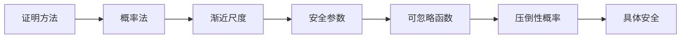

# 证明范式与渐近记号

本章讨论格基密码学中的证明。证明并不是为了形式化而形式化，而是为了明确哪些结论来自定义，哪些结论来自定理，哪些结论只是启发式估计。格基密码学横跨数学、算法与工程；如果没有严谨的证明范式，就很容易把“看起来正确”“实验上没有出错”“攻击者似乎很难”误认为真正的安全论证。

渐近记号与安全参数则构成现代密码学的尺度语言。它们帮助我们讨论随安全参数增长的算法效率、攻击优势、失败概率和统计误差。但渐近语言也容易被滥用：隐藏常数、忽略低阶项、把可忽略函数等同于某个固定小数，都会造成理论与工程之间的断裂。

## 基本证明方法

- **直接证明**是最基本的证明方式：从已知前提出发，通过定义、代数变形和已有定理推出结论。例如在解密正确性证明中，我们通常先写出解密前的中间量，再把密文表达式代入，最后得到“明文项加噪声项”的形式。若噪声项落在可舍入区域内，解密结果就等于原明文。直接证明的优点是结构清楚，适合讲解算法为什么工作。

- **逆否证明**用于证明 $P\Rightarrow Q$ 时，改为证明 $\neg Q\Rightarrow\neg P$。在格理论中，这种方法常用于唯一性或界限类命题。例如要证明“若两个格点距离都小于某半径，则它们必须相等”，可以反过来假设它们不相等，那么二者差就是非零格向量，其长度至少为最短向量长度，从而推出半径条件不可能同时满足。逆否证明尤其适合处理 BDD、唯一解码和最短向量间隔。

- **反证法**在安全归约中非常常见。典型形式是：假设存在一个攻击者 $\mathcal{A}$ 能以非可忽略优势破坏方案安全，则构造一个算法 $\mathcal{B}$，利用 $\mathcal{A}$ 去求解某个被假设困难的问题，例如 LWE 或 SIS。若 $\mathcal{B}$ 的成功概率也非可忽略，就与困难假设矛盾。因此，攻击者 $\mathcal{A}$ 不应存在。反证法的关键不是简单说“假设攻击者存在”，而是要精确说明 $\mathcal{B}$ 如何模拟环境、如何嵌入挑战、如何利用输出。

- **数学归纳法**适用于递归结构、迭代算法和分层构造。例如陷门委托、树形身份结构、协议轮次和循环不变量都可以用归纳法证明。归纳证明通常包含基例和归纳步：先证明初始对象满足性质，再证明若第 $i$ 步满足性质，则第 $i+1$ 步也满足性质。对初学者而言，归纳法的难点在于选择合适的不变量，而不是机械地写“假设成立”。

- **构造性证明**不仅证明对象存在，还给出构造方法。密码学尤其重视构造性，因为安全方案最终必须能运行。例如证明某个矩阵存在短陷门并不足够，若不能高效生成该矩阵与陷门，就无法作为算法使用。相反，概率法常能证明存在性但不提供高效构造。理解二者差别，有助于区分纯数学存在定理与可实现密码构造。

## 概率法

概率法是一种证明存在性的技术。其基本思想是：**从某个随机过程生成对象，证明生成对象满足目标性质的概率大于零，于是至少存在一个对象满足该性质。**这里的“随机”是证明工具，不一定意味着最终算法要随机运行。概率法在组合数学、图论、格理论和密码学中都非常常见。

在格基密码学中，随机矩阵 $\mathbf{A}\xleftarrow{\$}\mathbb{Z}_q^{m\times n}$ 是最常见的对象之一。许多结论会说：随机矩阵以高概率具有满秩、良好的散列性质或某种近均匀性。若某性质以概率 $1-\varepsilon$ 成立，其中 $\varepsilon<1$，那么至少存在一个矩阵满足该性质。这种论证为后续 Ajtai 哈希、SIS 平均情形困难性和陷门生成提供了直觉基础。

**期望论证**是概率法的重要形式。若一个非负随机变量 $X$ 的期望很小，则存在某个样本使 $X$ 不超过期望；若随机变量表示“坏事件数量”，则可用期望控制坏事件。更常见的是配合 **Markov 不等式**、**并集界**和**集中不等式**，证明随机对象不仅存在，而且高概率满足性质。虽然概率不等式会在下一部分系统讨论，本文需要先建立这种证明观念。

概率法与采样算法不同。证明随机对象以正概率满足性质，并不意味着我们已经有了高效检测或生成该对象的算法。例如某些短向量存在性定理保证格中存在短向量，但并不给出高效寻找方法。密码学困难性正建立在这种差异之上：对象可能确定存在，但计算上难以找到。若把存在性与可计算性混同，就会误解 SVP、CVP、SIS 等问题的困难性来源。

概率法还常用于证明**“随机选择的坏概率小”**。例如若某个解密失败事件 $E$ 满足 $\Pr[E]\leq 2^{-\lambda}$，则可以说随机生成的参数或随机采样的噪声导致失败的概率很小。但这里必须明确概率是对哪些随机性取的：密钥生成随机性、加密随机性、噪声采样随机性，还是攻击者随机性。不同随机源对应不同的安全或正确性含义。

## 渐近尺度

**渐近记号用于描述函数随输入规模增长时的数量级。**

- **渐近上界**：$$O(g(n)) = \{ f(n) \mid \exists C > 0, n_0 > 0, \text{ 使得 } \forall n \ge n_0, 0 \le f(n) \le Cg(n) \}$$；
  - **直观含义**：$f(n)$ 的增长速度**不超过** $g(n)$ 的常数倍。类比于实数比较中的 **$\le$**。
  - **学术通俗化**：只要能找到一个正的放大系数 $C$ 和一个临界点 $n_0$，在 $n_0$ 之后 $Cg(n)$ 就能永远压制住 $f(n)$。
  - **格密码示例**：$m = O(n \log q)$。意味着随着维数 $n$ 和模数 $q$ 增长，矩阵宽度 $m$ 最高只与 $n \log q$ 呈线性正比关系，不会出现 $n^2$ 或指数级增长。
- **渐近下界**：$$O(g(n)) = \{ f(n) \mid \exists C > 0, n_0 > 0, \text{ 使得 } \forall n \ge n_0, 0 \le f(n) \le Cg(n) \}$$
  - **直观含义**：$f(n)$ 的增长速度**不低于** $g(n)$ 的常数倍。类比于实数比较中的 **$\ge$**。
  - **学术通俗化**：存在一个缩小的系数 $C$，在足够远的地方（$n \ge n_0$），$Cg(n)$ 永远成为了 $f(n)$ 的地板，兜住了它的下限。
- **渐近确界**：$$\Theta(g(n)) = \{ f(n) \mid \exists C_1 > 0, C_2 > 0, n_0 > 0, \text{ 使得 } \forall n \ge n_0, 0 \le C_1 g(n) \le f(n) \le C_2 g(n) \}$$
  - **直观含义**：$f(n)$ 与 $g(n)$ 的增长速度**完全同阶**。类比于实数比较中的 **$=$**。
  - **学术通俗化**：$f(n)$ 被夹在了 $g(n)$ 的两个不同常数倍（上限 $C_2$ 和下限 $C_1$）之间。
  - **格密码示例**：攻击复杂度 $2^{\Theta(n)}$。这意味着该算法（如某些格基规约算法 BKZ/SVP 筛法）的开销是标准的指数级，其指数部分的增长率与 $n$ 精确同步，既不会像 $2^{n^2}$ 那样爆发，也不会降到 $2^{\sqrt{n}}$。
- **严格渐近上界**：$$o(g(n)) = \{ f(n) \mid \forall c > 0, \exists n_0 > 0, \text{ 使得 } \forall n \ge n_0, 0 \le f(n) < cg(n) \}$$
  - **直观含义**：$f(n)$ 的增长速度**严格慢于** $g(n)$。类比于实数比较中的 **$<$**。
  - **极限定义（更直观）**：$$\lim_{n \to \infty} \frac{f(n)}{g(n)} = 0$$
  - **学术通俗化**：大 $O$ 只需要存在*某一个* $C$ 能压制就行；而小 $o$ 要求**无论给出多么小的正数 $c$**（哪怕 $c = 10^{-10}$），只要 $n$ 足够大， $cg(n)$ 都能压制住 $f(n)$。说明 $g(n)$ 降维打击了 $f(n)$。
- **严格渐近下界**：$$\omega(g(n)) = \{ f(n) \mid \forall c > 0, \exists n_0 > 0, \text{ 使得 } \forall n \ge n_0, 0 \le cg(n) < f(n) \}$$
  - **直观含义**：$f(n)$ 的增长速度**严格快于** $g(n)$。类比于实数比较中的 **$>$**。
  - **极限定义（更直观）**：$$\lim_{n \to \infty} \frac{f(n)}{g(n)} = \infty$$
  - **学术通俗化**：无论你把 $g(n)$ 乘以多么大的常数 $c$，只要 $n$ 足够大，$f(n)$ 最终都会超越它。在格密码论文中，经常能看到如“安全性要求安全参数 $\lambda = \omega(\log n)$”，即 $\lambda$ 的增长速度必须严格快于对数阶，以对冲潜在的亚指数攻击。

**多项式、次指数和指数增长是密码学安全讨论的基本尺度**。若运行时间可由 $\operatorname{poly}(\lambda)$ 上界控制，则称算法是多项式时间算法。若攻击成本近似为 $2^{c\lambda}$，则属于指数级。格攻击常用维度 $n$ 表达复杂度，例如 BKZ 相关估计可能写成 $2^{\alpha n}$。这里的 $\alpha$ 不是抽象符号，而会直接影响参数选择。

**渐近记号的优点是抽象出主要增长趋势，缺点是隐藏常数和低阶项**。在理论证明中，$O(n\log q)$ 足以说明矩阵列数与维度和模数对数线性相关；但在工程实现中，常数因子会影响密钥大小和运行时间。格基密码的参数选择不能只看渐近式，还必须结合具体安全估计、实现成本和标准化要求。

**$\widetilde{O}(g(n))$ 通常表示隐藏多对数因子的上界**。例如 $\widetilde{O}(n)$ 可以表示 $O(n\log^c n)$。在格算法和快速多项式乘法中，这种写法很常见。但隐藏的对数因子在实际参数规模下并不总是可以忽略。尤其在实现层面，缓存、常数时间约束和内存访问模式可能比渐近乘法次数更重要。

渐近分析必须说明自变量。格基密码中可能同时存在安全参数 $\lambda$、LWE 维度 $n$、模数 $q$、样本数 $m$、模块秩 $k$ 和环次数 $n$。若写 $O(n)$，必须知道 $q$ 是否固定、$m$ 是否随 $n$ 增长、$k$ 是否为常数。模糊的自变量会使参数关系失去意义。

| **记号**                  | **含义**            | **对应极限情况 (g(n)f(n) 当 n→∞)** | **实数类比** |
| ------------------------- | ------------------- | ---------------------------------- | ------------ |
| **$f(n) = O(g(n))$**      | $f$ 不长得比 $g$ 快 | 趋于常数 $0 \le L < \infty$        | $\le$        |
| **$f(n) = \Omega(g(n))$** | $f$ 不长得比 $g$ 慢 | 趋于常数 $0 < L \le \infty$        | $\ge$        |
| **$f(n) = \Theta(g(n))$** | $f$ 与 $g$ 同速增长 | 趋于非零常数 $0 < L < \infty$      | $=$          |
| **$f(n) = o(g(n))$**      | $f$ 显著慢于 $g$    | 趋于 $0$                           | $<$          |
| **$f(n) = \omega(g(n))$** | $f$ 显著快于 $g$    | 趋于 $\infty$                      | $>$          |

## 安全参数

安全参数 $\lambda$ 是现代密码学中**控制安全级别和算法规模**的核心输入。通常算法写作接收一元串 $1^\lambda$，不是因为算法需要读取许多字符 $1$，而是为了在形式模型中允许运行时间多项式依赖于 $\lambda$。**若直接输入二进制整数 $\lambda$，长度只有 $**\log\lambda$，则“多项式时间”含义会发生变化。

> [!ANNOT]
>
> 例如，在具体密码学方案的初始化方法（比如$\mathsf{PKE}.\mathsf{KeyGen}$）中，输入参数是$1^\lambda$而不是$\lambda$（$\mathsf{PKE}.\mathsf{KeyGen}(1^\lambda)$）。主要原因为在严格的计算复杂性理论中，$\lambda$指的是算法（图灵机）的输入“长度”而不是“规模”。详细参考图灵机的纸带。

**一个密码方案应被理解为随 $\lambda$ 变化的一族方案**。对每个 $\lambda$，都有相应的参数 $n(\lambda)$、$q(\lambda)$、噪声分布 $\chi_\lambda$、密钥空间 $\mathcal{K}_\lambda$ 和算法集合。理论安全定义通常说：对任意 PPT 对手 $\mathcal{A}$，存在可忽略函数 $\mu$，使得攻击优势满足 $\operatorname{Adv}_{\mathcal{A}}(\lambda)\leq\mu(\lambda)$。这里的优势是关于整个参数族的函数，而不是某个固定参数点上的数值。

格基密码中，$\lambda$ 与**维度 $n$** 的关系需要明确。有些理论文本直接令 $n=\lambda$，有些方案令 $n$ 是固定环次数而安全级别由模块秩、模数、噪声宽度等共同决定。实际标准化参数集常以“安全等级”命名，而不是直接暴露 $\lambda$。即便如此，理论分析仍然要说明这些固定参数是从某个渐近族中抽取的代表。

安全参数还控制**攻击者资源**。PPT 对手的运行时间是 $\operatorname{poly}(\lambda)$，查询次数也通常限制为多项式。若攻击者可以进行指数级查询，许多安全结论会失效。安全证明中所有“可忽略”的坏事件通常只允许被多项式次数放大，否则多项式倍可忽略的封闭性质无法使用。

> [!ANNOT]
>
>  $\lambda$ 不能直接当作“密钥长度”。在某些对称密码中二者可能接近，但在格基密码中，公钥、私钥和密文长度往往是多个参数的函数，可能远大于 $\lambda$。因此应把 $\lambda$ 看成抽象安全旋钮，而不是某个具体数组长度。

## 可忽略函数

可忽略函数用于表达“随安全参数增长而比任何多项式倒数都更快趋近于零”的量。函数 $\mu:\mathbb{N}\to\mathbb{R}_{\geq 0}$ 是可忽略的，若对任意正多项式 $p(\lambda)$，都存在 $\lambda_0$，使得对所有 $\lambda\geq\lambda_0$ 都有

$$
\mu(\lambda)<\frac{1}{p(\lambda)}.
$$

常见例子包括 $2^{-\lambda}$、$2^{-\sqrt{\lambda}}$ 和 $\lambda^{-\log\lambda}$。而 $1/\lambda^2$ 不是可忽略函数，因为它不能小于所有多项式倒数。

可忽略函数的**封闭性质**非常重要。

- 若 $\mu_1$ 和 $\mu_2$ 都可忽略，则 $\mu_1+\mu_2$ 仍可忽略；

- 若 $p$ 是多项式，则 $p(\lambda)\mu_1(\lambda)$ 仍可忽略。

这个性质支撑了安全证明中的**混合论证**：**即使有多项式多个坏事件，每个坏事件概率可忽略，总坏概率仍然可忽略。**

可忽略函数不是某个固定小数。工程中常说失败概率低于 $2^{-128}$，这是固定参数下的具体安全目标；而理论中说 $\operatorname{negl}(\lambda)$，是关于整个参数族的渐近概念。若一个方案在固定参数下失败率为 $2^{-40}$，这可能在某些应用中不可接受；但仅凭这个固定数值，也不能判断它是否来自可忽略函数族。

在格基密码中，可忽略量可能来自多种来源**：统计距离、解密失败概率、采样截断误差、哈希碰撞概率、归约模拟差异**。最好为不同来源添加下标，例如 $\varepsilon_{\rm stat}$、$\varepsilon_{\rm fail}$、$\varepsilon_{\rm samp}$。如果所有误差都写作 $\varepsilon$，证明后半段很容易无法追踪误差来源。

**可忽略函数的定义是渐近的**，并不直接告诉我们现实参数下的数值。理论证明给出“最终会足够小”的保证，具体部署还要计算实际安全位数。格基密码尤其如此，因为归约损失、攻击估计和 DFR 预算都会影响最终参数。

## 压倒性概率

若事件 $E_\lambda$ 的概率至少为 $1-\mu(\lambda)$，其中 $\mu$ 是可忽略函数，则称 $E_\lambda$ 以压倒性概率发生。这个概念用于表达“除了极小概率的坏情形外，性质成立”。在密码学中，密钥生成成功、解密正确、采样器输出落在合理范围、随机矩阵满足秩条件，都可能以压倒性概率成立。

压倒性概率不同于必然成立。若一个加密方案具有完美正确性，则对所有合法密钥、消息和随机性，解密都返回原消息。**若它只有压倒性正确性，则允许存在可忽略概率的失败事件。**许多格基 KEM 采用带噪声构造，解封装失败概率虽然极低，但并非数学上绝对为零。因此正确性分析必须明确失败概率，并说明其如何影响安全性。

**多个压倒性事件同时发生时，需要控制坏事件并集**。若 $E_i$ 以概率至少 $1-\mu_i$ 发生，且事件个数 $t$ 为多项式，则
$$
\Pr\left[\bigwedge_{i=1}^{t}E_i\right]\geq 1-\sum_{i=1}^{t}\mu_i.
$$

**由于多项式个可忽略函数之和仍可忽略，所以同时成立仍是压倒性的**。但若事件个数为指数级，就不能直接得出同样结论。

压倒性概率的随机性来源必须明确。例如“解密以压倒性概率正确”可能是对密钥生成、加密随机性和噪声采样共同取概率；也可能是对固定密钥和任意消息，仅对加密随机性取概率。不同定义强度不同。实际方案文档应说明正确性是平均意义、最坏消息意义，还是最坏密钥意义。

在安全证明中，压倒性概率常与 “bad 事件” 结合使用。**两个游戏在 bad 事件不发生时完全相同，而 bad 事件发生概率可忽略，则两个游戏的输出分布统计距离可忽略**。这种思想会在可证明安全卷中系统展开。本卷只需掌握：高概率陈述不是随意的自然语言，而是可用概率不等式精确表达的数学命题。

## 具体安全

具体安全用**实际资源**和**优势**来描述安全性，而不仅仅说某个优势是可忽略的。一个典型的具体安全不等式可能形如

$$
\operatorname{Adv}^{\mathsf{KEM}}_{\Pi,\mathcal{A}}(\lambda)
\leq
\operatorname{Adv}^{\mathsf{LWE}}_{\mathcal{B}}(n,q,\chi)
+ q_H\varepsilon_{\rm prog}
+ \varepsilon_{\rm fail}.
$$

这类表达说明：若存在攻击 KEM 的对手 $\mathcal{A}$，则可以构造攻击 LWE 的算法 $\mathcal{B}$，同时还需要支付随机预言机编程误差和解封失败误差。

具体安全的关键变量包括攻击者运行时间 $T_{\mathcal{A}}$、查询次数 $Q$、成功概率、优势、内存、并行度和预计算成本。在格密码中，还需要估计已知格攻击的成本，例如 primal attack、dual attack、BKZ 相关成本和量子加速后的成本。渐近安全只能说明攻击不是多项式时间；具体安全才回答“当前参数能否抵抗预期资源的攻击”。

**归约损失**是具体安全中的重要问题。若攻击方案的优势为 $\epsilon$，归约算法求解底层问题的优势可能只有 $\epsilon/Q$ 或 $\epsilon/\operatorname{poly}(\lambda)$。在单用户理论中这可能仍然可忽略，但在实际多用户环境中，用户数、查询数和目标数会放大损失。格基 KEM 部署在互联网协议中时，必须考虑多用户、多实例和多目标安全预算。

具体安全还要求区分“安全位数”与“参数大小”。例如模数更大不一定总是更安全，因为它可能改变噪声率、攻击格维度和约化成本；密文更长也不自动表示安全性更高。参数选择必须结合底层困难问题、正确性失败率、实现约束和协议组合方式。

本书后续会在安全证明、参数估计和标准方案分析中反复使用具体安全语言。本章只需建立基本观念：渐近安全是理论底座，具体安全是部署桥梁。
