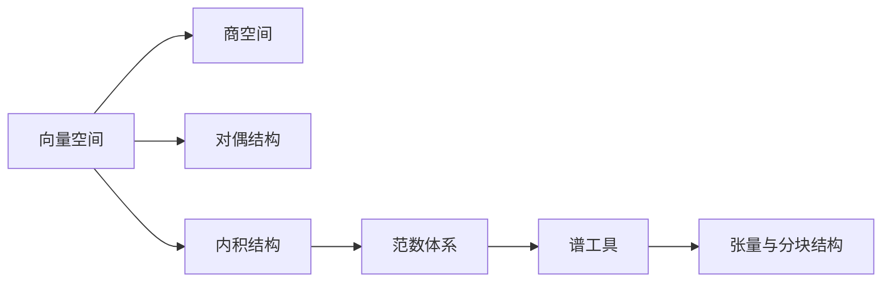

# 线性结构

线性结构是格基密码学的骨架。LWE 样本形如 $\mathbf{A}\mathbf{s}+\mathbf{e}\bmod q$，SIS 要求寻找满足 $\mathbf{A}\mathbf{x}=\mathbf{0}\bmod q$ 的短向量，环格与模块格也可理解为在更复杂代数对象上的线性结构。因此，学习格基密码之前，必须熟悉向量、矩阵、核、像、范数、内积、投影和谱工具。

本章的目标不是重复普通线性代数课程，而是把线性代数中的概念转化为格密码可用的语言。**实数域上线性代数、有限域上线性代数和环上模结构虽然形式相似，但性质并不完全相同。很多证明错误都来自把一个语境中的结论直接搬到另一个语境。**

## 向量空间

向量空间由**一组对象**和**两个运算**构成：向量加法与标量乘法。最熟悉的例子是 $\mathbb{R}^n$，其中向量 $\mathbf{x}=(x_1,\ldots,x_n)^\top$ 由 $n$ 个实数组成。若标量来自域 $F$，则 $F^n$ 是 $F$ 上的向量空间。在线性代数中，域的存在非常关键，因为非零标量都可逆，这保证了许多标准定理成立。

**子空间**是对加法和标量乘法封闭的子集合。给定若干向量 $\mathbf{v}_1,\dots,\mathbf{v}_m$，它们的线性组合形如 $a_1\mathbf{v}_1+\cdots+a_m\mathbf{v}_m$。所有线性组合构成的集合称为张成空间。若只有平凡组合能得到零向量，即 $a_1\mathbf{v}_1+\cdots+a_m\mathbf{v}_m=\mathbf{0}$ 蕴含所有 $a_i=0$，则这些向量线性无关。基是线性无关且张成整个空间的一组向量。

矩阵可以看作线性映射。若 $\mathbf{A}\in F^{m\times n}$，则 $\mathbf{x}\mapsto\mathbf{A}\mathbf{x}$ 把 $F^n$ 映射到 $F^m$。矩阵的列空间是所有 $\mathbf{A}\mathbf{x}$ 的集合，核空间是所有满足 $\mathbf{A}\mathbf{x}=\mathbf{0}$ 的向量集合。秩 $\operatorname{rank}(\mathbf{A})$ 刻画列空间维数，也等于行空间维数。秩—零度定理表明

$$
\dim\ker(\mathbf{A})+\operatorname{rank}(\mathbf{A})=n.
$$

格基密码中的 $\mathbb{Z}_q^n$ 在 $q$ 为素数时可视为有限域 $\mathbb{F}_q$ 上的向量空间；但若 $q$ 是合数，$\mathbb{Z}_q$ 不是域，而是环，某些线性代数结论需要修改。很多实际方案使用特殊模数以支持快速变换，这些模数未必总是素数。因此，当写 $\mathbf{A}\in\mathbb{Z}_q^{m\times n}$ 时，应先判断当前证明是否依赖域结构。

LWE 与 SIS 都以矩阵线性结构为核心。LWE 中公开样本通常可写成 $\mathbf{b}=\mathbf{A}\mathbf{s}+\mathbf{e}\bmod q$，其中 $\mathbf{s}$ 是秘密向量，$\mathbf{e}$ 是误差向量。SIS 中则寻找短非零向量 $\mathbf{x}$，使 $\mathbf{A}\mathbf{x}=\mathbf{0}\bmod q$。二者的困难性不只是线性方程求解困难，而是在“模线性结构 + 短向量/噪声约束”的组合中产生。

## 商空间

**商空间的思想是把某个子空间中的差异视为无关差异**。若 $V$ 是向量空间，$W\subseteq V$ 是子空间，则 $V/W$ 的元素是形如 $\mathbf{v}+W$ 的陪集，其中 $\mathbf{v}+W=\{\mathbf{v}+\mathbf{w}:\mathbf{w}\in W\}$。两个向量 $\mathbf{v}_1$ 与 $\mathbf{v}_2$ 属于同一个陪集，当且仅当 $\mathbf{v}_1-\mathbf{v}_2\in W$。因此，**商空间本质上是“按 $W$ 中的差异分类”**。

在模算术中，$\mathbb{Z}_q=\mathbb{Z}/q\mathbb{Z}$ 就是最基本的商结构。两个整数若相差 $q$ 的倍数，则在商结构中被视为同一个元素。同样，多项式商环 $\mathbb{Z}_q[X]/(\phi(X))$ 把相差 $\phi(X)$ 倍数的多项式视为同一个元素。后续环格方案将大量依赖这种思想：高次多项式可以通过模 $\phi(X)$ 约化为低次代表元。

在线性映射 $f:V\to U$ 中，核 $\ker f$ 决定哪些输入差异在输出中消失。若 $f(\mathbf{x}_1)=f(\mathbf{x}_2)$，则 $\mathbf{x}_1-\mathbf{x}_2\in\ker f$。因此，输出值对应的是输入空间按核划分后的某个等价类。这个观察是理解综合方程 $\mathbf{A}\mathbf{x}=\mathbf{u}\bmod q$ 的关键：**所有解构成某个特解加上核空间或核格**。

格理论中也会出现商空间，例如 $\mathbb{R}^n/\Lambda$。它**把相差一个格向量的实向量视为同一类**。这个对象可以看作 $n$ 维环面，基本平行多面体则提供一组代表元。商结构不是丢弃信息，而是把某些差异系统性地归零。

**代表元选择常影响实现。**比如 $\mathbb{Z}_q$ 的元素可选择标准代表元 $[a]_q\in\{0,\ldots,q-1\}$，也可选择中心代表元 $\langle a\rangle_q\in[-q/2,q/2)$。抽象商环元素相同，但范数、舍入和比较操作依赖代表元。格基加密正确性分析通常要把模元素提升到中心区间，以便判断噪声是否越界。

## 对偶结构

**对偶空间由线性泛函构成**。若 $V$ 是域 $F$ 上的向量空间，则 $V^*$ 表示所有线性映射 $\ell:V\to F$ 的集合。线性泛函把向量转化为标量，并保持线性结构：$\ell(a\mathbf{x}+b\mathbf{y})=a\ell(\mathbf{x})+b\ell(\mathbf{y})$。在有限维实向量空间中，每个线性泛函都可以通过某个向量与内积表示。

若 $\mathbf{e}_1,\ldots,\mathbf{e}_n$ 是 $V$ 的一组基，则存在对偶基 $\mathbf{e}_1^*,\ldots,\mathbf{e}_n^*$，满足 $\mathbf{e}_i^*(\mathbf{e}_j)=1$ 当 $i=j$，否则为 $0$。对偶基的意义在于提取坐标。若 $\mathbf{x}=x_1\mathbf{e}_1+\cdots+x_n\mathbf{e}_n$，则 $\mathbf{e}_i^*(\mathbf{x})=x_i$。这使我们能够把“坐标”理解为线性函数的输出。

对偶结构在格密码中并非抽象装饰。**对偶格 $\Lambda^*$ 定义为所有与原格 $\Lambda$ 中向量内积为整数的向量集合**。LWE 的对偶攻击、Poisson 求和公式、平滑参数和 Fourier 分析都依赖对偶格。

在有限阿贝尔群上，对偶常通过角色表示。对于模空间 $\mathbb{Z}_q^n$，一个典型角色可写作

$$
\chi_{\mathbf{a}}(\mathbf{x})=\exp\left(\frac{2\pi i\langle\mathbf{a},\mathbf{x}\rangle}{q}\right).
$$

这里 $\mathbf{a}$ 扮演频率向量的角色，$\mathbf{x}$ 是输入向量。后续分析模分布与 LWE 样本时，Fourier 工具会反复使用这种对偶视角。

一个对象可以从“点”的角度看，也可以从“测试函数”的角度看。统计距离、不可区分性和安全实验本质上都可理解为通过某类测试来比较两个分布。虽然这些内容属于后续概率与安全部分，但它们的语言基础已经在对偶结构中出现。

## 内积结构

内积为向量空间引入角度、长度和正交概念。在 $\mathbb{R}^n$ 中，标准欧氏内积定义为

$$
\langle\mathbf{x},\mathbf{y}\rangle=\sum_{i=1}^{n}x_i y_i.
$$

由内积可以定义范数 $\|\mathbf{x}\|_2=\sqrt{\langle\mathbf{x},\mathbf{x}\rangle}$。若 $\langle\mathbf{x},\mathbf{y}\rangle=0$，则称 $\mathbf{x}$ 与 $\mathbf{y}$ 正交。正交性表示两个方向互不影响，是理解投影、Gram–Schmidt 正交化和最小二乘的核心。

投影是把一个向量分解到某个子空间方向上的操作。若 $\mathbf{u}\neq\mathbf{0}$，则 $\mathbf{x}$ 在 $\mathbf{u}$ 方向上的投影为

$$
\operatorname{proj}_{\mathbf{u}}(\mathbf{x})=\frac{\langle\mathbf{x},\mathbf{u}\rangle}{\langle\mathbf{u},\mathbf{u}\rangle}\mathbf{u}.
$$

投影告诉我们 $\mathbf{x}$ 中有多少成分沿着 $\mathbf{u}$。在格算法中，投影用于把高维问题逐层分解；在 Babai 最近平面算法中，沿 Gram–Schmidt 方向逐步舍入就是投影思想的应用。

**Gram 矩阵记录一组向量之间的内积**。若矩阵 $\mathbf{B}$ 的列为 $\mathbf{b}_1,
\ldots,\mathbf{b}_n$，则 $\mathbf{B}^\top\mathbf{B}$ 的第 $(i,j)$ 项是 $\langle\mathbf{b}_i,\mathbf{b}_j\rangle$。Gram 矩阵描述了基向量之间的夹角与长度。格基质量很大程度上取决于基向量是否接近正交；若基向量高度相关，则同一个格可能被非常“歪斜”的基表示，导致解码和采样困难。

**最小二乘问题**寻找使 $\|\mathbf{A}\mathbf{x}-\mathbf{b}\|_2$ 最小的 $\mathbf{x}$。它与 CVP 有直观联系：CVP 要在离散格点中找最近点，而最小二乘在连续空间中找最佳近似。连续问题通常容易，离散约束使问题变难。理解这种差异，有助于认识格问题的计算困难性。

模空间中的内积需要谨慎。$\langle\mathbf{x},\mathbf{y}\rangle\bmod q$ 可以定义模内积，但它不提供实数意义下的长度和角度。**正确性分析往往需要先把模元素提升为中心代表元**，再在实数或整数空间中测量范数。

## 范数体系

范数用于度量向量大小。常见向量范数包括 $\ell_1$、$\ell_2$ 和 $\ell_\infty$ 范数：

- $\ell_1$ 范式（曼哈顿距离）：$$\|\mathbf{x}\|_1=\sum_{i=1}^{n}|x_i|$$
- $\ell_2$ 范式（欧式范数）：$$\|\mathbf{x}\|_2=\sqrt{\sum_{i=1}^{n}x_i^2}$$
- $\ell_{\infty}$ 范式（无穷范数）：$$\|\mathbf{x}\|_\infty=\max_i |x_i|$$

这些范数刻画不同意义下的“短”。在格基密码中，秘密向量、误差向量、SIS 解、陷门基和签名响应都需要范数约束。

不同范数之间存在比较关系。例如对任意 $\mathbf{x}\in\mathbb{R}^n$，有

$$
\|\mathbf{x}\|_\infty\leq \|\mathbf{x}\|_2\leq \sqrt{n}\|\mathbf{x}\|_\infty,
$$

$$
\|\mathbf{x}\|_2\leq \|\mathbf{x}\|_1\leq \sqrt{n}\|\mathbf{x}\|_2.
$$

这些不等式说明，在**固定维度下范数等价**，但**维度因子不可忽略**。若正确性证明从 $\ell_\infty$ 界转换为 $\ell_2$ 界，必须把 $\sqrt{n}$ 因子计入参数预算。

**矩阵范数**用于度量线性变换的大小。**Frobenius 范数** $\|\mathbf{A}\|_{\rm F}$ 是所有元素平方和的平方根，**谱范数** $\|\mathbf{A}\|_2$ 则表示矩阵对向量长度的最大拉伸：
$$
\|\mathbf{A}\|_2=\max_{\mathbf{x}\neq\mathbf{0}}\frac{\|\mathbf{A}\mathbf{x}\|_2}{\|\mathbf{x}\|_2}.
$$

谱范数在噪声传播、陷门质量和采样参数中非常重要，因为它控制最坏方向上的放大。

**Hamming（汉明）重量** $\operatorname{wt}(x)$ 或 $\|\mathbf{x}\|_0$ 统计非零坐标个数。虽然 $\|\cdot\|_0$ 严格说不是范数，但在稀疏秘密、挑战向量和编码理论中非常常见。固定重量集合的大小会影响拒绝采样、签名挑战空间和攻击枚举成本。

在模空间中谈范数时必须说明代表元。若 $a\in\mathbb{Z}_q$，标准代表元 $[a]_q$ 与中心代表元 $\langle a\rangle_q$ 的绝对值可能差异很大。例如 $q-1$ 的标准代表元很大，但中心代表元是 $-1$。解密正确性通常关心中心代表元的大小，因为噪声是围绕零分布的。

## 谱工具

特征值和奇异值描述矩阵的结构。若 $\mathbf{A}\mathbf{x}=\lambda\mathbf{x}$，则 $\lambda$ 是矩阵 $\mathbf{A}$ 的**特征值**，$\mathbf{x}$ 是对应**特征向量**。特征值适合分析方阵在某些方向上的作用，但对一般矩阵和非对称矩阵，奇异值更稳定。奇异值由 $\mathbf{A}^\top\mathbf{A}$ 的特征值平方根给出，通常记为 $s_i(\mathbf{A})$。

谱范数等于最大奇异值，即 $\|\mathbf{A}\|_2=s_1(\mathbf{A})$。**最小非零奇异值描述矩阵在最弱方向上的拉伸**。若最大奇异值很大或最小奇异值很小，线性系统可能数值不稳定。条件数通常定义为最大奇异值与最小奇异值之比，刻画求解线性系统对误差的敏感程度。

正定矩阵与二次型用于描述椭球和协方差。若对所有非零 $\mathbf{x}$ 都有 $\mathbf{x}^\top\mathbf{M}\mathbf{x}>0$，则对称矩阵 $\mathbf{M}$ 正定。二次型 $\mathbf{x}^\top\mathbf{M}\mathbf{x}$ 可看作带权长度平方。多维 Gaussian 分布 $\mathcal{N}(\boldsymbol{\mu},\boldsymbol{\Sigma})$ 的协方差矩阵 $\boldsymbol{\Sigma}$ 就是正半定矩阵，描述不同方向上的方差。

**格基密码中的采样和噪声传播常需要谱工具**。例如若 $\mathbf{e}$ 是噪声向量，则 $\mathbf{A}\mathbf{e}$ 的长度可由 $\|\mathbf{A}\|_2\|\mathbf{e}\|_2$ 控制。陷门采样中，短基的 Gram–Schmidt 长度和相关矩阵范数决定所需 Gaussian 参数。若忽略谱范数，只看单个坐标大小，可能低估最坏方向上的噪声放大。

需要强调，模矩阵的秩与实矩阵的谱性质属于不同语境。矩阵 $\mathbf{A}\in\mathbb{Z}_q^{m\times n}$ 可以作为模线性映射分析秩，也可以把代表元提升到整数或实数后分析谱范数，但这两个分析对象并不相同。写作中必须明确当前矩阵位于哪个空间，使用哪个范数或秩概念。

## 张量结构

**张量积**和 **Kronecker 积**用于描述分块结构和多层线性结构。若 $\mathbf{A}\in\mathbb{R}^{m\times n}$，$\mathbf{B}\in\mathbb{R}^{p\times r}$，则 Kronecker 积 $\mathbf{A}\otimes\mathbf{B}$ 是一个 $mp\times nr$ 的分块矩阵，其中 $\mathbf{A}$ 的每个元素 $a_{ij}$ 被替换为块 $a_{ij}\mathbf{B}$。这种结构在 gadget 矩阵、模块格和批量编码中非常常见。

Kronecker 积具有良好的代数性质。例如在维度匹配时，有

$$
(\mathbf{A}\otimes\mathbf{B})(\mathbf{x}\otimes\mathbf{y})=(\mathbf{A}\mathbf{x})\otimes(\mathbf{B}\mathbf{y}).
$$

此外，秩和范数也有相应关系，例如在合适条件下 $\operatorname{rank}(\mathbf{A}\otimes\mathbf{B})=\operatorname{rank}(\mathbf{A})\operatorname{rank}(\mathbf{B})$。这些性质使复杂结构可以拆解为较小结构分析。

在格基密码中，gadget 向量常写作 $\mathbf{g}=(1,2,4,\ldots,2^{d-1})^\top$，gadget 矩阵可通过单位矩阵与 $\mathbf{g}$ 的张量结构构造。位分解、幂次展开和陷门预像采样都依赖这种结构。若只把 gadget 看成一串数字，很难理解它为何能支持高效反演。

**模块格也可借助张量或分块思想理解**。环元素可表示为长度 $n$ 的系数向量，$R_q^k$ 中的元素则可表示为 $k$ 个多项式组成的块向量。环乘法对应某种结构化矩阵乘法，模块乘法对应分块结构化矩阵乘法。张量语言能帮助读者在“多项式表示”和“矩阵表示”之间转换。

张量结构还提醒我们，维度会迅速膨胀。一个看似简单的 $k\times k$ 环矩阵，若每个环元素对应 $n$ 维向量，展开后就是 $kn\times kn$ 的整数或模矩阵。参数分析和实现分析必须同时关注抽象维度与展开维度，否则会低估存储、运算和攻击成本。
