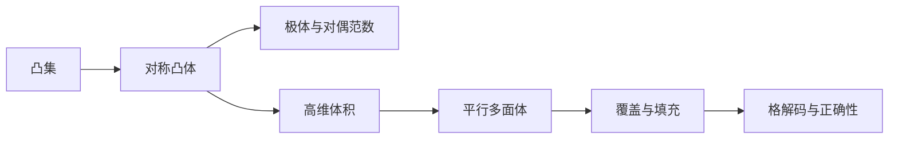

# 高维几何

格是一种离散的几何对象，而格基密码的安全性和正确性都深受高维几何影响。短向量、最近向量、覆盖半径、基本区域、凸体体积和高维集中现象，都是理解后续格理论的必要语言。格密码工作的维度通常很高，低维直觉常常失效。

## 凸集基础

集合 $K\subseteq\mathbb{R}^n$ 称为**凸集**，若对任意 $\mathbf{x},\mathbf{y}\in K$ 和任意 $t\in[0,1]$，都有 $t\mathbf{x}+(1-t)\mathbf{y}\in K$。直观地说，凸集包含任意两点之间的线段。球、立方体、半空间、椭球都是凸集；而环形区域或两个分离球的并通常不是凸集。

**凸组合**是形如 $\sum_i \alpha_i\mathbf{x}_i$ 的点，其中 $\alpha_i\geq0$ 且 $\sum_i\alpha_i=1$。一组点的**凸包**是包含这些点的最小凸集。凸包可以理解为用橡皮膜包住所给点集后形成的区域。在格几何中，我们经常用凸体与格点相交来研究短向量是否存在：如果某个以原点为中心的凸体足够大，就可能被迫包含非零格点。

**凸函数**是满足 $f(t\mathbf{x}+(1-t)\mathbf{y})\leq tf(\mathbf{x})+(1-t)f(\mathbf{y})$ 的函数。虽然本章不系统研究优化，但凸函数与范数、距离和能量函数密切相关。例如 $\|\mathbf{x}\|_2$ 是凸函数，$\|\mathbf{x}\|_2^2$ 也是凸函数。格问题的困难性常来自“在离散集合上优化凸函数”，连续优化容易而离散约束困难。

凸几何的价值在于提供坐标无关的语言。一个格基可能非常歪斜，但格本身作为点集具有几何性质。凸体体积、中心对称性和线性变换下的行为，比逐坐标计算更适合描述高维格结构。后续 Minkowski 定理正是用凸体体积来保证格点存在，而不是通过枚举坐标。

**凸性是一种全局性质，不是“边界看起来圆滑”。**多面体可以是凸的，球也可以是凸的；而边界光滑与否并不决定凸性。格密码中常用的 $\ell_\infty$ 球其实是立方体，它有棱角，但仍是凸集。

## 对称凸体

若集合 $K\subseteq\mathbb{R}^n$ 满足 $K=-K$，即 $\mathbf{x}\in K$ 当且仅当 $-\mathbf{x}\in K$，则称它**关于原点中心对称**。**若 $K$ 同时是凸集、紧集并且有非空内部，则常称为凸体**。对称凸体是数的几何中的核心对象，因为它能自然表达“长度不超过某界”的所有方向。

典型对称凸体包括**欧氏球** $B_2(r)=\{\mathbf{x}:\|\mathbf{x}\|_2\leq r\}$、**立方体** $B_\infty(r)=\{\mathbf{x}:\|\mathbf{x}\|_\infty\leq r\}$ 和**交叉多胞体** $B_1(r)=\{\mathbf{x}:\|\mathbf{x}\|_1\leq r\}$。这些对象分别对应不同范数约束。若某个格点落入 $B_2(r)$，说明存在欧氏长度不超过 $r$ 的短向量；若落入 $B_\infty(r)$，说明每个坐标都被 $r$ 控制。

**体积**是凸体最重要的量之一。线性变换 $\mathbf{A}$ 会按 $|\det(\mathbf{A})|$ 倍缩放体积。若 $K$ 是单位球，$\mathbf{A}K$ 是一个椭球，其体积由行列式控制。这一事实连接了线性代数中的行列式与几何中的空间大小，也为后续格行列式和余体积奠定基础。

中心对称性在 Minkowski 型定理中不可缺少。粗略地说，若一个中心对称凸体体积足够大，它必然包含非零格点。对称性保证如果体内有两个同余点，它们的差仍然落在相关凸体中。虽然严格定理会在格几何卷证明，但本节应先让读者理解：短向量存在性可以由“体积太大，无法避开所有格点”推出。

在密码分析中，不同凸体对应不同搜索策略和界限。例如枚举算法可能在欧氏球内搜索短向量，而某些实现错误可能产生 $\ell_\infty$ 有界的秘密空间。选择哪个凸体不是任意的，它反映了攻击者或证明者掌握的约束类型。

## 极体结构

**极体**是描述对偶几何的基本工具。若 $K\subseteq\mathbb{R}^n$ 是包含原点的凸体，其极体定义为
$$
K^\circ=\{\mathbf{y}\in\mathbb{R}^n: |\langle\mathbf{x},\mathbf{y}\rangle|\leq 1\text{ for all }\mathbf{x}\in K\}.
$$

极体由所有对 $K$ 中向量内积都受控的测试向量组成。这个定义把几何集合与线性泛函联系起来。

极体与对偶范数密切相关。若 $\|\cdot\|$ 是某个范数，则其对偶范数定义为

$$
\|\mathbf{y}\|_* = \sup_{\|\mathbf{x}\|\leq 1}|\langle\mathbf{x},\mathbf{y}\rangle|.
$$

欧氏范数的对偶仍是欧氏范数，$\ell_1$ 范数的对偶是 $\ell_\infty$ 范数，$\ell_\infty$ 范数的对偶是 $\ell_1$ 范数。这个关系在分析内积噪声和对偶攻击时十分重要。

**对偶几何会在格理论中表现为原格与对偶格之间的关系**。若原格中没有太短向量，对偶格中某些方向可能受到限制；反之亦然。转移定理、Banaszczyk 界和平滑参数都依赖原格—对偶格之间的精细关系。极体提供了理解这些结果的几何语言。

在 LWE 对偶攻击中，攻击者寻找某个短向量与公开样本矩阵相乘，使秘密项消失而噪声项仍可检测。这里“短”与“内积可控”正是对偶范数的思想。若一个向量在对偶意义下很短，则它对噪声的放大有限，从而可能产生统计区分。

初学者容易把“对偶”理解为纯粹代数技巧。事实上，对偶是从“对象本身”转向“所有线性测试”的视角。格密码安全经常关心某个分布能否被区分，而区分器本质上就是一种测试。因此，对偶视角会从几何一直贯穿到概率和安全证明。

## 高维体积

高维几何最反直觉的现象之一是体积集中。二维圆盘的面积直观上分布在内部，但**高维球的大部分体积集中在靠近边界的薄壳中**。**若 $\mathbf{X}$ 是高维标准 Gaussian 向量，则 $\|\mathbf{X}\|_2$ 并不会像一维那样广泛波动，而是高度集中在约 $\sqrt{n}$ 附近**。这种现象是后续高维随机性和噪声分析的基础。

球与立方体的体积比例在高维中急剧变化。单位立方体 $[-1,1]^n$ 的体积是 $2^n$，而**单位欧氏球的体积虽然起初增长，但高维后迅速趋向零**。许多低维图形给人的印象在高维中完全失效。格密码的维度通常为数百甚至上千，因此不能依赖二维图像判断参数安全。

高维体积与格点计数密切相关。若一个区域体积远大于格的基本区域体积，则直觉上它应包含许多格点；若体积很小，则可能不含非零格点。这种直觉需要通过数的几何定理严格化。格行列式或余体积衡量格点密度，凸体体积衡量搜索区域大小，二者比较构成短向量存在性分析的核心。

在正确性分析中，高维效应也很重要。若每个坐标的噪声都小概率越界，那么 $n$ 个坐标中至少一个越界的概率可能被放大约 $n$ 倍。反过来，若噪声向量的欧氏长度集中，则可以用整体范数界分析失败概率。选择逐坐标界还是整体范数界，会影响参数紧致性。

高维几何还影响攻击成本。枚举短向量时，搜索区域体积决定候选数量；筛法算法依赖高维球面上点的分布；BKZ 的启发式估计也使用高维球体积和 Gaussian heuristic。虽然这些算法会在后续卷详细讨论，本章应先让读者接受一个事实：高维体积不是直观背景，而是格密码安全估计的核心量。

## 平行多面体

给定线性无关向量 $\mathbf{b}_1,\ldots,\mathbf{b}_n\in\mathbb{R}^n$，它们生成的平行多面体定义为

$$
\mathcal{P}(\mathbf{B})=\left\{\sum_{i=1}^{n}t_i\mathbf{b}_i:0\leq t_i<1\right\},
$$

其中 $\mathbf{B}$ 是以 $\mathbf{b}_i$ 为列的矩阵。**这个区域可以看作由基向量张成的一个基本胞**。若这些向量生成格 $\Lambda=\mathcal{L}(\mathbf{B})$，则平行多面体的平移副本可以铺满整个空间。

**平行多面体的体积等于 $|\det(\mathbf{B})|$**。对于同一个满秩格，虽然不同基给出的平行多面体形状可能完全不同，但体积相同。因此**格的行列式**定义为 $\det(\Lambda)=|\det(\mathbf{B})|$，与基选择无关。这个数也称为余体积，表示每个格点平均占据的空间体积。

不同基对应同一格的事实非常重要。一个好基可能接近正交、向量较短，适合解码和采样；一个坏基可能非常歪斜，即使生成同一格，也会使算法困难。格密码公钥往往相当于某种“坏基”或随机表示，而私钥陷门则提供“好基”或短结构。平行多面体形状的差异正是这种思想的几何体现。

基本区域不一定只能选平行多面体。**Voronoi 胞**也是一种基本区域，它由距离某个格点最近的点组成。平行多面体容易由基描述，Voronoi 胞更适合最近点解码。后续学习 CVP、BDD 和误差协调时，两种基本区域都会出现。

在模运算中，区间 $[0,q)$ 可以看作一维格 $q\mathbb{Z}$ 的基本区域，中心区间 $[-q/2,q/2)$ 是另一种代表区域。高维模空间 $\mathbb{Z}_q^n$ 也可理解为 $q\mathbb{Z}^n$ 在 $\mathbb{Z}^n$ 中的商结构。这个简单例子连接了模算术、商空间和平行多面体。

## 覆盖结构

**覆盖描述用某些集合的平移副本覆盖整个空间的能力**。给定格 $\Lambda$ 和半径 $r$，若每个点 $\mathbf{x}\in\mathbb{R}^n$ 到某个格点的距离都不超过 $r$，则半径为 $r$ 的球围绕所有格点可以覆盖整个空间。最小这样的 $r$ 称为**覆盖半径**。覆盖半径刻画最坏情况下任意点距离最近格点有多远。

**填充描述格点周围互不重叠球的大小**。若以每个格点为中心的半径 $r$ 球互不相交，则 $r$ 不超过最短非零格向量长度的一半。填充半径与最短向量长度直接相关，而覆盖半径与最近点问题相关。一个格可能填充很好但覆盖不佳，也可能覆盖较好但最短向量较短。

**BDD，即有界距离解码，位于覆盖与填充之间**。若目标点距离某个格点足够近，并且这个近邻是唯一的，则可以尝试恢复该格点。**唯一性通常要求噪声半径小于最短向量长度的一半**。格基加密的解密正确性常可理解为：密文对应的点落在正确格点的可解码区域内，因此舍入或解码能恢复消息。

**误差协调和密钥压缩也可用覆盖语言解释**。通信双方拥有接近的值，希望通过公开少量提示得到相同密钥；这相当于把空间划分为若干区域，并要求误差不会把值推到不同区域。区域边界、覆盖半径和噪声分布共同决定失败概率。

**量化是覆盖结构的算法版本**。给定连续或高精度对象，量化器输出某个离散代表点。最简单的量化是舍入到最近整数；格量化则舍入到最近格点。格基密码中，压缩、解压缩、舍入、解码和协调都属于广义量化过程。理解覆盖结构，可以帮助读者把这些看似不同的操作统一起来。
