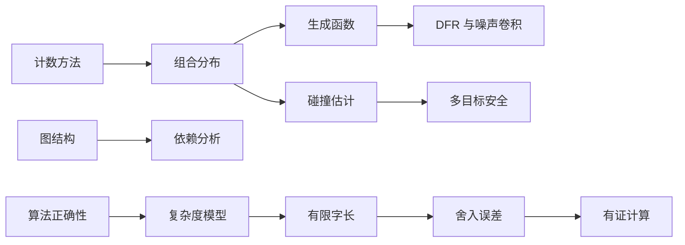

# 组合计数与算法可靠性

本章连接离散计数、概率直觉、图结构和实现可靠性。格基密码看似以代数和几何为主，但实际分析中经常需要计算密钥空间大小、挑战空间大小、碰撞概率、拒绝采样重试次数、噪声分布卷积和解密失败率。若没有组合计数工具，就无法严谨评估这些量。

## 计数方法

计数方法用于确定有限集合的大小。

- **加法原理**说明，若**若干类对象互不重叠**，则**总数等于各类数量之和**。
- **乘法原理**说明，若**一个对象可由连续选择构成，且每步选择数固定**，则**总数等于各步选择数的乘积**。例如长度为 $n$ 的二进制串有 $2^n$ 个，因为每个坐标有两个选择。

- **容斥原理**用于处理重叠集合。若要计算 $A\cup B$ 的大小，不能简单相加 $|A|+|B|$，因为交集被计算了两次。正确公式是

$$
|A\cup B|=|A|+|B|-|A\cap B|.
$$

​	更高阶容斥可处理多个集合。哈希碰撞、非法编码、多个失败事件的精确计数都可能需要容斥思想。

- **双射证明**通过构造两个集合之间的一一对应来证明它们大小相同。例如长度为 $n$、重量为 $w$ 的二进制向量与从 $[n]$ 中选择 $w$ 个位置的子集一一对应，因此数量为 $\binom{n}{w}$。这种思想在分析稀疏秘密空间、签名挑战空间和错误向量集合时很常见。

- **计数不等于安全**。一个密钥空间很大，只说明穷举搜索困难，但不排除结构攻击、代数攻击或统计攻击。格基密码的安全通常依赖 LWE/SIS 等困难假设，而不是单纯依赖密钥数量。不过，计数仍然是安全预算的重要组成部分，尤其在多目标攻击、生日界和随机性复用分析中。

## 组合分布

组合分布把计数与概率联系起来。二项式系数 $\binom{n}{w}$ 表示从 $n$ 个位置中选择 $w$ 个位置的方式数。若 $X\sim\mathsf{Bin}(n,p)$，则

$$
\Pr[X=w]=\binom{n}{w}p^w(1-p)^{n-w}.
$$

当 $p=1/2$ 时，这描述 $n$ 次公平比特中出现 $w$ 个 $1$ 的概率。

**中心二项分布可由两个独立二项变量之差构造。**若 $X,Y\sim\mathsf{Bin}(\eta,1/2)$ 独立，则 $X-Y$ 服从参数为 $\eta$ 的中心二项分布，常记为 $\mathsf{CBD}_\eta$。这种分布支持集有限、采样高效，在许多格基方案中用于生成小噪声。它不是 Gaussian 分布，但在参数合适时具有类似集中性。

多项式系数推广了二项式系数。若有 $k$ 类对象，第 $i$ 类选择数量为 $n_i$，总数 $n=\sum_i n_i$，则排列数量为

$$
\binom{n}{n_1,
\ldots,n_k}=\frac{n!}{n_1!\cdots n_k!}.
$$

这类系数可用于分析多值噪声分布、固定组成向量和挑战多项式。

Stirling 公式提供阶乘的渐近估计：

$$
n!\approx \sqrt{2\pi n}\left(\frac{n}{e}\right)^n.
$$

它使我们能够估计巨大组合数的对数规模。例如固定重量向量数量 $\binom{n}{w}$ 的安全位数可通过 $\log_2\binom{n}{w}$ 估计。实际参数分析中，经常只关心对数规模，因为它对应穷举复杂度的比特数。

Hamming 球体积也是重要组合对象。长度为 $n$、半径为 $r$ 的 Hamming 球包含所有重量不超过 $r$ 的二进制向量，其大小为 $\sum_{i=0}^{r}\binom{n}{i}$。它连接编码理论、错误纠正、稀疏搜索和某些格构造。后续 Construction A 与编码视角会继续使用这些工具。

## 碰撞估计

生日界描述从有限集合中重复采样时出现碰撞的概率。若从大小为 $N$ 的集合中独立均匀采样 $t$ 次，则至少出现一对碰撞的概率约为 $t^2/(2N)$，当 $t\ll\sqrt{N}$ 时这个近似较好。更精确地，无碰撞概率为

$$
\prod_{i=0}^{t-1}\left(1-\frac{i}{N}\right).
$$

当 $t$ 达到约 $\sqrt{N}$ 时，碰撞概率变得不可忽略，这就是所谓平方根现象。

生日界在哈希安全中非常重要。若哈希输出长度为 $\ell$，输出空间大小为 $2^\ell$，则经典碰撞搜索约需要 $2^{\ell/2}$ 次查询，而不是 $2^\ell$。因此，若希望获得约 $128$ 位碰撞安全性，哈希输出长度通常需要约 $256$ 位。后量子环境下还要考虑量子碰撞算法，相关预算会更复杂。

多目标攻击会进一步改变概率。若攻击者有 $N$ 个目标公钥、$Q$ 次查询或多个会话，则成功概率可能随目标数量线性或近似线性增长。单用户安全证明中的优势上界不能直接用于大规模部署，必须计入用户数和实例数。格基 KEM 在协议中使用时，密钥派生、上下文绑定和多用户安全都与此相关。

碰撞估计也用于随机种子和 nonce 分析。若某个实现随机生成种子或一次性值，而空间不够大，就可能在大量会话中重复。随机性复用在签名和加密中常常是灾难性的。即使单次重复概率很低，长期运行和大规模部署也可能放大风险。

初学者需要理解生日界的前提：采样应近似独立且均匀，集合大小应明确，碰撞定义应清楚。如果分布非均匀，最大概率点会显著提高碰撞风险；如果采样有状态或去重机制，公式也要调整。不能把“平方根规则”当成无条件结论。

## 生成函数

生成函数把数列编码为形式幂级数。若数列为 $a_0,a_1,a_2,\ldots$，其普通生成函数为

$$
A(X)=\sum_{i\geq0}a_iX^i.
$$

系数 $a_i$ 可以通过提取 $X^i$ 的系数得到。生成函数的优势在于，组合对象的加法、拼接和独立求和常转化为多项式或幂级数的乘法。

概率生成函数用于描述非负整数随机变量。若随机变量 $X$ 满足 $\Pr[X=i]=p_i$，则其概率生成函数为

$$
G_X(z)=\mathbb{E}[z^X]=\sum_{i\geq0}p_i z^i.
$$

若 $X$ 与 $Y$ 独立，则 $X+Y$ 的生成函数是 $G_X(z)G_Y(z)$。这使得独立噪声之和的分布可以通过多项式乘法计算。

中心二项分布和离散噪声分析都可以使用生成函数。若一个噪声坐标由多个独立小随机变量相加得到，其分布就是基本分布的卷积。生成函数提供了精确计算卷积系数的方法，比简单使用尾界更细致。解密失败率 DFR 的精确估计往往需要这种工具。

在环格方案中，噪声不是简单逐坐标相加，还可能经过多项式卷积。某个输出系数是多个随机变量乘积和的组合。生成函数、特征函数和动态规划都可用于估计这些系数的分布。若直接假设其为 Gaussian，可能得到不严谨甚至错误的失败率估计。

生成函数也有实现挑战。高精度系数计算可能涉及巨大整数、极小概率和尾部质量截断。若用浮点数近似，需要控制舍入误差；若用有理数或区间算术，计算成本可能上升。后续有证数值计算将提供更可靠的方式。

## 图结构

图由顶点和边组成，用于描述对象之间的关系。无向图表示对称关系，有向图表示有方向的依赖。树是无环连通图，DAG 是有向无环图。图结构在密码学中不仅用于数据结构，也用于描述协议拓扑、依赖关系和安全实验中的查询流程。

Merkle 树是哈希树结构的典型例子。叶子表示数据块，内部节点表示子节点哈希，根节点承诺整组数据。认证路径是一条从叶子到根的路径，加上兄弟节点哈希。虽然 Merkle 树属于哈希与认证数据结构内容，但理解树、路径和根的概念是基础。

依赖图用于分析随机变量之间的依赖。若一组随机变量并非完全独立，但每个变量只依赖少量其他变量，可以用图表示依赖关系。格基密码的 DFR 分析中，不同系数噪声可能因为卷积共享随机源而相关；若错误地假设独立，就会低估失败概率。

协议也可用图描述。群组密钥协商中，参与方之间的通信拓扑可能是链、树或更一般图。动态成员加入和删除对应图结构变化。虽然这些内容属于后续卷，但本节先建立图语言，便于理解“信息沿边传播”“状态沿路径更新”“局部验证覆盖全局结构”等思想。

图算法的复杂度也会进入实现分析。例如树高度影响认证路径长度，图连通性影响协议鲁棒性，DAG 拓扑排序影响任务调度。格基密码不是孤立代数公式，实际协议和实现常需要组合这些离散结构。

## 算法正确性

算法正确性证明说明算法输出确实满足规格。一个算法规格通常包含前置条件、后置条件和失败行为。前置条件说明输入必须满足什么，例如参数合法、编码规范、矩阵维度匹配；后置条件说明输出应满足什么，例如解密输出原消息、采样结果属于目标集合、变换后再逆变换得到原多项式。

循环不变量是证明循环正确性的核心。若算法在每轮循环前后都保持某个性质，并且初始时该性质成立，循环结束时该性质又足以推出目标结论，则算法正确。例如在逐系数解析字节流时，不变量可以是“已经解析的前 $i$ 个系数都属于 $\mathbb{Z}_q$ 且与输入字节前缀一致”。在 NTT 中，不变量可能描述每一层蝶形运算后数组表示的部分变换结果。

终止性也必须证明。拒绝采样算法可能循环直到采到合法值；若接受概率太低，虽然理论上最终会成功，但运行时间可能不可接受。严谨分析应给出期望重试次数和尾界。若规范设置最大重试次数，则还要说明超过上限时如何处理，以及这是否引入统计偏差或失败概率。

密码算法的正确性不同于普通软件功能测试。测试向量只能覆盖有限输入，不能证明所有合法输入都正确。格基密码中的边界条件很多，例如模约减边界、压缩舍入边界、中心代表元边界、非法编码、空输入、最大长度输入。形式化正确性证明帮助发现这些测试难以覆盖的问题。

安全实现还要求算法行为不泄漏秘密。严格说，常数时间属于实现安全而不是数学正确性；但在密码软件中，二者不可分离。若算法在数学上输出正确，却根据秘密数据分支或访问秘密相关内存位置，仍可能被侧信道攻击破坏。因此，后续实现章节会把功能正确性与泄漏安全共同审查。

## 复杂度模型

时间复杂度描述算法运行所需基本操作数量，空间复杂度描述内存需求。最坏情况复杂度关注所有输入中最困难的输入，平均情况复杂度关注某个输入分布下的期望成本，期望复杂度还可能来自算法内部随机性。格基密码中，密钥生成、采样、NTT、解封装和攻击算法都需要复杂度分析。

摊还复杂度用于分析多次操作的平均成本。例如某些预计算表在初始化时成本较高，但可被多次封装或验证共享。若只看单次操作，可能误判长期运行效率。协议实现中，预计算也会带来内存占用和侧信道风险，因此不能只看算术运算次数。

格攻击复杂度尤其需要谨慎。BKZ、枚举、筛法等算法的实际成本依赖维度、块大小、内存、并行度和启发式模型。安全估计常以指数形式给出，例如 $2^{c n}$ 或 $2^{c\beta}$，其中 $\beta$ 可能表示块大小。小的常数变化会导致巨大成本差异，因此参数表必须给出清晰假设。

RAM 模型按字操作计数，更接近软件实现；图灵机模型更适合理论定义；电路模型适合硬件和量子资源估计。不同模型之间通常在多项式意义下等价，但具体安全和实现性能会有明显差异。格基密码既需要理论模型，也需要工程模型。

复杂度还包括通信大小和存储大小。公钥、密文、签名和共享头的字节数直接影响部署。环格和模块格之所以重要，一个原因是它们通过结构化计算降低存储和通信成本。安全性、正确性、运行时间和带宽共同决定方案质量。

## 有限字长

实际计算机使用固定宽度整数，例如 $16$ 位、$32$ 位或 $64$ 位。数学中的整数可以任意大，但机器整数会溢出。若实现使用无符号 $16$ 位整数表示模 $q$ 元素，乘法中间结果可能超过 $16$ 位，必须提升到更宽类型或使用专门约减技术。否则数学公式正确，程序结果仍可能错误。

补码是有符号整数的常见表示。它使加减法在底层硬件上具有模 $2^w$ 的行为，但编程语言对有符号溢出的规定可能不同。在某些语言中，有符号溢出属于未定义行为，编译器可能基于“不发生溢出”的假设优化代码，导致密码实现错误。安全代码应明确使用无符号类型或经过验证的安全算术。

模约减是格基密码实现的核心操作。Barrett 约减、Montgomery 约减和条件减法都用于高效计算 $amod q$。这些算法必须保证输出代表元范围正确，并且尽量常数时间。若约减结果偶尔落在 $[q,2q)$，可能在后续操作中仍可接受；但规范必须说明这种“懒约减”的允许范围。

中心提升也需要有限字长处理。将 $[a]_q$ 转为 $\langle a\rangle_q$ 时，常需要比较 $a$ 与 $q/2$ 并条件减去 $q$。若该条件分支依赖秘密数据，可能泄漏信息。因此实现中常使用位掩码或算术技巧完成常数时间转换。

有限字长问题还会影响序列化。多项式系数如何压缩为字节、字节如何解析回系数、是否允许非规范编码、溢出时如何处理，都会影响互操作性和安全性。CCA 安全 KEM 中，非规范编码处理不当可能造成重加密检查绕过或不同实现行为不一致。

## 舍入误差

浮点数用有限位表示实数，因此几乎所有非特殊实数运算都会产生舍入误差。绝对误差是 $|\widehat{x}-x|$，相对误差是 $|\widehat{x}-x|/|x|$。在数值算法中，条件数衡量输入微小变化对输出的放大程度。若问题病态，即使每步舍入很小，最终误差也可能很大。

格基密码通常偏好整数运算，但并非完全避开浮点数。Falcon 类签名使用高精度采样和 FFT 相关运算；某些参数评估和 DFR 计算也依赖浮点近似。若浮点误差改变采样分布，可能造成统计偏差；若误差影响边界判断，可能导致签名失败率或安全性偏离理论分析。

定点数是浮点数的替代方案。它通过固定缩放因子将实数近似为整数，便于常数时间实现和误差控制。定点实现仍需分析截断、舍入和溢出。采样概率表、指数函数近似和 Gaussian 尾部截断，都必须把数值误差转化为统计距离或失败概率预算。

舍入模式也影响可复现性。向零舍入、向下舍入、向上舍入和最近舍入可能给出不同结果。跨平台实现若依赖默认浮点环境，可能在不同处理器上产生不同输出。密码规范通常应避免这种不确定性，或明确要求特定舍入行为。

初学者应理解：数值误差不是工程细枝末节，而是密码证明与实现之间的接口。若理论证明假设精确离散 Gaussian 采样，而实现只产生近似分布，就必须证明近似分布与理想分布的统计距离足够小。否则安全证明无法直接适用。

## 有证计算

有证计算的目标是让数值结论可以被独立复核。格基密码参数分析中，经常需要证明某个失败概率小于阈值、某个尾部质量可忽略、某个采样误差不超过预算、某个攻击成本高于安全等级。若这些结论只来自普通浮点脚本，读者很难判断舍入误差是否影响结论。

区间算术是一种常见方法。它不用单个浮点数表示结果，而用区间 $[a,b]$ 包围真实值。每次运算都向外舍入，保证真实结果始终在区间内。若最终能证明整个区间都低于安全阈值，就得到可靠结论。区间可能变宽，因此算法设计需要控制依赖和误差膨胀。

有理数计算提供另一种可复核路径。若概率、组合数和尾界可以用整数或有理数表示，就可以避免浮点误差。但有理数分子分母可能迅速膨胀，计算成本很高。因此实践中常结合高精度浮点、区间包围和符号化上界。

DFR 证明尤其适合有证计算。解密失败通常是极小概率事件，普通 Monte Carlo 模拟几乎观察不到失败，不能证明失败率足够低。严谨做法应使用解析尾界、生成函数、动态规划、重要性采样或区间证书，并明确所有近似误差。若声称失败概率低于 $2^{-128}$，就应说明证据如何得到。

有证计算还服务于标准化和实现审计。参数表、参考代码和测试向量应能被第三方复现；安全估计脚本应记录版本、输入、舍入策略和误差预算。格基密码面向长期部署，只有可复核的数值链条才能支撑可信标准。
