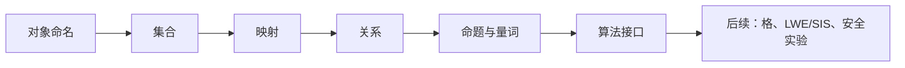

# 形式化语言

本章建立格基密码学的最低层语言。格基加密是一种高度形式化的数学工程：它一方面依赖集合、函数、关系、商结构、模运算等基础数学语言，另一方面又要求这些语言能够被精确转写为算法接口和安全实验。因而，本章不会把集合论、逻辑学和函数论当作孤立的数学常识，而是把它们看成描述密码系统的“语法层”。

>[!ANNOT]
> 本卷采用统一符号风格：标量用 $a,q,n$，向量用 $\mathbf{x},\mathbf{s},\mathbf{e}$，矩阵用 $\mathbf{A},\mathbf{B}$，集合与分布用 $\mathcal{X},\mathcal{D}$，算法用 $\mathsf{Alg}$，失败符号用 $\perp$。向量默认视为列向量，模 $q$ 对象默认属于商环 $\mathbb{Z}_q=\mathbb{Z}/q\mathbb{Z}$。

## 数学对象的命名规范

> [!ANNOT]
>
> 具体符号同一问题可参考[附录Ⅰ - 后量子密码体系全局符号统一表](/posts/appendix-post-quantum-cryptography-symbol-table/)。

在格基密码学中，同一个文本会同时出现整数、环元素、向量、矩阵、集合、分布、算法、事件、对手与安全优势。若不建立命名规范会无法判断某个符号是具体值、随机变量还是算法输出。例如 $e$ 可能表示一个误差标量，$E$ 可能表示一个随机变量或事件，$\mathbf{e}$ 通常表示误差向量，$\mathcal{E}$ 则更适合作为某个事件类或实验对象。命名规范的核心目标不是追求排版美观，而是使每个符号的“类型”在视觉上尽量可见。

本文将标量、整数和环元素写作普通斜体，如 $a,q,n,x$；向量写作粗体小写，如 $\mathbf{x},\mathbf{s},\mathbf{e}$；矩阵写作粗体大写，如 $\mathbf{A},\mathbf{B}$；集合、空间和分布族写作花体大写，如 $\mathcal{M},\mathcal{C},\mathcal{D}$；算法和协议字段写作无衬线体，如 $\mathsf{KeyGen},\mathsf{pk},\mathsf{ct}$；对手、归约和模拟器写作花体大写，如 $\mathcal{A},\mathcal{B},\mathcal{S}$。这种区分在后续安全证明中极其重要，因为一个安全实验经常同时包含算法 $\mathsf{Enc}$、对手 $\mathcal{A}$、挑战事件 $E$ 和随机变量 $X$。

安全参数通常记为 $\lambda$。一个密码方案并不是单个算法，而是一族由安全参数索引的算法与空间。例如，密钥空间可以写成 $\mathcal{K}_\lambda$，消息空间可以写成 $\mathcal{M}_\lambda$，密文空间可以写成 $\mathcal{C}_\lambda$，噪声分布可以写成 $\chi_\lambda$。实际方案中常常给出固定参数表，例如某个 KEM 的 $n,q,k$ 已经确定；但在理论证明中，仍然需要把它理解为随 $\lambda$ 增长的一族对象。

一个常见误区是“同一个字母只要上下文能猜出来就可以复用”。在短小证明中，这可能不会造成灾难；但在格密码字典式写作中，这会严重破坏可读性。例如，$s$ 在格文献中常表示 Gaussian 参数，而 $\mathbf{s}$ 又常表示 LWE 秘密向量；若同一节再用 $s$ 表示字符串长度，就会产生不必要的负担。写作时应尽量为局部含义添加语义下标，例如 $s_{\rm G}$、$\ell_{\rm msg}$、$\varepsilon_{\rm stat}$。

赋值、采样与输出也必须区分。数学定义可写作 $x:=y$，确定性赋值可写作 $x\gets y$，从分布 $\mathcal{D}$ 采样写作 $x\leftarrow\mathcal{D}$，从有限集合 $S$ 均匀采样写作 $x\xleftarrow{\$}S$，算法运行写作 $y\leftarrow\mathsf{Alg}(x)$。如果算法失败、拒绝或输出无效对象，统一使用 $\perp$。这些符号在采样器、解封装算法和安全游戏中会反复出现。

## 集合结构

集合是描述密码对象空间的**最基本语言**。一个集合可以理解为若干对象的总体，例如整数集合 $\mathbb{Z}$、模整数集合 $\mathbb{Z}_q$、长度为 $n$ 的二进制串集合 $\{0,1\}^n$、模向量空间 $\mathbb{Z}_q^n$、模矩阵集合 $\mathbb{Z}_q^{m\times n}$。在密码方案中，密钥、明文、密文、随机币、错误向量和查询结果都属于某个明确的集合。

集合的**基本运算**包括并、交、差、补和**笛卡尔积**。若 $A$ 与 $B$ 是两个集合，则 $A\cup B$ 表示并集，$A\cap B$ 表示交集，$A\setminus B$ 表示从 $A$ 中去除属于 $B$ 的元素，$A\times B$ 表示所有有序对 $(a,b)$ 的集合。在密码学中，笛卡尔积非常常见。例如公钥加密的密钥对空间可看作 $\mathcal{PK}_\lambda\times\mathcal{SK}_\lambda$，一个加密算法的输入空间可看作 $\mathcal{PK}_\lambda\times\mathcal{M}_\lambda\times\mathcal{R}_\lambda$，其中 $\mathcal{R}_\lambda$ 是随机币空间。

有限集合的大小通常写作 $|S|$。当写 $x\xleftarrow{\$}S$ 时，含义是从有限集合 $S$ 中按均匀分布抽取一个元素，也就是说每个元素被选中的概率均为 $1/|S|$。这与 $x\leftarrow\mathcal{D}$ 不同，后者表示从分布 $\mathcal{D}$ 采样；$\mathcal{D}$ 可以不是均匀分布，也可以定义在无限集合上。格基密码中的误差通常来自非均匀分布，例如中心二项分布或离散 Gaussian 分布，因此不能把“来自某个集合”和“均匀来自某个集合”混为一谈。

在格基加密中，集合还承担“约束条件”的表达功能。例如，短向量集合可以写作 $\{\mathbf{x}\in\mathbb{Z}^n:\|\mathbf{x}\|_2\leq \beta\}$，固定汉明重量向量集合可以写作 $\{\mathbf{x}\in\{0,1\}^n:\operatorname{wt}(\mathbf{x})=w\}$。这些集合定义会直接影响密钥空间大小、错误概率和攻击复杂度。初学者应养成习惯：每当出现一个新变量，都先问它属于哪个集合。

集合语言也用于描述安全实验中的**查询集合**。比如攻击者已经查询过的哈希输入可记为集合 $Q_H$，已经提交过的密文可记为集合 $Q_D$。当安全实验规定“攻击者不得查询挑战密文”时，本质上是在要求 $\mathsf{ct}^\star\notin Q_D$。这种写法使安全定义从自然语言变成可检查的数学条件。

## 映射结构

映射或函数是把一个集合中的元素送到另一个集合中的规则。若 $f:A\to B$，则 $A$ 称为**定义域**，$B$ 称为**陪域**；对 $a\in A$，$f(a)$ 是它的**像**。密码学中的大多数算法都可以先抽象为映射：哈希函数把比特串映射到固定长度摘要，公钥加密算法把公钥、消息和随机币映射到密文，模线性函数把向量映射到综合值。

在格基密码中，最重要的映射之一是**模线性映射**。给定矩阵 $\mathbf{A}\in\mathbb{Z}_q^{m\times n}$，可以定义

$$
f_{\mathbf{A}}:\mathbb{Z}_q^n\to\mathbb{Z}_q^m,\qquad \mathbf{x}\mapsto \mathbf{A}\mathbf{x}\bmod q.
$$

这个映射的核 $\ker f_{\mathbf{A}}$ 是所有满足 $\mathbf{A}\mathbf{x}=\mathbf{0}\bmod q$ 的向量集合。SIS 问题可以粗略理解为：在这个核中寻找一个非零短整数向量。若给定目标 $\mathbf{u}\in\mathbb{Z}_q^m$，原像集合 $f_{\mathbf{A}}^{-1}(\mathbf{u})$ 则是所有满足 $\mathbf{A}\mathbf{x}=\mathbf{u}\bmod q$ 的解。陷门采样的目标之一正是在这样的原像集合中采样短向量。

单射、满射和双射是刻画映射性质的基本概念。

- **单射**表示不同输入不会映到同一个输出；
- **满射**表示陪域中每个元素都有原像；
- **双射**同时具备二者，因而存在逆映射。

在密码学中，单向函数通常不是要求严格单射，而是要求“容易计算、难以反演”。格基构造中，公开矩阵 $\mathbf{A}$ 所定义的映射往往存在大量原像，因此从输出恢复某个短原像才成为困难问题。

函数复合写作 $f\circ g$，表示先应用 $g$ 再应用 $f$。这种顺序在协议设计中非常重要。例如密钥派生可能先执行 KEM 解封装得到共享秘密，再将其输入 $\mathsf{KDF}$，可写成 $K=\mathsf{KDF}(\mathsf{Decaps}(\mathsf{sk},\mathsf{ct}))$。若把复合顺序写反，含义完全改变。后续安全证明中的混合游戏也经常通过逐步替换某个复合映射中的一环来完成。

随机化算法可以看作带有额外随机输入的确定性映射。例如加密算法可写为

$$
\mathsf{Enc}:\mathcal{PK}_\lambda\times\mathcal{M}_\lambda\times\mathcal{R}_\lambda\to\mathcal{C}_\lambda.
$$

若随机币 $r\in\mathcal{R}_\lambda$ 被显式给出，则密文是确定的；若写作 $\mathsf{ct}\leftarrow\mathsf{Enc}(\mathsf{pk},\mu)$，则表示算法内部自行采样随机币。这个区别在分析重用随机数、确定性封装和 hedged 生成时极为关键。

## 关系结构

关系是比函数更一般的对象。一个**二元关系** $\mathcal{R}\subseteq A\times B$ 由若干有序对构成；若 $(a,b)\in\mathcal{R}$，可以说 $a$ 与 $b$ 满足关系 $\mathcal{R}$。在密码学中，关系语言常用于**零知识证明**和**知识证明**：语句 $x$ 与见证 $w$ 满足某个关系，写作 $(x,w)\in\mathcal{R}$。理解关系结构有助于后续把 SIS 解、签名见证和承诺打开统一表示。

- **等价关系**是一类特殊关系，要求满足**自反性**、**对称性**和**传递性**：

  - **自反性**：$x\sim x$；

  - **对称性**：$x\sim y \Leftrightarrow y\sim x$；

  - **传递性**：$x\sim y\and y\sim z \Rightarrow x\sim z$。

> [!ANNOT]
>
> **模同余**就是最重要的例子。整数 $a$ 与 $b$ 在模 $q$ 意义下同余，写作 $a\equiv b\pmod q$，表示 $q\mid(a-b)$。所有与 $a$ 同余的整数构成一个等价类。商环 $\mathbb{Z}/q\mathbb{Z}$ 的元素不是单个整数，而是这样的等价类。为了计算方便，经常选择代表元，例如 $[a]_q\in\{0,1,\ldots,q-1\}$ 或中心代表元 $\langle a\rangle_q\in[-q/2,q/2)$。

- **商结构**在格基密码中无处不在。$\mathbb{Z}_q$ 是 $\mathbb{Z}$ 对模同余关系取商得到的对象；多项式商环 $\mathbb{Z}_q[X]/(\phi(X))$ 是把相差 $\phi(X)$ 倍数的多项式视为同一个对象；模格中的陪集则把相差某个核格元素的向量视为同一综合值的解。**商结构的本质不是“截断”，而是“把某类差异视为零”。**

- **偏序关系**也是常见工具。比如集合包含 $A\subseteq B$、实数大小 $a\leq b$、事件蕴含 $E\subseteq F$ 都可以看成偏序。密码证明中经常比较**优势**、**概率**和**复杂度**，例如 $\operatorname{Adv}_{\mathcal{A}}\leq \varepsilon$。这类不等式表达的是一种控制关系：如果右侧足够小，则左侧也足够小。理解偏序有助于避免把“上界”误解为“精确值”。

关系结构还可以表达“合法性”。例如解密算法接收密文 $\mathsf{ct}$，并不意味着任意比特串都是合法密文；可以定义集合 $\mathcal{C}_{\rm valid}$ 或关系 $\mathcal{R}_{\rm ct}$ 来刻画合法编码。若解码失败，则输出 $\perp$。后续讨论 CCA 安全、显式拒绝和规范编码时，合法性关系将成为不可绕开的对象。

## 命题结构

**数学命题是可以判断真假的陈述。**格基密码中的正确性、安全性和参数条件都必须最终转化为命题。比如“若噪声幅度小于 $q/4$，则解密正确”是一个条件命题；“对任意 PPT 对手 $\mathcal{A}$，其攻击优势为可忽略函数”是一个带量词的命题。学习密码学时，许多错误并非来自计算错误，而是来自命题结构理解错误。

**量词顺序尤其重要。**陈述“对任意对手 $\mathcal{A}$，存在可忽略函数 $\mu_{\mathcal{A}}$ 使得优势不超过 $\mu_{\mathcal{A}}(\lambda)$”与“存在一个统一的可忽略函数 $\mu$，使得所有对手优势都不超过 $\mu(\lambda)$”并不完全相同。类似地，“存在一个归约算法能利用任意成功对手”比“对某个固定对手存在归约”更强。后续可证明安全部分会大量使用这种量词结构。

**必要条件与充分条件必须区分。**若命题写作 $P\Rightarrow Q$，表示 $P$ 成立足以推出 $Q$ 成立；但它并不意味着 $Q\Rightarrow P$。在正确性分析中，常见命题是“若误差向量满足某个范数界，则解密正确”。这说明该范数界是保证正确性的充分条件；如果某次解密正确，并不能反推出误差一定满足该界，因为可能存在更宽松的正确区域。

**逻辑否定需谨慎。**命题“对所有 $x$，性质 $P(x)$ 成立”的否定是“存在某个 $x$，使得 $P(x)$ 不成立”；命题“存在某个 $x$，使得 $P(x)$ 成立”的否定是“对所有 $x$，性质 $P(x)$ 不成立”。在安全定义中，攻击者通常试图证明某个“存在性”：存在策略使优势非可忽略；归约证明则常以反证方式说明如果这种攻击者存在，就能求解困难问题。

**事件语言把逻辑与概率结合起来。**若 $E$ 与 $F$ 是事件，$E\land F$ 表示二者同时发生，$E\lor F$ 表示至少一个发生，$\neg E$ 表示 $E$ 不发生。并集界可写为
$$
\Pr[E_1\lor\cdots\lor E_t]\leq \sum_{i=1}^t\Pr[E_i].
$$

这条简单不等式在格密码正确性证明中极其常见，因为解密失败往往被拆成多个坐标、多个样本或多个子事件的失败之和。

## 形式化接口

密码方案的接口是把数学对象组织成算法的方式。

- 一个$\mathsf{PKE}$方案通常包含 $\mathsf{KeyGen}$、$\mathsf{Enc}$ 和 $\mathsf{Dec}$；
- 一个$\mathsf{KEM}$通常包含 $\mathsf{KeyGen}$、$\mathsf{Encaps}$ 和 $\mathsf{Decaps}$。

接口写法决定了安全实验中挑战者、对手和归约能够访问哪些对象。若接口模糊，安全定义也会随之模糊。

以公钥加密为例，可以写作
$$
(\mathsf{pk},\mathsf{sk})\leftarrow\mathsf{KeyGen}(1^\lambda),
$$

$$
\mathsf{ct}\leftarrow\mathsf{Enc}(\mathsf{pk},\mu),
$$

$$
\mu'\leftarrow\mathsf{Dec}(\mathsf{sk},\mathsf{ct}).
$$

其中 $\mathsf{pk}$ 是公钥，$\mathsf{sk}$ 是私钥，$\mu$ 是明文，$\mathsf{ct}$ 是密文。若 $\mu'=\mu$，则该次解密正确；若输入非法或解密失败，算法可输出 $\perp$。实际格基 KEM 中，**解封装失败处理会影响 CCA 安全**，因此 $\perp$ 不是可有可无的符号。

接口应明确哪些输入是**公开的**，哪些输入是**秘密的**，哪些输入是**随机的**。例如公开矩阵种子 $\mathsf{seed}$ 可以随公钥公开，而秘密噪声向量 $\mathbf{s}$ 与 $\mathbf{e}$ 必须保密；加密随机性可以由内部随机数生成器产生，也可以由外部显式输入。若一个算法使用可扩展输出函数 $\mathsf{XOF}$ 生成矩阵，则应说明输入标签、种子、行列索引和输出长度，否则不同实现可能生成不同矩阵。

伪代码中的流程控制也应形式化。赋值、采样、条件分支、循环、拒绝和返回都需要保持一致写法。例如拒绝采样可以写作“若条件不满足，则返回到采样步骤”；解码算法可以写作“若编码无效，则返回 $\perp$”。对初学者而言，伪代码不是程序语言的简化版，而是数学算法的可读表示。它必须足够明确，以便读者复现算法或检查安全证明。

形式化接口还要求说明参数条件。例如算法可能要求 $q$ 为奇数、$n$ 为二的幂、$m\geq n\lceil\log q\rceil$，或者分布 $\chi_e$ 的尾部足够小。若这些条件没有在接口或参数段声明，后续定理就会缺少前提。格基密码中的许多错误都来自“算法写出来了，但参数条件没有同步写清”。
