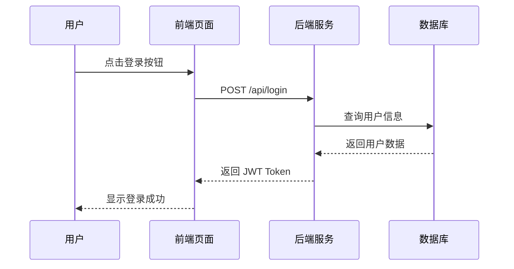

# 代码块

## 常规代码块

本博客对 Hugo 默认代码块做了大量定制，支持以下功能：

- **语法高亮**：使用 Hugo 内置 Chroma 引擎，风格为 `github`，支持几乎所有主流语言（Python、Java、C、Go、HTML、YAML 等）；
- **语言标签**：代码框左上角自动显示语言名称（大写）；
- **语言元信息（元数据）**：可通过 `filename=` 属性自定义标签名；
- **复制按钮**：右上角有复制按钮，点击后显示"已复制！"反馈；
- **折叠/展开按钮**：折叠按钮（≥8 行或 ≥400px 自动折叠，可配置）；
- **折叠浮层**：折叠后底部显示半透明渐变遮罩 + 居中的展开按钮，悬停可见；
- **Hover 动效**：代码框整体有 hover 上浮 + 阴影增强效果；

````demo {title="常规代码块渲染展示", render="markdown"}
```python {filename="hello.py"}
print("Hello World!")
```
````

## Output 代码

特殊类型代码框，用 `output` 作为语言标识，专门用于展示程序输出结果：

- **折叠箭头**：头部显示收起/展开箭头，默认折叠；
- **无语法高亮**：输出文本黑白显示，无语法着色（作为特殊输出效果）；
- **自动合并**：当 output 代码框紧跟在常规代码框之后时，二者边框会融为一体，展现为"代码+输出"的连续视觉效果。

````demo {title="Output 附着展示案例",render="Mermaid"}
```python
def bubble_sort(arr):
    """
    冒泡排序：每一轮将最大的元素“浮”到末尾。
    """
    n = len(arr)
    for i in range(n):
        swapped = False
        for j in range(0, n - i - 1):
            if arr[j] > arr[j + 1]:
                arr[j], arr[j + 1] = arr[j + 1], arr[j]
                swapped = True
        if not swapped:
            break
    return arr

original = [64, 34, 25, 12, 22, 11, 90]
sorted_list = bubble_sort(original.copy())
print("排序后列表:", sorted_list)
```
```output
原始列表: [64, 34, 25, 12, 22, 11, 90]
排序后列表: [11, 12, 22, 25, 34, 64, 90]
```
````


## Mermaid 代码块

与 Hugo 默认的 mermaid 实现不同，本博客对渲染流程做了从零重写：

- **Hugo 默认方案**：将所有 mermaid 代码块丢给客户端 `mermaid.run()` 一次性渲染，切换暗色模式时无法重绘，图表颜色卡死。

- **本博客方案**：

  - 渲染钩子 `render-codeblock-mermaid.html` 为每个 mermaid 代码块单独生成容器，带独立 ID 和完整工具栏；

  - `mermaid.html` 使用 ES Module 动态加载 Mermaid.js，按当前主题实时初始化，监听 `themeChanged` 事件自动重绘——暗色/亮色切换时图表颜色即时同步；

  - 原始代码存在 `data-mermaid-source` 隐藏 textarea 中，确保代码视图可以无损还原。


-  **交互工具栏**：

默认显示四个按钮：

| 按钮     | 功能                               |
| -------- | ---------------------------------- |
| **Code** | 切换到源代码视图，可编辑后重新渲染 |
| **Save** | 下载 SVG 文件                      |
| **Copy** | 复制 SVG 到剪贴板                  |
| **Zoom** | 全屏查看图表                       |

切换到代码视图后，工具栏变为另外四个按钮：**Render**（回到图表）、**Collapse**（折叠长代码，如果代码过长的话）、**Copy**（复制源码）。

````demo

````

