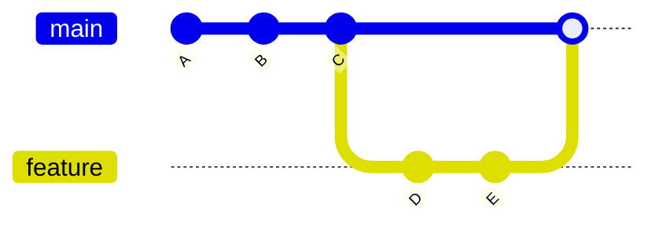
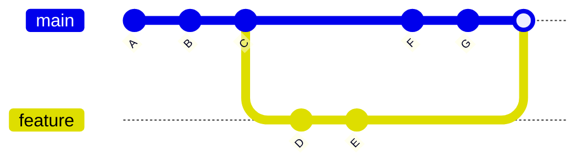
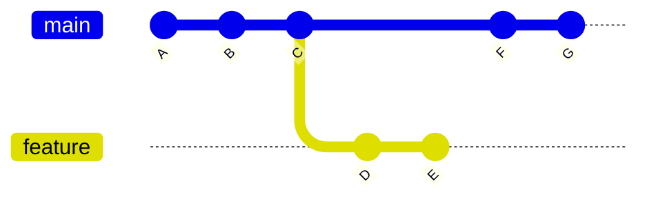
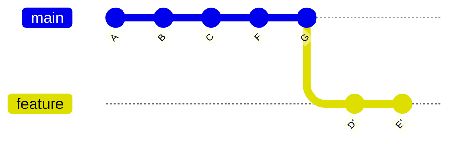

# 分支模型合并变基与冲突处理

## 分支命名与生命周期

分支是 Git 协作的核心。一个稳定项目通常会区分**长期分支**和**短期分支**。

- 常见**长期分支**：

| 分支 | 作用 |
| --- | --- |
| `main` | 可发布、可部署的稳定主线 |
| `develop` | 集成开发分支，适用于 Git Flow |
| `release/x.y` | 发布准备分支，用于冻结功能和修复发布问题 |
| `hotfix/x.y.z` | 生产紧急修复分支 |

- 常见**短期分支**：

| 分支前缀 | 示例 | 作用 |
| --- | --- | --- |
| `feature/` | `feature/login` | 新功能开发 |
| `fix/` | `fix/token-expired` | 缺陷修复 |
| `docs/` | `docs/api-guide` | 文档修改 |
| `refactor/` | `refactor/user-module` | 重构 |
| `chore/` | `chore/update-deps` | 工程维护 |

创建并切换分支：

```bash
git switch -c feature/login
```

基于指定分支创建：

```bash
git fetch origin
git switch -c hotfix/session-timeout origin/main
```

删除已合并本地分支：

```bash
git branch -d feature/login
```

强制删除本地分支：

```bash
git branch -D feature/abandoned
```

删除远程分支：

```bash
git push origin --delete feature/login
```

## 合并分支（merge）与变基分支（rebase）

### 合并分支

合并会把另一个分支的历史整合到当前分支。先切到目标分支，再执行 merge：

```bash
git switch main
git merge feature/login
```

常用参数：

| 参数 | 作用 |
| --- | --- |
| `--no-ff` | 即使可以快进，也创建合并提交 |
| `--ff-only` | 只允许快进合并，否则失败 |
| `--squash` | 把来源分支变更压成暂存区改动，不保留其提交结构 |
| `--abort` | 合并冲突或失败后中止合并 |

- **快进合并不会产生新的合并提交**，目标分支引用直接移动到来源分支提交。



- **非快进合并会创建一个具有多个父提交的合并提交**，更能保留“某个功能分支被合入”的上下文。



在团队主干上，常见策略是 Pull Request 页面选择 squash merge、rebase merge 或 merge commit。选择标准应写入贡献指南。

### 变基分支

`rebase` 的作用是把当前分支上的提交“移植”到新的基底上。典型场景：功能分支开发期间，主线已经前进，需要把功能分支更新到最新主线后再提交审查。

```bash
git switch feature/login
git fetch origin
git rebase origin/main
```

如果发生冲突，解决文件后执行：

```bash
git add <resolved-file>
git rebase --continue
```

放弃变基：

```bash
git rebase --abort
```

跳过当前提交：

```bash
git rebase --skip
```

交互式变基可整理本地提交：

```bash
git rebase -i HEAD~5
```

常见指令：

| 指令 | 含义 |
| --- | --- |
| `pick` | 保留提交 |
| `reword` | 修改提交说明 |
| `edit` | 停在该提交以便修改内容 |
| `squash` | 合并到前一个提交，并编辑说明 |
| `fixup` | 合并到前一个提交，丢弃该提交说明 |
| `drop` | 删除提交 |

原则：已经推送到共享分支并被他人基于其开发的提交，不应随意 rebase。rebase 会重写提交 ID，可能导致他人历史分叉。

- **rebase 前**：



- **rebase 后**：



### merge 与 rebase 的选择

- `merge` 保留真实分支拓扑，适合体现并行开发和集成节点；
- `rebase` 生成更线性的历史，适合在合并前整理个人功能分支。

推荐实践：

| 场景 | 推荐策略 |
| --- | --- |
| 本地功能分支同步主线 | `git rebase origin/main` |
| 公共长期分支整合发布分支 | `git merge --no-ff` |
| Pull Request 合入小型功能 | squash merge |
| 需要保留完整功能提交历史 | merge commit |
| 需要严格线性历史 | rebase merge 或 fast-forward only |

## 冲突的产生与处理

冲突通常发生在两个分支修改同一文件相近位置，Git 无法自动判断应保留哪一方。冲突文件会出现标记：

```text
<<<<<<< HEAD
current branch content
=======
incoming branch content
>>>>>>> feature/login
```

其中 `HEAD` 表示当前分支内容，分隔线下方表示被合并或被变基提交的内容。

### 冲突处理流程

合并冲突流程：

```bash
git merge feature/login
git status
```

打开冲突文件，编辑为最终内容，然后：

```bash
git add src/auth/login.ts
git merge --continue
```

某些 Git 版本中合并继续可直接使用：

```bash
git commit
```

变基冲突流程：

```bash
git rebase origin/main
git status
```

解决后：

```bash
git add src/auth/login.ts
git rebase --continue
```

查看冲突双方版本：

```bash
git checkout --ours src/auth/login.ts
git checkout --theirs src/auth/login.ts
```

- 在 merge 中，`ours` 是当前分支，`theirs` 是被合并分支。
- 在 rebase 中，由于 Git 正在把提交逐个应用到新基底上，语义容易让人误解，使用前应通过 `git status` 和冲突内容确认。

### rerere 复用冲突解决方案

`rerere` 表示 reuse recorded resolution。开启后，Git 会记录冲突解决方式，当同类冲突再次出现时尝试自动复用。

```bash
git config --global rerere.enabled true
```

适用于长期维护分支反复 cherry-pick、release 分支多次回合主线等场景。

### cherry-pick 精准搬运提交

把某个提交应用到当前分支：

```bash
git cherry-pick <commit>
```

常用参数：

| 参数 | 作用 |
| --- | --- |
| `-x` | 在提交说明中记录来源提交 ID，适合维护分支 |
| `--no-commit` | 应用变更但不立即提交 |
| `--continue` | 冲突解决后继续 |
| `--abort` | 放弃 cherry-pick |

维护 release 分支时，建议使用：

```bash
git cherry-pick -x <fix-commit>
```

这样后续审计可以知道修复来自哪个主线提交。
