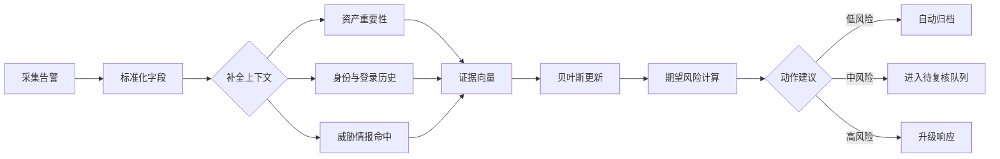

告警排查最容易陷入两种极端：要么完全凭经验挑最像问题的告警，要么把所有规则分数机械相加。前者难以复盘，后者容易把噪声伪装成精确。一个折中的办法是把排查过程写成概率更新：每条证据只改变我们对事件的相信程度，而不是直接宣布结论。

这篇文章记录一个小模型：用贝叶斯更新融合证据，用代价函数排序，再用轻量代码把结果落成可重复的流水线。

## 证据与后验概率

设事件 $A$ 表示“该告警确实需要人工处理”，证据集合为 $E=\{e_1,e_2,\dots,e_n\}$。最朴素的写法是：

<div class="math-display">$$\begin{aligned} P(A \mid E) &= \frac{P(E \mid A)P(A)}{P(E \mid A)P(A) + P(E \mid \neg A)P(\neg A)} \end{aligned}$$</div>

如果暂时假设证据之间在给定事件状态后条件独立，可以把似然拆开：

<div class="math-display">$$\begin{aligned} \log \frac{P(A \mid E)}{P(\neg A \mid E)} &= \log \frac{P(A)}{P(\neg A)} + \sum_{i=1}^{n}\log \frac{P(e_i \mid A)}{P(e_i \mid \neg A)} \end{aligned}$$</div>

这个形式很适合工程实现，因为每条证据都可以被解释为一段 log odds 增量。比如“命中高置信 IOC”“源主机最近有异常登录”“目标端口暴露在公网”都只是把分数向上或向下推一点。

## 排序不是只看概率

只看后验概率还不够。一个低概率但高损失的事件，可能比一个高概率但低影响的事件更应该排在前面。可以定义期望风险：

<div class="math-display">$$\begin{aligned} R(a, x) &= \mathbb{E}[L(a, Y) \mid x] = \sum_{y \in \{0,1\}} L(a, y)P(Y=y \mid x) \end{aligned}$$</div>

其中 $a$ 是动作，$Y=1$ 表示真实事件，$x$ 是告警上下文。若动作集合为 $\{\text{ignore}, \text{review}, \text{escalate}\}$，可以选风险最小的动作：

<div class="math-display">$$\begin{aligned} a^\* &= \arg\min_{a \in \mathcal{A}}\left[L(a,1)P(Y=1\mid x) + L(a,0)(1-P(Y=1\mid x)) + C(a)\right] \end{aligned}$$</div>

再加入时效衰减和资产权重，得到一个排序分数：

<div class="math-display">$$\begin{aligned} \operatorname{score}(x,t) &= \sigma\left(\beta_0 + \mathbf{w}^{\mathsf T}\mathbf{x} + \gamma \log(1 + v_{\text{asset}}) + \lambda e^{-\Delta t / \tau}\right)\cdot\left(1+\alpha \cdot \operatorname{impact}(x)\right) \end{aligned}$$</div>

这里 $\sigma(z)=\frac{1}{1+e^{-z}}$，$\Delta t$ 是距离首次出现的时间，$\tau$ 控制新鲜度衰减速度。

## 一段最小实现

下面的 Python 代码演示如何把证据转换成 log odds，并输出概率与排序分数。

```python
from __future__ import annotations

from dataclasses import dataclass
from math import exp, log


@dataclass(frozen=True)
class Evidence:
    name: str
    likelihood_if_true: float
    likelihood_if_false: float

    @property
    def log_likelihood_ratio(self) -> float:
        return log(self.likelihood_if_true / self.likelihood_if_false)


def sigmoid(value: float) -> float:
    return 1 / (1 + exp(-value))


def posterior_probability(prior: float, evidence: list[Evidence]) -> float:
    odds = log(prior / (1 - prior))
    for item in evidence:
        odds += item.log_likelihood_ratio
    return sigmoid(odds)


def priority_score(probability: float, asset_value: float, impact: float, age_minutes: int) -> float:
    freshness = exp(-age_minutes / 240)
    return probability * (1 + 0.35 * asset_value) * (1 + 0.5 * impact) * (0.8 + freshness)


if __name__ == "__main__":
    evidence = [
        Evidence("high_confidence_ioc", 0.72, 0.08),
        Evidence("rare_parent_process", 0.46, 0.18),
        Evidence("recent_failed_logons", 0.38, 0.21),
    ]

    probability = posterior_probability(prior=0.12, evidence=evidence)
    score = priority_score(probability, asset_value=0.8, impact=0.9, age_minutes=35)

    print(f"posterior={probability:.3f}")
    print(f"score={score:.3f}")
```

这段实现刻意保持小而透明。实际系统里可以把每条证据的似然来自历史数据、专家配置或模型校准结果，但最终都应该能解释为“它为什么把告警往前排”。

## 流水线

一个可落地的处理流程大致如下：



这张图的关键不是流程多复杂，而是每一步都能留下中间产物。只要能回放证据向量和模型输出，后续就能检查某次排序到底是数据问题、权重问题，还是规则本身需要调整。

## 校准与复盘

概率模型最怕“分数看起来像概率，但其实没有校准”。可以用 Brier score 评估：

$$\begin{aligned} \operatorname{Brier} &= \frac{1}{N}\sum_{i=1}^{N}(p_i-y_i)^2 \end{aligned}$$

## 二级标题

111

### 三级标题

#### 四级标题

也可以把预测概率分桶，比较每个桶里的真实命中率：

$$\begin{aligned} \operatorname{ECE} &= \sum_{m=1}^{M}\frac{|B_m|}{N}\left|\operatorname{acc}(B_m)-\operatorname{conf}(B_m)\right| \end{aligned}$$

> **注**：哈哈*测试一下*

如果一个模型总是把事件报成 $0.9$，但同一桶里的真实命中率只有 $0.55$，它就不适合作为“概率”直接进入风险公式。此时应该先做校准，再谈自动化。

## 小结

告警优先级不是一个单纯的排序问题，而是一个证据、概率、代价和流程共同作用的问题。把公式、代码和流程图都写下来，最大的好处是能复盘：每一次误判都可以追到具体证据、权重或动作成本，而不是停留在“感觉这条规则不准”。
