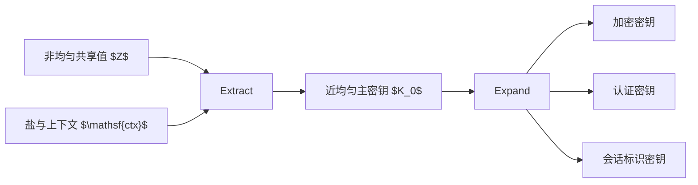

# 熵与随机提取

格基 KEM 的最终输出通常是一段会话密钥 $K$。这段密钥应当对攻击者近似均匀、不可预测，并且能够安全用于后续对称加密或认证协议。然而，方案内部得到的共享值未必天然均匀：它可能来自带噪线性结构，可能经过压缩协调，可能受到公开提示影响，也可能在失败事件条件化后产生偏差。

因此，仅仅说“底层 LWE 困难”并不足以解释最终密钥为什么安全。我们还需要回答：

- 内部共享值还剩多少不确定性；
- 攻击者看到公钥、密文、上下文和泄漏后，这种不确定性还剩多少；
- KDF 或提取器如何把非均匀输入整理成近似均匀密钥；
- 多会话、多用户和侧信道是否会逐步消耗这些随机性。

熵理论与随机提取正是用来回答这些问题的工具。

## Shannon 熵、碰撞熵与最小熵

**Shannon 熵**是最经典的熵概念。对离散随机变量 $X$，其 Shannon 熵定义为：
$$
H(X):=-\sum_x\Pr[X=x]\log\Pr[X=x].
$$

它描述平均意义下的不确定性。若 $X$ 在大小为 $M$ 的集合上均匀分布，则 $H(X)=\log M$；若某些值出现概率较高，熵会下降。Shannon 熵在信息论中非常自然，但在密码学中，平均不确定性有时不够保守。

**碰撞熵**与碰撞概率相关。碰撞概率定义为：
$$
\operatorname{cp}(X):=\Pr[X=X'],
$$

其中 $X'$ 是与 $X$ 独立同分布的副本。展开可得：

$$
\operatorname{cp}(X)=\sum_x\Pr[X=x]^2.
$$

碰撞熵可写为：

$$
H_2(X):=-\log\operatorname{cp}(X).
$$

它衡量两次独立采样得到相同值的可能性，在哈希、全域散列和二阶矩分析中经常出现。

**最小熵**是密码学中尤其重要的概念。它定义为：
$$
H_\infty(X):=-\log\left(\max_x\Pr[X=x]\right).
$$

最小熵直接刻画攻击者一次猜测 $X$ 的最大成功概率。若 $H_\infty(X)=h$，则最可能值的概率为 $2^{-h}$。因此，最小熵比 Shannon 熵更关注最坏情况。

一个变量可以有较高 Shannon 熵，但最小熵很低。例如，设 $X$ 以概率 $1/2$ 取 $0$，以概率 $1/2$ 在 $2^{100}$ 个值中均匀取值。它的 Shannon 熵仍然不小，但攻击者猜 $0$ 就有 $1/2$ 成功率，最小熵只有 $1$。这样的变量显然不能直接作为高安全级别密钥。

在格基 KEM 中，内部共享值可能不是均匀分布。即使攻击者无法恢复秘密，也不意味着共享值每个可能取值都接近均匀。因此，最终会话密钥通常需要经过 $\mathsf{KDF}$ 或哈希处理。熵分析要回答的是：在攻击者观察到所有公开信息后，KDF 输入还剩多少不可预测性。

三种熵之间通常满足如下直观关系：

$$
H_\infty(X)\leq H_2(X)\leq H(X).
$$

所以，若能证明最小熵高，通常更贴近密码安全需求；若只知道 Shannon 熵高，还需要额外小心。

>[!ANNOT]
>不要把“取值空间很大”当成“安全”。若分布高度偏斜，攻击者会优先猜测高概率值。密码密钥需要的是接近均匀，或者至少具有足够最小熵的输入，再通过提取获得近似均匀输出。

## 条件熵与侧信息

攻击者并不是在真空中猜测秘密。它通常知道公钥 $\mathsf{pk}$、密文 $\mathsf{ct}$、协议上下文 $\mathsf{ctx}$、压缩提示、算法标识、失败行为，甚至可能观察侧信道泄漏。因此，真正重要的是条件熵：**在攻击者已知侧信息之后，目标变量还剩多少不确定性**。

条件 Shannon 熵写作 $H(X\mid Y)$，表示已知 $Y$ 后 $X$ 的平均剩余不确定性。对密码应用而言，更常用的是条件最小熵。一个常见表达是：

$$
H_\infty(X\mid Y):=-\log\left(\mathbb{E}_{y\leftarrow Y}\left[\max_x\Pr[X=x\mid Y=y]\right]\right).
$$

它的直观含义是：**攻击者看到 $Y$ 后，对 $X$ 做最佳一次猜测的平均成功能力。**平均条件最小熵 $\widetilde{H}_\infty(X\mid Y)$ 适合描述侧信息随机变化时的平均猜测能力。光滑最小熵则允许忽略小概率坏事件。如果某些极端情况概率很低但会显著降低最小熵，光滑化可以给出更符合密码证明需求的度量。

在格基 KEM 中，侧信息 $Y$ 可能包含：

$$
Y=(\mathsf{pk},\mathsf{ct},\mathsf{ctx},\mathsf{tag}_{\rm dom},E_{\rm leak}).
$$

其中 $E_{\rm leak}$ 可抽象表示实现泄漏、失败返回、计时信息或其他辅助信息。最终希望证明 KDF 输入 $Z$ 在给定 $Y$ 后仍具有足够熵，或者在计算意义上无法从 $Y$ 区分 $Z$ 与随机量。

公开信息不一定造成同等数量的熵损失：

- 若公开一个与 $X$ 独立的随机值，通常不会降低 $X$ 的条件熵；
- 若公开 $X$ 的一部分，会损失对应信息量；
- 若公开一个复杂函数 $f(X)$，损失取决于该函数对 $X$ 的约束强度；
- 若公开信息长度为 $\ell$ 比特，最坏情况下可能损失至多 $\ell$ 比特最小熵，但实际损失可能更小。

链式思想常用于泄漏分析。若依次泄漏 $Y_1,\ldots,Y_t$，应分析：

$$
H_\infty(X\mid Y_1,\ldots,Y_t).
$$

不能只看单次泄漏。多次会话、多次解封装失败、多次错误消息和多条侧信道轨迹都可能累积信息。后量子协议部署中，多用户、多会话场景尤其需要这一点。

>[!ANNOT]
>条件熵的方向必须写清楚。$H_\infty(K\mid \mathsf{ct})$ 表示攻击者看到密文后密钥的剩余不可预测性；$H_\infty(\mathsf{ct}\mid K)$ 是另一个完全不同的问题。

## 互信息与泄漏累积

互信息衡量两个随机变量之间共享的信息量。它定义为：

$$
I(X;Y):=H(X)-H(X\mid Y).
$$

若 $X$ 与 $Y$ 独立，则 $I(X;Y)=0$；若 $Y$ 完全决定 $X$，则互信息等于 $H(X)$。互信息适合描述平均泄漏，但它不直接等同于最小熵损失，因此在密码安全中通常作为辅助工具。

互信息也可以用 KL 散度表示：

$$
I(X;Y)=D_{\rm KL}(P_{X,Y}\|P_XP_Y).
$$

这说明互信息衡量联合分布与独立乘积分布之间的差异。如果 $P_{X,Y}=P_XP_Y$，则二者独立，互信息为 $0$。

在格基协议中，泄漏往往是累积的。设攻击者观察到 $Y_1,\ldots,Y_t$，则互信息有链式分解：

$$
I(X;Y_1,\ldots,Y_t)=\sum_{i=1}^{t}I(X;Y_i\mid Y_1,\ldots,Y_{i-1}).
$$

这表达了一个重要事实：第 $i$ 次观察带来的新增信息，应在已经知道前面所有观察的条件下计算。即使每次泄漏很小，只要会话次数足够多，总泄漏也可能不可忽略。

Fano 不等式把恢复错误率与条件熵联系起来。直观地说，如果攻击者能以很高概率恢复 $X$，那么 $H(X\mid Y)$ 必然较小；反过来，若条件熵很大，攻击者的恢复错误率就不能太低。Fano 不等式常用于信息论下界和攻击能力分析。

Pinsker 不等式把 KL 散度与总变差距离联系起来：

$$
\Delta(P,Q)\leq\sqrt{\frac{1}{2}D_{\rm KL}(P\|Q)}.
$$

这意味着，**如果通过互信息或 KL 散度证明两个分布接近独立，可以进一步得到统计区分优势上界。**对格基加密而言，这类桥梁工具常用于把解析信息量界转化为安全实验中的优势界。

不过，互信息小并不自动保证每个具体取值都难猜。某些分布可能平均泄漏少，但存在少量侧信息取值会让秘密几乎暴露。若这些坏侧信息概率不可忽略，就会破坏密码安全。因此，实际密钥提取证明通常更偏向条件最小熵和光滑最小熵。

## 全域哈希与随机提取器

随机提取器的目标，是从非均匀但仍有足够熵的输入中提取接近均匀的输出。全域哈希族是构造提取器的经典工具。一个哈希族 $\mathcal{H}$ 若满足对任意 $x\neq x'$：

$$
\Pr_{h\leftarrow\mathcal{H}}[h(x)=h(x')]\leq \frac{1}{|\mathcal{Y}|},
$$

则称为全域哈希族，其中 $\mathcal{Y}$ 是输出空间。若哈希种子公开后，输出仍能与均匀随机量一起保持接近，则称为强提取。

剩余哈希引理是密码学中极其重要的定理。粗略地说，若 $X$ 至少有 $h$ 比特最小熵，选择全域哈希 $h_{\rm hash}$ 把 $X$ 压缩到 $\ell$ 比特，且 $\ell$ 比 $h$ 小足够多，则输出接近均匀。典型形式可写为：

$$
\Delta\left((h_{\rm hash},h_{\rm hash}(X)),(h_{\rm hash},U_\ell)\right)\leq \varepsilon,
$$

其中 $U_\ell\xleftarrow{\$}\{0,1\}^{\ell}$。常见参数关系为：

$$
\ell\leq H_\infty(X)-2\log\frac{1}{\varepsilon}.
$$

这个公式表达了提取的代价：若希望统计误差 $\varepsilon$ 很小，就必须额外牺牲约 $2\log(1/\varepsilon)$ 比特熵。

在 KEM 中，内部共享值 $Z$ 经常通过哈希或 KDF 得到最终密钥：

$$
K:=\mathsf{KDF}(Z,\mathsf{ctx}).
$$

如果把 $\mathsf{KDF}$ 理想化为随机预言机，证明常从计算不可区分角度说明 $K$ 对攻击者随机；如果使用信息论提取框架，则需要说明 $Z$ 在给定侧信息后具有足够条件最小熵，并使用剩余哈希引理或其变体。

全域哈希和实际 KDF 并不完全相同。实际 KDF 通常同时承担多个工程任务：

- 从非均匀输入中提取密钥材料；
- 扩展多个子密钥；
- 绑定协议上下文；
- 做域分离；
- 绑定 transcript 或算法标识。

理论上应区分 $\mathsf{Extract}$ 与 $\mathsf{Expand}$。前者处理非均匀输入，后者从均匀或伪随机主密钥派生多个用途的密钥。

>[!ANNOT]
>KDF 不能把完全可预测的输入变成安全密钥。它能做的是：在输入仍具有足够熵或计算不可预测性的前提下，将其整理为适合协议使用的密钥材料。

## 量子侧信息下的提取

后量子密码学允许攻击者使用量子计算。即便协议消息是经典的，攻击者也可能持有与秘密相关的量子侧信息。因此，经典条件最小熵和经典剩余哈希引理需要推广。

量子侧信息可抽象为系统 $E$。目标变量 $X$ 是经典随机变量，攻击者持有量子状态 $\rho_E^x$。整体状态可写成经典-量子形式：

$$
\rho_{XE}=\sum_x P_X(x)|x\rangle\langle x|\otimes \rho_E^x.
$$

量子条件最小熵 $H_{\min}(X\mid E)$ 刻画攻击者在持有量子系统 $E$ 时猜测 $X$ 的能力。它的直观含义仍然是“给定侧信息后的最大猜测概率”，只是攻击者可以先对量子系统进行最优测量。

量子剩余哈希引理说明，全域哈希仍可在量子侧信息存在时提取随机性。粗略地说，若 $H_{\min}(X\mid E)$ 足够大，则公开选择的全域哈希种子与哈希输出对攻击者来说仍接近均匀。这对后量子 KEM 的理论基础非常重要。

需要注意，量子侧信息下的提取与 QROM 证明不是同一个问题：

- 量子侧信息提取关注攻击者持有量子辅助信息时，如何从经典变量中提取密钥；
- QROM 证明关注攻击者能以叠加方式查询随机预言机时，证明者如何模拟或编程哈希。

二者有关联，但不能混为一谈。

本书后续涉及 QPT 对手、QROM 和 measure-and-reprogram 技术时，会继续使用本节语言。此处读者只需掌握一个原则：若安全目标明确允许量子攻击者，就不能默认所有经典提取定理自动适用，必须使用量子安全版本或说明模型限制。

## 密钥材料的熵账本

熵工具最终要落到密钥材料分析上。对于一个格基 KEM，建议建立如下熵账本：

| 项目 | 记号 | 需要说明的问题 |
| :--- | :--- | :--- |
| 原始共享值 | $Z$ | 来源于何种 LWE/MLWE 结构 |
| 攻击者侧信息 | $Y$ | 包括 $\mathsf{pk},\mathsf{ct},\mathsf{ctx}$ 与泄漏 |
| 条件熵 | $H_\infty(Z\mid Y)$ | 是否足够支撑目标密钥长度 |
| 失败事件 | $E_{\rm fail}$ | 条件化后是否改变分布 |
| 提取输出 | $K$ | 是否接近均匀或计算伪随机 |
| 统计误差 | $\varepsilon_{\rm ext}$ | 如何进入最终安全界 |

{tableMode="stretch"}

如果最终密钥长度为 $\ell_K$，而希望提取误差为 $\varepsilon_{\rm ext}$，则需要保守检查输入剩余熵是否显著超过 $\ell_K$。若使用剩余哈希引理，常见形式要求：

$$
\ell_K\leq H_\infty(Z\mid Y)-2\log\frac{1}{\varepsilon_{\rm ext}}.
$$

实际 KEM 证明不一定直接使用这种信息论提取框架，也可能依赖随机预言机和 LWE 计算不可区分性。但无论采用何种证明路线，都应明确回答：最终密钥为什么可以看作随机？

常见答案可能是：

- 输入有足够条件最小熵，并由提取器输出近均匀密钥；
- 某个游戏中哈希输入对攻击者不可预测，随机预言机在未查询点输出均匀；
- 底层 LWE 替换后，共享值与攻击者视图计算不可区分。

解密失败会影响熵账本。若失败事件发生时，解封装输出替代密钥或错误标志，攻击者可能通过观察行为获得关于秘密的信息。CCA 变换通常通过重加密检查、隐式拒绝和哈希绑定来控制这一风险，但证明中仍必须把失败概率和错误处理纳入安全账本。

常见错误包括：

- 把 LWE 困难性直接等同于共享值均匀；
- 认为哈希后任何输入都安全；
- 忽略公开提示对熵的损失；
- 忽略多会话泄漏累积；
- 混淆统计提取和计算伪随机；
- 没有说明量子侧信息模型。
