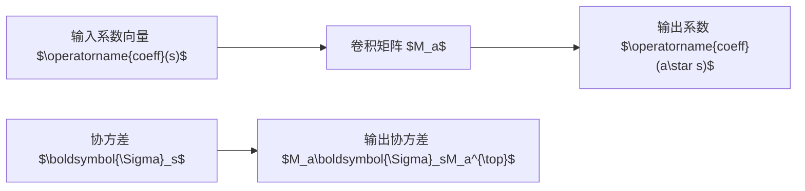

# 高维随机性

格基密码学天生是高维的。LWE 秘密是向量，MLWE 对象是环元素向量，RLWE 对象虽然常写作多项式，但本质上也可以看作高维系数向量。噪声也不再是一个数，而是向量、矩阵、环卷积结果，或多个实例共同组成的随机结构。

高维随机性研究的正是这些对象在范数、方向、谱性质和相关结构上的行为。低维直觉在高维空间中经常失效，例如：

- 单个坐标很小，不代表所有坐标都小；
- 高维随机向量的长度往往高度集中；
- 矩阵条目独立，不代表矩阵作为线性映射没有异常方向；
- 环乘法会在输出系数之间引入结构性相关。

本章目标，是为后续格基加密参数分析、噪声传播和随机矩阵估计准备基础语言。

## 随机向量与协方差矩阵

随机向量是由多个随机变量组成的向量。若 $\mathbf{X}=(X_1,\ldots,X_n)^{\top}$，则其均值向量定义为：

$$
\mathbb{E}[\mathbf{X}]:=(\mathbb{E}[X_1],\ldots,\mathbb{E}[X_n])^{\top}.
$$

协方差矩阵定义为：

$$
\boldsymbol{\Sigma}:=\mathbb{E}\left[(\mathbf{X}-\mathbb{E}[\mathbf{X}])(\mathbf{X}-\mathbb{E}[\mathbf{X}])^{\top}\right].
$$

矩阵第 $(i,j)$ 项为 $\operatorname{Cov}(X_i,X_j)$。其中：

- 对角项描述单个坐标的方差；
- 非对角项描述两个坐标之间的线性相关；
- 若所有坐标独立且方差为 $\sigma^2$，则 $\boldsymbol{\Sigma}=\sigma^2\mathbf{I}_n$。

协方差矩阵在线性变换下有简单规律。若 $\mathbf{Y}:=\mathbf{A}\mathbf{X}$，且 $\mathbf{A}$ 是确定矩阵，则：

$$
\mathbb{E}[\mathbf{Y}]=\mathbf{A}\mathbb{E}[\mathbf{X}],
$$

$$
\operatorname{Cov}(\mathbf{Y})=\mathbf{A}\boldsymbol{\Sigma}\mathbf{A}^{\top}.
$$

这对格基加密非常重要，因为 LWE 样本、加密密文和噪声传播都包含矩阵乘法。若 $\mathbf{e}$ 是独立同方差误差向量，则 $\mathbf{A}\mathbf{e}$ 的协方差由 $\mathbf{A}\mathbf{A}^{\top}$ 控制。矩阵的谱性质会影响噪声在不同方向上的放大程度。

在 MLWE/RLWE 中，环元素 $a(X)=\sum_i a_iX^i$ 可通过系数向量 $\operatorname{coeff}(a)$ 表示。环乘法 $a\star s$ 对应某种结构矩阵作用在 $\operatorname{coeff}(s)$ 上。以负循环卷积为例，一个环元素对应的乘法矩阵具有循环结构。即使输入系数独立，输出系数也可能相关，因为不同输出坐标共享输入系数。

协方差只能描述二阶相关，不能完全刻画分布。例如，两个随机向量可能有相同协方差矩阵，但尾部行为完全不同。尽管如此，它仍是识别噪声规模、主方向和相关结构的第一步。

>[!ANNOT]
>在高维分析中，不应只问“每个坐标方差是多少”，还应问“不同坐标是否相关”“哪些方向方差更大”“线性变换后协方差如何变化”。这些问题直接影响解密失败率和攻击分析。

## 亚高斯变量与高维范数

亚高斯变量是尾部不超过高斯量级的随机变量。直观地说，若 $X$ 以 $0$ 为中心，并且存在参数 $\tau^2$，使得对所有实数 $t$ 有：

$$
\mathbb{E}[e^{tX}]\leq \exp\left(\frac{\tau^2t^2}{2}\right),
$$

则 $X$ 可视为亚高斯变量。由此可推出尾界：

$$
\Pr[|X|\geq u]\leq 2\exp\left(-\frac{u^2}{2\tau^2}\right).
$$

许多格基密码常用噪声都是亚高斯，或可由亚高斯界控制。例如有界中心分布、中心二项分布和离散 Gaussian 都具有较好的尾部。亚高斯性使我们能够从一维尾界推广到向量范数和线性投影。

随机向量 $\mathbf{X}$ 称为亚高斯向量，通常意味着对任意单位向量 $\mathbf{u}$，投影 $\langle\mathbf{u},\mathbf{X}\rangle$ 都是亚高斯变量。这比逐坐标亚高斯更强，因为它控制所有方向上的波动。格基加密中的许多安全分析需要考虑攻击者选择的方向，因此所有方向的投影都很重要。

高维随机向量的长度具有集中现象。若 $X_i$ 独立、均值为 $0$、方差为 $\sigma^2$，则：

$$
\mathbb{E}[\|\mathbf{X}\|_2^2]=n\sigma^2.
$$

因此，典型 $\ell_2$ 长度约为 $\sigma\sqrt{n}$。这与单坐标规模 $\sigma$ 不同。初学者常犯的错误是：看到每个坐标很小，就忽略维度累积导致的整体范数增长。

对于 $\ell_\infty$ 范数，若每个坐标满足亚高斯尾界，则 union bound 给出：

$$
\Pr[\|\mathbf{X}\|_\infty\geq u]\leq \sum_{i=1}^n\Pr[|X_i|\geq u].
$$

若每个坐标尾部为 $2\exp(-u^2/(2\tau^2))$，则：

$$
\Pr[\|\mathbf{X}\|_\infty\geq u]\leq 2n\exp\left(-\frac{u^2}{2\tau^2}\right).
$$

这说明最大坐标通常比单坐标标准差多一个 $\sqrt{\log n}$ 因子。若解密正确性要求每个系数都不过界，就必须考虑这种维度放大。

在格基 KEM 中，正确性条件有时以 $\ell_\infty$ 形式出现，因为每个系数都需要正确解码；安全证明或几何分析则可能使用 $\ell_2$ 范数，因为格问题、Gaussian 质量和短向量通常以欧氏范数表达。读者应熟悉两种范数之间的转换：

$$
\|\mathbf{x}\|_\infty\leq \|\mathbf{x}\|_2\leq \sqrt{n}\|\mathbf{x}\|_\infty.
$$

这组不等式简单但常用。它说明 $\ell_2$ 控制可以推出 $\ell_\infty$ 控制，但可能损失 $\sqrt{n}$；反过来，坐标最大值控制也可给出整体长度控制，并带来维度因子。

## 亚指数变量与二次型

亚高斯变量的乘积通常不再是亚高斯，而是亚指数。格基加密中的许多噪声项正是乘积和，例如 $\langle\mathbf{s},\mathbf{e}\rangle$、$\mathbf{e}^{\top}\mathbf{r}$ 或环卷积系数。因此，需要亚指数工具。

一个随机变量 $X$ 若尾部大致满足：

$$
\Pr[|X|\geq u]\leq 2\exp\left(-\frac{u}{K}\right)
$$

在较大 $u$ 范围内成立，则可视为亚指数型。亚指数尾部比亚高斯尾部重，但仍具有指数衰减。若 $S$ 和 $E$ 是独立亚高斯变量，则乘积 $SE$ 通常是亚指数变量。

考虑噪声内积：

$$
Z:=\sum_{i=1}^n S_iE_i.
$$

若 $S_i$ 和 $E_i$ 独立且以 $0$ 为中心，则每项 $S_iE_i$ 均值为 $0$，但尾部较重。对 $Z$ 的分析通常使用 Bernstein 型不等式或亚指数和的集中界，而不是直接套用 Hoeffding 或普通亚高斯投影界。

二次型在更复杂分析中出现。给定矩阵 $\mathbf{M}$ 和随机向量 $\mathbf{X}$，二次型为：

$$
Q:=\mathbf{X}^{\top}\mathbf{M}\mathbf{X}.
$$

Hanson-Wright 不等式控制亚高斯向量二次型偏离其期望的概率。粗略地，它表明偏离概率由两个矩阵量共同控制：

- $\|\mathbf{M}\|_{\rm F}$，即 Frobenius 范数，反映整体能量；
- $\|\mathbf{M}\|_2$，即谱范数，反映最坏方向。

二次型工具可用于分析随机矩阵能量、噪声相关性、某些攻击统计量和投影范数。不过它的前提严格：通常要求坐标独立、亚高斯且中心化。若变量来自环结构、共享秘密或拒绝采样后的条件分布，必须先确认这些前提是否仍成立。

>[!ANNOT]
>看到乘积项时，应立即警惕：它不再是普通小噪声，而可能具有不同尾部类型。格基加密的正确性分析经常卡在这里，不能用“每项都很小”替代乘积和的概率证明。

## 随机矩阵与谱范数

随机矩阵是高维概率的核心对象。格基加密中的公开矩阵 $\mathbf{A}$ 通常在 $\mathbb{Z}_q^{m\times n}$ 上均匀采样，或由种子展开。虽然算法在模空间中运行，但很多分析会把矩阵条目提升为整数或实数后研究其范数、奇异值和谱性质。

矩阵谱范数定义为：

$$
\|\mathbf{A}\|_2:=\sup_{\|\mathbf{x}\|_2=1}\|\mathbf{A}\mathbf{x}\|_2.
$$

它描述矩阵作为线性映射时，对向量长度的最大放大倍数。Frobenius 范数定义为：

$$
\|\mathbf{A}\|_{\rm F}:=\left(\sum_{i,j}A_{i,j}^2\right)^{1/2}.
$$

两者关注点不同：谱范数关心最坏方向，Frobenius 范数关心整体能量。随机矩阵理论常给出高概率界，说明独立条目随机矩阵的谱范数不会太大，或奇异值不会太异常。

矩阵 Bernstein 和矩阵 Hoeffding 是控制随机矩阵和的工具。若 $\mathbf{X}_1,\ldots,\mathbf{X}_N$ 是独立随机矩阵，且每个矩阵的谱范数受控，则可控制：

$$
\left\|\sum_i\mathbf{X}_i-\mathbb{E}\sum_i\mathbf{X}_i\right\|_2.
$$

这在分析随机采样矩阵、协方差矩阵和噪声传播时很有用。

对于 LWE/MLWE，公开矩阵 $\mathbf{A}$ 的主要安全作用由 LWE 假设承担，而不是由谱范数界直接保证。随机矩阵理论不能替代 LWE 困难性。但它可以辅助分析算法行为，例如噪声放大、陷门质量、采样稳定性和某些实现中的异常矩阵概率。

在模 $q$ 空间中，矩阵条目属于 $\mathbb{Z}_q$。若进行实数范数分析，需要明确采用何种代表元。通常可使用中心代表元 $\langle A_{i,j}\rangle_q$。不同代表元选择会影响范数数值，但不改变模线性关系。证明中必须说明这一点，否则容易混淆代数运算和实几何分析。

## $\epsilon$-net 与覆盖数

谱范数涉及所有单位方向：

$$
\|\mathbf{A}\|_2=\sup_{\|\mathbf{x}\|_2=1}\|\mathbf{A}\mathbf{x}\|_2.
$$

单位球面包含无穷多个方向，不能直接对所有方向使用 union bound。$\epsilon$-net 方法的思想是，用有限个点近似整个球面。若 $\mathcal{N}$ 是单位球面的 $\epsilon$-net，则每个单位向量都能找到 $\mathbf{y}\in\mathcal{N}$，使得 $\|\mathbf{x}-\mathbf{y}\|_2\leq\epsilon$。

覆盖数描述需要多少点才能覆盖高维球面。典型界为：单位球面存在大小不超过 $(1+2/\epsilon)^n$ 的 $\epsilon$-net。虽然这是指数大小，但取对数后只产生 $O(n)$ 项，常可与固定方向的指数尾界平衡。

使用 $\epsilon$-net 证明谱范数界的一般路线如下：

这个方法体现了高维概率的基本技巧：先证明固定方向的结论，再通过覆盖论推广到所有方向。没有 $\epsilon$-net，许多“对所有方向成立”的命题无法从一维尾界直接得到。

在格基密码中，$\epsilon$-net 思想可帮助理解为什么谱范数界、随机矩阵界和高维范数界常出现维度因子。它也提醒我们：从单个方向的安全或噪声界推广到攻击者可自适应选择方向时，必须支付覆盖或复杂度代价。

## 依赖随机变量的处理

高维随机性最危险的地方是依赖结构。许多漂亮的集中不等式都要求独立，但格基密码中的随机变量常常共享来源。依赖可能来自：

- 共享秘密；
- 共享随机种子；
- 环卷积；
- 压缩误差；
- 拒绝采样条件化；
- 多用户公共参数；
- 随机预言机查询历史。

处理依赖的第一步是画依赖图。依赖图中节点表示随机变量，边表示共享随机源或直接函数关系。没有边不必然意味着独立，但依赖图能帮助定位问题。

第二步是尝试条件化。许多复杂表达式在固定某些变量后会变成独立和。例如，$\sum_i S_iE_i$ 中若固定 $\mathbf{S}$，它就成为关于独立 $E_i$ 的加权和。条件化之后可以使用尾界，再对被固定变量的高概率好事件取并合或平均。

第三步是分块。若变量不能完全独立，但可以分成若干块，使块之间独立或弱相关，就可以先控制每块，再合并结果。环卷积分析中，有时可通过拆分索引集合减少共享项。

第四步是使用适合依赖的工具，例如鞅差、负相关、依赖图集中不等式或解耦不等式。这些工具比独立和尾界复杂，使用时必须明确前提。
