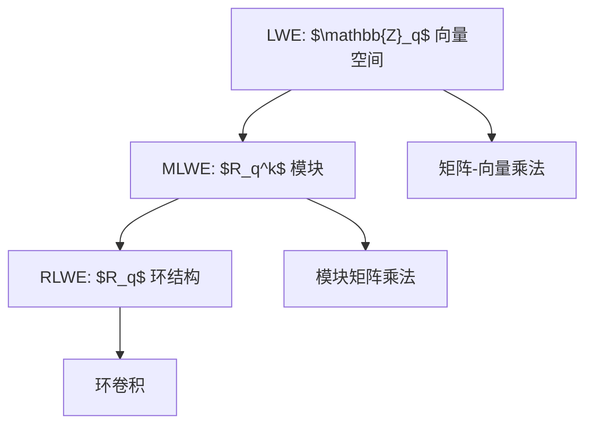
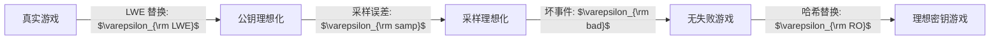

# 格基加密随机性账本

前几章分别介绍了随机变量、尾界、分布距离、熵与高维随机性。本章把这些工具收束到格基加密方案分析中。所谓“随机性账本”，是指在分析一个格基加密或 KEM 方案时，系统列出所有随机对象、分布来源、依赖关系、噪声表达式、失败事件、统计替换和安全损失。

它不是形式主义，而是一种防漏工具。很多初学者阅读格基加密论文时，会直接跳到 LWE 假设或安全游戏，却没有先弄清楚算法中每个量的来源。这容易导致三类问题：

- 误以为共享秘密的多个样本彼此独立；
- 解密失败率只凭直觉估计；
- 采样误差、压缩误差和多用户损失没有计入最终安全界。

本章的任务，是给出一套可复用的分析模板。后续看到任何 LWE/MLWE/RLWE 型方案，都可以先按这套账本拆解，再进入正确性和安全证明。

## LWE 型样本的概率建模

LWE 型样本是格基加密的基本构件。标准 LWE 形式中，取：

$$
\mathbf{a}_i\xleftarrow{\$}\mathbb{Z}_q^n,\quad
\mathbf{s}\leftarrow\chi_s^n,\quad
e_i\leftarrow\chi_e,
$$

并输出：

$$
b_i:=\langle\mathbf{a}_i,\mathbf{s}\rangle+e_i\pmod q.
$$

多个样本可写成矩阵形式：

$$
\mathbf{A}\xleftarrow{\$}\mathbb{Z}_q^{m\times n},\quad
\mathbf{b}:=\mathbf{A}\mathbf{s}+\mathbf{e}\pmod q.
$$

随机性账本首先要记录：

- $\mathbf{A}$ 是均匀矩阵，或由种子展开；
- $\mathbf{s}$ 来自秘密分布；
- $\mathbf{e}$ 来自误差分布；
- $\mathbf{b}$ 是确定性派生变量；
- 若 $\mathbf{A}$ 由 $\mathsf{seed}$ 经 $\mathsf{XOF}$ 展开，则 $\mathsf{seed}$ 和 $\mathsf{XOF}$ 也必须写入账本。

判定 LWE 比较两个联合分布：

$$
(\mathbf{A},\mathbf{A}\mathbf{s}+\mathbf{e})
$$

和

$$
(\mathbf{A},\mathbf{u}),
$$

其中 $\mathbf{u}\xleftarrow{\$}\mathbb{Z}_q^m$。这不是单个向量的边缘比较，而是联合分布比较。攻击者看到 $\mathbf{A}$，因此 $\mathbf{b}$ 与 $\mathbf{A}$ 的带噪线性关系才是安全问题核心。

MLWE 把标量模空间推广为多项式商环 $R_q$ 上的模块。典型对象为：

$$
\mathbf{A}\in R_q^{k\times k},\quad
\mathbf{s},\mathbf{e}\in R_q^k,\quad
\mathbf{t}:=\mathbf{A}\mathbf{s}+\mathbf{e}.
$$

这里每个环元素又可展开为 $n$ 个系数。随机性账本应说明分布是在系数层面独立采样，还是在环元素层面由某种采样器生成。若实现中使用 NTT 表示乘法，还要区分数学分布与实现表示，不能把频域表示误认为新的随机分布。

RLWE 是秩一环结构。样本通常写作：

$$
(a,b=a\star s+e)\in R_q^2.
$$

其中 $\star$ 表示商环乘法或卷积。RLWE 结构性更强，安全性依赖环结构假设，噪声分析则必须面对卷积导致的系数相关性。

>[!ANNOT]
>LWE、MLWE、RLWE 的概率建模不是只换符号。空间结构越强，随机变量之间的相关性、实现表示和攻击面也越需要被明确写出。

## 加密噪声表达式展开

正确性证明的第一步，不是立即套尾界，而是从算法公式中推导解密噪声。以一个简化 LWE/MLWE 公钥加密为例，密钥生成阶段设：

$$
\mathbf{t}:=\mathbf{A}\mathbf{s}+\mathbf{e}\pmod q.
$$

加密消息 $\mu$ 时，采样 $\mathbf{r},\mathbf{e}_1,e_2$，计算：

$$
\mathbf{u}:=\mathbf{A}^{\top}\mathbf{r}+\mathbf{e}_1\pmod q,
$$

$$
v:=\mathbf{t}^{\top}\mathbf{r}+e_2+\mathsf{Encode}(\mu)\pmod q.
$$

解密时计算：

$$
v-\mathbf{s}^{\top}\mathbf{u}.
$$

将定义代入：

$$
\begin{aligned}
v-\mathbf{s}^{\top}\mathbf{u}
&=
(\mathbf{A}\mathbf{s}+\mathbf{e})^{\top}\mathbf{r}+e_2+\mathsf{Encode}(\mu)
-\mathbf{s}^{\top}(\mathbf{A}^{\top}\mathbf{r}+\mathbf{e}_1)\\
&=
\mathbf{s}^{\top}\mathbf{A}^{\top}\mathbf{r}
+\mathbf{e}^{\top}\mathbf{r}
+e_2+\mathsf{Encode}(\mu)
-\mathbf{s}^{\top}\mathbf{A}^{\top}\mathbf{r}
-\mathbf{s}^{\top}\mathbf{e}_1\\
&=
\mathsf{Encode}(\mu)+\mathbf{e}^{\top}\mathbf{r}+e_2-\mathbf{s}^{\top}\mathbf{e}_1.
\end{aligned}
$$

因此，总解密噪声为：

$$
N_{\rm dec}:=\mathbf{e}^{\top}\mathbf{r}+e_2-\mathbf{s}^{\top}\mathbf{e}_1.
$$

这个展开有两个作用：

- 它把可消去的主项 $\mathbf{s}^{\top}\mathbf{A}^{\top}\mathbf{r}$ 显式抵消掉；
- 它把真正影响正确性的噪声项列了出来，便于后续尾界或精确卷积。

若方案还包含压缩与解压，则需要加入压缩误差。例如密文分量 $\mathbf{u}$ 和 $v$ 被压缩后，解密噪声可能变为：

$$
N_{\rm dec}:=\mathbf{e}^{\top}\mathbf{r}+e_2-\mathbf{s}^{\top}\mathbf{e}_1+E_v-\mathbf{s}^{\top}E_{\mathbf{u}},
$$

其中 $E_v$ 和 $E_{\mathbf{u}}$ 是解压误差。它们通常是原始密文分量的确定性函数，而不是独立噪声。账本必须记录这一点，否则可能低估失败率。

解密成功条件取决于消息编码。若一个比特消息编码为 $0$ 或 $\lfloor q/2\rfloor$，判决边界约为 $q/4$。抽象地，若编码间隔为 $\Delta$，则成功条件可写为：

$$
|\langle N_{\rm dec}\rangle_q|<\frac{\Delta}{2}.
$$

失败事件为：

$$
E_{\rm fail}:=\left\{|\langle N_{\rm dec}\rangle_q|\geq\frac{\Delta}{2}\right\}.
$$

这一步非常关键。只有把失败事件写成明确数学条件，后续尾界、精确卷积或有证数值计算才有对象。

## 解密失败率分析

解密失败率通常记为 DFR，即 decryption failure rate。它是正确性分析的核心指标：

$$
\operatorname{DFR}:=\Pr[E_{\rm fail}].
$$

在实际 KEM 中，失败事件可能涉及多个系数。若每个系数都有噪声 $N_i$，整体失败事件为：

$$
E_{\rm fail}:=\bigcup_{i=1}^{n}\left\{|\langle N_i\rangle_q|\geq\frac{\Delta}{2}\right\}.
$$

最直接的上界是 union bound：

$$
\Pr[E_{\rm fail}]\leq\sum_{i=1}^n
\Pr\left[|\langle N_i\rangle_q|\geq\frac{\Delta}{2}\right].
$$

如果所有系数边缘分布相同，则：

$$
\Pr[E_{\rm fail}]\leq n\cdot p_{\rm coeff},
$$

其中 $p_{\rm coeff}$ 是单系数失败概率。这个界不要求系数失败事件独立，因此严谨但可能偏松。

分析 $p_{\rm coeff}$ 常有三种方法：

1. **解析尾界**：例如 Hoeffding、Bernstein 或亚指数和界。优点是可证明，缺点是可能保守。
2. **精确卷积**：适合支持集有限、依赖结构可处理的噪声。优点是精确，缺点是实现复杂度可能较高。
3. **实验估计**：用大量随机测试观察失败次数。它只能作为辅助证据，不能单独证明极低失败率。

以噪声：

$$
N=\sum_{i=1}^{h}X_i
$$

为例，若 $X_i$ 独立且分布有限，可用卷积得到 $P_N$，然后计算尾部：

$$
p_{\rm coeff}=\sum_{|z|\geq \Delta/2}P_N(z).
$$

若 $X_i$ 是乘积项，例如 $X_i=S_iE_i$，则先计算乘积分布，再卷积。若存在压缩误差，则应加入误差范围或精确条件分布。

DFR 不只是正确性指标，也会影响安全性。许多 CCA 安全 KEM 使用 Fujisaki-Okamoto 类变换。若解封装失败行为可被攻击者观察，就可能形成反应攻击或侧信道。标准方案通常通过重加密检查、隐式拒绝和伪随机替代密钥控制风险，但 DFR 仍必须足够低，并纳入安全证明。

>[!ANNOT]
>“实验没有观察到失败”不等于“失败率足够低”。若目标是 $2^{-100}$ 量级，直接实验几乎不可能给出充分证据。必须依赖数学上界或有证数值计算。

## 统计替换与采样误差

安全证明中经常把真实分布替换为理想分布。每次替换都要付出代价。随机性账本需要记录这些代价，并把它们加到最终安全界中。

常见统计替换包括：

| 替换对象 | 真实分布 | 理想分布 | 误差记号 |
| :--- | :--- | :--- | :--- |
| 采样器输出 | 实现分布 $\widetilde{D}$ | 理想分布 $D$ | $\varepsilon_{\rm samp}$ |
| 公开矩阵 | 陷门生成矩阵 | 均匀矩阵 | $\varepsilon_{\rm trap}$ |
| 截断噪声 | 截断分布 | 未截断分布 | $\varepsilon_{\rm tail}$ |
| 压缩模型 | 真实舍入误差 | 简化误差模型 | $\varepsilon_{\rm comp}$ |
| 哈希输出 | 真实哈希 | 随机预言机 | 模型假设 |

{tableMode="stretch"}

若某一步满足：

$$
\Delta(P_{\rm real},P_{\rm ideal})\leq\varepsilon,
$$

则该步骤对任意后续视图造成的统计损失至多为 $\varepsilon$。若一共进行 $t$ 次替换，粗略总损失为：

$$
\varepsilon_{\rm total}\leq\sum_{i=1}^{t}\varepsilon_i.
$$

采样误差尤其容易被忽略。理论方案可能要求精确均匀采样 $\mathsf{U}(\mathbb{Z}_q)$，但实现若直接用随机字节取模，在 $q$ 不整除字节空间大小时会产生偏差。若要求离散 Gaussian，有限表截断、浮点近似和随机位消耗都可能造成偏差。若要求中心二项分布，bit-slicing 与 popcount 实现必须确保字节解析一致且常数时间。

压缩误差也不能随意理想化。真实压缩函数是确定性的，误差依赖输入值。若证明把压缩误差当作独立均匀噪声，就必须证明这种替换的统计距离小；否则只能使用有界误差或真实分布分析。

在写作安全证明时，建议建立“替换账本”：

每条边都必须说明使用的假设、引理或概率界。最终安全界应是这些损失与底层困难问题优势的组合。

## 多用户与多实例概率损失

实际部署中的 KEM 不是只运行一次。服务器可能每天处理大量解封装；协议可能有多个接收者；攻击者可以选择多个目标公钥；安全实验允许多次查询。单实例概率账本必须扩展到多用户和多实例环境。

若单次解封装失败概率为 $p_{\rm fail}$，用户数为 $N$，每个用户最多处理 $Q$ 次密文，则粗略整体失败概率上界为：

$$
\Pr[E_{\rm any\ fail}]\leq NQp_{\rm fail}.
$$

这个界来自 union bound，不要求所有事件独立。若 $p_{\rm fail}$ 极小，即使乘以较大的 $NQ$ 仍可接受；若参数余量不足，多用户放大会迅速消耗安全空间。

统计距离也会累积。若每个实例采样误差为 $\varepsilon_{\rm samp}$，共调用 $Q$ 次采样器，则：

$$
\varepsilon_{\rm samp,total}\leq Q\varepsilon_{\rm samp}.
$$

若每个用户的安全归约有线性损失，多用户安全界可能出现 $N$ 倍损失。现代协议分析不能只报告“单用户 IND-CCA 安全”，还应说明部署规模下的安全预算。

不过，多用户损失不总是简单线性。若用户共享公共参数、共享随机预言机、共享算法协商上下文或共享实现漏洞，事件之间可能相关。线性 union bound 仍给出保守上界，但可能无法描述结构性攻击。若存在跨用户密文重放、未知密钥共享或密钥不承诺问题，还需要专门安全定义。

在随机性账本中，多用户部分至少应记录：

| 项目 | 记号 | 说明 |
| :--- | :--- | :--- |
| 用户数 | $N$ | 公钥或接收者数量 |
| 查询数 | $Q$ | 封装、解封装或哈希查询次数 |
| 单次失败率 | $p_{\rm fail}$ | 单个实例 DFR |
| 总失败预算 | $NQp_{\rm fail}$ | union bound 上界 |
| 统计误差 | $\varepsilon_{\rm stat}$ | 采样和替换误差累积 |
| 归约损失 | $\varepsilon_{\rm red}$ | 底层困难问题优势损失 |

{tableMode="stretch"}

## 参数表中的概率证据

最终方案参数表不能只列 $n,q,k,\eta$。一个完整的格基加密参数表应包含概率证据。至少需要说明：秘密分布、误差分布、压缩参数、消息编码间隔、单系数噪声分布、单系数失败概率、整体 DFR、采样统计误差、实现近似误差、多用户预算和最终安全余量。

示例参数证据表可采用如下结构：

| 类别 | 内容 | 检查点 |
| :--- | :--- | :--- |
| 基础参数 | $n,q,k,\eta,d$ | 是否与算法一致 |
| 噪声来源 | $\chi_s,\chi_e,\chi_r$ | 是否给出分布和支持集 |
| 正确性边界 | $\Delta/2$ | 是否与编码规则一致 |
| 尾部方法 | Bernstein、卷积或区间计算 | 是否满足前提 |
| DFR | $\operatorname{DFR}$ | 是否为整体失败概率 |
| 统计误差 | $\varepsilon_{\rm samp},\varepsilon_{\rm comp}$ | 是否计入最终界 |
| 多用户预算 | $N,Q$ | 是否考虑部署规模 |

{tableMode="stretch"}

若使用数值计算，应说明计算精度。极小概率不能用普通浮点随意相加；应使用任意精度、区间算术或可验证脚本。若使用截断，应给出截断尾部质量上界。若使用实验估计，应明确它只是验证实现或辅助发现问题，不是严格 DFR 证明。

>[!ANNOT]
>参数表是证明的压缩摘要。一个无法追溯概率依据的参数表，不应被视为完整安全论证。
