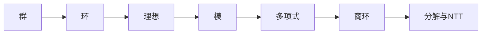

# 环上代数结构

格基密码从普通 LWE 发展到 Ring-LWE、Module-LWE 和 NTRU 类结构后，代数语言变得不可或缺。群、环、理想、模、多项式商环和 CRT 分解不是为了抽象而抽象，而是为了描述高效结构化计算以及这些结构带来的安全边界。

本章以格基加密为主线介绍环上代数结构。目标是让基础薄弱的读者能够理解：为什么 $\mathbb{Z}_q^n$ 可以升级为 $R_q$，为什么多项式乘法可以替代矩阵乘法，为什么环不是域时要谨慎，为什么模块格处于普通 LWE 与环 LWE 之间。

## 群结构

**1. 群 (Group)** 

群是最基础的代数结构之一，其保留了最核心的“变化与还原”的规律。一个集合 $G$ 加上一个二元运算 $\circ$ 必须满足四条公理：

- **封闭性**：对于任意 $a, b \in G$，$a \circ b \in G$。
- **结合律**：$(a \circ b) \circ c = a \circ (b \circ c)$。
- **单位元**：存在唯一的 $e \in G$，使得 $a \circ e = e \circ a = a$。
- **逆元**：对于任意 $a \in G$，存在唯一的 $a^{-1}$，使得 $a \circ a^{-1} = a^{-1} \circ a = e$。

**2. 阿贝尔群 (Abelian Group)**：

如果在上述基础上，运算还满足**交换律**（$a \circ b = b \circ a$），则称为阿贝尔群。密码学中绝大多数底层结构都是阿贝尔群。

> [!ANNOT]
>
> - **整数加法群 $(\mathbb{Z}, +)$**：拥有无限多个元素，单位元是 $0$，$a$ 的逆元是 $-a$。
> - **模加法群 $(\mathbb{Z}_q, +)$**：这是格密码中最常见的有限群。它的元素是 $\{0, 1, \dots, q-1\}$，运算是在模 $q$ 意义下的加法。
> - **非零有限域乘法群 $\mathbb{F}_q^\times$**：经典密码学（如 DH、DSA）的核心，但在格密码中，我们主要依赖的是**加法群**。

**3. 子群和商群**

如果说群定义了空间，那么**子群和商群**就定义了如何在这个空间中进行**分类与降维**。

- **子群 (Subgroup)**：如果群 $G$ 中的一个子集 $H$ 自己也能满足上述四条公理，它就是子群。
- **陪集 (Coset)**：对于子群 $H$ 和 $G$ 中的元素 $g$，$gH = \{gh \mid h \in H\}$ 称为一个陪集。陪集的作用是将大群 $G$ 划分成若干个不相交的、大小相等的“切片”。
- **商群 (Quotient Group)**：在阿贝尔群中，这些“切片”（陪集）本身可以构成一个新的群，记作 $G/H$。

> [!ANNOT]
>
> **经典映射：$\mathbb{Z}/q\mathbb{Z}$**
>
> 以整数加法群 $\mathbb{Z}$ 为例，所有 $q$ 的倍数构成了它的一个子群 $q\mathbb{Z} = \{\dots, -2q, -q, 0, q, 2q, \dots\}$。
>
> 当计算商群 $\mathbb{Z}/q\mathbb{Z}$ 时，实际上是将所有相差 $q$ 的倍数的整数，都视为同一个元素。” 这种将无限大空间“折叠”成有限环形空间的操作，正是模算术 $\mathbb{Z}_q$ 的代数本质。

**4. 群同态 (Group Homomorphism)** 

如果映射 $\varphi: G \to H$ 满足 $\varphi(x \circ y) = \varphi(x) \ast \varphi(y)$，它就是同态。这意味着在原空间里先运算再映射，和先映射再在新空间里运算，结果是一致的。

两个极重要的概念：

- **像 ($\operatorname{im}\varphi$)**：输入集合 $G$ 经过映射后，在 $H$ 中实际踩到的所有点的集合。
- **核 ($\ker\varphi$)**：$G$ 中所有被映射到 $H$ 的单位元 $e_H$ 的元素集合。

**5. 基本同态定理 (The First Isomorphism Theorem)**：

$$G/\ker\varphi \cong \operatorname{im}\varphi$$

> [!ANNOT]
>
> 如果 $x$ 和 $y$ 经过同态映射后得到了相同的结果（即 $\varphi(x) = \varphi(y)$），等价于说它们的差异存在于核中（$x \circ y^{-1} \in \ker\varphi$）。核就是这个映射的“视盲区”，**映射无法区分相差一个核元素的两个输入**。

**6. SIS 问题关联**

格密码中的短整数解问题（SIS）完全可以用群同态的语言来重构。

定义一个随机矩阵 $\mathbf{A} \in \mathbb{Z}_q^{n \times m}$。我们可以将乘以矩阵 $\mathbf{A}$ 视为一个从高维整数加法群到有限维模加法群的映射：

$$f_{\mathbf{A}}: \mathbb{Z}^m \to \mathbb{Z}_q^n, \quad \mathbf{x} \mapsto \mathbf{A}\mathbf{x} \bmod q$$

1. **这是一个群同态**：因为 $\mathbf{A}(\mathbf{x} + \mathbf{y}) \equiv \mathbf{A}\mathbf{x} + \mathbf{A}\mathbf{y} \pmod q$。
2. **它的核 ($\ker f_{\mathbf{A}}$)**：所有满足 $\mathbf{A}\mathbf{x} \equiv \mathbf{0} \pmod q$ 的整数向量 $\mathbf{x} \in \mathbb{Z}^m$。
   - 这个核**精确地定义了一个 $q$-ary 格**（通常记为 $\Lambda^\perp(\mathbf{A})$）
   - 因为核是一个子群，所以这个格在加法和减法下是封闭的（两个零解向量相加，依然是零解）。

**SIS 问题的本质**：如果仅仅是找 $\ker f_{\mathbf{A}}$ 中的元素，用高斯消元法多项式时间就能解决。SIS 问题的真正要求是：在 $\ker f_{\mathbf{A}}$ 中，找到一个**非零且极短**（范数 $\|\mathbf{x}\| \le \beta$）的元素。

> [!ANNOT]
>
> 群理论在传统密码体系和后量子密码体系中所扮演的角色是不同的：
>
> - **经典公钥密码（RSA/ECC）**：其安全性完全建立在**群结构本身的代数困难性**上。例如，在椭圆曲线群中给定 $P$ 和 $Q=kP$，寻找 $k$（离散对数问题）在代数上极其困难。
> - **格基密码**：这里的群（同态与商结构）仅仅是用来定义 $q$-ary 格（即映射的核）。在代数层面上，解方程 $\mathbf{A}\mathbf{x} \equiv \mathbf{b} \pmod q$ 是轻易可破的。格密码的安全性来源于**几何性质（范数 $\|\cdot\|$）和连续空间中的噪声**。寻找“短”向量或处理带有小高斯噪声的线性方程（LWE），打破了纯代数的整除和消元规律。

基于您提供的文本，我按照第一节“群结构”的详尽、层层递进且带有注释块（`> [!ANNOT]`）的写作思路，为您重新梳理和扩写了后续的代数结构章节。这能帮助读者更好地建立从抽象代数到格密码具体应用的直觉。

## 环结构

**1. 环 (Ring)**

群只定义了一种运算（通常是加法），而环则是一个同时拥有**加法**和**乘法**双重结构的集合。要成为一个环 $R$，它必须满足：  

- **加法群**：在加法下，它必须是一个阿贝尔群（有封闭性、结合律、交换律、零元和负元）。  
- **乘法半群**：乘法必须满足结合律。  
- **分配律**：乘法能够通过分配律（$a(b+c) = ab+ac$）与加法产生有机的联系。  

如果乘法还满足交换律，则称为**交换环**；如果存在乘法单位元（即数字 $1$），则称为**含幺环**。整数环 $\mathbb{Z}$、模环 $\mathbb{Z}_q$ 和多项式环 $R[X]$ 都是格密码中最基础的环结构。  

**2. 零因子与域的边界**

在环的世界里，并非所有非零元素都能做除法（即拥有乘法逆元）。  

- **域 (Field)**：一种“完美”的环，其中每一个非零元素都是可逆的。  
- **整环 (Integral Domain)**：没有“零因子”的交换环。  
- **零因子 (Zero Divisor)**：如果两个非零元素相乘等于零（例如在 $\mathbb{Z}_6$ 中，$2 \cdot 3 = 0$），这两个元素就是零因子。  

> [!ANNOT]
>
> **环与域的本质差异陷阱**
>
> 不可将所有的环都当成普通的整数或域来处理。在域上成立的线性代数结论（如高斯消元、矩阵求逆、秩的计算），在普通的环上可能会彻底失效。在格密码中，由于我们经常在包含零因子的环上操作，因此必须极其谨慎地重新检查元素的可逆性和基的定义。  

**3. 格密码中的环**

在普通 LWE 问题中使用庞大的完全随机矩阵进行乘法操作，导致了极高的存储和计算成本。 Ring-LWE 的核心优势在于**用一次环乘法替代复杂的矩阵乘法**。一个简单的环元素就可以隐式地代表一整个结构化的矩阵。这种代数结构的引入显著压缩了公钥体积，并大幅降低了运算成本，但代价是引入了可能被利用的额外代数结构（攻击面）。  

## 理想结构

**1. 理想 (Ideal)**

理想可以被视为环中一种具有“极强吸收能力”的特殊子集。如果集合 $I \subseteq R$ 满足以下条件，它就是一个理想：  

- 它自身是一个**加法子群**（内部加减封闭）。  
- **吸收律**：对于环中的**任意**元素 $r \in R$ 和理想中的**任意**元素 $a \in I$，它们的乘积 $ra$ 必定被“强行拉回”到理想 $I$ 中（即 $ra \in I$）。  

**2. 主理想 (Principal Ideal)**

由单个元素“衍生”出来的理想是最简单的形式。对于 $a \in R$，由它生成的主理想记为 $(a) = \{ra : r \in R\}$。  

- 在整数环 $\mathbb{Z}$ 中，所有 $q$ 的倍数构成了主理想 $(q) = q\mathbb{Z}$。  
- 在多项式环中，由多项式 $\phi(X)$ 生成的主理想 $(\phi(X))$ 包含了所有能被 $\phi(X)$ 整除的多项式。  

> [!ANNOT]
>
> **同态的核与理想格的几何映射**
>
> 在代数意义上，理想的本质是**同态映射的核**，这使得它成为构造“商环”的核心。而在格基密码（特别是 Ring-LWE 的安全证明）中，理想扮演了更深刻的角色：代数数域整数环中的理想，可以通过特定的数学嵌入方式，转化为欧氏空间中实实在在的几何“格”（即理想格）。这就将抽象的代数结构与直观的几何难题绑定在了一起。  

## 模结构

**1. 模 (Module)**

模是**向量空间的降级推广**。如果把构成向量空间的底层“标量域”降级替换为普通的“环”就得到了模。 设 $R$ 是一个环，$M$ 是一个阿贝尔群。如果在 $M$ 上可以定义 $R$ 中元素的“标量乘法”，并且满足结合律与分配律，那么 $M$ 就是一个 $R$-模。  

**2. 自由模 (Free Module)**

如果一个模拥有类似向量空间那样的“基”，它就被称为自由模。最典型的自由模是 $R^k$，它的元素是由 $k$ 个环元素排列而成的向量。例如，若 $R_q$ 是多项式商环，那么 $R_q^k$ 中的元素就是由 $k$ 个多项式组成的向量。  

> [!ANNOT]
>
> **Module-LWE：在效率与安全之间的平衡**
>
> 模结构是现代标准化 KEM（如 Kyber/ML-KEM）的核心，原因在于它提供了一个完美的“性能折中”：  
>
> - **普通 LWE**：工作在无结构的向量空间上。安全性最保守（好），但矩阵庞大，效率极低（坏）。  
> - **Ring-LWE**：工作在秩为 1 的环结构上。效率极高（好），但结构性太强，一旦环本身有弱点就全线崩溃（坏）。  
> - **Module-LWE**：工作在 $R_q^k$ 模上。通过调整模块的秩 $k$，可以在无结构（极大 $k$）和强结构（$k=1$）之间找到最合理的平衡点。  

## 多项式与商环结构

**1. 多项式的向量化表示**

在格密码中，多项式不仅仅是代数对象，它们是**表示向量的最佳载体**。一个长度为 $n$ 的向量 $(a_0, a_1, \ldots, a_{n-1})$ 可以无缝转化为一个最高次为 $n-1$ 的多项式 $a(X) = \sum_{i=0}^{n-1} a_i X^i$。 在这个视角下：  

- 多项式的加法等价于向量的逐项加法。  
- 多项式的乘法等价于向量系数的某种卷积。  

**2. 多项式商环 (Quotient Ring)**

多项式商环 $R_q = \mathbb{Z}_q[X]/(\phi(X))$ 是环格密码运行的终极计算环境。 这里的商环操作，本质上是把所有相差 $\phi(X)$ 倍数的多项式视为同一个“等价类”。在实际计算中，两个多项式相乘后，如果次数超过了限制，就必须使用关系 $\phi(X) = 0$ 进行约化（折叠回低次项）。  

> [!ANNOT]
>
> **核心卷积规则与规范编码**
>
> 模多项式 $\phi(X)$ 的选择直接决定了系统的物理计算规则：  
>
> - 若 $\phi(X) = X^n - 1$：$X^n = 1$，高次项直接循环回到低次项，形成**循环卷积**。  
> - 若 $\phi(X) = X^n + 1$：$X^n = -1$，高次项循环回低次项时必须**带上负号**，形成**负循环卷积**。其计算公式为 $c_k = \sum_{i+j \equiv k \bmod n} (-1)^{\lfloor (i+j)/n \rfloor} a_i b_j$。如果代码实现中漏掉这个符号，整个密码算法将彻底崩溃。  
>
> 此外，由于商环中的元素有无穷多个多项式代表，工程实现必须强制使用**唯一规范编码**（如限制系数在 $\{0, \dots, q-1\}$ 且次数严格小于 $n$）。这对于保证 CCA 安全变换中的重加密一致性至关重要。  

## 分解结构与 NTT

**1. 中国剩余定理 (CRT) 分解**

如果多项式商环的模数 $\phi(X)$ 能够在某个底层环或域上分解成几个互不包含公因式的短多项式乘积，我们就可以利用中国剩余定理（CRT）将庞大的商环“拆解”为多个小型商环的直积。  

**2. 数论变换 (NTT)**

多项式层面的 CRT 就是数论变换（NTT）的代数基础。NTT 本质上是定义在有限环或有限域上的离散傅里叶变换。 如果存在合适的单位根 $\omega$，NTT 可以将一个多项式 $a(X)$ 映射为一系列点上的求值结果 $(a(\omega^0), a(\omega^1), \ldots)$。 最神奇的性质在于，时域中极其昂贵的多项式卷积乘法，在频域（评估域）中变成了廉价的逐点相乘： $$ \widehat{a \star b} = \widehat{a} \odot \widehat{b} $$ 计算完成后，再通过逆变换 (INTT) 还原回系数表示。  

> [!ANNOT]
>
> 分解结构（如 NTT）不仅是一种追求极速的工程技巧，它同时也是一把双刃剑：  
>
> - **结构性暴露**：如果环被分解出过多微小的分量，攻击者就有可能在这些脆弱的小分量上局部破译秘密或误差信息。  
> - **侧信道泄漏**：NTT 的频域乘法虽然极快，但其内部复杂的蝶形运算、内存访问模式和预计算表极其容易泄露信息。如果输入的 NTT 数组中包含私钥，非恒定时间的缓存命中行为（Cache Timing）将成为致命的侧信道漏洞。数学上的代数同构，绝不意味着工程实现天然安全。
