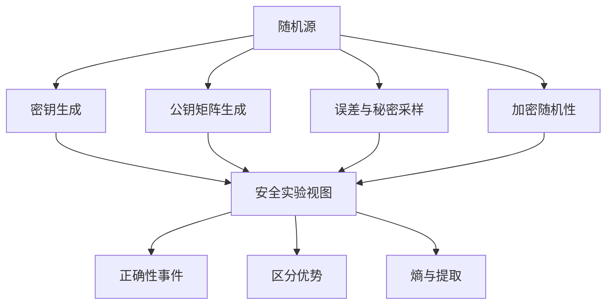
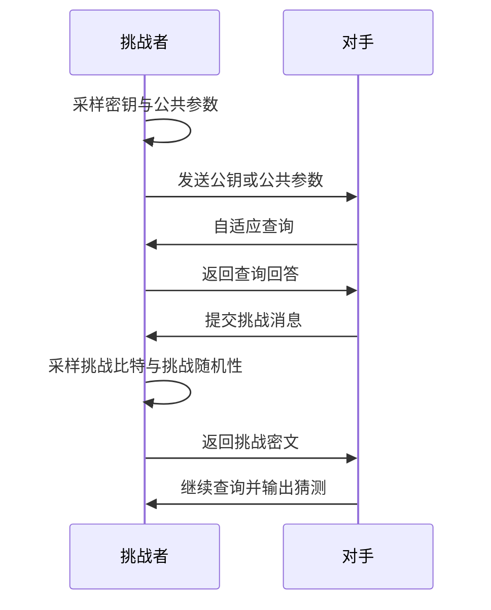
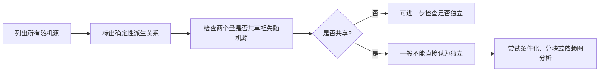

# 随机对象的统一语言

本章的目标，是给后续格基加密正文准备一套可以反复使用的“随机性语言”。很多格基密码概念表面上属于代数、格几何或复杂性理论，但一旦进入方案证明，就会落回概率论：

- 密钥、误差、公钥矩阵分别如何采样；
- 哪些量是真正随机的，哪些量只是确定性派生；
- 解密失败如何写成事件；
- 攻击者看到公钥、密文和查询历史后，还能区分什么；
- KEM 的最终密钥为什么可以被视为随机密钥材料。

因此，本章不把概率论当作孤立内容，而是把每个概念都放回 LWE、MLWE、RLWE、公钥加密与 KEM 的语境中。本章把一段方案伪代码翻译成概率语言：列出随机源、分布、依赖关系、派生变量和失败事件。

为避免符号混乱，本卷采用如下约定：随机变量使用 $X,Y,Z,E$ 等大写斜体；向量使用 $\mathbf{x},\mathbf{s},\mathbf{e}$；矩阵使用 $\mathbf{A},\mathbf{B}$；分布族使用 $\mathcal{D},\mathcal{X}$；有限集合 $S$ 上的均匀分布写作 $\mathcal{U}(S)$；从分布采样写作 $x\leftarrow\mathcal{D}$；从有限集合均匀采样写作 $x\xleftarrow{\$}S$。若随机变量 $X$ 的分布记为 $P_X$，联合分布记为 $P_{X,Y}$，条件分布记为 $P_{X\mid Y=y}$。

> [!ANNOT]
>
> 具体符号表参考[附录Ⅰ - 后量子密码体系全局符号统一表](/posts/appendix-post-quantum-symbol-table)。

## 概率空间与安全实验样本点

概率论的起点是概率空间，记为 $(\Omega,\mathcal{F},\Pr)$。其中：

- $\Omega$ 是样本空间，可以先理解为“所有随机币取值的全集”；
- $\mathcal{F}$ 是事件集合，说明哪些子集可以被讨论概率；
- $\Pr$ 是概率测度，为事件分配 $0$ 到 $1$ 之间的概率值。

**1. 样本空间**

在密码学证明中，$\Omega$ 往往不是一次掷硬币那么简单。一次完整的格基加密安全实验，可能同时包含：密钥生成随机数、公钥矩阵种子、秘密向量 $\mathbf{s}$、误差向量 $\mathbf{e}$、加密随机向量 $\mathbf{r}$、加密误差 $\mathbf{e}_1,e_2$、压缩舍入误差、随机预言机回答、攻击者内部随机币，以及挑战比特 $b\leftarrow\mathcal{U}(\{0,1\})$。这些随机对象共同组成一个大的概率空间。

以最基础的 LWE 样本为例。令 $q$ 为模数，$n$ 为秘密维数，$m$ 为样本数，典型采样过程为：

$$
\mathbf{A}\xleftarrow{\$}\mathbb{Z}_q^{m\times n},\quad
\mathbf{s}\leftarrow\chi_s^n,\quad
\mathbf{e}\leftarrow\chi_e^m,\quad
\mathbf{b}:=\mathbf{A}\mathbf{s}+\mathbf{e}\pmod q.
$$

- $\mathbf{A}$ 是均匀采样的随机矩阵；
- $\mathbf{s}$ 和 $\mathbf{e}$ 分别来自秘密分布和误差分布；
- $\mathbf{b}$ 不是独立采样出来的，而是由 $\mathbf{A},\mathbf{s},\mathbf{e}$ 确定性派生出来的随机变量。

如果某个证明后面把 $\mathbf{b}$ 替换成均匀随机向量，就必须说明这是基于 LWE 假设做出的计算性替换，而不是在原始概率空间中天然成立。

**2. 事件**

事件是概率空间中最常用的对象。在正确性分析中，典型事件是解密失败。若消息编码间隔为 $\Delta$，总解密噪声为 $N_{\rm dec}$，一种常见失败条件可以写成：
$$
E_{\rm fail}:=\left\{\left|\langle N_{\rm dec}\rangle_q\right|\geq \frac{\Delta}{2}\right\}.
$$

这句话的含义是：**先把模 $q$ 噪声提升到中心代表元，再判断它是否越过解码边界。**只有把“失败”写成这种明确事件，后续才谈得上估计 $\Pr[E_{\rm fail}]$。

安全实验中的“攻击成功”也应写成事件。例如在 IND-CPA 实验中，挑战者选择 $b\leftarrow\mathcal{U}(\{0,1\})$，攻击者输出 $b'$，则成功事件可写为：

$$
E_{\rm win}:=\{b'=b\}.
$$

攻击优势本质上就是 $\Pr[E_{\rm win}]$ 相对随机猜测概率 $1/2$ 的偏离。复杂的安全目标，最终都会落到类似的概率事件上。

>[!ANNOT]
>每一次采样、每一个派生量、每一个失败条件，都应能放入同一个概率空间中描述。若说不清某个量来自哪些随机源，后续关于独立性、尾界和安全优势的推导通常就不可靠。

## 分布族与安全参数

密码学研究的不是一个固定分布，而是一族随安全参数 $\lambda$ 增长的分布。安全参数决定方案规模，也决定攻击难度。若只研究固定的 $n=4,q=17$，许多渐近安全概念就失去意义；**真正的方案必须说明当 $\lambda$ 增大时，$n,q,m$、模块秩 $k$、噪声宽度、密钥长度和输出长度如何变化。**

一个分布族可写作：

$$
\{\mathcal{D}_\lambda\}_{\lambda\in\mathbb{N}}.
$$

例如，LWE 误差分布可写成 $\chi_{e,\lambda}$，秘密分布可写成 $\chi_{s,\lambda}$。在具体方案中，为了简洁，常省略下标 $\lambda$，只写 $\chi_e,\chi_s$。但这种省略必须建立在参数表已经明确的基础上，否则读者无法判断某个失败概率是否随 $\lambda$ 可忽略。

格基加密中常见的分布包括：

- 有限集合上的**均匀分布**，例如 $\mathcal{U}(\mathbb{Z}_q)$；
- **中心二项**分布 $\mathsf{CBD}_\eta$；
- **离散 Gaussian** 分布 $D_{\Lambda,s,\mathbf{c}}$；
- **稀疏分布、小区间分布和舍入误差分布**；
- 由短种子经 $\mathsf{XOF}$ 展开的伪随机分布。

有限集合 $S$ 上均匀采样写作 $a\xleftarrow{\$}S$。例如：

$$
a\xleftarrow{\$}\mathbb{Z}_q
$$

表示 $a$ 从 $\mathbb{Z}_q$ 中均匀采样。若 $\mathbf{A}\xleftarrow{\$}\mathbb{Z}_q^{m\times n}$，通常表示每个矩阵条目独立均匀采样，除非另有说明。若 $\mathbf{A}$ 实际由短种子 $\mathsf{seed}$ 经 $\mathsf{XOF}$ 展开，则从信息论角度它不是完整空间上的均匀矩阵；证明中必须说明 $\mathsf{XOF}$ 被建模为随机预言机、伪随机生成器，还是实现细节。

**中心二项分布**

中心二项分布 $\mathsf{CBD}_\eta$ 是许多模块格 KEM 中的常用噪声。令 $B_i,B'_i\leftarrow\mathsf{Ber}(1/2)$ 独立，则：
$$
X:=\sum_{i=1}^{\eta}B_i-\sum_{i=1}^{\eta}B'_i
$$

服从 $\mathsf{CBD}_\eta$。它以 $0$ 为中心，支持集有限，便于常数时间实现和精确尾部分析。

**离散分布**

离散 Gaussian 分布更常出现在理论研究中，尤其与平滑参数、陷门采样和最坏到平均归约有关。若 $\Lambda$ 为格，中心为 $\mathbf{c}$，Gaussian 参数为 $s$，则格上的离散 Gaussian 写作 $D_{\Lambda,s,\mathbf{c}}$。

还要区分离散分布与连续分布。格基加密算法运行在有限环、有限模空间或整数格上，所以实际随机变量通常是离散的；但理论分析常借助连续正态分布 $\mathcal{N}(\mu,\sigma^2)$ 或多维正态分布 $\mathcal{N}(\boldsymbol{\mu},\boldsymbol{\Sigma})$。连续近似可以帮助理解，却不能在严格证明中随意替代离散分布。若要替代，就要给出统计距离、散度或尾界误差。

>[!ANNOT]
>“取值空间很大”不等于“分布均匀”，“看起来像高斯”也不等于“可以当作高斯”。在密码学证明中，分布族必须被精确定义，任何近似都需要支付可量化的误差代价。

在方案参数表中，建议至少列出：

| 对象 | 典型记号 | 分布或空间 | 作用 |
| :--- | :--- | :--- | :--- |
| 公共矩阵 | $\mathbf{A}$ | $\mathbb{Z}_q^{m\times n}$ 或 $R_q^{k\times k}$ | LWE/MLWE 线性映射 |
| 秘密向量 | $\mathbf{s}$ | $\chi_s^n$ 或 $\chi_s^k$ | 私钥核心随机量 |
| 误差向量 | $\mathbf{e}$ | $\chi_e^m$ 或 $\chi_e^k$ | 隐藏线性关系 |
| 加密随机量 | $\mathbf{r}$ | $\chi_r^m$ 或 $\chi_r^k$ | 生成一次性密文 |
| 压缩误差 | $E_{\rm comp}$ | 有界分布或确定性函数 | 影响正确性 |
| 失败事件 | $E_{\rm fail}$ | 事件 | 描述解密错误 |

{tableMode="stretch"}

## 联合分布与条件分布

单个随机变量的边缘分布只能描述局部信息。格基密码中更关键的是多个变量之间的联合关系。判定 LWE 比较的不是单独的 $\mathbf{b}$，而是两个联合分布：

$$
(\mathbf{A},\mathbf{A}\mathbf{s}+\mathbf{e})\quad\text{与}\quad(\mathbf{A},\mathbf{u}),
$$

其中 $\mathbf{u}\xleftarrow{\$}\mathbb{Z}_q^m$。两个世界里 $\mathbf{A}$ 的边缘分布相同，差别在于第二个分量是否与 $\mathbf{A}$ 存在带噪线性关系。LWE 的核心不是“$\mathbf{b}$ 看起来是否均匀”这个孤立问题，而是“$(\mathbf{A},\mathbf{b})$ 能否与 $(\mathbf{A},\mathbf{u})$ 区分”。

联合分布记为 $P_{X,Y}$。若 $X,Y$ 是离散变量，则：

$$
P_{X,Y}(x,y):=\Pr[X=x\land Y=y].
$$

边缘分布可由联合分布求和得到：

$$
P_X(x)=\sum_y P_{X,Y}(x,y).
$$

条件分布描述“已知一个变量取值后，另一个变量还剩什么随机性”。若 $\Pr[Y=y]>0$，则：

$$
P_{X\mid Y=y}(x):=\Pr[X=x\mid Y=y]=\frac{\Pr[X=x\land Y=y]}{\Pr[Y=y]}.
$$

在格基加密中，条件化对象不同，分布判断就会不同。例如：

- 固定公钥 $\mathsf{pk}$ 后，加密仍然使用新的 $\mathbf{r},\mathbf{e}_1,e_2$；
- 固定秘密 $\mathbf{s}$ 后，$\mathbf{b}=\mathbf{A}\mathbf{s}+\mathbf{e}$ 仍随 $\mathbf{A}$ 和 $\mathbf{e}$ 变化；
- 固定 $\mathbf{A}$ 和 $\mathbf{s}$ 后，$\mathbf{b}$ 的剩余随机性只来自 $\mathbf{e}$。

以公钥加密为例，密钥生成得到：

$$
\mathbf{t}:=\mathbf{A}\mathbf{s}+\mathbf{e}\pmod q.
$$

加密消息 $\mu$ 时，可能计算：

$$
\mathbf{u}:=\mathbf{A}^{\top}\mathbf{r}+\mathbf{e}_1\pmod q,
$$

$$
v:=\mathbf{t}^{\top}\mathbf{r}+e_2+\mathsf{Encode}(\mu)\pmod q.
$$

密文 $(\mathbf{u},v)$ 的分布依赖于 $\mathsf{pk}=(\mathbf{A},\mathbf{t})$。若条件化在 $\mathsf{pk}$ 上，随机性来自 $\mathbf{r},\mathbf{e}_1,e_2$；若进一步条件化在 $\mathbf{r}$ 上，则 $\mathbf{u}$ 的剩余随机性只来自 $\mathbf{e}_1$，$v$ 的剩余随机性只来自 $e_2$。证明中若不说明条件化对象，就很难判断独立性和分布替换是否合法。

安全实验通常是多阶段概率过程：

在每个阶段，对手下一步行为都可能依赖此前观察。因此安全证明常要写出“给定查询历史 $\mathsf{hist}$ 后，挑战密文的条件分布”。这种写法看似繁琐，却能避免把自适应攻击错误简化为非自适应攻击。

## 独立性、条件独立性与依赖陷阱

独立性是概率论中最容易被误用的概念之一。两个随机变量 $X$ 和 $Y$ 独立，记为 $X\perp Y$，意思是对所有 $x,y$ 都有：

$$
\Pr[X=x\land Y=y]=\Pr[X=x]\Pr[Y=y].
$$

直观地说，**知道 $Y$ 的值不会改变 $X$ 的分布**。若在给定 $Z$ 后，$X$ 与 $Y$ 独立，则称它们在条件 $Z$ 下条件独立。条件独立和普通独立不能混用：有些变量本来不独立，但给定中间变量后独立；也有些变量本来独立，条件化后反而相关。

LWE 样本给出一个典型陷阱。令：

$$
b_i:=\langle \mathbf{a}_i,\mathbf{s}\rangle+e_i\pmod q.
$$

不同 $b_i$ 共享同一个秘密 $\mathbf{s}$。因此，多个样本不是由完全互不相关的机制生成。若给定 $\mathbf{s}$，并假设各行 $\mathbf{a}_i$ 与误差 $e_i$ 独立，则不同样本更容易分析；但在不条件化 $\mathbf{s}$ 的情况下，它们存在共同来源。很多错误证明正是把这些样本直接当作独立副本。

环格和模块格中的依赖更隐蔽。环元素 $a(X)=\sum_i a_iX^i$ 与 $s(X)$ 相乘时，输出系数由卷积得到。即使输入系数 $a_i,s_i$ 独立，乘积 $a(X)\star s(X)$ 的不同输出系数也会共享大量输入项。因此，不能从“输入系数独立”直接推出“输出系数独立”。

另一个常见陷阱是把伪随机展开当作信息论独立。标准化格基方案常用 $\mathsf{seed}$ 通过 $\mathsf{XOF}$ 生成矩阵 $\mathbf{A}$。实现上每个条目看起来像随机字节解析结果，但从信息论角度，整个矩阵由短种子决定，支持集远小于全部矩阵集合。若证明需要信息论均匀矩阵，就必须把 $\mathsf{XOF}$ 理想化，或额外假设其伪随机性。

判断独立性时，可按下面流程检查：

例如在 MLWE 加密中：

$$
\mathbf{u}:=\mathbf{A}^{\top}\mathbf{r}+\mathbf{e}_1,
$$

$$
v:=\mathbf{t}^{\top}\mathbf{r}+e_2+\mathsf{Encode}(\mu).
$$

$\mathbf{u}$ 和 $v$ 共享 $\mathbf{r}$，而 $\mathbf{t}$ 又包含密钥生成时的秘密与误差。因此，$\mathbf{u}$ 与 $v$ 通常不是独立的。若只分析解密噪声，可能通过代数消去得到更简单表达式；但这一步必须在公式中完成，不能凭直觉省略依赖关系。

>[!ANNOT]
>在格基密码中，独立性错误往往不是小瑕疵，而可能直接导致错误的失败率估计或安全归约。凡是使用 Chernoff、Hoeffding、Bernstein 等尾界之前，都应先核查独立性或条件独立性前提。

## 随机变量的数字特征

### 随机变量与期望

随机变量可以理解为“带概率的数值”。例如，某个噪声变量 $X$ 可能取 $-1,0,1$，并且每个值有不同概率。

若 $X$ 是离散随机变量，其期望定义为：

$$
\mathbb{E}[X]:=\sum_x x\Pr[X=x].
$$

期望是加权平均。它不是说 $X$ 一定会取这个值，而是描述长期平均水平。

例如，若 $X$ 以概率 $1/2$ 取 $0$，以概率 $1/2$ 取 $2$，则：

$$
\mathbb{E}[X]=0\cdot\frac12+2\cdot\frac12=1.
$$

在格基加密中，噪声分布通常设计为以 $0$ 为中心，也就是 $\mathbb{E}[X]=0$。这样做的好处是噪声不会系统性偏向某个方向。

### 原点矩与中心矩

“矩”可以理解为随机变量的幂的期望。第 $k$ 阶原点矩定义为：

$$
\mathbb{E}[X^k].
$$

常见例子包括：

- 一阶原点矩：$\mathbb{E}[X]$，也就是期望；
- 二阶原点矩：$\mathbb{E}[X^2]$，常用于控制能量；
- 四阶原点矩：$\mathbb{E}[X^4]$，常用于更精细地控制尾部。

中心矩则关注随机变量相对均值的偏离。第 $k$ 阶中心矩定义为：

$$
\mathbb{E}[(X-\mathbb{E}[X])^k].
$$

其中最重要的是二阶中心矩，也就是方差。

### 方差与标准差

方差定义为：

$$
\operatorname{Var}(X):=\mathbb{E}\left[(X-\mathbb{E}[X])^2\right].
$$

如果记 $\mu:=\mathbb{E}[X]$，则也可以写成：

$$
\operatorname{Var}(X)=\mathbb{E}[(X-\mu)^2].
$$

方差衡量 $X$ 围绕均值波动的程度。方差越大，分布越分散；方差越小，分布越集中。

标准差定义为：

$$
\sigma:=\sqrt{\operatorname{Var}(X)}.
$$

标准差与 $X$ 的单位相同，因此更容易直观理解。若噪声标准差为 $\sigma$，通常可以把“典型波动规模”粗略理解为 $\sigma$ 量级，但尾界要关心的是远大于 $\sigma$ 的异常偏离概率。

方差还有一个常用等式：

$$
\operatorname{Var}(X)=\mathbb{E}[X^2]-(\mathbb{E}[X])^2.
$$

若 $X$ 以 $0$ 为中心，即 $\mathbb{E}[X]=0$，则：

$$
\operatorname{Var}(X)=\mathbb{E}[X^2].
$$

这在格基噪声分析中非常常见。

### 独立和的期望与方差

若 $X_1,\ldots,X_n$ 是随机变量，令：

$$
S:=\sum_{i=1}^n X_i.
$$

无论是否独立，期望都满足线性性：

$$
\mathbb{E}[S]=\sum_{i=1}^n\mathbb{E}[X_i].
$$

但方差相加通常需要独立性。若 $X_1,\ldots,X_n$ 两两独立，则：

$$
\operatorname{Var}(S)=\sum_{i=1}^n\operatorname{Var}(X_i).
$$

若不独立，则需要加入协方差项：

$$
\operatorname{Var}(S)=\sum_i\operatorname{Var}(X_i)+2\sum_{i<j}\operatorname{Cov}(X_i,X_j).
$$

其中：

$$
\operatorname{Cov}(X_i,X_j):=\mathbb{E}\left[(X_i-\mathbb{E}[X_i])(X_j-\mathbb{E}[X_j])\right].
$$

这说明一个非常重要的问题：共享秘密、共享随机种子、环卷积等依赖结构会改变方差分析。不能只看到“很多项相加”，就默认方差可以直接相加。

## 随机变量变换与模运算

格基加密中的随机变量很少保持原样。它们会经过模约减、中心提升、矩阵乘法、环乘法、压缩、解压、编码、哈希和 KDF 等变换。理解这些变换如何改变分布，是把概率论用于密码方案的关键。

最基本的变换是模约减。若 $a\in\mathbb{Z}$，标准代表元记为 $[a]_q\in\{0,\ldots,q-1\}$，中心代表元记为 $\langle a\rangle_q$，通常取在接近 $(-q/2,q/2]$ 的区间中。二者表示同一个模 $q$ 类，但用途不同：

- 算法实现通常使用标准代表元；
- 正确性证明通常使用中心代表元，因为噪声大小要按离 $0$ 的距离衡量。

例如，若 $q=17$，则 $[15]_{17}=15$，但中心代表元通常为 $\langle 15\rangle_{17}=-2$。在解密噪声分析中，$15$ 看似很大，实际与 $-2$ 同余，距离 $0$ 很近。因此，正确性条件必须使用中心代表元，而不能只比较标准代表元大小。

另一个重要变换是线性映射。若 $\mathbf{X}$ 是随机向量，$\mathbf{A}$ 是确定矩阵，则 $\mathbf{Y}:=\mathbf{A}\mathbf{X}$ 的分布由 $\mathbf{X}$ 和 $\mathbf{A}$ 决定。若在模 $q$ 空间中，应写作：

$$
\mathbf{Y}:=\mathbf{A}\mathbf{X}\pmod q.
$$

如果 $\mathbf{X}$ 是小噪声向量，$\mathbf{A}\mathbf{X}$ 的坐标通常是多个小变量的加权和，尾部可能显著变宽。若 $\mathbf{A}$ 是环乘法对应的卷积矩阵，不同坐标之间还可能相关。不能把每个输出坐标简单看作原始分布的独立副本。

压缩和解压是现代 KEM 中的关键变换。常见压缩函数可抽象为：

$$
\mathsf{Compress}_q(x,d):=\left\lfloor\frac{2^d}{q}x\right\rceil \bmod 2^d.
$$

解压函数可抽象为：

$$
\mathsf{Decompress}_q(y,d):=\left\lfloor\frac{q}{2^d}y\right\rceil.
$$

压缩节省公钥或密文长度，但会引入舍入误差。若定义：

$$
E_{\rm comp}(x):=\mathsf{Decompress}_q(\mathsf{Compress}_q(x,d),d)-x,
$$

则 $E_{\rm comp}(x)$ 一般是 $x$ 的确定性函数，而不是独立噪声。严谨分析至少要说明误差范围；若要把它替换成简化噪声模型，还必须给出替换误差或统计距离。

哈希和 KDF 也是随机变量变换。若：

$$
K:=\mathsf{KDF}(z,\mathsf{ctx}),
$$

则 $K$ 的安全性取决于输入 $z$ 的剩余熵、$\mathsf{KDF}$ 的模型和上下文绑定。不能因为输出看起来像随机比特串，就认为低熵输入自动安全。这个主题会在“熵与随机提取”章节继续展开。
