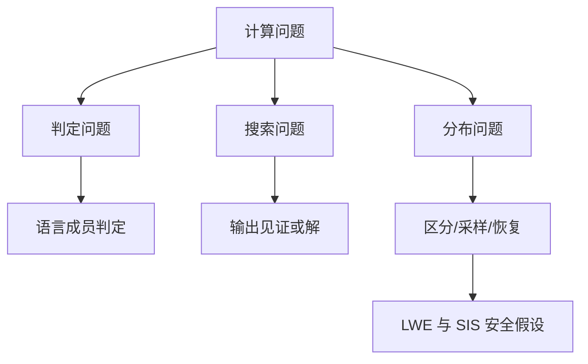

# 计算问题的形式化基础

格基密码的对象具有显著的数学结构：格 $\Lambda$、矩阵 $\mathbf{A}\in\mathbb{Z}_q^{m\times n}$、短向量 $\mathbf{s}$、误差向量 $\mathbf{e}$、多项式环元素 $a\in R_q$。然而**密码学中的安全声明并不是对抽象对象直接说话，而是对算法能够读入、写出和处理的有限字符串说话**。若一个方案的公钥、密文、参数或见证不能被明确编码，所谓“攻击者输入”就没有严格含义；若一个困难问题没有指定输入分布、输出目标与成功判据，所谓“基于 LWE 安全”也缺乏可检验的形式含义。

本章的任务是把后续所有格基加密、KEM、签名、零知识和协议安全证明所需的计算问题语言建立起来。

## 编码与输入规模

### 规范编码与唯一表示

规范编码不仅要求**对象可以被写成比特串**，还要求**同一数学对象在协议语境中具有唯一或可验证的表示**。若同一个矩阵、环元素或承诺值允许多个合法编码，攻击者就可能构造语义相同但字节不同的对象，从而绕过哈希绑定、签名验证或密文重放检查。规范编码通常包含固定字节序、固定长度字段、系数范围约定、模数代表元约定以及失败返回规则。

以 $\mathbb{Z}_q$ 中的系数为例，常见表示选择区间 $\{0,1,\ldots,q-1\}$。若实现同时接受 $q+1$、$1$ 或负数补码形式作为同一元素的表示，则哈希输入与数学对象之间失去一一对应关系。格基 KEM 与签名中大量使用“先编码再哈希”的结构，编码规范性直接影响 transcript 绑定、挑战生成和抗篡改性质。

### 输入规模与参数规模

**输入规模 $|x|$ 与安全参数 $\lambda$ 并非同一概念。**

- **安全参数**用于描述安全目标和参数族增长方式；
- **输入规模**用于描述某个具体实例的比特长度。

格基问题中，$n$、$q$、$m$、环次数、模块秩和噪声参数共同决定实例编码长度。若只写“算法关于 $\lambda$ 多项式时间”，还需要说明 $n(\lambda)$、$q(\lambda)$、$m(\lambda)$ 如何随 $\lambda$ 增长。

> [!ANNOT]
>
> 例如 LWE 样本 $(\mathbf{a},b)\in\mathbb{Z}_q^n\times\mathbb{Z}_q$ 的直接编码长度约为 $(n+1)\lceil\log_2 q\rceil$。若样本数为 $m$，总输入长度还要乘以 $m$。在形式化问题定义中，运行时间关于编码长度多项式，参数化分析中则常把成本写成 $T(n,q,m,\chi)$，两种写法描述同一对象的不同层面。

**计算理论通常从字母表开始**。最常用的字母表是二元集合 $\{0,1\}$，有限比特串的全集记为 $\{0,1\}^*$，长度为 $\ell$ 的比特串集合记为 $\{0,1\}^\ell$。一个算法的输入必须是某个有限字符串 $x\in\{0,1\}^*$，其长度记为 $|x|$。这一定义看似朴素，却是密码学严谨性的第一道门槛：算法不能直接读取“一个抽象矩阵”或“一个环元素”，它只能读取这些对象的编码。

在格基密码中，规范编码函数通常写作 $\mathsf{Encode}$，对应的解码函数写作 $\mathsf{Decode}$。若 $x$ 是一个数学对象，则 $\mathsf{Encode}(x)$ 是它的比特串表示；若 $B$ 是一个比特串，则 $\mathsf{Decode}(B)$ 尝试恢复数学对象，若格式非法则输出 $\perp$。为了避免拼接歧义，多个字段的编码通常需要包含类型、长度或固定字段边界。例如公钥可能由种子、压缩矩阵描述和附加哈希组成，不能简单写成若干字节相连而不说明边界。

$$
\mathsf{Decode}(\mathsf{Encode}(x))=x
$$

上式表示编码的正确性要求：合法对象经编码后再解码，需要回到原对象。反方向通常不要求对所有比特串成立，因为并非每个比特串都是合法编码。对于密码实现而言，这种差异非常重要。解码失败时必须返回 $\perp$，而不是把非法输入“非规范解释”为某个对象；否则攻击者可能利用非规范编码构造等价密文、畸形公钥或跨协议混淆输入。

**输入规模不是数学对象的“数值大小”，而是编码长度**。例如模数 $q$ 的数值大小为 $q$，但表示它只需要约 $\lceil\log_2 q\rceil$ 位。矩阵 $\mathbf{A}\in\mathbb{Z}_q^{m\times n}$ 若逐项编码，则长度大约为 $mn\lceil\log_2 q\rceil$ 位；若它由公开种子经 $\mathsf{XOF}$ 展开，则实际公钥中可能只存储一个短种子，但安全证明中仍需区分“存储大小”和“展开后被算法使用的矩阵规模”。
$$
|\mathsf{Encode}(\mathbf{A})|\approx mn\lceil\log_2 q\rceil
$$

对于多项式环 $R_q=\mathbb{Z}_q[X]/(\phi(X))$ 中的元素 $a(X)=\sum_{i=0}^{n-1}a_iX^i$，常用编码是系数向量 $\operatorname{coeff}(a)=(a_0,\ldots,a_{n-1})^\top$ 的逐坐标编码。若使用 NTT 表示或压缩表示，必须说明该表示是否规范、是否唯一、是否允许多个比特串表示同一环元素。规范性并不只是工程细节，它会影响密文比较、重加密验证、哈希绑定和 CCA 安全证明中的“相同输入”判断。

| 对象 | 常见数学表示 | 常见编码要点 |
| :--- | :--- | :--- |
| 模整数 | $a\in\mathbb{Z}_q$ | 固定字节数、标准代表元 $[a]_q$ |
| 向量 | $\mathbf{x}\in\mathbb{Z}_q^n$ | 坐标顺序、端序、压缩规则 |
| 矩阵 | $\mathbf{A}\in\mathbb{Z}_q^{m\times n}$ | 行优先/列优先、种子展开规则 |
| 环元素 | $a\in R_q$ | 系数表示、NTT 表示、模多项式 |
| 密文 | $\mathsf{ct}$ | 字段边界、压缩参数、拒绝非法格式 |

任何安全实验中的输入、输出和查询都必须落在明确的编码空间中。若一个安全定义写着对手输出密文 $\mathsf{ct}$，则挑战者首先要做的事情不是解密，而是解码并检查格式。若格式非法，返回 $\perp$ 或执行固定拒绝流程。格基 KEM 的 CCA 证明尤其依赖这种规范化处理，因为解封装查询经常被攻击者用来探测实现细节和失败路径。

## 判定问题与搜索问题

### 判定、搜索与构造任务的边界

- 判定问题输出**一位信息**；
- 搜索问题输出**满足关系的见证**；
- 构造任务则可能要求生成**带有特定分布或结构的对象**。

三者在证明中经常互相连接，但接口不同。判定器的输出不能直接当作见证，搜索器的成功概率也不能直接等价为分布不可区分优势。

在格基密码中，判定 LWE 适合表达“样本是否像均匀分布”，搜索 LWE 适合表达“能否恢复秘密”，SIS 适合表达“能否找到短核向量”。若加密方案的安全证明依赖判定 LWE，则攻击者的输出通常是一位猜测；若签名伪造归约到 SIS，则攻击者的输出通常被转换为一个短向量。证明书写需要把攻击输出与底层问题输出逐项对齐。

一个**语言**是某个字符串集合 $L\subseteq\{0,1\}^*$。**判定问题**要求算法在输入 $x$ 时回答 $x\in L$ 是否成立。**若存在算法 $\mathsf{Alg}$ 对所有输入输出 $0$ 或 $1$，并满足 $\mathsf{Alg}(x)=1$ 当且仅当 $x\in L$，则称该算法判定语言 $L$**。复杂性理论中的许多基本类别，如 $\mathbf{P}$ 与 $\mathbf{NP}$，都是围绕语言定义的。

密码学中还大量出现**搜索问题**。搜索问题不是只回答“是”或“否”，而是要求输出某个满足条件的对象。例如 SIS 问题给定矩阵 $\mathbf{A}\in\mathbb{Z}_q^{n\times m}$，要求找到非零短向量 $\mathbf{z}$，使得 $\mathbf{A}\mathbf{z}=\mathbf{0}\pmod q$；ISIS 问题给定目标综合 $\mathbf{u}$，要求找到短向量 $\mathbf{z}$ 使得 $\mathbf{A}\mathbf{z}=\mathbf{u}\pmod q$。这些问题的核心不是判定某个字符串是否属于语言，而是构造一个满足代数约束和范数约束的见证。

$$
\mathbf{A}\mathbf{z}\equiv \mathbf{0}\pmod q,
\qquad
0<\|\mathbf{z}\|_2\leq \beta_{\rm SIS}
$$

**判定 LWE 则更接近分布区分问题。**给定若干样本 $(\mathbf{a}_i,b_i)$，其中 $\mathbf{a}_i\xleftarrow{\$}\mathbb{Z}_q^n$。真实 LWE 样本满足 $b_i=\langle\mathbf{a}_i,\mathbf{s}\rangle+e_i\pmod q$，均匀样本则满足 $b_i\xleftarrow{\$}\mathbb{Z}_q$。攻击者的目标不是输出秘密 $\mathbf{s}$，而是区分自己看到的样本来自哪一个分布。这种“区分两个分布族”的问题，是现代公钥加密安全证明最常用的形式之一。

**搜索问题与判定问题之间不能默认等价。**某些参数下的 LWE 具有搜索到判定归约或判定到搜索归约，但这需要额外证明，并且可能依赖模数结构、误差分布、样本数和秘密分布。若一个方案的安全证明需要判定 LWE，而引用的文献只说明搜索 LWE 困难，则必须补充二者之间的归约条件。类似地，SIS 的搜索形式与某些碰撞抗哈希性质之间的联系，也需要严格写出。

在格基密码教材中，规范写法是把问题分为三层：判定问题回答一位信息，搜索问题输出数学对象，分布问题要求区分或采样。三者可以互相关联，但不能混用名称。在论文语境中出现“LWE is hard”，应立即追问：是 search-LWE、decision-LWE、还是某个密钥恢复版本？秘密分布是均匀还是短分布？样本数量是否有界？对手是经典 PPT 还是量子 QPT？

## 关系语言与见证验证

为了统一搜索问题与零知识证明中的陈述，密码学常使用关系语言。设 $\mathcal{X}$ 是语句空间，$\mathcal{W}$ 是见证空间，一个关系写作 $\mathcal{R}\subseteq\mathcal{X}\times\mathcal{W}$。若 $(x,w)\in\mathcal{R}$，则称 $w$ 是语句 $x$ 的有效见证。由关系定义的语言为所有存在有效见证的语句集合：

$$
L_{\mathcal{R}}=\{x\in\mathcal{X}:\exists w\in\mathcal{W},\ (x,w)\in\mathcal{R}\}.
$$

关系语言的优势在于它把“命题为真”与“知道为什么为真”分开。验证者可以检查 $(x,w)\in\mathcal{R}$，但在零知识证明中，证明者希望说服验证者 $x\in L_{\mathcal{R}}$，同时不泄漏 $w$。在格基密码中，许多对象天然适合写成关系：知道短向量、知道承诺打开、知道密文加密随机性、知道签名生成秘密、知道陷门预像等。

以 SIS 关系为例，公共语句可以是 $x=(\mathbf{A},\mathbf{u},\beta)$，见证可以是短向量 $w=\mathbf{z}$。关系定义为：

$$
\mathcal{R}_{\rm SIS}=\left\{((\mathbf{A},\mathbf{u},\beta),\mathbf{z}):\mathbf{A}\mathbf{z}\equiv\mathbf{u}\pmod q\land \|\mathbf{z}\|_2\leq\beta\right\}.
$$

这里有两个条件缺一不可。代数等式保证 $\mathbf{z}$ 是综合方程的解，范数界保证它是密码学意义上的短解。若省略范数界，由于模线性方程通常有大量长解，关系会变得过于宽松，不能表达 SIS 的困难性。若省略代数等式，只要求短向量存在，则任何足够短的随机向量都可能成为见证，也失去协议意义。

关系语言还需要规定见证长度。复杂性类 $\mathbf{NP}$ 中的见证长度必须由输入长度的多项式界定，验证关系必须能在多项式时间内检查。在格基协议中，这意味着范数计算、矩阵乘法、模约减和编码解码都必须是高效的。若某个关系要求验证者解一个 CVP 或运行指数时间格约简才能检查见证，那它就不适合作为普通 NP 关系。

>[!ANNOT]
>在格基零知识论文中，“证明知道短向量”经常并不意味着直接证明 $\mathbf{z}$ 的所有坐标，而是通过承诺、响应、范数界、线性关系和挑战结构间接证明。无论协议形式多复杂，底层关系都必须先写清楚。

## Promise problem 与参数条件
### Promise 的技术作用

Promise problem 用于排除问题定义中不希望覆盖的畸形输入。复杂性语言只关心 $x\in L$ 或 $x\notin L$，而 promise problem 进一步规定输入必须来自 $\Pi_{\rm yes}\cup\Pi_{\rm no}$。算法只需在满足 promise 的输入上正确；不满足 promise 的输入不计入问题语义。

格基问题的 promise 往往来自参数范围。例如近似最短向量问题要求区分 $\lambda_1(\Lambda)\le r$ 与 $\lambda_1(\Lambda)>\gamma r$；中间区域不属于承诺范围。LWE 也隐含误差率、样本数与模数条件。若 promise 被忽略，归约可能把实例带到未定义区域，安全论证随之失去形式含义。

Promise problem 是格密码中重要且容易被忽视的概念。普通语言判定要求算法对所有字符串输入都给出正确答案；promise problem 则只要求算法在满足某个承诺条件的输入集合上表现正确。输入若不满足 promise，可以不规定算法行为。形式上，可以把 promise problem 看成一对互不相交的集合 $(L_{\rm yes},L_{\rm no})$，算法只需在 $L_{\rm yes}\cup L_{\rm no}$ 上区分二者。

格困难问题大量依赖 promise。例如 GapSVP 要求输入格满足 $\lambda_1(\Lambda)\leq d$ 或 $\lambda_1(\Lambda)>\gamma d$ 二者之一，中间区域不作要求。BDD 要求目标点距离某个格点足够近，并且通常落在唯一解码半径内。若目标点离两个格点都很近，或者根本没有接近格点，则 BDD 的输出目标不再明确。LWE 也包含隐含 promise：样本必须按照指定秘密分布、误差分布、模数和样本数生成，否则“真实 LWE 分布”没有定义。

$$
\operatorname{dist}(\mathbf{t},\Lambda)<\frac{1}{2}\lambda_1(\Lambda)
$$

上式是 BDD 唯一解码直觉的核心条件之一。若目标点 $\mathbf{t}$ 距离某个格点小于最短非零格向量长度的一半，则最近格点唯一。实际密码归约中常使用更严格的半径，以便抵抗噪声传播和近似算法误差。这里的半径条件就是 promise：没有它，BDD 问题就不再是“恢复唯一近邻”，而退化为一般 CVP。

参数条件也是 promise 的一部分。LWE 的困难性通常要求误差率、模数和维度处于某个范围；SIS 的短解界 $\beta_{\rm SIS}$ 若太大，鸽巢原理保证容易找到解，若太小则可能根本没有非零短解。结构化问题如 RLWE、MLWE 和 NTRU 还要求指定环、模数分裂行为、模块秩和秘密采样方式。把这些条件从问题定义中拿掉，会使困难性陈述失去精确含义。

常见错误是把 promise 当作证明后的附注。例如有人写“假设 LWE 困难”，但不写 $n,q,m,\chi_e,\chi_s$；或者写“基于 BDD 安全”，却不说明解码半径与格参数的关系；又或者把某个归约只覆盖的高斯误差分布替换为 CBD 分布，却没有证明分布替换造成的统计距离或计算不可区分性。严格写作中，promise 必须出现在定义、定理陈述和参数表中。

## 算法、运行时间与可计算函数

算法可以是确定性的，也可以是随机化的。确定性算法在给定输入后输出唯一结果；随机化算法还依赖内部随机币。按照统一记号，随机化算法运行可写为 $y\leftarrow\mathsf{Alg}(x)$，若显式给出随机币 $r$，则写作 $y:=\mathsf{Alg}(x;r)$。密码方案中的 $\mathsf{KeyGen}$、$\mathsf{Enc}$、$\mathsf{Encaps}$、采样器、攻击者 $\mathcal{A}$ 和归约算法 $\mathcal{B}$ 通常都是随机化算法。

运行时间是输入长度的函数。若存在多项式 $p$，使得算法在所有长度为 $N$ 的输入上运行时间不超过 $p(N)$，则称其为多项式时间算法。在密码学中，算法通常还由安全参数 $\lambda$ 索引，因此更常写作 $T_{\mathcal{A}}(\lambda)\leq\operatorname{poly}(\lambda)$。这里的 $\operatorname{poly}(\lambda)$ 表示关于 $\lambda$ 的某个多项式，而不是一个固定多项式名称。

$$
T_{\mathcal{A}}(\lambda)\leq c\lambda^d
$$

上式表示存在常数 $c,d$，使得对充分大的 $\lambda$，算法 $\mathcal{A}$ 的运行时间由 $c\lambda^d$ 控制。需要特别区分：多项式时间并不意味着实际运行一定快，它只是渐近意义上的“高效”。一个 $\lambda^{100}$ 时间算法在理论上仍是多项式，但在实际密码中不可接受。因此后续具体安全分析还会关注真实时间、内存、查询数和攻击成功率。

可忽略函数用于表达安全失败概率。函数 $\operatorname{negl}(\lambda)$ 是可忽略的，若对任意多项式 $p$，存在足够大的 $\lambda_0$，使得当 $\lambda>\lambda_0$ 时有 $\operatorname{negl}(\lambda)<1/p(\lambda)$。密码安全中的“除可忽略概率外成立”就是指坏事件概率比任何多项式倒数都下降得更快。典型例子包括 $2^{-\lambda}$ 或 $2^{-\sqrt{\lambda}}$，而 $1/\lambda^2$ 不是可忽略函数。

$$
\forall p\in\mathbb{R}[X]^+,
\quad
\exists \lambda_0,
\quad
\forall \lambda>\lambda_0,
\quad
\operatorname{negl}(\lambda)<\frac{1}{p(\lambda)}.
$$

在格基密码中，正确性失败概率、采样统计误差、陷门生成失败概率和安全归约中的坏事件概率都可能以 $\operatorname{negl}(\lambda)$ 的形式出现。严谨写法要求说明这些误差如何相加，是否仍然可忽略，以及是否在多用户或多查询场景中被放大。例如单次解封装失败概率可忽略，并不自动保证 $N$ 个用户、每个用户 $Q$ 次查询后的总失败概率仍满足参数目标；必须使用并合界或更精细分析。

## 格基密码中的问题书写规范
### 形式化问题模板

格基密码中的困难问题通常可以按照固定模板描述：首先给出参数生成算法 $\mathsf{ParamGen}(1^\lambda)$；随后给出实例采样算法 $\mathsf{InstGen}$；再定义目标关系、输出空间或判定分布；最后声明成功概率和允许的运行时间。该模板可以避免“问题名称明确但输入来源不明确”的常见漏洞。

以判定 LWE 为例，完整表述至少包含维度 $n$、模数 $q$、样本数 $m$、秘密分布 $\chi_s$、误差分布 $\chi_e$。真实分布采样 $\mathbf{A}\leftarrow\mathbb{Z}_q^{m\times n}$、$\mathbf{s}\leftarrow\chi_s^n$、$\mathbf{e}\leftarrow\chi_e^m$，输出 $(\mathbf{A},\mathbf{A}\mathbf{s}+\mathbf{e})$；均匀分布输出 $(\mathbf{A},\mathbf{u})$。区分优势定义为两个输出实验之间接受概率的差值。

后续所有困难问题都应按照统一模板书写。一个完整的问题定义至少应包含：参数生成方式、实例空间、实例分布、目标输出、成功判据、允许算法类型和优势度量。若是判定问题，还要给出两个分布族；若是搜索问题，还要给出有效解集合；若是采样问题，还要给出输出分布与允许误差。这样的模板虽然显得繁琐，却能防止安全证明中最危险的“偷换问题”。

以判定 LWE 为例，参数包括维度 $n$、模数 $q$、样本数 $m$、秘密分布 $\chi_s$ 和误差分布 $\chi_e$。真实分布采样如下：选择 $\mathbf{s}\leftarrow\chi_s^n$，对每个 $i\in[m]$ 采样 $\mathbf{a}_i\xleftarrow{\$}\mathbb{Z}_q^n$ 与 $e_i\leftarrow\chi_e$，令 $b_i=\langle\mathbf{a}_i,\mathbf{s}\rangle+e_i\pmod q$。均匀分布则令 $(\mathbf{a}_i,b_i)\xleftarrow{\$}\mathbb{Z}_q^n\times\mathbb{Z}_q$。对手的优势是区分这两个分布的能力。

$$
\operatorname{Adv}^{\rm LWE}_{\mathcal{A}}=
\left|
\Pr[\mathcal{A}(\mathsf{LWE})=1]-
\Pr[\mathcal{A}(\mathsf{U})=1]
\right|.
$$

SIS 则通常写成搜索问题。给定 $\mathbf{A}\xleftarrow{\$}\mathbb{Z}_q^{n\times m}$，要求输出 $\mathbf{z}\in\mathbb{Z}^m$，满足 $\mathbf{z}\neq\mathbf{0}$、$\mathbf{A}\mathbf{z}\equiv\mathbf{0}\pmod q$ 且 $\|\mathbf{z}\|_2\leq\beta_{\rm SIS}$。如果使用 $\|\cdot\|_\infty$ 或 Hamming 重量界，也必须在定义中明确。不同范数界下的问题强度和参数含义不同，不能把它们简单视为同一假设。

在写问题定义时，还应区分数学分布与实现分布。例如理论中可使用离散 Gaussian $D_{\mathbb{Z},s}$，但标准方案可能使用中心二项分布 $\mathsf{CBD}_\eta$。若证明需要从前者切换到后者，必须给出统计距离、次高斯界或额外假设。若公开矩阵理论上均匀采样，但实现中由 $\mathsf{XOF}$ 从短种子展开，则安全证明可能要依赖随机预言机、PRG 安全或把矩阵生成器视为规范的一部分。

本节最后给出一个写作检查表。每当本书后续定义一个格基困难问题或安全实验，都应检查以下内容：对象是否有规范编码；输入规模如何计算；分布是否完整指定；promise 是否写入定义；成功事件是否可高效验证；对手类型是 $\mathsf{PPT}$ 还是 $\mathsf{QPT}$；优势是否以概率差、成功率或统计距离表示；参数是否与后续方案一致。只有这些问题都回答清楚，安全证明才能进入下一步。

## 本章小结
### 写作检查清单

计算问题的形式化写作可以按以下顺序检查：数学对象是否给出编码；实例是否由有限字符串表示；参数是否随安全参数增长；输出目标是判定、搜索、采样还是分布区分；成功概率和运行时间是否明确；promise 条件是否列出。该清单能够把抽象数学问题转换为可用于安全证明的算法问题。

本章建立了计算问题的基本语言。字符串和编码告诉本章算法究竟处理什么；语言和关系告诉本章如何把数学命题变成可验证对象；判定、搜索和分布问题告诉本章困难性可以有不同形式；promise problem 告诉本章格基问题必须依赖参数条件；运行时间与可忽略函数则给出了“高效”和“安全”的渐近语义。

对格基密码相关内容而言，本章最重要的能力不是背诵定义，而是养成写定义的纪律。看到一个安全声明时，应主动补齐它背后的输入空间、分布、见证、算法类型和优势函数。后续进入归约证明时，所有这些细节都会重新出现：归约要生成正确分布的输入，要模拟正确编码的消息，要把攻击者输出转化为困难问题的有效解。若本章基础不牢，后续证明会不断出现看似微小但实质致命的漏洞。
