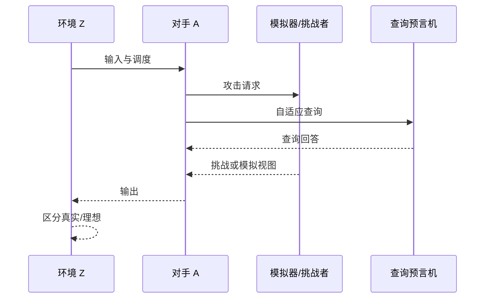

# 随机算法与交互对手

## 本章导读

密码学中的算法几乎从不只是确定性函数。密钥生成需要随机性，加密需要随机性，采样噪声需要随机性，安全实验中的挑战比特需要随机性，对手也会使用随机策略。更进一步，协议不是单次函数调用，而是参与方之间多轮消息交换、状态更新和查询响应的过程。若不能精确描述随机算法和交互对手，后续的 IND-CCA、EUF-CMA、零知识、AKE 与 mmKEM 安全定义都无法严格展开。

本章从概率图灵机开始，逐步引入 $\mathsf{PPT}$、交互式算法、带状态对手、自适应查询、辅助输入、非一致性、模拟器和环境。目标不是扩展完整复杂性理论谱系，而是为格基密码论文中常见的下列表述提供形式化解释：令 $\mathcal{A}$ 为任意 $\mathsf{PPT}$ 对手，访问解封装预言机 $\mathcal{O}_{\mathsf{Decaps}}$ 与随机预言机 $\mathcal{O}_H$，归约 $\mathcal{B}^{\mathcal{A}}$ 通过模拟查询并嵌入 LWE 挑战来求解判定 LWE。

## 概率图灵机与随机带
### 随机变量视图

随机算法的每次运行都可以看成在随机币空间上诱导一个输出分布。输入 $x$ 固定时，$\mathsf{Alg}(x;R)$ 中的随机币 $R$ 决定输出 $Y$。安全证明比较的往往不是单个输出值，而是两个随机过程产生的联合分布。挑战者随机币、对手随机币、预言机随机币和采样器随机币共同构成实验的概率空间。

这种视图有助于区分“算法错误”与“分布替换”。算法错误表示同一实验中某个输出不满足目标条件；分布替换表示证明把一个随机过程替换为另一个随机过程，并用不可区分性或统计距离控制替换损失。混合论证中的每一步都需要明确随机变量如何耦合、哪些随机币保持不变、哪些分布被替换。

### 随机性复用与独立性

密码证明中经常写出多个独立采样符号，例如 $r_1\leftarrow\{0,1\}^\ell$ 与 $r_2\leftarrow\{0,1\}^\ell$。独立性不是装饰性语法，而是分布正确性的组成部分。若实现复用随机种子、复用签名 nonce、复用加密临时秘密或把不同噪声向量从同一短输出截取而未分析相关性，证明模型中的独立采样假设可能失效。

格基签名尤其依赖这一点。拒绝采样、挑战生成和响应向量之间的相关性必须被严格控制，否则签名可能泄漏秘密向量的线性信息。KEM 中的封装随机性、密文压缩误差和密钥导出输入也需要明确独立关系，避免跨会话相关性造成攻击面。

概率图灵机是在普通图灵机的基础上加入随机带或随机转移机制的计算模型。直观地说，算法在运行过程中可以读取随机比特，从而对同一输入产生不同输出。若随机化算法记为 $\mathsf{Alg}$，输入为 $x$，则输出 $Y$ 是一个随机变量，写作 $Y\leftarrow\mathsf{Alg}(x)$。若需要显式记录随机币 $r$，则写作 $y:=\mathsf{Alg}(x;r)$。

随机带的重要性在于它允许本文把“算法的随机选择”变成证明中可控制的对象。安全证明经常需要固定某次运行的随机币，或者在两个游戏之间复用同一随机币来证明分布一致。例如在混合论证中，若两个游戏除某个子过程外完全相同，证明者常把其余随机币耦合为相同，从而把优势差异集中到被替换的分布上。

在格基密码中，随机性来源非常多。矩阵 $\mathbf{A}$ 可能由公开种子展开，秘密 $\mathbf{s}$ 来自短分布 $\chi_s$，误差 $\mathbf{e}$ 来自 $\chi_e$，加密随机性产生临时向量，KEM 封装还会生成共享秘密或随机消息。若这些随机量在证明中被混淆，就会导致错误独立性假设。例如把密钥噪声与加密噪声看成同一分布并不等于它们可以复用同一随机币；复用随机性往往会破坏安全。

$$
\mathbf{s}\leftarrow\chi_s^n,
\qquad
\mathbf{e}\leftarrow\chi_e^m,
\qquad
\mathbf{A}\xleftarrow{\$}\mathbb{Z}_q^{m\times n}
$$

随机算法还需要区分理论随机源与实现随机源。理论中常假设随机比特完全均匀独立；实现中则通常由熵源、DRBG、$\mathsf{XOF}$ 或系统随机数接口提供。第三卷主要处理理论模型，但理论模型与实现工程之间存在如下接口：证明中的独立均匀随机性必须在实现卷中被随机性工程重新审计。若某个方案的签名随机数复用或噪声种子泄漏，理论安全假设通常无法拯救实现。

## PPT、期望多项式时间与严格多项式时间
### 截断技术与运行时间界

期望多项式时间算法的平均运行时间受多项式控制，但单次运行可能非常长。安全定义中常使用严格多项式时间，是为了使实验在固定时间界内结束并便于组合。若一个归约只具有期望多项式时间，通常可以通过截断技术把运行时间限制在某个多项式上，同时把截断失败概率计入安全损失。

截断的基本形式是：当运行步数超过 $T(\lambda)$ 时强制停止并输出失败。若原算法期望时间为 $p(\lambda)$，由 Markov 不等式可知超时概率至多为 $p(\lambda)/T(\lambda)$。选择足够大的多项式 $T$ 可以把超时概率压到所需范围，但该损失必须写入证明账本。

$\mathsf{PPT}$ 是概率多项式时间算法的缩写。一个算法族 $\mathcal{A}$ 若在安全参数 $\lambda$ 下运行时间由 $\operatorname{poly}(\lambda)$ 控制，并且可以使用随机币，则称为 $\mathsf{PPT}$ 算法。现代密码学中的经典对手通常被限制为 $\mathsf{PPT}$，这表示攻击者可以高效随机计算，但不能进行指数级穷举或无限计算。

严格多项式时间算法要求每次运行都在多项式步内停止。期望多项式时间算法则允许少数运行时间较长，只要求期望运行时间为多项式。许多采样算法天然具有拒绝重试结构，例如从某个提议分布采样后按概率接受，不接受则重新尝试。如果接受概率有常数下界，则期望重试次数为常数；但若没有尾界，算法仍可能在极小概率下运行时间较长。

$$
\mathbb{E}[T_{\mathsf{Alg}}(\lambda)]\leq\operatorname{poly}(\lambda)
$$

在密码安全定义中，为了避免复杂技术细节，通常要求对手是严格 $\mathsf{PPT}$。对于方案算法本身，若存在拒绝采样或重试过程，教材写作应说明如何把期望多项式时间算法截断为严格多项式时间算法，并把截断失败概率计入正确性或统计误差。例如签名方案中若重试次数超过上限，则输出失败；只要该失败概率可忽略，理论上可以接受，但实现中还要考虑拒绝次数是否泄漏秘密。

在格基 KEM 中，封装和解封装一般应是固定上界运行的算法。解封装尤其敏感，因为 CCA 对手可以提交大量畸形密文并观察返回行为。如果解封装时间依赖密文是否通过重加密验证、噪声是否越界或哈希查询是否命中，就可能形成侧信道。计算模型中的 $\mathsf{PPT}$ 只限制运行时间的渐近大小，不自动保证常数时间实现；这是理论卷与实现卷之间必须衔接的地方。

## 交互式算法与协议状态
### Transcript 与状态绑定

交互协议的 transcript 是按顺序记录的消息序列。许多安全性质并不只依赖最后一条消息，而是依赖完整 transcript 的哈希、签名、承诺或密钥派生。若某轮消息没有绑定上下文，攻击者可能把一个会话中的消息转移到另一个会话，形成重放、反射或未知密钥共享攻击。

格基协议中，transcript 绑定通常通过哈希函数或随机预言机实现。需要纳入的字段包括参与方身份、参数标识、公钥、密文、承诺、挑战、会话编号、算法版本和失败标志。字段缺失并不一定破坏底层 LWE/SIS 困难性，但可能破坏协议层安全目标。

交互式算法不是一次性输入输出函数，而是在多个轮次中接收消息、更新内部状态并发送消息的过程。一个协议参与方通常拥有长期输入、会话输入、本地随机币、内部状态和输出寄存器。对于认证密钥交换、群组密钥协商、零知识证明和多接收者 KEM，协议状态往往比单个算法输入更重要。

状态至少包括三类信息。第一类是密码状态，如长期私钥 $\mathsf{sk}$、临时秘密、噪声向量和随机种子。第二类是协议状态，如会话标识、参与方身份、轮次编号、已经收到的消息和 transcript。第三类是安全实验状态，如攻击者是否已经发起挑战、某个会话是否被测试、某个密钥是否被腐化。若这些状态没有明确建模，许多安全定义都会出现二义性。

$$
\mathsf{state}_{i+1}:=\mathsf{Update}(\mathsf{state}_i,\mathsf{msg}_i;r_i)
$$

上式抽象表示参与方在第 $i$ 轮根据当前状态、收到的消息和本地随机币更新状态。该写法强调了一个基本事实：协议安全不是只看最终密钥，还要看中间消息如何影响状态。格基协议中常见的错误包括重复使用临时秘密、不同会话复用同一噪声、多轮消息没有绑定身份、群组协议中成员变更没有更新 transcript。

交互式模型还要求规定消息调度。诚实执行中，消息按协议顺序发送；攻击环境中，对手可以延迟、重放、删除、交错或修改消息。并发会话下，同一参与方可能同时处理多个协议实例。若协议没有把会话标识 $\mathsf{sid}$、参与方集合和算法套件写入哈希或 KDF 上下文，攻击者可能把一个会话的消息搬到另一个会话中，形成未知密钥共享或跨协议攻击。

## 自适应查询与带状态对手
### 自适应性的证明成本

自适应攻击的关键在于查询顺序依赖此前回答。归约模拟此类攻击时，不能预先固定所有查询内容，也不能假设攻击者不会查询证明中的关键点。随机预言机证明、CCA 解封装证明和签名伪造证明中，许多损失项都来自“猜测关键查询位置”或“在正确时刻编程预言机”。

例如攻击者最多进行 $Q_H$ 次哈希查询，归约需要命中其中某一次以提取信息，则常见损失为 $1/Q_H$ 或其变体。若同时存在签名查询、解密查询和腐化查询，损失可能叠乘或相加。自适应查询越多，证明越需要精确记录失败事件。

自适应对手是指攻击者下一步行为可以依赖此前收到的回答。与一次性攻击相比，自适应攻击更接近真实网络环境：攻击者可以先查询若干密文的解封结果，再构造挑战；也可以先获得若干签名，再伪造新消息；还可以根据随机预言机返回值调整后续查询。安全实验必须明确对手拥有哪些查询接口。

常见查询接口包括加密预言机 $\mathcal{O}_{\mathsf{Enc}}$、解密预言机 $\mathcal{O}_{\mathsf{Dec}}$、封装预言机 $\mathcal{O}_{\mathsf{Encaps}}$、解封装预言机 $\mathcal{O}_{\mathsf{Decaps}}$、签名预言机 $\mathcal{O}_{\mathsf{Sign}}$、验证预言机 $\mathcal{O}_{\mathsf{Vrfy}}$、随机预言机 $\mathcal{O}_H$ 和腐化预言机 $\mathcal{O}_{\mathsf{Corrupt}}$。每个预言机都需要维护状态，例如查询表、已签名消息集合、挑战密文集合或腐化记录。

$$
\mathcal{A}^{\mathcal{O}_1,\ldots,\mathcal{O}_t}(1^\lambda)
$$

该记号表示对手 $\mathcal{A}$ 在输入安全参数 $1^\lambda$ 时，可以访问预言机 $\mathcal{O}_1,\ldots,\mathcal{O}_t$。在证明中，归约 $\mathcal{B}$ 往往要模拟这些预言机。模拟成功并不只是返回某个看似合理的答案，而是要保证对手看到的联合分布与真实实验一致或不可区分。若某个查询无法模拟，归约需要定义失败事件 $\mathsf{bad}$，并界定其概率。

以格基 KEM 的 CCA 安全为例，对手可以在挑战前后查询解封装预言机，但不能查询挑战密文本身。归约需要对任意密文 $\mathsf{ct}$ 执行与真实解封装一致的处理，通常包括解码、重计算哈希、重加密验证、KDF 派生和失败返回。若证明在某一步把真实密钥替换为随机密钥，模拟器还必须确保攻击者无法通过解封装查询发现替换发生。这正是 FO 变换证明复杂的原因之一。

## 辅助输入、非一致性与多用户环境

辅助输入是对手在安全实验开始时额外获得的信息。它可以是公开参数的函数、实现平台信息、预计算表、标准文档、甚至与安全参数有关的 advice。若对手被允许非一致计算，则对每个安全参数 $\lambda$，它可以拥有一段长度为 $\operatorname{poly}(\lambda)$ 的建议信息。这种模型比统一 $\mathsf{PPT}$ 更强，也更贴近长期部署中攻击者提前准备的情况。

非一致性常用电路族表达。对每个输入长度都有一个电路 $C_\lambda$，它可以被视为针对该长度专门设计的攻击程序。密码学中使用非一致对手，是为了避免安全依赖于攻击者无法“把参数写死到程序里”的不自然假设。例如标准化参数固定后，攻击者完全可以针对 Kyber 或 Dilithium 的某个参数集长期优化攻击代码。

多用户环境进一步放大了辅助输入的意义。假设系统中有 $N$ 个用户，每个用户生成独立公钥。攻击者可以先做一次昂贵预计算，然后针对所有用户寻找弱点。若安全证明只在单用户场景下给出优势 $\epsilon$，多用户优势可能增长到约 $N\epsilon$，甚至在多目标哈希或批量攻击中出现更复杂的摊还效应。

$$
\operatorname{Adv}^{\rm mu}_{\Pi}(\mathcal{A})
\leq
N\cdot \operatorname{Adv}^{\rm su}_{\Pi}(\mathcal{B})+\delta
$$

上式是许多多用户安全分析中的典型形态。该式不是普遍定理，而是表达了一个常见的安全损失结构：用户数 $N$ 往往进入安全损失。对于格基 KEM 部署，若同一参数集服务于海量用户，单用户安全位数不能直接等于系统级安全位数。安全估计需要同时考虑用户数、会话数、查询数和攻击者预计算能力。

## 模拟器、环境与实验调度

模拟器 $\mathcal{S}$ 是安全证明中的核心角色。它的任务是在没有某些真实秘密的情况下，为攻击者生成一个不可区分的视图。在基于游戏的证明中，模拟器常隐含在归约内部；在基于模拟的定义中，模拟器则是明确定义的算法，用于把理想世界执行伪装成真实世界执行。无论哪种形式，模拟器都必须维护状态并回答查询。

环境通常记为 $\mathcal{Z}$，它负责选择输入、调度协议、接收输出并最终区分真实世界与理想世界。在简单 IND-CPA 游戏中，环境概念不明显；但在可组合安全、AKE、GKE 和 mmKEM 中，环境可以并发启动多个会话、腐化某些参与方、安排消息交错并观察协议输出。若不引入环境，就难以精确描述协议在更大系统中组合时的安全性。

在格基协议中，模拟难点往往来自代数结构与分布要求同时存在。例如模拟器可能要生成看似均匀的公开矩阵，同时嵌入 LWE 挑战；要回答哈希查询，同时在某个目标点编程；要处理解封装失败，同时保持失败分布与真实实现一致；要模拟零知识证明，同时保证响应向量不泄漏秘密。这些任务都依赖本章建立的随机算法、状态和查询模型。

本章最后收束为一个原则：安全证明不是只比较最终输出，而是比较攻击者能够看到的完整视图。视图包括公开参数、所有消息、所有查询回答、时间顺序、失败标志、腐化结果和最终挑战。“视图”理解成攻击者在实验中记录的完整日志；证明安全，就是证明这份日志在真实世界和模拟世界中无法被高效区分。

## 本章小结
### 视图优先原则

随机算法与交互对手的核心对象是视图分布。公开参数、随机币、消息序列、查询回答、失败标志、腐化结果和最终输出共同决定攻击者视图。安全证明比较真实视图与模拟视图，而不是只比较最终密钥或最终比特。该原则贯穿后续所有安全实验。
