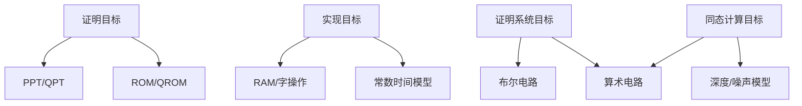

# 计算模型谱系

## 本章导读

同一个密码方案可以被多种计算模型观察。理论证明中，算法通常是图灵机或概率多项式时间算法；实现评估中，算法运行在 RAM 模型、字操作模型和具体处理器上；零知识、电路安全和同态计算中，算法被写成布尔电路或算术电路；后量子安全中，对手可能是量子多项式时间算法，并且在 QROM 中可进行量子叠加查询。若模型没有明确，许多结论会被误用。

本章的目标是建立一张“计算模型地图”。不同模型并非互相矛盾，而是强调不同层面的成本和能力。格基密码的特殊之处在于它横跨这些模型：LWE 归约多用图灵机语言，NTT 实现要看 RAM 与缓存，ZK 证明要看电路大小，FHE 要看乘法深度，QROM 证明要看量子查询。理解模型差异，是正确阅读论文和标准文档的前提。

## 单带、多带与 RAM 模型
### 字操作模型与实现成本

字操作模型在 RAM 模型基础上进一步把机器字大小纳入成本估计。格基实现常对 16 位、32 位或 64 位字进行模加、模乘、Montgomery 约减、Barrett 约减和向量化操作。若模数 $q$ 能够适配机器字，单次运算可近似看成常数成本；若 $q$ 较大或需要多精度表示，成本会明显上升。

因此，渐近复杂度相同的多项式乘法在具体实现中可能表现不同。NTT 的理论成本为 $O(n\log n)$，但蝶形运算的模约减次数、根表访问方式、缓存命中率和 SIMD 布局决定实际性能。实现安全还要求常数时间访问，避免秘密相关分支和秘密相关地址。

单带图灵机是最经典的抽象计算模型。它有一条无限纸带、一个读写头和有限状态控制器。每一步根据当前状态和读到的符号，写入新符号、移动读写头并更新状态。该模型非常适合给出计算可判定性和渐近复杂性的基础定义，但它与真实计算机的内存结构差距较大。

多带图灵机允许多条纸带和多个读写头。它在模拟具体算法时更方便，例如可以一条带保存输入、一条带保存工作数据、一条带保存输出。单带与多带模型在多项式时间意义下等价：一个模型中的多项式时间算法可以由另一个模型以多项式开销模拟。因此，复杂性理论通常不关心二者之间的多项式差异。

RAM 模型更接近实际程序。它假设内存由可随机访问的单元组成，每条指令可以读取或写入某个地址。格基密码实现中的多项式乘法、矩阵向量乘法、模约减、采样和哈希展开，都更适合在 RAM 或字操作模型中分析。若一个机器字能容纳 $w$ 位，则对 $q$ 位模数的加法、乘法和约减成本还要依赖 $q$ 与 $w$ 的关系。

$$
T_{\rm RAM}(\mathsf{NTT})=\widetilde{O}(n)
$$

这里的 $\widetilde{O}(n)$ 隐去多对数因子，表示 NTT 在适当模数和预计算根存在时可近似线性对数时间运行。然而真实实现还受到缓存局部性、向量化、内存带宽和常数时间要求影响。理论上两个算法同为 $O(n\log n)$，实际速度可能相差数倍；其中一个还可能因数据依赖访存而泄漏秘密。

因此，图灵机模型适合证明“可高效计算”，RAM 模型适合估计“如何运行”，常数时间模型适合分析“是否泄漏”。格基密码写作中不应混淆这些层次。安全归约中说 $\mathcal{B}$ 为 $\mathsf{PPT}$，并不说明它的实现是常数时间；实现文档中说某段代码使用固定循环，也不自动给出数学安全归约。

## 布尔电路与非一致计算
### 电路族与非一致建议

布尔电路模型通常讨论一族电路 $\{C_n\}_{n\in\mathbb{N}}$，其中 $C_n$ 处理长度为 $n$ 的输入。非一致性表示每个输入长度可以拥有单独电路，而不要求存在统一算法高效生成这些电路。复杂性类 $\mathbf{P/poly}$ 正是在这种语境下出现，它可视为多项式大小电路族能够判定的问题集合。

密码学中的非一致对手可以把大量预计算信息固化进电路。对于固定参数系统，攻击者可能离线预计算表、筛法数据库或针对特定公参的辅助信息。安全证明若允许非一致对手，辅助输入和建议串必须被纳入优势定义。

布尔电路由输入线、逻辑门和输出线组成，常见门包括 $\mathsf{AND}$、$\mathsf{OR}$、$\mathsf{NOT}$ 和 $\mathsf{XOR}$。电路大小通常指门数量，电路深度指从输入到输出经过的最长门路径长度。与图灵机不同，电路是固定输入长度的计算对象；每个安全参数或输入长度通常对应一个电路 $C_\lambda$。

电路模型自然表达非一致计算。攻击者可以针对每个 $\lambda$ 拥有一个不同电路，这相当于允许一段依赖 $\lambda$ 的 advice 被硬编码进电路。密码学中考虑非一致对手，是为了防止安全性依赖于“攻击者无法提前针对参数做准备”这一不合理限制。标准化参数固定多年后，攻击者完全可以为该参数集设计专用硬件或优化电路。

布尔电路在格基密码中还有工程意义。若要把一个格基验证算法放入零知识证明系统、MPC 协议或硬件设计中，就需要把模加法、模乘法、比较、范数检查、NTT 和哈希函数转化为布尔门。此时，门数量与深度直接影响证明大小、验证时间或硬件面积。某个算法在软件中运行速度较高，并不表示它的布尔电路较小；哈希函数就是典型例子。

| 操作 | 布尔电路关注点 | 格基密码场景 |
| :--- | :--- | :--- |
| 模加法 | 进位链、位宽 | LWE 样本计算 |
| 模乘法 | 乘法器大小、约减逻辑 | NTT 与环乘 |
| 范数比较 | 比较器、绝对值 | 签名验证与 ZK 关系 |
| 哈希/XOF | 置换电路大小 | Fiat–Shamir 与 KDF |
| 解码 | 分支与合法性检查 | KEM 解封装 |

在电路模型下，时间与空间被替换为大小与深度。对并行硬件而言，深度影响延迟，大小影响资源。对零知识证明而言，约束数或门数影响证明生成成本。对同态加密而言，乘法深度影响噪声增长和是否需要自举。格基密码的许多高级应用都要求算法描述能够转换为电路描述。

## 算术电路与代数计算
### 约束系统与证明成本

算术电路常被转化为 R1CS、Plonkish 约束或 AIR 形式。每个约束描述有限域元素之间的代数关系，证明系统的生成时间、证明大小和验证时间通常与约束数量、约束度数、查找表使用量和多项式承诺开销相关。格基零知识中，模线性关系、范数界、分解约束和范围约束都会被拆分为可证明的算术关系。

格基对象转入有限域约束时，需要处理模数不一致问题。LWE 的模数 $q$ 不一定等于证明系统底层域大小 $p$，因此常用位分解、范围证明、进位约束或 CRT 表示来表达 $\bmod q$ 运算。若转换遗漏范围约束，证明可能在大域中成立，却不对应原始格关系。

算术电路是在某个环或域上使用加法门与乘法门计算多项式函数的模型。与布尔电路逐比特处理不同，算术电路可以把 $\mathbb{Z}_q$ 中的元素视为基本对象。对于格基密码而言，这种模型非常自然，因为 LWE、SIS、RLWE 和 MLWE 都大量使用模线性代数和多项式环运算。

例如，矩阵向量乘法 $\mathbf{A}\mathbf{s}$ 在算术电路中可以用 $mn$ 个乘法和约 $mn$ 个加法表达。如果 $\mathbf{A}$ 是结构化环矩阵，则多项式乘法可用卷积或 NTT 优化。算术电路能够清楚表达代数结构，也方便与代数攻击、Gröbner 基方法和 Arora–Ge 线性化思想连接。

$$
\mathbf{b}=\mathbf{A}\mathbf{s}+\mathbf{e}\pmod q
$$

上式在 LWE 中只是一行公式，但若转化为电路，需要明确每个坐标如何相乘、相加和约减。若是在 $R_q$ 中，则 $a\star s+e$ 的乘法还要按照模多项式 $\phi(X)$ 约简。不同表示会导致不同电路：系数域卷积、NTT 频域逐点乘法、CRT 分解后的并行计算，都对应不同的门结构和约束系统。

算术电路也常用于零知识证明。证明者可能需要证明自己知道 $\mathbf{s},\mathbf{e}$，使得 $\mathbf{b}=\mathbf{A}\mathbf{s}+\mathbf{e}$，同时 $\mathbf{s},\mathbf{e}$ 满足小范数或小范围约束。线性等式在算术电路中成本较低，但范围证明、范数证明和二进制分解可能非常昂贵。因此，一个关系在数学上简单，不代表证明系统中便宜。

需要注意的是，算术电路中的“一个乘法门”不是现实世界中的恒定成本。若底层元素是大模数整数、多项式环元素或扩域元素，一个门可能隐藏大量位级运算。写作中需要明确当前电路是在 $\mathbb{F}_q$ 上、$\mathbb{Z}_q$ 上，还是在某种抽象环上；若 $q$ 非素数，$\mathbb{Z}_q$ 不是域，许多域上电路性质不能直接照搬。

## 量子计算模型
### 经典控制与量子数据

量子算法通常由经典控制逻辑与量子寄存器操作组成。经典部分决定电路结构、测量位置和后处理方式；量子部分在酉变换、查询操作和测量中演化。量子多项式时间不等于“每个经典算法自动量子加速”，而是允许使用量子叠加、干涉和测量来设计新算法。

后量子密码安全中的核心问题是：给定公钥、密文和预言机接口，量子对手能否以多项式时间获得非可忽略优势。已知量子算法能够加速某些搜索和周期结构问题，但对一般格问题没有类似 Shor 算法对因数分解和离散对数的多项式时间攻击。参数评估仍需要考虑 Grover 型平方加速和量子格攻击模型。

后量子密码要求方案抵抗量子多项式时间对手，即 $\mathsf{QPT}$ 对手。量子计算的基本单位是量子比特，其状态可以是 $|0\rangle$ 与 $|1\rangle$ 的复线性叠加。多个量子比特组成的系统可以处于纠缠态。量子算法通过酉变换、辅助量子寄存器和测量产生输出分布。

第三卷不展开完整量子算法理论，但需要精确区分量子模型与经典随机模型的差别。经典随机算法在任一时刻拥有一个具体内部状态，只是该状态对外部观察者随机；量子算法的内部状态可以是多个计算路径的叠加，测量会改变状态，未知量子态不能被任意复制。这些性质会影响重绕、查询记录和随机预言机编程。

$$
|\psi\rangle=\alpha|0\rangle+\beta|1\rangle,
\qquad
|\alpha|^2+|\beta|^2=1
$$

上式表示单量子比特纯态的基本形式。测量该状态时，以 $|\alpha|^2$ 的概率得到 $0$，以 $|\beta|^2$ 的概率得到 $1$。在密码安全语境中，攻击者可以使用量子计算寻找结构、加速搜索或执行量子查询。Grover 搜索使无结构搜索获得平方根加速，BHT 类算法影响碰撞搜索复杂度，这会改变对称密钥长度和哈希输出长度的保守估计。

格基密码被称为后量子候选，并不是因为已经证明 LWE 或 SIS 不在 $\mathbf{BQP}$ 中。更准确地说，目前没有已知经典或量子多项式时间算法能在推荐参数下求解这些问题；同时，LWE/SIS 拥有强大的最坏到平均归约和长期攻击审计。安全写作中应避免说“格问题已证明量子安全”，而应说“在已知经典和量子攻击下被认为困难，并在特定模型和参数下有归约证据”。

## 量子查询与 QROM 接口

经典随机预言机中，攻击者提交一个具体字符串 $x$，预言机返回 $H(x)$。模拟器可以维护查询表，看到某个点被查询后记录它，必要时还可以在未查询点编程。量子随机预言机模型中，攻击者可以对输入叠加进行查询，大致形式是把 $|x,y\rangle$ 映射为 $|x,y\oplus H(x)\rangle$。这意味着攻击者一次查询可能“同时触及”许多输入。

这种差异使经典 ROM 证明中的许多技巧失效。经典证明常说“若攻击者没有查询目标点，则它不知道哈希值；若查询了目标点，归约可以在查询表中找到它”。在 QROM 中，攻击者可能以较小振幅查询目标点，而不产生可直接读取的查询记录。模拟器若测量查询，会扰动量子状态；若不测量，又不知道该在哪个点编程。

$$
\mathcal{O}_H:|x,y\rangle\mapsto |x,y\oplus H(x)\rangle
$$

QROM 证明因此需要专门工具，例如 measure-and-reprogram 与 compressed oracle。它们提供在量子查询环境下选择、测量和重编程某个点的方式，并给出额外安全损失。对格基签名的 Fiat–Shamir 证明和格基 KEM 的 FO 变换证明而言，经典 ROM 安全不自动推出 QROM 安全，必须检查证明是否适应量子查询。

QROM 可以视为“哈希理想化的量子增强版”，而不是现实哈希函数本身。真实 SHAKE 或其他 XOF 只能被经典或量子电路计算；QROM 是证明模型。使用 QROM 的价值在于它更保守地反映量子对手对哈希的访问能力，但它仍然是理想模型，不等于标准模型证明。

## 模型选择与证明边界
### 模型声明的最小信息

技术文档中的模型声明至少需要覆盖算法类型、对手类型、预言机类型、输入分布、资源度量和输出事件。若证明在 ROM 中成立，模型声明需要写明随机预言机的输入输出长度与查询限制；若证明在 QROM 中成立，需要说明量子查询接口；若实现声称常数时间，需要说明时间模型、秘密数据范围和观测面。

模型声明不是附加说明，而是定理含义的一部分。同一方案在标准模型、ROM、QROM、带泄漏模型、多用户模型和可组合模型下可能具有不同安全结论。把模型写清楚，可以避免把局部证明误用为全局保证。

不同计算模型服务于不同问题。若目标是证明某个困难假设推出 IND-CPA 安全，通常使用 $\mathsf{PPT}$ 或 $\mathsf{QPT}$ 对手模型。若目标是估计软件性能，需要 RAM 和字操作模型。若目标是构造零知识证明，需要布尔或算术电路模型。若目标是评估 FHE 计算，需要电路深度和乘法层数。若目标是证明 Fiat–Shamir 在量子对手下安全，需要 QROM。

模型之间可以互相模拟，但模拟开销和保留性质不同。图灵机多项式时间算法可以转化为多项式大小电路族，但这可能引入非一致性。RAM 上高效的查表算法转化为电路时可能门数较大。经典 ROM 证明不能直接变成 QROM 证明。标准模型证明通常强于 ROM 证明，但可能效率更低或需要更强假设。

写作时应在每个定理或安全实验前明确模型。例如：“对任意 $\mathsf{PPT}$ 对手”表示经典计算安全；“对任意 $\mathsf{QPT}$ 对手”表示量子计算安全；“在 $\mathsf{RO}$ 中”表示随机预言机模型；“在 $\mathsf{QRO}$ 中”表示量子随机预言机模型。若某个结果只在 ROM 中成立，不能在摘要中省略模型；若某个实现通过常数时间审计，也不能因此声称标准模型可证明安全。

本章的核心结论是：模型不是形式主义负担，而是安全论证的边界线。格基密码的强大之处在于它能在多个模型中形成相对完整的证据链；格基密码的复杂之处也正在于，需要明确每条证据链覆盖什么、不覆盖什么。

## 本章小结
### 模型转换边界

不同计算模型之间可以互相模拟，但模拟开销和可观察资源并不相同。图灵机模型给出渐近高效性，RAM 模型接近实现成本，电路模型服务证明系统与硬件约束，量子模型描述后量子攻击能力。模型转换需要同时记录成本、输入输出和安全含义。
