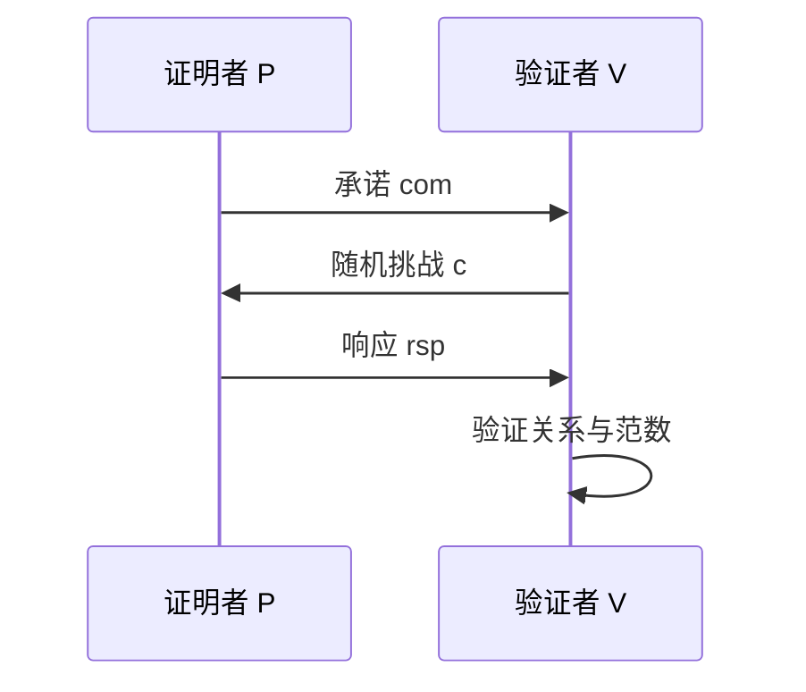

# 交互证明背景

## 本章导读

交互证明研究一个计算能力强的证明者如何通过多轮通信说服验证者某个语句为真。零知识证明进一步要求验证者在被说服的同时不获得见证信息。格基密码中，交互证明不仅服务于零知识卷，也服务于签名、Fiat–Shamir 变换、认证密钥交换、群组协议和多接收者 KEM 的验证结构。

本章介绍 IP、知识复杂性、Arthur–Merlin 协议、PCP 直觉、并发与重置环境，并说明这些概念如何连接格基协议。本章不展开所有定理证明，重点在于交互证明的三个核心问题：验证者为什么相信，证明者泄漏了什么，以及协议在并发环境中是否仍然安全。

## IP 与交互验证
### 完整性误差与可靠性误差

完整性误差描述真语句被诚实证明者证明时仍被拒绝的概率。可靠性误差描述假语句被作弊证明者说服验证者接受的概率。二者来源不同：完整性误差可能来自采样失败、拒绝采样、范围边界或随机挑战；可靠性误差通常来自挑战空间大小、承诺绑定性或知识提取失败。

在格基协议中，完整性误差需要与底层密码原语的正确性失败区分。KEM 解封装失败、签名拒绝采样失败、零知识证明中的抽样失败都可能出现概率项，但它们属于不同实验。清晰区分这些误差，有助于后续组合安全分析。

交互证明系统包含证明者 $\mathcal{P}$ 和验证者 $\mathcal{V}$。公共输入为语句 $x$，证明者可能拥有私有见证 $w$。双方进行若干轮消息交换，最后验证者输出接受或拒绝。若 $x$ 为真，诚实证明者应使验证者接受；若 $x$ 为假，任何作弊证明者都难以使验证者接受。

完整性表示真语句可被证明。若 $(x,w)\in\mathcal{R}$，诚实证明者 $\mathcal{P}(w)$ 与诚实验证者 $\mathcal{V}$ 交互后，验证者需要以高概率接受。可靠性表示假语句不能被伪造证明。若 $x\notin L_{\mathcal{R}}$，任意高效或无界作弊证明者 $\mathcal{P}^*$ 使验证者接受的概率都应较小。

$$
\Pr[\langle\mathcal{P}(w),\mathcal{V}\rangle(x)=1]\geq 1-\varepsilon_{\rm comp}
$$

$$
\Pr[\langle\mathcal{P}^*,\mathcal{V}\rangle(x)=1]\leq \varepsilon_{\rm sound}
$$

在格基零知识中，语句常是某个模线性关系，见证是短向量。验证者希望确认 $\mathbf{A}\mathbf{z}=\mathbf{u}\pmod q$ 且 $\|\mathbf{z}\|\leq\beta$，但证明者不想暴露 $\mathbf{z}$。交互证明通过承诺、挑战和响应结构，使验证者获得统计或计算意义上的信心。

交互验证的关键不是把见证直接发给验证者。直接发送 $\mathbf{z}$ 虽然可验证，却完全泄漏见证。密码协议需要在“可验证”和“不泄漏”之间取得平衡。这正是知识复杂性和零知识概念出现的原因。

## 知识复杂性与零知识直觉
### 模拟器的角色

零知识的形式化核心是模拟器。若验证者从真实交互中获得的视图可以由一个不持有见证的模拟器生成，则交互没有泄漏见证信息。视图通常包括验证者随机币、收到的消息、内部状态和最终输出。模拟器输出分布与真实视图之间可以要求完全相同、统计接近或计算不可区分。

格基零知识证明常使用承诺—挑战—响应结构。模拟器需要先选择挑战和响应，再构造与之匹配的承诺，从而生成看似真实的 transcript。为了使这种反向构造成立，协议设计必须保证承诺分布、响应分布和拒绝采样规则满足零知识条件。

知识复杂性关注验证者从证明过程中获得了多少知识。零知识要求验证者除了语句为真之外，不能学到关于见证的额外信息。形式上，若存在模拟器 $\mathcal{S}$，它在不知道见证 $w$ 的情况下可以生成与真实交互视图不可区分的 transcript，则协议是零知识的。

$$
\mathsf{View}_{\mathcal{V}^*}^{\rm real}(x,w)
\approx
\mathsf{View}_{\mathcal{S}}^{\rm sim}(x)
$$

这里的 $\mathcal{V}^*$ 是可能作弊的验证者。真实视图包括验证者的随机币、收到的消息和内部状态；模拟视图由模拟器仅根据公共语句生成。若二者完美相同，称为完美零知识；若统计接近，称为统计零知识；若仅对高效区分器不可区分，称为计算零知识。

格基零知识证明常需要隐藏短向量。一个简单但错误的做法是发送被随机扰动的见证；若扰动分布依赖见证，验证者可能通过统计偏差恢复信息。许多格协议使用拒绝采样、承诺和随机掩码，目的就是让响应分布与秘密无关或接近无关。模拟器能否生成同分布响应，是证明零知识的核心。

知识证明还要求若证明者能使验证者接受，则存在提取器可以从证明者中提取见证。对于 Sigma 协议，提取通常依赖同一承诺下两个不同挑战的有效响应。格基协议中的提取器需要从模线性等式中恢复短向量或等价见证，因此挑战空间、响应范数和承诺绑定性都影响可靠性。

## Arthur–Merlin 协议
### 公共随机性与 Fiat–Shamir

Arthur–Merlin 协议中的验证者随机挑战是公开随机性。Fiat–Shamir 变换把交互式挑战替换为哈希输出，使协议转化为非交互证明或签名结构。该转换的安全性通常在随机预言机模型或量子随机预言机模型中分析。

格基签名中的挑战往往由消息、承诺和公钥哈希得到。挑战空间大小影响可靠性，挑战与响应的分布影响零知识，哈希绑定字段影响不可伪造性。交互证明背景为理解签名安全证明提供了统一框架。

Arthur–Merlin 协议是一类公共随机交互证明。Arthur 代表验证者，Merlin 代表证明者。公共随机性意味着验证者的挑战可以视为公开随机串，而不是私有隐藏随机性。这种结构与 Sigma 协议和 Fiat–Shamir 变换关系密切。

许多三轮协议具有“承诺—挑战—响应”形式。证明者先发送承诺 $\mathsf{com}$，验证者发送随机挑战 $c$，证明者返回响应 $\mathsf{rsp}$，验证者检查 $(\mathsf{com},c,\mathsf{rsp})$ 是否一致。若挑战空间足够大，作弊证明者在不知道见证时难以同时回答多个挑战。

Fiat–Shamir 变换把验证者随机挑战替换为哈希输出：$c:=H(\mathsf{ctx}\Vert x\Vert\mathsf{com})$。这使交互式证明变成非交互式证明或签名。格基签名中，大量方案可看作对某个身份或消息执行 Fiat–Shamir 后得到的非交互证明。挑战必须绑定语句、承诺、消息、上下文和算法套件，否则可能出现重放或跨协议攻击。

公共随机性也带来证明模型问题。若挑战由真实哈希生成，证明通常在 ROM 或 QROM 中完成；若挑战来自公共随机串，则需要 CRS 或公共随机串模型。不同模型下的安全含义不同。把交互协议“哈希化”并不自动安全，必须证明 Fiat–Shamir 变换保留可靠性和零知识性质。

## PCP 与局部可验证性

PCP 理论研究验证者只读取证明中的少量位置，也能以高概率判断语句是否为真。虽然本书不会展开 PCP 定理，但局部可验证性是现代证明系统的重要思想。它说明证明可以被编码成冗余形式，使少量随机检查足以发现错误。

这种思想与密码协议有多种联系。Merkle 树承诺允许验证者只检查认证路径，而不是读取整棵树；向量承诺允许打开少量坐标；某些零知识证明把大关系拆成许多局部约束；FHE 和可验证计算也依赖把计算表达为可局部检查的约束系统。

在格基证明系统中，局部性常与线性关系和范数约束结合。线性关系可批量检查，短向量性质则需要额外证明。若证明系统能把高维向量关系压缩为少量随机线性组合，通信量和验证成本就会下降。但压缩必须保持可靠性，不能让作弊证明者通过小概率逃避检查。

>[!ANNOT]
>PCP 在本卷中只作为背景出现。重点在于“少量随机检查能够约束全局结构”这一思想，因为它会在承诺、证明系统和协议验证中反复出现。

## 并行、并发与重置环境
### 并发组合中的状态风险

并发环境中，多个协议实例可能交错执行。攻击者可以把一个会话中的消息延迟、复制或嵌入到另一个会话。若协议没有把会话标识、参与方身份和上下文写入 transcript，安全性质可能在单会话中成立而在并发环境中失败。

重置环境进一步允许攻击者让同一参与方以相同内部随机性重新运行某些步骤。对于依赖随机承诺或临时秘密的格基协议，重置可能暴露线性关系。协议实现需要确保每次会话的随机性独立，并在证明模型中明确状态更新规则。

单会话安全不自动推出并发安全。并行执行指多个协议实例同时运行，但轮次结构可能同步；并发执行允许攻击者任意交错不同会话消息；重置攻击允许攻击者把某个参与方恢复到旧状态并用不同消息重新交互。这些环境都会给协议安全带来额外挑战。

在零知识中，并发验证者可能把一个会话的消息用于另一个会话，试图从多个 transcript 中拼出见证信息。在 Sigma 协议中，若证明者对同一承诺回答两个不同挑战，提取器可能得到见证；这对可靠性有利，但若重置攻击迫使诚实证明者复用承诺，就可能泄漏秘密。签名随机数复用灾难与这一现象具有相似直觉。

格基协议中的并发问题还包括随机性复用和状态混淆。若两个 KEM 会话复用同一临时噪声，密文差分可能泄漏秘密；若群组协议没有绑定成员列表，攻击者可能把旧成员的消息搬入新会话；若零知识证明没有绑定上下文，证明可被复制到另一个语句中使用。

$$
\mathsf{ctx}=\mathsf{sid}\Vert\mathsf{pid}\Vert\mathsf{role}\Vert\mathsf{suite}\Vert\mathsf{transcript}
$$

上式表示一种上下文绑定思想。协议中的哈希、KDF、挑战和认证标签应吸收会话标识 $\mathsf{sid}$、参与方身份 $\mathsf{pid}$、角色、算法套件和 transcript。这样，即便消息字节相同，在不同会话或角色下也会得到不同挑战或密钥，降低跨协议攻击风险。

## 与格基协议的接口

交互证明背景将在后续多个方向出现。格基零知识直接以关系语言和交互证明为基础；格基签名常由 Fiat–Shamir 变换得到；认证密钥交换需要在交互 transcript 中绑定身份与密钥；群组协议需要处理多方并发和成员变化；mmKEM 需要验证共享头、接收者绑定和局部一致性。

每个协议型方案都需要明确公共输入、私有见证、随机挑战、消息轮次、会话标识、查询接口和腐化模型。若一个协议声称零知识，应给出模拟器；若声称知识证明，应给出提取器；若声称可组合，应定义环境和理想功能；若声称非交互安全，应说明 Fiat–Shamir 或 CRS 的模型。

本章的价值在于提供协议视角。格基密码不只是矩阵和噪声，也包括消息流、证明流、查询流和状态流。许多安全漏洞并不来自 LWE 本身被攻破，而来自协议没有正确绑定上下文、没有处理并发、没有避免随机性复用或没有证明模拟视图。理解交互证明，是从“会用格基原语”走向“能审查格基协议”的关键一步。

## 本章小结
### 协议视角

交互证明把密码对象放入消息流和状态流中分析。完整性、可靠性、零知识、并发安全和重置安全都依赖 transcript、随机性和上下文绑定。该视角为后续格基零知识、签名和认证协议提供基础。
