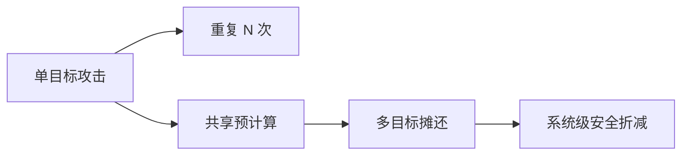

# 资源复杂度与参数化分析

## 本章导读

格基密码的安全不是由单个参数决定的。维度 $n$、模数 $q$、样本数 $m$、模块秩 $k$、噪声宽度、秘密分布、压缩参数、BKZ 块大小 $\beta$、用户数 $N$、查询数 $Q$ 和量子资源都会影响最终安全。若只说“安全参数为 $\lambda$”，不足以完成参数评估。

本章从参数化复杂度、细粒度复杂度、时间—内存折中、并行复杂度、量子资源估计和参数评估接口六个方面展开。目标是解释标准方案参数表背后的逻辑：为什么要同时报告攻击成本、内存、失败概率、归约损失和多用户损失；为什么一个看似微小的压缩或噪声选择会影响整体安全。

## 参数化复杂度视角
### 多参数安全面

格基密码的安全面由多个参数共同决定。维度影响格攻击指数，模数影响噪声率和代数结构，样本数影响可用方程数量，秘密分布影响搜索空间，压缩参数影响噪声增长和失败概率。任何单参数描述都会丢失重要信息。

因此，参数表不仅列出 $n$、$q$、$k$、$\eta$，还需要说明这些参数进入哪些成本模型。密钥大小和密文大小属于通信成本，NTT 次数和哈希调用属于运行成本，解封装失败率属于正确性成本，BKZ 块大小和筛法内存属于攻击成本。多参数表述能够把安全、效率和正确性放在同一坐标系中比较。

参数化复杂度强调把问题难度写成多个参数的函数，而不是只依赖总输入长度。在格基密码中，这一点尤其自然。LWE 的难度取决于维度 $n$、模数 $q$、样本数 $m$、误差分布 $\chi_e$ 和秘密分布 $\chi_s$；MLWE 还取决于环次数和模块秩；SIS 取决于短解界 $\beta_{\rm SIS}$ 与矩阵形状。

$$
T_{\rm attack}=T(n,q,m,\chi_s,\chi_e,\beta)
$$

这种写法提醒本章，攻击成本不是 $n$ 的单变量函数。增加模数可能改善正确性，却改变 LWE 噪声率和攻击成本；减小噪声可能提高解封装正确性，却削弱安全；增加模块秩可能提高安全，也增加密钥和密文大小。参数设计是在安全、正确性和效率之间寻找平衡。

参数化视角还能解释为什么不同方案同属 MLWE，却参数差异较大。某些方案选择较小模块秩但较大环次数，某些方案使用更强压缩以降低带宽，某些方案使用不同噪声分布以便常数时间采样。若只看“基于 MLWE”，无法比较它们的安全强度。

在写作中，参数应以表格形式集中声明，并在正文中说明每个参数的语义。尤其要避免同一符号在不同章节表示不同对象。例如 $\beta$ 可表示 BKZ 块大小，也可表示 SIS 短解界；按照统一符号表，应通过下标区分，如 $\beta_{\rm BKZ}$ 与 $\beta_{\rm SIS}$。

## 细粒度复杂度与指数常数
### 渐近符号的局限

$O(\cdot)$、$\widetilde{O}(\cdot)$ 和指数记号适合描述增长趋势，但不足以给出具体参数安全。两个攻击算法可能同为 $2^{\Theta(n)}$，却因指数常数不同而对应完全不同的安全级别。格攻击估计中，根 Hermite 因子、BKZ 模型、筛法常数和量子加速假设都影响指数常数。

技术文档中使用渐近符号时，需要配合具体成本估计。渐近安全说明参数族随 $\lambda$ 增长可达到安全目标，具体安全说明固定参数在当前模型下的攻击成本。二者互补，不能互相替代。

细粒度复杂度关注更精确的运行时间形式。对于实际密码安全而言，知道攻击是指数时间还不够；需要知道指数常数。$2^{0.29n}$ 与 $2^{0.1n}$ 都是指数时间，但安全含义完全不同。格攻击评估尤其依赖这些常数。

BKZ 相关攻击常以块大小 $\beta_{\rm BKZ}$ 为核心参数。枚举、筛法和量子变体对同一块大小给出不同成本模型。攻击者选择块大小越大，约简质量越高，但时间和内存成本也越高。参数估计器通常搜索最优块大小，使攻击成功条件与成本达到平衡。

$$
T_{\rm sieve}(\beta_{\rm BKZ})\approx 2^{c\beta_{\rm BKZ}+o(\beta_{\rm BKZ})}
$$

这里的常数 $c$ 依赖攻击模型。经典筛法、量子筛法和不同启发式假设会给出不同 $c$。此外，$o(\beta)$ 项、多项式因子和实现常数在中等参数下可能不可忽略。标准化安全估计通常会采用保守模型，并随着攻击研究进展更新。

细粒度分析还要关注成功概率。某些攻击可以用较低成本获得较低成功概率，通过重复放大；某些攻击成功率与噪声尾部或弱实例概率有关。若攻击成本估计没有说明成功概率，就无法转化为安全位数。安全位数本质上是成本、成功概率和资源模型共同决定的量。

## 时间—内存折中
### 预处理与在线攻击

时间—内存折中常把攻击分为预处理阶段和在线阶段。预处理可能针对公共参数、固定矩阵或某类实例构建数据结构；在线阶段利用该数据结构攻击具体密钥或密文。多用户系统中，预处理成本可以在大量目标之间摊销，因此单用户安全估计不能直接扩展到大规模部署。

格筛法和某些编码攻击都具有显著内存需求。若攻击时间降低但内存升高，需要把二者作为独立资源报告。安全级别只给出一个数字时，容易掩盖内存瓶颈或并行化条件。

时间—内存折中描述攻击者用更多内存换取更少时间，或用更多时间换取更少内存。格筛法是典型例子：它通过存储大量短向量并寻找组合来逐步缩短向量，因此内存需求较高。枚举算法通常内存较低，但时间可能更高。不同攻击在现实可行性上差异巨大。

生日攻击和多目标哈希攻击也体现时间—内存折中。攻击者可以预先存储表格，在大量目标中寻找匹配。对于 KEM 和签名中的哈希绑定，输出长度、目标数量和预计算能力共同决定安全边际。若系统部署规模较大，多目标效应不能忽略。

$$
T\cdot M \approx 2^\ell
$$

上式只是许多时间—内存折中的抽象示意，并非普遍定律。它表达的思想是：总搜索空间大小固定时，攻击者可能在时间 $T$ 和内存 $M$ 之间分配资源。具体攻击可能有不同指数关系，必须引用相应模型。

对于格基参数评估，应同时报告时间和内存。一个攻击若时间为 $2^{120}$ 但内存为 $2^{100}$ 个向量，现实可行性与单纯 $2^{120}$ 次操作不同。量子攻击还要报告量子内存，因为大规模量子内存可能远比经典内存昂贵。忽略内存会导致对攻击能力的误判。

## 并行复杂度与批量攻击

并行复杂度区分总工作量与墙钟时间。若攻击可完美并行，使用 $P$ 个处理器可将时间约降为 $T/P$，但总工作量仍为 $T$。若攻击存在串行瓶颈或内存通信瓶颈，并行加速会低于线性。现实攻击者可能拥有 GPU、FPGA、ASIC 或大规模集群，因此安全估计不能只以单核时间衡量。

格攻击中，不同算法并行性不同。筛法可在某些阶段并行处理向量，但需要共享或合并大表；枚举可并行搜索树的不同分支，但剪枝和负载均衡复杂；BKW 类攻击可并行处理样本和表；哈希搜索通常高度并行。参数评估应说明采用的是总门数、总操作数还是墙钟时间模型。

批量攻击在多用户场景中尤其重要。攻击者面对 $N$ 个公钥时，可能不需要独立攻击每个用户。某些预计算可跨用户复用，某些多目标攻击成功概率随目标数增加。安全证明中的多用户损失通常用 $N$ 或查询数线性放大，但实际攻击也可能出现摊还效应。

对部署而言，安全级别应按系统规模解释。一个面向少量设备的协议与一个全球浏览器生态中的 KEM 所需安全余量不同。多用户、多会话和长期密钥使用都会提高攻击者收益。格基密码标准化参数通常考虑大规模部署，因此保守性非常重要。

## 量子资源估计
### 逻辑量子资源与物理开销

量子攻击成本可以按逻辑门数、量子比特数、电路深度或查询次数估计。实际物理实现还需要纠错开销，物理量子比特数和运行时间可能远高于逻辑估计。后量子参数评估通常先在逻辑资源层面比较算法，再结合物理可行性讨论安全余量。

Grover 搜索给无结构搜索带来平方级加速，但并不自动把所有攻击平方加速。若攻击过程包含大量不可逆经典计算、内存访问或数据结构操作，量子化成本需要单独分析。格基参数文档中区分经典成本与量子成本，可以避免过度乐观或过度保守的估计。

量子资源估计不能只看查询复杂度。一个量子算法可能在理想查询模型下复杂度较低，但需要巨大的逻辑量子比特、T 门数、T 深度、纠错开销和量子内存。容错量子计算的物理成本可能远超逻辑门计数。后量子安全评估必须区分理想算法复杂度与现实资源需求。

Grover 搜索将无结构搜索从 $2^\ell$ 降到约 $2^{\ell/2}$ 次查询，但它具有串行深度要求，不能像经典并行搜索那样简单线性并行。量子碰撞搜索也会影响哈希输出长度估计。对于对称密钥和哈希参数，后量子设计通常通过增加长度来抵消这些加速。

$$
T_{\rm Grover}\approx 2^{\ell/2}
$$

对于格问题，目前没有已知类似 Shor 算法的多项式时间量子攻击。量子算法可能改善某些子程序，如筛法或搜索步骤，但整体仍被认为指数困难。参数估计中常分别报告经典成本和量子成本。若量子模型只是把某个经典子程序的指数常数降低，也必须说明降低幅度和资源假设。

量子资源还包括量子内存。许多理想量子算法需要保持大规模叠加和相干存储，这在现实中极其昂贵。若一个攻击需要指数级量子内存，其威胁程度不同于只需指数级经典时间的攻击。标准安全分析通常采用保守但不过度理想化的量子成本模型。

## 格密码参数评估接口
### 参数审计清单

参数审计可以按固定清单展开：问题假设、实例分布、参数生成、正确性失败、最佳已知攻击、经典/量子成本、内存、归约损失、多用户损失、实现侧信道、版本变更和弃用条件。该清单把理论安全与工程部署连接起来。

若参数发生微调，例如压缩位数减少、噪声分布改变或模数切换，审计需要重新计算失败概率和攻击成本。格基密码的参数高度耦合，小改动可能同时影响带宽、速度、安全和正确性。因此，参数版本管理本身就是安全工程的一部分。

一个完整的参数评估应输出多维信息，而不是单个安全位数。至少应包括：底层假设、实例分布、推荐攻击模型、最佳已知攻击、经典时间、经典内存、量子时间、量子内存、正确性失败概率、归约损失、多用户损失、实现安全余量和参数版本。这些信息共同限定安全结论的适用范围。

| 项目 | 应记录内容 | 作用 |
| :--- | :--- | :--- |
| 底层假设 | LWE/MLWE/SIS/MSIS/NTRU | 明确安全来源 |
| 分布参数 | $n,q,k,m,\chi_s,\chi_e$ | 确定实例族 |
| 攻击模型 | primal、dual、BKZ、量子变体 | 确定成本估计 |
| 资源成本 | 时间、内存、查询数 | 转化为安全级别 |
| 正确性 | DFR、尾界、压缩误差 | 防止失败攻击 |
| 证明损失 | 用户数、查询数、统计误差 | 连接理论保证 |

参数评估还应区分理论证明参数和实现参数。理论方案可能使用理想均匀矩阵和离散 Gaussian，标准实现可能使用种子展开矩阵和 CBD 噪声。若二者不同，应说明替换依据。压缩、编码、拒绝采样和错误处理都可能影响安全与正确性。

最终，参数选择是证据综合。最坏到平均归约提供理论基础，具体攻击估计提供现实安全，正确性分析防止失败泄漏，实现审计防止侧信道，协议分析防止组合攻击。任何单一指标都不足以代表格基密码安全。本章为后续攻击评估、标准方案剖析和实现审计建立资源语言。

## 本章小结
### 参数评估的整体性

参数评估需要同时覆盖安全、正确性、效率和实现约束。攻击时间、内存、量子资源、失败概率、通信成本和归约损失共同决定参数质量。单个安全位数只能作为摘要，不能替代完整审计。
