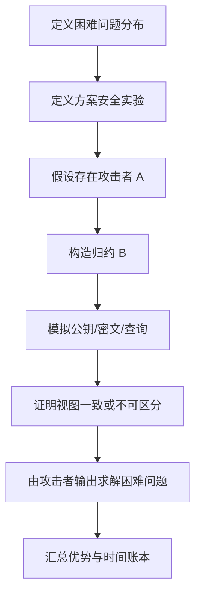

# 本卷总结与后续接口

## 本章导读

第三卷的主题是计算模型、复杂性理论与归约。它位于概率统计基础之后、可证明安全与格困难假设之前，承担桥梁作用。本卷并不追求完整覆盖理论计算机科学，而是为格基密码建立足够严谨的表达框架：怎样定义算法，怎样定义问题，怎样定义攻击者，怎样定义查询，怎样说明困难性，怎样书写归约。

本章将第三卷的概念收束为三条主线：从计算模型到安全实验，从复杂性到格困难假设，从归约账本到方案证明。最后给出常用符号表和练习建议，帮助读者在进入后续可证明安全、LWE/SIS、陷门、KEM 和签名章节前完成自检。

## 从计算模型到安全实验

安全实验是计算模型的应用。挑战者、对手、查询预言机、随机币、状态和输出事件共同组成一个概率实验。若没有前面章节建立的算法与交互模型，安全实验就只能写成非形式化故事。严谨的安全定义必须说明对手是 $\mathsf{PPT}$ 还是 $\mathsf{QPT}$，输入是什么，能访问哪些预言机，何时输出，赢事件如何定义。

以 IND-CPA 为例，对手输入公钥，提交两个等长消息，挑战者随机选择比特 $b$ 并返回 $\mathsf{Enc}(\mathsf{pk},\mu_b)$，对手输出猜测 $b'$。优势定义为其猜中概率超过 $1/2$ 的程度。这个简单实验已经包含随机算法、编码、消息空间、挑战比特、对手状态和优势函数。

$$
\operatorname{Adv}^{\rm ind\mbox{-}cpa}_{\Pi}(\mathcal{A}) = \left|\Pr[b'=b]-\frac{1}{2}\right|.
$$

IND-CCA、EUF-CMA、AKE、GKE、ZK 和 mmKEM 只是更复杂的安全实验。它们增加了解封装查询、签名查询、腐化查询、会话状态、模拟器或环境。无论复杂度多高，底层结构仍是本卷建立的计算模型：算法、随机性、交互、查询和概率事件。

读者进入后续章节时，应始终把安全实验拆解为几个问题：实验中的随机变量有哪些？对手看到的视图是什么？哪些查询被允许？哪些查询被禁止？赢事件如何计算？优势是否对所有高效对手都可忽略？这些问题比背诵定义名称更重要。

## 从复杂性到格困难假设

复杂性类告诉我们哪些问题被认为高效可解或难解，但密码假设还需要平均情形分布。格基密码依赖的 LWE、SIS、MLWE、MSIS、RLWE、NTRU 等问题，都必须指定参数与分布。不能仅仅说“基于格问题困难”，而要说明具体是哪一个问题、哪个分布、哪个参数范围、抵抗哪类对手。

格基密码的理论优势来自最坏到平均归约。某些随机 LWE/SIS 实例的困难性可以由最坏情形格问题的近似困难性支撑。这使随机公钥和随机密文不只是经验对象，而与数的几何和格算法复杂性建立联系。但这种联系有条件：近似因子、误差分布、模数、维度和经典/量子模型都必须写清楚。

$$
\text{Worst-case lattice hardness}
\Longrightarrow
\text{Average-case LWE/SIS hardness}
\Longrightarrow
\text{Cryptographic security}
$$

这条箭头链并非无损。第一步可能有近似因子和模型限制；第二步需要安全归约和分布模拟；第三步还要考虑具体参数、正确性失败、实现侧信道和协议组合。读者不应把任何一条箭头当成自动成立，而应逐段检查条件。

结构化假设需要额外谨慎。MLWE 和 RLWE 通过环/模块结构提高效率，但结构化分布不同于普通 LWE。MSIS、RSIS 和 NTRU 类假设也有各自的安全证据与攻击面。后续卷在介绍具体方案时，应在每个定理前明确底层假设，而不是把所有内容统称为“格假设”。

## 从归约账本到方案证明

归约账本是可证明安全写作的骨架。一个方案证明应先定义底层困难问题，再定义安全实验，然后构造归约，接着证明模拟视图正确，最后汇总时间、优势、查询和失败事件。若缺少其中任何一步，证明都不完整。

可以把标准证明模板写成如下流程：

优势账本通常具有如下形式：

$$
\operatorname{Adv}^{\rm sec}_{\Pi}(\mathcal{A})
\leq
c_1\operatorname{Adv}^{P_1}(\mathcal{B}_1)
+c_2\operatorname{Adv}^{P_2}(\mathcal{B}_2)
+\varepsilon_{\rm stat}
+\Pr[\mathsf{bad}].
$$

这里 $P_1,P_2$ 可能是 LWE、SIS、哈希碰撞、PRF 安全或其他假设；$c_1,c_2$ 是损失因子；$\varepsilon_{\rm stat}$ 是统计误差；$\Pr[\mathsf{bad}]$ 是模拟失败或碰撞事件概率。一个优秀的证明不仅给出最终不等式，还要解释每一项来自哪个游戏跳转。

在格基 KEM 中，账本可能包括底层 PKE 的 IND-CPA 安全、哈希查询损失、解封装查询失败项、密文验证碰撞项和 DFR 项。在格基签名中，账本可能包括 SIS 困难性、拒绝采样统计误差、分叉损失、哈希查询损失和范数溢出概率。在零知识中，账本可能包括承诺绑定性、模拟统计距离和提取失败概率。

## 常用符号与术语表

本卷使用的符号应与全书保持一致。安全参数写作 $\lambda$，输入长度写作 $|x|$，安全参数的一元输入写作 $1^\lambda$。算法名使用无衬线体，如 $\mathsf{KeyGen}$、$\mathsf{Enc}$、$\mathsf{Dec}$、$\mathsf{Encaps}$、$\mathsf{Decaps}$。对手、归约和模拟器分别写作 $\mathcal{A}$、$\mathcal{B}$、$\mathcal{S}$。

| 符号 | 含义 | 本卷用途 |
| :--- | :--- | :--- |
| $\lambda$ | 安全参数 | 控制算法族与安全级别 |
| $1^\lambda$ | 一元安全参数输入 | 防止输入长度与数值混淆 |
| $\mathsf{PPT}$ | 概率多项式时间 | 经典高效对手 |
| $\mathsf{QPT}$ | 量子多项式时间 | 量子高效对手 |
| $\mathcal{A}$ | 对手 | 攻击安全实验 |
| $\mathcal{B}$ | 归约算法 | 利用攻击者求解困难问题 |
| $\mathcal{S}$ | 模拟器 | 生成模拟视图 |
| $\mathcal{O}$ | 预言机 | 查询接口 |
| $Q_{\mathcal{O}}$ | 查询次数 | 安全损失参数 |
| $\Delta(P,Q)$ | 总变差距离 | 衡量统计模拟误差 |
| $\operatorname{negl}(\lambda)$ | 可忽略函数 | 表示渐近安全误差 |

术语也需要保持精确。判定问题、搜索问题、分布问题不能混用；最坏情形困难与平均情形困难不能混用；标准模型、ROM 与 QROM 不能混用；经典安全与量子安全不能混用；渐近安全与具体安全不能混用。这些区分是格密码写作严谨性的最低要求。

## 推荐练习与写作训练

为了真正掌握本卷内容，读者应完成若干写作型练习。第一，任选一个 SIS 关系，写出公共语句、见证、关系定义和验证算法，并说明验证时间为什么是多项式。第二，把判定 LWE 写成两个分布族的不可区分实验，明确 $n,q,m,\chi_s,\chi_e$。第三，写出一个从 IND-CPA 攻击者到判定 LWE 区分器的归约框架，不必追求完整方案，只需列出分布账本。

第四，设计一个随机预言机 lazy sampling 表，并说明重复查询如何保证一致性。第五，解释为什么经典 ROM 中的查询记录不能直接用于 QROM。第六，给定用户数 $N$、哈希查询数 $Q_H$ 和单用户优势界，写出一个简单多用户损失估计。第七，选择一个格基 KEM 参数，列出影响安全的所有参数，而不是只写维度。

这些练习的目的不是做题，而是训练表达。格基密码的学习难点常常不在单个公式，而在如何把算法、分布、参数、证明和实现放在同一张图中。第三卷提供的语言，将在后续所有卷中反复使用。

## 后续接口

进入可证明安全卷后，本卷的概念会直接变成安全游戏、混合论证和归约证明。进入格困难问题卷后，本卷的平均情形、promise 和复杂性类会帮助读者理解 LWE/SIS 的定义和归约。进入 KEM、签名与零知识卷后，本卷的预言机、交互、模拟器和 QROM 会成为证明核心。进入攻击与实现卷后，本卷的资源复杂度会支撑参数估计和安全审计。

因此，第三卷不是独立理论插曲，而是全书的方法论中枢。读者若能熟练使用本卷语言，就能在后续阅读中主动追问：模型是什么？分布是什么？对手能做什么？归约损失是多少？实现是否符合理论接口？这些问题构成格基密码专家的基本思维方式。
