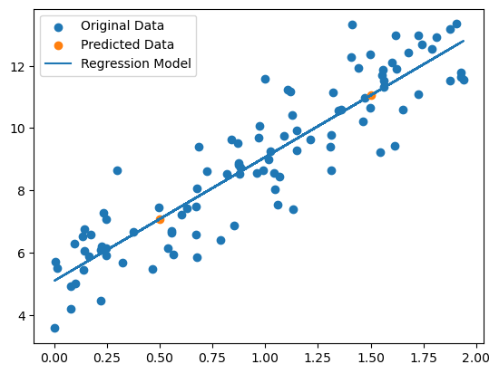
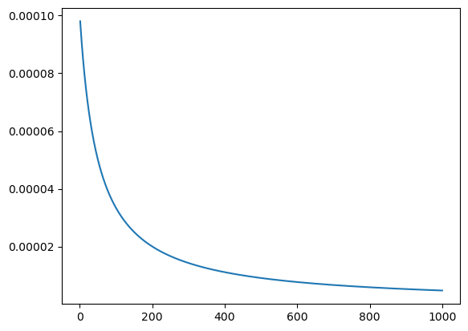
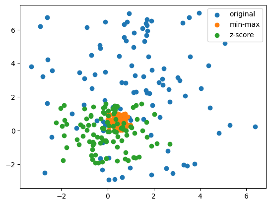
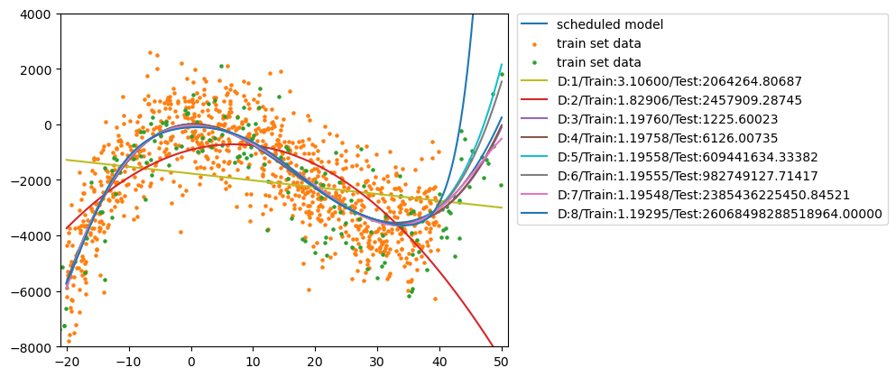
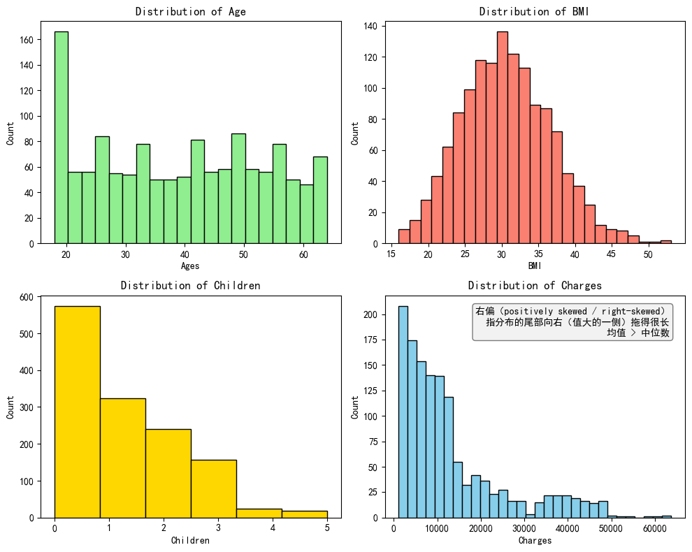
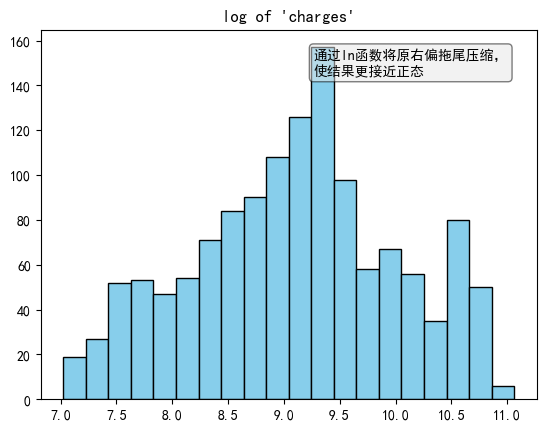
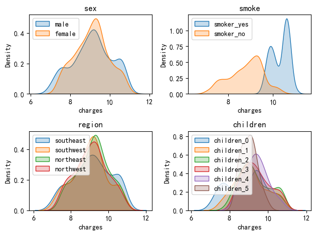

- 任务类型分类：有监督学习
- 定义：拟合因变量(向量) **y** 与 **x** 之间呈线性关系，即 $\mathbf{y} = \mathbf{w}^T\mathbf{x} + \mathbf{b}$，其中 $\mathbf{x,y,w,b \in \mathbb{R}^n}$
- 目标：寻找参数最优解使得$\operatorname{Loss}$函数最小。$(\hat{\mathbf{w}}, \hat{\mathbf{b}}) = \operatorname{Loss}(\mathbf{y}, \hat{\mathbf{y}}) \Leftrightarrow\operatorname{Argmin}(\operatorname{Loss}(\mathbf{w}, \mathbf{b}))$
  * 多元线性回归常用损失函数 —— MSE(均方误差，由似然函数推导而来): 
    $$
    \displaystyle{\operatorname{\mathit{J}(\theta)} = \frac{1}{2} \displaystyle \sum_{i=1}^{m} (h_\theta(x^{(i)}) - y^{(i)})^2 = \frac{1}{2}(X\theta - y)^T(X\theta - y) = \frac{1}{2}(\theta^TX^TX\theta - \theta^TX^Ty - y^TX\theta + y^Ty)}
    $$
    
  
    系数可为$\displaystyle{\frac{1}{2}、\frac{1}{n}、\frac{1}{2n}}$
  
  * MSE对 $\theta$ 的梯度: 
    $$
    \displaystyle{\frac{\partial{J}(\theta)}{\partial\theta} = X^TX\theta - X^Ty = 0 \Rightarrow \theta = (X^TX)^{-1}X^Ty}
    $$

# 正规方程（Normal Equation）

- 参数解析解： $\hat{\theta} = (X^TX)^{-1}X^Ty$
- 可能存在的问题：$(X^TX)^{-1}$的求解可能比较困难

## 一维线性回归（代码实现）

```python
import numpy as np
import matplotlib.pyplot as plt
np.random.seed(20030428)
m = 100 # 数据量

# 随机生成 x 序列
x = np.random.rand(m,1) * 2
# 模拟 x 对应的 y 标签，误差呈正态分布
y = 5 + x*4 + np.random.randn(m,1)
# 补充 x0 列
X = np.c_[np.ones((m,1)),x]

# 参数的求解公式
w_hat = np.linalg.inv(X.T.dot(X)).dot(X.T).dot(y)

# 预测
x_pre = [[0.5],[1.5]]
X_pre = np.c_[np.ones((2,1)),x_pre]
y_pre = X_pre.dot(w_hat)

plt.scatter(x,y,label='Original Data')
plt.scatter(x_pre,y_pre,label='Predicted Data')
plt.plot(x,X.dot(w_hat),label='Regression Model')
plt.legend()
plt.show()
```



## 高维线性回归（代码实现）

```python
import numpy as np
np.random.seed(20030428)

# 维度
n = 4 
# 数据量
m = 1000

# 设置预测值
x_pre = np.random.random(size = (3,n))*10

# 随机生成 x 序列
x = np.random.rand(m,n) * 2
# 补充 x0 列
X = np.c_[np.ones((m,1)),x]
# 模拟 x 对应的 y 标签，误差呈正态分布
w = np.random.randint(0,6,size=(n+1,1))
y = X.dot(w) + np.random.randn(m,1)


# 参数的求解公式
w_hat = np.linalg.inv(X.T.dot(X)).dot(X.T).dot(y)
print('W_hat:')
print(w_hat.reshape(1,n+1))

# 预测
X_pre = np.c_[np.ones((3,1)),x_pre]
y_pre = X_pre.dot(w_hat)
print('X_pre: ')
print(x_pre)
print('Y_pre: ')
print(y_pre)
```


```output
W_hat:
[[5.02671056 3.98404888 4.00452019 4.9783491  1.02490084]]
X_pre: 
[[0.03016482 4.79096225 5.74410225 4.2038564 ]
 [0.0650456  9.53496505 3.37288732 7.77475153]
 [2.68648726 5.44484467 6.07293252 8.00564199]]
Y_pre: 
[[57.23707594]
 [68.2285754 ]
 [75.97196488]]
```


## 高维线性回归（sklearn库）

```python
import numpy as np
from sklearn.linear_model import LinearRegression
np.random.seed(20030428)

# 维度
n = 4
# 数据量
m = 1000

# 设置预测值
x_pre = np.random.random(size = (3,n))*10

# 随机生成 x 序列
x = np.random.rand(m,n) * 2
# 补充 x0 列
X = np.c_[np.ones((m,1)),x]
# 模拟 x 对应的 y 标签，误差呈正态分布
w = np.random.randint(0,6,size=(n+1,1))
y = X.dot(w) + np.random.randn(m,1)


reg = LinearRegression(fit_intercept=True)
reg.fit(x,y)
print('W_hat:')
print(np.c_[reg.intercept_,reg.coef_])

# 预测
y_pre = reg.predict(x_pre)
print('X_pre: ')
print(x_pre)
print('Y_pre: ')
print(y_pre)
```

```output
W_hat:
[[5.02671056 3.98404888 4.00452019 4.9783491  1.02490084]]
X_pre: 
[[0.03016482 4.79096225 5.74410225 4.2038564 ]
 [0.0650456  9.53496505 3.37288732 7.77475153]
 [2.68648726 5.44484467 6.07293252 8.00564199]]
Y_pre: 
[[57.23707594]
 [68.2285754 ]
 [75.97196488]]
```

# 梯度下降（Gradient Descent）

- 梯度下降法迭代公式：$\hat\theta_{k+1} = \hat\theta_k - \alpha \nabla_{\theta}J(\hat\theta)$, $\alpha$为学习率。
- 学习率 $\alpha$ ：$\alpha$ 设置过大容易造成震荡，$\alpha$ 设置太小容易造成迭代次数增加，也可能落到局部最优解。一般设置为0.1、0.01、0.001、0.0001。

## 批量梯度下降（GD）

- 批量梯度下降的梯度：

$$
\nabla_{\theta}J(\theta)
= \frac{\partial}{\partial\theta}J(\theta)
= \sum_{i=1}^{m}\left(h_\theta\left(x^{(i)}\right)-y^{(i)}\right)x^{(i)}
= X^T(X\theta-y)
$$

### 代码实现

```python
import numpy as np

np.random.seed(20030428)

# 维度
n = 4
# 数据量
m = 1000

# 设置预测值
x_pre = np.random.random(size = (3,n))*10


# 超参数
learning_rate = 0.0001 # 学习率 α
n_iterations = 1000 # 迭代次数


# 随机生成 x 序列
x = np.random.rand(m,n) * 2
# 补充 x0 列
X = np.c_[np.ones((m,1)),x]
# 模拟 x 对应的 y 标签，误差呈正态分布
w = np.random.randint(0,6,size=(n+1,1))
y = X.dot(w) + np.random.randn(m,1)


# 初始化参数向量
w_init = np.random.randn(n+1,1)
# 求梯度
for n_iteration in range(n_iterations):
    gradient = X.T.dot(X.dot(w_init)-y)
    w_init = w_init - learning_rate*gradient

print('W_hat:')
print(w_init.reshape(1,n+1))

# 预测
y_pre = np.c_[np.ones((3,1)),x_pre].dot(w_init)
print('X_pre: ')
print(x_pre)
print('Y_pre: ')
print(y_pre)
```

```output
W_hat:
[[5.02631227 3.98414324 4.00461388 4.97843832 1.02499615]]
X_pre: 
[[0.03016482 4.79096225 5.74410225 4.2038564 ]
 [0.0650456  9.53496505 3.37288732 7.77475153]
 [2.68648726 5.44484467 6.07293252 8.00564199]]
Y_pre: 
[[57.23804251]
 [68.23011847]
 [75.97363505]]
```

## 随机梯度下降（SGD）

- 随机梯度下降每次使用一条样本计算梯度：

$$
\begin{aligned}
&\displaystyle {\nabla_{\theta}J(\theta) = \frac{\partial}{\partial\theta}J(\theta) = (h_\theta(x^{(i)})-y^{(i)})x^{(i)} = ({x^{(i)}})^T(x^{(i)}\theta-y^{(i)}) } \\
&\text{where }i \sim \text{Uniform}\bigl(\{1,2,\dots,m\}\bigr)
\end{aligned}
$$

### 代码实现

```python
import numpy as np

np.random.seed(20030428)

# 维度
n = 4
# 数据量
m = 1000

# 设置预测值
x_pre = np.random.random(size = (3,n))*10

# 超参数
learning_rate = 0.0001 # 学习率 α
n_iterations = 1000 # 迭代次数


# 随机生成 x 序列
x = np.random.rand(m,n) * 2
# 补充 x0 列
X = np.c_[np.ones((m,1)),x]
# 模拟 x 对应的 y 标签，误差呈正态分布
w = np.random.randint(0,6,size=(n+1,1))
y = X.dot(w) + np.random.randn(m,1)


# 初始化参数向量
w_init = np.random.randn(n+1,1)
# 求梯度
for n_iteration in range(n_iterations):
    for _ in range(m):
        random_index = np.random.randint(m)
        x_i = X[random_index:random_index+1,:]
        y_i = y[random_index:random_index+1,:]
        gradient = x_i.T.dot(x_i.dot(w_init)-y_i)
        w_init = w_init - learning_rate*gradient

print('W_hat:')
print(w_init.reshape(1,n+1))

# 预测
y_pre = np.c_[np.ones((3,1)),x_pre].dot(w_init)
print('X_pre: ')
print(x_pre)
print('Y_pre: ')
print(y_pre)
```

```output
W_hat:
[[5.01922912 3.97831998 4.00264292 4.96386168 1.01662312]]
X_pre: 
[[0.03016482 4.79096225 5.74410225 4.2038564 ]
 [0.0650456  9.53496505 3.37288732 7.77475153]
 [2.68648726 5.44484467 6.07293252 8.00564199]]
Y_pre: 
[[57.1024122 ]
 [68.08959999]
 [75.78462184]]
```

### 小幅优化：打乱数据索引，顺序选取向量

```python
import numpy as np

np.random.seed(20030428)

# 维度
n = 4
# 数据量
m = 1000

# 设置预测值
x_pre = np.random.random(size = (3,n))*10

# 超参数
learning_rate = 0.0001 # 学习率 α
n_iterations = 1000 # 迭代次数


# 随机生成 x 序列
x = np.random.rand(m,n) * 2
# 补充 x0 列
X = np.c_[np.ones((m,1)),x]
# 模拟 x 对应的 y 标签，误差呈正态分布
w = np.random.randint(0,6,size=(n+1,1))
y = X.dot(w) + np.random.randn(m,1)


# 初始化参数向量
w_init = np.random.randn(n+1,1)
# 求梯度
for n_iteration in range(n_iterations):
    # 打乱顺序，顺序读取
    index = np.arange(m)
    np.random.shuffle(index)
    X = X[index]
    y = y[index]
    for i in range(m):
        x_i = X[i:i+1,:]
        y_i = y[i:i+1,:]
        gradient = x_i.T.dot(x_i.dot(w_init)-y_i)
        w_init = w_init - learning_rate*gradient

print('W_hat:')
print(w_init.reshape(1,n+1))

# 预测
y_pre = np.c_[np.ones((3,1)),x_pre].dot(w_init)
print('X_pre: ')
print(x_pre)
print('Y_pre: ')
print(y_pre)
```

```output
W_hat:
[[5.02675441 3.98450041 4.00505391 4.9789357  1.02541193]]
X_pre: 
[[0.03016482 4.79096225 5.74410225 4.2038564 ]
 [0.0650456  9.53496505 3.37288732 7.77475153]
 [2.68648726 5.44484467 6.07293252 8.00564199]]
Y_pre: 
[[57.24520848]
 [68.23968977]
 [75.98378179]]
```

## 小批量梯度下降（Mini-batch SGD）

- 小批量梯度下降使用样本子集 $S$ 计算梯度：

$$
\displaystyle{\nabla_{\theta}J(\theta) = \frac{\partial}{\partial{\theta}}J(\theta) = \displaystyle \sum_{i\in S}(h_\theta(x^{(i)}) - y^{(i)})x^{(i)} = ({x^{(S)}})^T(x^{(S)}\theta-y^{(S)}) }
$$

​		其中 $|S|=\operatorname{batch\_size}\lt m$，且 $S\subseteq\{1,2,\dots,m\}$，由样本集合中均匀随机选取。

### 代码实现

```python
import numpy as np

np.random.seed(20030428)
x_pre = np.random.random(size = (3,n))*10


# 维度
n = 4
# 数据量
m = 1000
# 分批大小
batch_size = 10
# 批次数
num_batches = int(m/batch_size)

# 超参数
learning_rate = 0.0001 # 学习率 α
n_iterations = 1000 # 迭代次数

# 随机生成 x 序列
x = np.random.rand(m,n) * 2
# 补充 x0 列
X = np.c_[np.ones((m,1)),x]
# 模拟 x 对应的 y 标签，误差呈正态分布
w = np.random.randint(0,6,size=(n+1,1))
y = X.dot(w) + np.random.randn(m,1)


# 初始化参数向量
w_init = np.random.randn(n+1,1)
# 求梯度
for n_iteration in range(n_iterations):
    for _ in range(num_batches):
        random_index = np.random.randint(m)
        x_s = X[random_index:random_index+batch_size,:]
        y_s = y[random_index:random_index+batch_size,:]
        gradient = x_s.T.dot(x_s.dot(w_init)-y_s)
        w_init = w_init - learning_rate*gradient

print('W_hat:')
print(w_init.reshape(1,n+1))

# 预测
y_pre = np.c_[np.ones((3,1)),x_pre].dot(w_init)
print('X_pre: ')
print(x_pre)
print('Y_pre: ')
print(y_pre)
```

```output
W_hat:
[[5.04016211 3.9927612  4.01168955 4.96684374 1.00728303]]
X_pre: 
[[0.03016482 4.79096225 5.74410225 4.2038564 ]
 [0.0650456  9.53496505 3.37288732 7.77475153]
 [2.68648726 5.44484467 6.07293252 8.00564199]]
Y_pre: 
[[57.14498768]
 [68.13517282]
 [75.83694482]]
```

### 小幅优化：打乱数据索引，顺序批量选取向量

```python
import numpy as np

np.random.seed(20030428)
x_pre = np.random.random(size = (3,n))*10

# 维度
n = 4
# 数据量
m = 1000
# 分批大小
batch_size = 10
# 批次数
num_batches = int(m/batch_size)

# 超参数
learning_rate = 0.0001 # 学习率 α
n_iterations = 1000 # 迭代次数

# 随机生成 x 序列
x = np.random.rand(m,n) * 2
# 补充 x0 列
X = np.c_[np.ones((m,1)),x]
# 模拟 x 对应的 y 标签，误差呈正态分布
w = np.random.randint(0,6,size=(n+1,1))
y = X.dot(w) + np.random.randn(m,1)


# 初始化参数向量
w_init = np.random.randn(n+1,1)
# 求梯度
for n_iteration in range(n_iterations):
     # 打乱顺序，顺序读取
    index = np.arange(m)
    np.random.shuffle(index)
    X = X[index]
    y = y[index]
    for i in range(num_batches):
        x_s = X[i*batch_size:i*batch_size+batch_size,:]
        y_s = y[i*batch_size:i*batch_size+batch_size,:]
        gradient = x_s.T.dot(x_s.dot(w_init)-y_s)
        w_init = w_init - learning_rate*gradient

print('W_hat:')
print(w_init.reshape(1,n+1))

# 预测
y_pre = np.c_[np.ones((3,1)),x_pre].dot(w_init)
print('X_pre: ')
print(x_pre)
print('Y_pre: ')
print(y_pre)
```

```output
W_hat:
[[5.0267601  3.98450244 4.00504673 4.978934   1.02541437]]
X_pre: 
[[0.03016482 4.79096225 5.74410225 4.2038564 ]
 [0.0650456  9.53496505 3.37288732 7.77475153]
 [2.68648726 5.44484467 6.07293252 8.00564199]]
Y_pre: 
[[57.24518034]
 [68.23964038]
 [75.98376306]]
```

## SGD的sklearn库实现

```python
import numpy as np
from sklearn.linear_model import SGDRegressor

np.random.seed(20030428)
x_pre = np.random.random(size = (3,n))*10

# 维度
n = 4
# 数据量
m = 1000

# 超参数
learning_rate = 0.001 # 学习率 α
n_iterations = 10000 # 迭代轮次

# 随机生成 x 序列
x = np.random.rand(m,n) * 2
# 补充 x0 列
X = np.c_[np.ones((m,1)),x]
# 模拟 x 对应的 y 标签，误差呈正态分布
w = np.random.randint(0,6,size=(n+1,1))
y = X.dot(w) + np.random.randn(m,1)

sgd_reg = SGDRegressor(
    loss='squared_error', # MSE
    penalty = None, # 无正则项
    alpha = 0, # 无正则强度
    learning_rate = 'constant', # 学习率
    eta0 = learning_rate, # 固定学习率
    fit_intercept = True, # 增加偏置列
    max_iter = n_iterations * m, # 迭代次数
    warm_start = False, # 不进行手动迭代，直接迭代完成
    random_state = 20030428, # 打乱样本的随机种子
)
sgd_reg.fit(x,y.flatten())
print('W_hat:')
print(np.c_[sgd_reg.intercept_,sgd_reg.coef_.reshape(1,-1)])

# 预测
y_pre = sgd_reg.predict(x_pre).reshape(-1,1)
print('X_pre: ')
print(x_pre)
print('Y_pre: ')
print(y_pre)
```

```output
W_hat:
[[4.78413833 4.04362443 4.06423645 5.03733553 1.08352435]]
X_pre: 
[[0.03016482 4.79096225 5.74410225 4.2038564 ]
 [0.0650456  9.53496505 3.37288732 7.77475153]
 [2.68648726 5.44484467 6.07293252 8.00564199]]
Y_pre: 
[[57.86766804]
 [69.21400854]
 [77.04212681]]
```

## 梯度下降法的问题与解决思路

- **学习速率调整**（学习速率调度，Learning rate schedules）：该方法试图在每次更新参数的过程中，改变学习速率。一般使用某种事先设定的策略或者在每次迭代中衰减一个较小的阈值
- 在**稀疏特征数据**中：很少出现的特征应该使用一个相对较大的学习速率
- 对于**非凸目标函数**：可能落入鞍点或平滑点

### 确定速率调整函数

```python
import numpy as np
import matplotlib.pyplot as plt

t0,t1 = 5,50000
def learning_rate_schedule(alpha):
    return t0/(alpha * 1000 + t1)

x_show = np.linspace(1,1000,1000)
y_show = np.array([learning_rate_schedule(x_show[i]) for i in range(len(x_show))])
plt.plot(x_show,y_show)
```

```output
[<matplotlib.lines.Line2D at 0x1a768afe390>]
```



### 更改学习速率

```python
import numpy as np

np.random.seed(20030428)

# 维度
n = 4
# 数据量
m = 1000

# 设置预测值
x_pre = np.random.random(size = (3,n))*10


# 超参数
# learning_rate = 0.0001 # 学习率 α
n_iterations = 1000 # 迭代次数


# 随机生成 x 序列
x = np.random.rand(m,n) * 2
# 补充 x0 列
X = np.c_[np.ones((m,1)),x]
# 模拟 x 对应的 y 标签，误差呈正态分布
w = np.random.randint(0,6,size=(n+1,1))
y = X.dot(w) + np.random.randn(m,1)


# 初始化参数向量
w_init = np.random.randn(n+1,1)
# 求梯度
for n_iteration in range(n_iterations):
    gradient = X.T.dot(X.dot(w_init)-y)
    w_init = w_init - learning_rate_schedule(n_iteration)*gradient

print('W_hat:')
print(w_init.reshape(1,n+1))

# 预测
y_pre = np.c_[np.ones((3,1)),x_pre].dot(w_init)
print('X_pre: ')
print(x_pre)
print('Y_pre: ')
print(y_pre)
```

```output
W_hat:
[[4.97242598 3.99644548 4.01333635 4.98719143 1.04554164]]
X_pre: 
[[0.03016482 4.79096225 5.74410225 4.2038564 ]
 [0.0650456  9.53496505 3.37288732 7.77475153]
 [2.68648726 5.44484467 6.07293252 8.00564199]]
Y_pre: 
[[57.36296538]
 [68.4494602 ]
 [76.21792798]]
```

# 坐标下降（Coordinate Descent）

- **坐标下降**：一次走一步，每次只动一个变量。将高维问题拆成一系列一维问题，逐个坐标迭代更新，直到收敛。
- **核心思想**：固定其他所有变量，只沿第i个坐标方向做一维最优化，循环往复。
- **迭代公式**：

$$
\displaystyle{\theta_i^{(k+1)}
= \operatorname*{argmin}_{\theta_i}
\operatorname{Loss}\left(
\theta_1^{(k+1)}, \dots, \theta_{i-1}^{(k+1)},
\theta_i,
\theta_{i+1}^{(k)}, \dots, \theta_n^{(k)}
\right)}
$$

​	其中 $\operatorname{Loss}$ 为目标损失函数，$\theta^{(k)}$ 为第 $k$ 次迭代时的完整参数向量，$\theta_i^{(k)}$ 为第 $k$ 次迭代时向量 $\theta$ 的第 $i$ 个分量。

- 对于MES的参数迭代公式（由MSE推导而来）：

$$
\begin{aligned}
\theta_j
  &= \frac{\sum_{i=1}^{m}x_j^{(i)}\left(y^{(i)}-\sum_{k\neq j}\theta_k x_k^{(i)}\right)}
          {\sum_{i=1}^{m}\left(x_j^{(i)}\right)^2} \\
\theta_j^{(k+1)}
  &= \theta_j^{(k)}
     - \frac{1}{X_{\cdot j}^{T}X_{\cdot j}}X_{\cdot j}^{T}(X\theta-y)
\end{aligned}
$$

​	其中 $m$ 为样本数量，$\theta_j$ 为 $\theta$ 的第 $j$ 个分量，$x_j^{(i)}$ 为第 $i$ 条样本的第 $j$ 个分量。

## 代码实现

```python
import numpy as np

np.random.seed(20030428)

# 维度
n = 4
# 数据量
m = 1000

# 设置预测值
x_pre = np.random.random(size = (3,n))*10


# 超参数
n_iterations = 1000 # 迭代次数


# 随机生成 x 序列
x = np.random.rand(m,n) * 2
# 补充 x0 列
X = np.c_[np.ones((m,1)),x]
# 模拟 x 对应的 y 标签，误差呈正态分布
w = np.random.randint(0,6,size=(n+1,1))
y = X.dot(w) + np.random.randn(m,1)

# 初始化参数向量
theta = np.zeros(shape=(n+1,1))

for _ in range(n_iterations):
    for j in range(theta.shape[0]):
        theta[j] = theta[j] -  (1/(X[:,j]@X[:,j]))*X[:,j]@(X@theta - y)

print('W_hat:')
print(theta)

# 预测
y_pre = np.c_[np.ones((3,1)),x_pre].dot(theta)
print('X_pre: ')
print(x_pre)
print('Y_pre: ')
print(y_pre)
```

```output
W_hat:
[[5.02671056]
 [3.98404888]
 [4.00452019]
 [4.9783491 ]
 [1.02490084]]
X_pre: 
[[0.03016482 4.79096225 5.74410225 4.2038564 ]
 [0.0650456  9.53496505 3.37288732 7.77475153]
 [2.68648726 5.44484467 6.07293252 8.00564199]]
Y_pre: 
[[57.23707594]
 [68.2285754 ]
 [75.97196488]]
```

# 归一化（Normalization）

- 归一化是将不同尺度、纲量和分布的数据缩放到同一标准区间的预处理技术
- 核心目的：消除纲量影响、加速模型收敛、提升数值稳定性，同时保留原始信息的相对关系
- 特征级归一化方法
  * 最大值最小值归一化（Min-Max）：受离心值影响较大
    + 对第j个特征值做归一化：

    $$
    \displaystyle{x^{*}_{i,j} = \frac{x_{i,j}-x_j^{\min}}{x_j^{\max}-x_j^{\min}}}
    $$

    + 对整个数据集做归一化：$\displaystyle{x^* = \frac{x-\min(x)}{\max(x)-\min(x)}}$
  * 标准归一化（Z-score）：
    + 对第j个特征值做归一化：
    $$
    \displaystyle{x^*_{i,j} = \frac{x_{i,j} - \mu_j}{\sigma_j}}
    $$

    ​       其中：

    $$
    \mu_j=\frac{1}{n}\sum_{i=1}^n x_{i,j},
    \qquad
    \sigma_j=\sqrt{\frac{1}{n} \sum_{i=1}^n (x_{i,j}-\mu_j)^2}
    $$

```python
import numpy as np
from sklearn.preprocessing import MinMaxScaler
from sklearn.preprocessing import StandardScaler
np.random.seed(20030428)

# 数据维度
n = 4
# 数据规模
m = 100

# 初始化数据
x = np.empty((m, 2))
x[:, 0] = np.random.normal(1, 2, m)
x[:, 1] = np.random.random(m) * 10-3
plt.scatter(x[:,0],x[:,1],label='original')

# Min-Max归一化
minmax_scaler = MinMaxScaler()
x_min_max_normalization = minmax_scaler.fit_transform(x)
plt.scatter(x_min_max_normalization[:,0],x_min_max_normalization[:,1],label='min-max')
minmax_scaler.fit(x)

# Z-score归一化
standar_scaler = StandardScaler()
x_standar_scaler = standar_scaler.fit_transform(x)
plt.scatter(x_standar_scaler[:,0],x_standar_scaler[:,1],label='z-score')
standar_scaler.fit(x)
print('μ =', standar_scaler.mean_)
print('σ² =', standar_scaler.var_)

plt.legend()
plt.show()
```

```output
μ = [1.07725633 2.44897092]
σ² = [3.86482916 7.93336293]
```



# 正则化（Regularization）

- 过拟合与欠拟合
  * **欠拟合（underfit）**：未拟合到位，训练集和测试集准确率未达到最高
  * **过拟合（overfit）**：拟合过度，训练集准确率升高的同时，测试集的准确率反而降低
  * **适度拟合（just right）**：过拟合前，训练集和测试集准确率都达到最高时刻
  
- 正则化：防止过拟合，增加模型鲁棒性（Robust）
  * **鲁棒性调优**：使模型具有更好的鲁棒性，让模型的的泛化能力和推广能力更加强大
  * 正则化本质：牺牲模型在训练集上的正确率以提高模型的推广能力，参数 **w** 在数值上越小越好，进而抵抗数值扰动。但 **w** 的数值不能极小，故而将原来的损失函数加上一个惩罚项
  
- 惩罚项（正则项）：
  * L1 正则项（即曼哈顿距离）：
    $$
    \begin{aligned}
    L_1(w) &= \displaystyle{\sum^m_{i=0}|w_i|}\\
    
    \displaystyle{\frac{\partial}{\partial w_i}L_1(w_i)} &= sign(w_i) = \pm 1
    \end{aligned}
    $$
  
  * L2 正则项（即欧式距离的平方）：
$$
\begin{aligned}
L_2(w) &= \sum_{i=0}^{m}|w_i|^2 \\ 
\frac{\partial}{\partial w_i}L_2(w_i) &= 2w_i
\end{aligned}
$$


- 正则化后的多元线性回归的损失函数
  * **Lasso 回归**（套索回归，稀疏性）：
    
    + 损失函数 
    $$
    J_{lasso}(\theta)=MSE(\theta)+L_1(\theta)
    $$
    + 梯度 
    
    $$
    \nabla_{\theta}J_{Lasso}(\theta)
      = \frac{\partial}{\partial \theta}J(\theta)
        + \frac{\partial}{\partial \theta}L_1(\theta)
      = X^T(X\theta-y)+\lambda\operatorname{sign}(\theta)
    $$
    
  * **Ridge 回归**（岭回归，平滑性）：
    
    + 损失函数 
    $$
    J_{ridge}(\theta)=MSE(\theta)+L_2(\theta)
    $$
    + 梯度 
    
    $$
    \nabla_{\theta}J_{Ridge}(\theta)
      = \frac{\partial}{\partial \theta}J(\theta)
        + \frac{\partial}{\partial \theta}L_2(\theta)
      = X^T(X\theta-y)+2\lambda \theta
    $$
    
  * **ElasticNet回归**（弹性网络回归）：
    
    + 损失函数 
    $$
    J_{\mathrm{ElasticNet}}(\theta)=MSE(\theta)+L_1(\theta)+L_2(\theta)
    $$
    + 梯度 
      $$
      \begin{aligned}
      \displaystyle{
      \nabla_{\theta}J_{\mathrm{ElasticNet}}(\theta)
        = \frac{\partial}{\partial \theta}J(\theta)
          + \frac{\partial}{\partial \theta}L_1(\theta)
          + \frac{\partial}{\partial \theta}L_2(\theta) 
        = X^T(X\theta-y)
          + \lambda\left[(1-r)\operatorname{sign}(\theta)+2r\theta\right]
      }
      \end{aligned}
      $$
    

> [!ANNOT]
>
> Lasso 回归与 Ridge 回归只定义了 Loss 函数模型，可以用梯度下降法、坐标下降法、最小角回归（LARS）、正规方程等方法进行求解。在 sklearn 库中 Lasso 和 ElasticNet 使用坐标下降；Ridge 使用正规方程；SVGRegressor 使用随机梯度下降，可自定义正则化类型、正则化强度、学习率、阈值、迭代次数等等

## Lasso回归（sklearn库）

```python
import numpy as np
from sklearn.linear_model import Lasso

np.random.seed(20030428)

# 维度
n = 4
# 数据量
m = 1000

# 设置预测值
x_pre = np.random.random(size = (3,n))*10


# 随机生成 x 序列
x = np.random.rand(m,n) * 2
# 补充 x0 列
X = np.c_[np.ones((m,1)),x]
# 模拟 x 对应的 y 标签，误差呈正态分布
w = np.random.randint(0,6,size=(n+1,1))
y = X.dot(w) + np.random.randn(m,1)


lasso_reg = Lasso(alpha=0.0015,max_iter=30000000)
lasso_reg.fit(x,y)
print('W_hat:')
print(np.c_[lasso_reg.intercept_,lasso_reg.coef_.reshape(1,-1)])

# 预测
y_pre = lasso_reg.predict(x_pre)
print('X_pre: ')
print(x_pre)
print('Y_pre: ')
print(y_pre.reshape(-1,1))
```

```output
W_hat:
[[5.0464025  3.97908982 3.99958499 4.97364032 1.01995191]]
X_pre: 
[[0.03016482 4.79096225 5.74410225 4.2038564 ]
 [0.0650456  9.53496505 3.37288732 7.77475153]
 [2.68648726 5.44484467 6.07293252 8.00564199]]
Y_pre: 
[[57.18512159]
 [68.14652889]
 [75.88324745]]
```

## Ridge回归（sklearn库）

```python
import numpy as np
from sklearn.linear_model import Ridge

np.random.seed(20030428)

# 维度
n = 4
# 数据量
m = 1000

# 设置预测值
x_pre = np.random.random(size = (3,n))*10

# 随机生成 x 序列
x = np.random.rand(m,n) * 2
# 补充 x0 列
X = np.c_[np.ones((m,1)),x]
# 模拟 x 对应的 y 标签，误差呈正态分布
w = np.random.randint(0,6,size=(n+1,1))
y = X.dot(w) + np.random.randn(m,1)


ridge_reg = Ridge(alpha=0.4,solver='sag')
ridge_reg.fit(x,y)
print('W_hat:')
print(np.c_[ridge_reg.intercept_,ridge_reg.coef_.reshape(1,-1)])

# 预测
y_pre = ridge_reg.predict(x_pre)
print('X_pre: ')
print(x_pre)
print('Y_pre: ')
print(y_pre.reshape(-1,1))
```

```output
W_hat:
[[5.04469365 3.97896047 3.99922338 4.97248436 1.02326193]]
X_pre: 
[[0.03016482 4.79096225 5.74410225 4.2038564 ]
 [0.0650456  9.53496505 3.37288732 7.77475153]
 [2.68648726 5.44484467 6.07293252 8.00564199]]
Y_pre: 
[[57.18895127]
 [68.16319935]
 [75.89870099]]
```

## ElasticNet回归（sklearn库）

```python
import numpy as np
from sklearn.linear_model import ElasticNet

np.random.seed(20030428)

# 维度
n = 4
# 数据量
m = 1000

# 设置预测值
x_pre = np.random.random(size = (3,n))*10

# 随机生成 x 序列
x = np.random.rand(m,n) * 2
# 补充 x0 列
X = np.c_[np.ones((m,1)),x]
# 模拟 x 对应的 y 标签，误差呈正态分布
w = np.random.randint(0,6,size=(n+1,1))
y = X.dot(w) + np.random.randn(m,1)


elasticnet_reg = ElasticNet(alpha=0.01,l1_ratio=0.2)
elasticnet_reg.fit(x,y)
print('W_hat:')
print(np.c_[elasticnet_reg.intercept_,elasticnet_reg.coef_.reshape(1,-1)])

# 预测
y_pre = elasticnet_reg.predict(x_pre)
print('X_pre: ')
print(x_pre)
print('Y_pre: ')
print(y_pre.reshape(-1,1))
```

```output
W_hat:
[[5.40784751 3.87770911 3.89554975 4.85588961 0.98362001]]
X_pre: 
[[0.03016482 4.79096225 5.74410225 4.2038564 ]
 [0.0650456  9.53496505 3.37288732 7.77475153]
 [2.68648726 5.44484467 6.07293252 8.00564199]]
Y_pre: 
[[56.21597338]
 [66.82977581]
 [74.39992651]]
```

## 随机梯度下降实现elasticnet正则化（sklearn库）

```python
import numpy as np
from sklearn.linear_model import SGDRegressor

np.random.seed(20030428)

# 维度
n = 4
# 数据量
m = 1000

# 设置预测值
x_pre = np.random.random(size = (3,n))*10

# 随机生成 x 序列
x = np.random.rand(m,n) * 2
# 补充 x0 列
X = np.c_[np.ones((m,1)),x]
# 模拟 x 对应的 y 标签，误差呈正态分布
w = np.random.randint(0,6,size=(n+1,1))
y = X.dot(w) + np.random.randn(m,1)


sgd_reg = SGDRegressor(
    penalty='elasticnet', # 正则化类型
    max_iter = 100000, # 迭代次数
    alpha = 0.01, # 正则化强度 λ
    l1_ratio=0.2, # l1正则化比例
    tol = 1e-10, # 收敛阈值
    # ……
)

sgd_reg.fit(x,y.ravel())
print('W_hat:')
print(np.c_[sgd_reg.intercept_,sgd_reg.coef_.reshape(1,-1)])

# 预测
y_pre = sgd_reg.predict(x_pre)
print('X_pre: ')
print(x_pre)
print('Y_pre: ')
print(y_pre.reshape(-1,1))
```

```output
W_hat:
[[5.1320958  3.93664843 3.95394899 4.913876   1.04281603]]
X_pre: 
[[0.03016482 4.79096225 5.74410225 4.2038564 ]
 [0.0650456  9.53496505 3.37288732 7.77475153]
 [2.68648726 5.44484467 6.07293252 8.00564199]]
Y_pre: 
[[56.80371943]
 [67.77050846]
 [75.42653888]]
```

# 升维方法 — 多项式回归（Polynomial Regression）

- 目的：解决**欠拟合**问题
- 常见手段：将已知维度进行相乘来构建新的维度，将非线性Data转换为线性Data
- 以二阶多项式升维为例：

$$
y=w_0+w_1x_1+w_2x_2
\Rightarrow
y^*=w_0+w_1x_1+w_2x_2+w_3x_1^2+w_4x_2^2+w_5x_1x_2
$$
- 以下面拟合过程为例：$D_3$ 达到最佳拟合。随着维度的增加，$D_3$ 以下训练集和测试集误差均减小，属于欠拟合；$D_3$ 以上训练集误差减小，测试集误差增大，属于过拟合

```python
import numpy as np
import matplotlib.pyplot as plt
from sklearn.preprocessing import PolynomialFeatures
from sklearn.linear_model import LinearRegression
from sklearn.metrics import mean_squared_error

np.random.seed(20030428)
plt.xlim(-21, 51)      # 横轴
plt.ylim(-8000, 4000)   # 纵轴

# 预设函数
def mapping(x):
    return 0.2*x**3 - 10*x**2 + 5*x - 1

# 维度
n = 1

x_show = np.linspace(-20,50,10000)
plt.plot(x_show,mapping(x_show),color='C0',label='scheduled model')

# 训练集数据量
train_size= 10000
# 测试集数据量
test_size = 10000

# 随机生成训练集
x_train = np.random.rand(m,n) * 60 - 20
y_train = mapping(x_train) + np.random.randn(m,1)*1111
plt.scatter(x_train,y_train,color='C1',s=5,label='train set data')

# 随机生成测试集
x_test = np.random.rand(m,n) * 400 - 100
y_test = mapping(x_test) + np.random.randn(m,1)*1111
plt.scatter(x_test,y_test,color='C2',s=5,label='train set data')

### 升维预测 ###
# dimensions = {2:'C3'}
dimensions = {1:'C8',2:'C3',3:'C4',4:'C5',5:'C9',6:'C7',7:'C6',8:'C10'}
for dim,color in dimensions.items():
    # 多项式升维
    poly_features = PolynomialFeatures(
        degree=dim, # 设置维度
        include_bias=True # 设置截距
    )
    # 训练集和测试集升维
    x_train_poly = poly_features.fit_transform(x_train)
    x_test_poly = poly_features.fit_transform(x_test)
    # 线性回归
    lin_reg = LinearRegression(
        fit_intercept=False # 不加偏置
    )
    lin_reg.fit(x_train_poly,y_train)
    y_train_pre = lin_reg.predict(x_train_poly)
    y_test_pre = lin_reg.predict(x_test_poly)
    train_norm = mean_squared_error(y_train,y_train_pre)
    test_norm = mean_squared_error(y_test,y_test_pre)
    lab = f"D:{dim}/Train:{train_norm/1e6:.5f}/Test:{test_norm/1e6:.5f}"
    x_show_poly = poly_features.fit_transform(x_show.reshape(-1,1))
    plt.plot(x_show,lin_reg.predict(x_show_poly),color=dimensions[dim],label=lab)


plt.legend(
    loc='upper left', # 以legend左上角为基准点
    bbox_to_anchor=(1.02, 1), # 距离原点的相对位置，图像为0-1
    borderaxespad=0, # 间距值
    ncol=1, # 分几列
)
```

```output
<matplotlib.legend.Legend at 0x1a768d8d150>
```



# 实践 — 保险花销预测

- 数据集路径： ".\Dataset\1_Insurance_Expense_Forecast\insurance.csv"

## 数据提取

```python
import pandas as pd
import numpy as np

data = pd.read_csv(
    './Dataset/1_Insurance_Expense_Forecast/insurance.csv',
    sep=',')
data.head(6)
```


## EDA（Exploratory Data Analysis，探索性数据分析）

- 本质：在把数据喂给算法之前，先用人眼和统计工具观察和清洗数据
- 目的：发现数据长什么样、哪里脏、哪里怪、哪里藏着有用的信号，从而为后续的特征工程、模型选择、甚至业务决策提供直觉和依据
- 发现charges出现右偏问题，通过特征工程中数值变换的取对数手段进行处理

```python
# 观察数据结构信息

print(data.info()) # 结果显示数据质量较好，无缺失值
print(data.describe())
```

```output
<class 'pandas.core.frame.DataFrame'>
RangeIndex: 1338 entries, 0 to 1337
Data columns (total 7 columns):
 #   Column    Non-Null Count  Dtype  
---  ------    --------------  -----  
 0   age       1338 non-null   int64  
 1   sex       1338 non-null   object 
 2   bmi       1338 non-null   float64
 3   children  1338 non-null   int64  
 4   smoker    1338 non-null   object 
 5   region    1338 non-null   object 
 6   charges   1338 non-null   float64
dtypes: float64(2), int64(2), object(3)
memory usage: 73.3+ KB
None
               age          bmi     children       charges
count  1338.000000  1338.000000  1338.000000   1338.000000
mean     39.207025    30.663397     1.094918  13270.422265
std      14.049960     6.098187     1.205493  12110.011237
min      18.000000    15.960000     0.000000   1121.873900
25%      27.000000    26.296250     0.000000   4740.287150
50%      39.000000    30.400000     1.000000   9382.033000
75%      51.000000    34.693750     2.000000  16639.912515
max      64.000000    53.130000     5.000000  63770.428010
```

```python
# 观察数据分布

import matplotlib.pyplot as plt
# %matplotlib inline
plt.rcParams['font.family'] = 'sans-serif'      # 1. 启用 sans-serif 列表
plt.rcParams['font.sans-serif'] = ['SimHei']    # 2. 把 SimHei 放在最前
plt.rcParams['axes.unicode_minus'] = False      # 3. 让负号正常显示（可选）


plt.figure(figsize=(10, 8)) # 设置画布大小

plt.subplot(2, 2, 1) # 第一个子图
plt.hist(data['age'], bins=20, color='lightgreen', edgecolor='k')
plt.xlabel('Ages')
plt.ylabel('Count')
plt.title('Distribution of Age')

plt.subplot(2, 2, 2) # 第二个子图
plt.hist(data['bmi'], bins=25, color='salmon', edgecolor='k')
plt.xlabel('BMI')
plt.ylabel('Count')
plt.title('Distribution of BMI')

plt.subplot(2, 2, 3) # 第三个子图
plt.hist(data['children'], bins=6, color='gold', edgecolor='k')
plt.xlabel('Children')
plt.ylabel('Count')
plt.title('Distribution of Children')

ax_charges=plt.subplot(2, 2, 4) # 第四个子图
plt.hist(data['charges'], bins=30, color='skyblue', edgecolor='k')
plt.xlabel('Charges')
plt.ylabel('Count')
plt.title('Distribution of Charges')
ax_charges.text(
    0.95,0.95, # 百分比坐标
    '右偏（positively skewed / right-skewed）\n指分布的尾部向右（值大的一侧）拖得很长\n均值 > 中位数',
    transform=ax_charges.transAxes, # 用子图的坐标系
    va='top',ha='right', # 文本框基准点选取
    fontsize = 10,
    bbox=dict(
        boxstyle='round,pad=0.3',
        facecolor=(0.9,0.9,0.9),
        alpha=0.5,
    )
)

plt.tight_layout() # 自动调整间距
plt.show()
```



```python
# 压缩优化异常标签值

ax = plt.subplot(1, 1, 1)
ax.text(
    0.55,0.95, # 百分比坐标
    '通过ln函数将原右偏拖尾压缩，\n使结果更接近正态',
    transform=ax.transAxes, # 用子图的坐标系
    va='top',ha='left', # 文本框基准点选取
    fontsize = 10,
    bbox=dict(
        boxstyle='round,pad=0.3',
        facecolor=(0.9,0.9,0.9),
        alpha=0.5,
    )
)


plt.hist(np.log1p(data['charges']),bins=20, color='skyblue', edgecolor='k')
plt.title('log of \'charges\'')
plt.show()

# 增加标签值压缩列
data['log_charges']=np.log1p(data['charges'])
data.head(6)
```



|       | age  | sex    | bmi    | children | smoker | region    | charges     | log_charges |
| ----- | ---- | ------ | ------ | -------- | ------ | --------- | ----------- | ----------- |
| **0** | 19   | female | 27.900 | 0        | yes    | southwest | 16884.92400 | 9.734236    |
| **1** | 18   | male   | 33.770 | 1        | no     | southeast | 1725.55230  | 7.453882    |
| **2** | 28   | male   | 33.000 | 3        | no     | southeast | 4449.46200  | 8.400763    |
| **3** | 33   | male   | 22.705 | 0        | no     | northwest | 21984.47061 | 9.998137    |
| **4** | 32   | male   | 28.880 | 0        | no     | northwest | 3866.85520  | 8.260455    |
| **5** | 31   | female | 25.740 | 0        | no     | southeast | 3756.62160  | 8.231541    |

## 特征工程

- 类别：缺失值处理/数值变换/类别编码/高维稀疏/非线性交叉/时序&序列/业务先验
- 类别编码 — One-Hot编码：对某个特征从“分类”到“向量”的变化过程，例如：
  - 若简单地将“男”/“女”，编码为0/1，模型会误以为“女”>“男”，把颜色当成连续量，学到错误的序关系
  - 将“男”/“女”编码为二维向量 $(0,1)$ 和 $(1,0)$
  - 将本项目中的region特征中的southeast、southwest、northeast、northwest编码为$(1,0,0,0)，(0,1,0,0)，(0,0,1,0)，(0,0,0,1)$

```python
# 进行 One-Hot编码
data = pd.get_dummies(data,dtype=int)
data.head(6)
```

| | age | bmi | children | charges | log_charges | sex_female | sex_male | smoker_no | smoker_yes | region_northeast | region_northwest | region_southeast | region_southwest |
|---|---|---|---|---|---|---|---|---|---|---|---|---|---|
| **0** | 19 | 27.900 | 0 | 16884.92400 | 9.734236 | 1 | 0 | 0 | 1 | 0 | 0 | 0 | 1 |
| **1** | 18 | 33.770 | 1 | 1725.55230 | 7.453882 | 0 | 1 | 1 | 0 | 0 | 0 | 1 | 0 |
| **2** | 28 | 33.000 | 3 | 4449.46200 | 8.400763 | 0 | 1 | 1 | 0 | 0 | 0 | 1 | 0 |
| **3** | 33 | 22.705 | 0 | 21984.47061 | 9.998137 | 0 | 1 | 1 | 0 | 0 | 1 | 0 | 0 |
| **4** | 32 | 28.880 | 0 | 3866.85520 | 8.260455 | 0 | 1 | 1 | 0 | 0 | 1 | 0 | 0 |
| **5** | 31 | 25.740 | 0 | 3756.62160 | 8.231541 | 1 | 0 | 1 | 0 | 0 | 0 | 1 | 0 |

```python
# 取出样本及标签值
x = data.drop(columns=['charges','log_charges'])
y = data['log_charges']

# 填充空值
x.fillna(0,inplace=True)
y.fillna(0,inplace=True)

x.head()
```

| | age | bmi | children | sex_female | sex_male | smoker_no | smoker_yes | region_northeast | region_northwest | region_southeast | region_southwest |
|---|---|---|---|---|---|---|---|---|---|---|---|
| **0** | 19 | 27.900 | 0 | 1 | 0 | 0 | 1 | 0 | 0 | 0 | 1 |
| **1** | 18 | 33.770 | 1 | 0 | 1 | 1 | 0 | 0 | 0 | 1 | 0 |
| **2** | 28 | 33.000 | 3 | 0 | 1 | 1 | 0 | 0 | 0 | 1 | 0 |
| **3** | 33 | 22.705 | 0 | 0 | 1 | 1 | 0 | 0 | 1 | 0 | 0 |
| **4** | 32 | 28.880 | 0 | 0 | 1 | 1 | 0 | 0 | 1 | 0 | 0 |

```python
# 划分训练集与测试集
from sklearn.model_selection import train_test_split
x_train,x_test,y_train,y_test = train_test_split(x,y,test_size=0.3)
print(x.shape,y.shape)
print(x_train.shape,y_train.shape)
print(x_test.shape,y_test.shape)
```

```output
(1338, 11) (1338,)
(936, 11) (936,)
(402, 11) (402,)
```

```python
# 归一化
from sklearn.preprocessing import StandardScaler
x_scaler = StandardScaler(
    copy=True, # 非原地更改
    with_mean=True, # 先减去平均值
    with_std=True, # 除以标准差
).fit(x_train) # 用测试集数据训练出均值和标准差
x_train_scaled = x_scaler.transform(x_train)
x_test_scaled = x_scaler.transform(x_test)
```

```python
# 多项式升维以拟合非线性特征
from sklearn.preprocessing import PolynomialFeatures
poly_features = PolynomialFeatures(
    degree = 1,
    include_bias=False
)
x_train_scaled = poly_features.fit_transform(x_train_scaled)
x_test_scaled = poly_features.fit_transform(x_test_scaled)
```

## 模型训练

```python
from sklearn.linear_model import LinearRegression
from sklearn.linear_model import Ridge
from sklearn.linear_model import SGDRegressor

# 线性回归
lin_reg = LinearRegression()
lin_reg.fit(x_train_scaled,y_train)
y_train_predict_lin = lin_reg.predict(x_train_scaled)
y_test_predict_lin = lin_reg.predict(x_test_scaled)

# 岭回归
rid_reg = Ridge()
rid_reg.fit(x_train_scaled,y_train)
y_train_predict_rid = rid_reg.predict(x_train_scaled)
y_test_predict_rid = rid_reg.predict(x_test_scaled)

# 随机梯度下降
sgd_reg = SGDRegressor()
sgd_reg.fit(x_train_scaled,y_train)
y_train_predict_sgd = sgd_reg.predict(x_train_scaled)
y_test_predict_sgd = sgd_reg.predict(x_test_scaled)
```

## 模型评估

```python
from sklearn.metrics import mean_squared_error

print(
    "LinearRegression(Train / Test): ",
    np.sqrt(mean_squared_error(y_train,y_train_predict_lin)),
    np.sqrt(mean_squared_error(y_test,y_test_predict_lin))
)

print(
    "RidgeRegression(Train / Test): ",
    np.sqrt(mean_squared_error(y_train,y_train_predict_rid)),
    np.sqrt(mean_squared_error(y_test,y_test_predict_rid))
)

print(
    "SGDRegression(Train / Test): ",
    np.sqrt(mean_squared_error(y_train,y_train_predict_sgd)),
    np.sqrt(mean_squared_error(y_test,y_test_predict_sgd))
)
```

```output
LinearRegression(Train / Test):  0.44905273756975034 0.43211955383967054
RidgeRegression(Train / Test):  0.44905315842354915 0.4321996372029468
SGDRegression(Train / Test):  0.449286159412961 0.43308751362633735
```

## 进阶

```python
import numpy as np
import pandas as pd
import matplotlib.pyplot as plt
import seaborn as sns
from sklearn.preprocessing import PolynomialFeatures
from sklearn.model_selection import train_test_split
from sklearn.linear_model import LinearRegression
from sklearn.linear_model import Ridge
from sklearn.ensemble import GradientBoostingRegressor
from sklearn.metrics import mean_squared_error
from sklearn.preprocessing import StandardScaler


# 数据读取
data = pd.read_csv('./Dataset/1_Insurance_Expense_Forecast/insurance.csv')


# EDA
# 如果对于某个特征对预测值几乎无影响，则可忽略（降噪）
data['charges'] = np.log1p(data['charges'])
print(data.head())
print(data.info())
print(data.describe())

ax = plt.subplot(2,2,1)
plt.title('sex')
sns.kdeplot(data.loc[data.sex=='male','charges'],
            fill=True, label='male', ax=ax)
sns.kdeplot(data.loc[data.sex=='female','charges'],
            fill=True, label='female', ax=ax)
plt.legend()

ax = plt.subplot(2,2,2)
plt.title('smoke')
sns.kdeplot(data.loc[data.smoker=='yes','charges'],
            fill=True, label='smoker_yes', ax=ax)
sns.kdeplot(data.loc[data.smoker=='no','charges'],
            fill=True, label='smoker_no', ax=ax)
plt.legend()

ax = plt.subplot(2,2,3)
plt.title('region')
sns.kdeplot(data.loc[data.region=='southeast','charges'],
           fill=True,label='southeast',ax=ax)
sns.kdeplot(data.loc[data.region=='southwest','charges'],
           fill=True,label='southwest',ax=ax)
sns.kdeplot(data.loc[data.region=='northeast','charges'],
           fill=True,label='northeast',ax=ax)
sns.kdeplot(data.loc[data.region=='northwest','charges'],
           fill=True,label='northwest',ax=ax)
plt.legend()

ax = plt.subplot(2,2,4)
plt.title('children')
sns.kdeplot(data.loc[data.children==0,'charges'],
            fill=True, label='children_0', ax=ax)
sns.kdeplot(data.loc[data.children==1,'charges'],
            fill=True, label='children_1', ax=ax)
sns.kdeplot(data.loc[data.children==2,'charges'],
            fill=True, label='children_2', ax=ax)
sns.kdeplot(data.loc[data.children==3,'charges'],
            fill=True, label='children_3', ax=ax)
sns.kdeplot(data.loc[data.children==4,'charges'],
            fill=True, label='children_4', ax=ax)
sns.kdeplot(data.loc[data.children==5,'charges'],
            fill=True, label='children_5', ax=ax)
plt.legend()

plt.tight_layout()  
plt.show()


# 特征工程
data = data.drop(['region','sex'],axis=1) # 删除无用特征
# 特征离散化
def discretization(df,bmi=30,child=0):
    df['bmi']='over' if df['bmi']>=bmi else 'under'
    df['children'] = 'no' if df['children'] == child else 'yes'
    return df
data = data.apply(discretization,axis=1,args=(30,0))
print(data.head())
# one-hot 编码
data = pd.get_dummies(data)
# 解决右偏问题
print(data.head())
# 样本获取与空值填充
x = data.drop('charges',axis=1)
y = data['charges']
x.fillna(0,inplace=True)
y.fillna(0,inplace=True)
print(x.head())
print(y.head())


# 模型训练
# 划分
x_train,x_test,y_train,y_test = train_test_split(x,y,test_size=0.3)
# # 归一化
# x_scaler = StandardScaler().fit(x_train)
# x_train = x_scaler.transform(x_train)
# 升维
poly_featrues = PolynomialFeatures(degree=2,include_bias=False)
x_train_poly = poly_features.fit_transform(x_train)
# 训练
reg_lin = LinearRegression()
reg_lin.fit(x_train_poly,y_train)

reg_rid = Ridge()
reg_rid.fit(x_train_poly,y_train)

reg_gra = GradientBoostingRegressor()
reg_gra.fit(x_train_poly,y_train)


# 测试集预测
# # 归一化
# x_test = x_scaler.transform(x_test)
# 升维
x_test_poly = poly_features.fit_transform(x_test)
# 预测
y_test_pre_lin = reg_lin.predict(x_test_poly)
y_test_pre_rid = reg_rid.predict(x_test_poly)
y_test_pre_gra = reg_gra.predict(x_test_poly)


# 模型评估
print(
    "LinearRegression: ",
    np.sqrt(mean_squared_error(y_test,y_test_pre_lin))
)

print(
    "RidgeRegression: ",
    np.sqrt(mean_squared_error(y_test,y_test_pre_rid))
)

print(
    "GradientBoostingRegressor: ",
    np.sqrt(mean_squared_error(y_test,y_test_pre_gra))
)
```

```output
   age     sex     bmi  children smoker     region   charges
0   19  female  27.900         0    yes  southwest  9.734236
1   18    male  33.770         1     no  southeast  7.453882
2   28    male  33.000         3     no  southeast  8.400763
3   33    male  22.705         0     no  northwest  9.998137
4   32    male  28.880         0     no  northwest  8.260455
<class 'pandas.core.frame.DataFrame'>
RangeIndex: 1338 entries, 0 to 1337
Data columns (total 7 columns):
 #   Column    Non-Null Count  Dtype  
---  ------    --------------  -----  
 0   age       1338 non-null   int64  
 1   sex       1338 non-null   object 
 2   bmi       1338 non-null   float64
 3   children  1338 non-null   int64  
 4   smoker    1338 non-null   object 
 5   region    1338 non-null   object 
 6   charges   1338 non-null   float64
dtypes: float64(2), int64(2), object(3)
memory usage: 73.3+ KB
None
               age          bmi     children      charges
count  1338.000000  1338.000000  1338.000000  1338.000000
mean     39.207025    30.663397     1.094918     9.098828
std      14.049960     6.098187     1.205493     0.919379
min      18.000000    15.960000     0.000000     7.023647
25%      27.000000    26.296250     0.000000     8.464064
50%      39.000000    30.400000     1.000000     9.146658
75%      51.000000    34.693750     2.000000     9.719618
max      64.000000    53.130000     5.000000    11.063061
```



```output
   age    bmi children smoker   charges
0   19  under       no    yes  9.734236
1   18   over      yes     no  7.453882
2   28   over      yes     no  8.400763
3   33  under       no     no  9.998137
4   32  under       no     no  8.260455
   age   charges  bmi_over  bmi_under  children_no  children_yes  smoker_no  \
0   19  9.734236     False       True         True         False      False   
1   18  7.453882      True      False        False          True       True   
2   28  8.400763      True      False        False          True       True   
3   33  9.998137     False       True         True         False       True   
4   32  8.260455     False       True         True         False       True   

   smoker_yes  
0        True  
1       False  
2       False  
3       False  
4       False  
   age  bmi_over  bmi_under  children_no  children_yes  smoker_no  smoker_yes
0   19     False       True         True         False      False        True
1   18      True      False        False          True       True       False
2   28      True      False        False          True       True       False
3   33     False       True         True         False       True       False
4   32     False       True         True         False       True       False
0    9.734236
1    7.453882
2    8.400763
3    9.998137
4    8.260455
Name: charges, dtype: float64
LinearRegression:  0.41171540130927264
RidgeRegression:  0.4119283802418486
GradientBoostingRegressor:  0.3163566171772987
```
